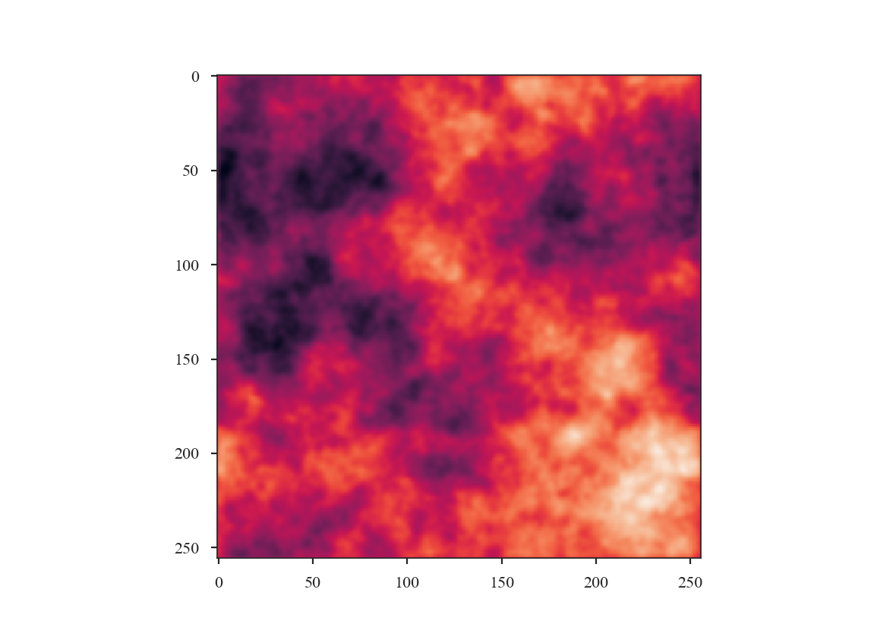

.. _gen_test_data:

*********************
Creating testing data
*********************

TurbuStat includes a simulation package to create 2D images and PPV cubes with
set power-law indices. These provide simple non-realistic synthetic
observations that can be used to test idealized regimes of turbulent statistics.::

    >>> import matplotlib.pyplot as plt
    >>> from astropy.io import fits

Two-dimensional images
----------------------

The 2D power-law image function is `make_extended`::
    >>> from turbustat.simulator import make_extended

The ``make_extended`` function is adapted from the implementation in `image_registration <https://image-registration.readthedocs.io/en/latest/>`_.

To create an isotropic power-law field, or a fractional Brownian Motion (fBM) field, with an index of 3 and size of 256 pixels, we run:

    >>> rnoise_img = make_extended(256, powerlaw=3.)
    >>> plt.imshow(rnoise_img)  # doctest: +SKIP

..  Just repeat using the beam correction tutorials

To calculate the power-spectrum and check its index, we need to generate a minimal FITS HDU:

    >>> rnoise_hdu = fits.PrimaryHDU(rnoise_img)

The FITS header lacks the information to convert to angular or physical scales and is used here to show the minimal working case. See the :ref:`handling simulated data tutorial <simobs_tutorial>` on how to create usable FITS header for simulated data.

The power-spectrum of the image should give a slope of 3:

    >>> from turbustat.statistics import PowerSpectrum
    >>> pspec = PowerSpectrum(rnoise_hdu)
    >>> pspec.run(verbose=True, radial_pspec_kwargs={'binsize': 1.0},
    ...           fit_kwargs={'weighted_fit': True}, fit_2D=False,
    ...           low_cut=1. / (60 * u.pix))  # doctest: +SKIP
                                OLS Regression Results
    ==============================================================================
    Dep. Variable:                      y   R-squared:                       1.000
    Model:                            OLS   Adj. R-squared:                  1.000
    Method:                 Least Squares   F-statistic:                 8.070e+06
    Date:                Thu, 21 Jun 2018   Prob (F-statistic):               0.00
    Time:                        11:43:47   Log-Likelihood:                 701.40
    No. Observations:                 177   AIC:                            -1399.
    Df Residuals:                     175   BIC:                            -1392.
    Df Model:                           1
    Covariance Type:            nonrobust
    ==============================================================================
                     coef    std err          t      P>|t|      [0.025      0.975]
    ------------------------------------------------------------------------------
    const          0.0032      0.001      3.952      0.000       0.002       0.005
    x1            -2.9946      0.001  -2840.850      0.000      -2.997      -2.992
    ==============================================================================
    Omnibus:                      252.943   Durbin-Watson:                   1.077
    Prob(Omnibus):                  0.000   Jarque-Bera (JB):            26797.433
    Skew:                          -5.963   Prob(JB):                         0.00
    Kurtosis:                      62.087   Cond. No.                         4.55
    ==============================================================================

..  Just repeat using the beam correction tutorials
.. image:: tutorials/images/rednoise_pspec_slope3.png

Anisotropic 2D images can also be produced:

    >>> import astropy.units as u
    >>> rnoise_img = make_extended(256, powerlaw=3., ellip=0.5, theta=45 * u.deg)
    >>> plt.imshow(rnoise_img)  # doctest: +SKIP

The power-spectrum can then be calculated and fit in 1D and 2D (see :ref:`pspec_tutorial`):

    >>> pspec = PowerSpectrum(rnoise_hdu)
    >>> pspec.run(verbose=True, radial_pspec_kwargs={'binsize': 1.0},
    ...           fit_kwargs={'weighted_fit': True}, fit_2D=False,
    ...           low_cut=1. / (60 * u.pix))  # doctest: +SKIP
                                OLS Regression Results
    ==============================================================================
    Dep. Variable:                      y   R-squared:                       1.000
    Model:                            OLS   Adj. R-squared:                  1.000
    Method:                 Least Squares   F-statistic:                 1.122e+06
    Date:                Wed, 15 Aug 2018   Prob (F-statistic):               0.00
    Time:                        14:18:14   Log-Likelihood:                 526.68
    No. Observations:                 177   AIC:                            -1049.
    Df Residuals:                     175   BIC:                            -1043.
    Df Model:                           1
    Covariance Type:            nonrobust
    ==============================================================================
                     coef    std err          t      P>|t|      [0.025      0.975]
    ------------------------------------------------------------------------------
    const          2.7786      0.002   1295.906      0.000       2.774       2.783
    x1            -2.9958      0.003  -1059.077      0.000      -3.001      -2.990
    ==============================================================================
    Omnibus:                       35.156   Durbin-Watson:                   2.661
    Prob(Omnibus):                  0.000   Jarque-Bera (JB):              334.753
    Skew:                           0.205   Prob(JB):                     2.04e-73
    Kurtosis:                       9.725   Cond. No.                         4.55
    ==============================================================================

Three-dimensional fields
------------------------

Three-dimensional power-law fields can also be produced with `make_3dfield`:

    >>> from turbustat.simulator import make_3dfield
    >>> threeD_field = make_3dfield(128, powerlaw=3.)

Only isotropic fields can currently be created. Projections of this 3D field
are shown below:

    >>> plt.figure(figsize=[10, 3])  # doctest: +SKIP
    >>> plt.subplot(131)  # doctest: +SKIP
    >>> plt.imshow(threeD_field.mean(0), origin='lower')  # doctest: +SKIP
    >>> plt.subplot(132)  # doctest: +SKIP
    >>> plt.imshow(threeD_field.mean(1), origin='lower')  # doctest: +SKIP
    >>> plt.subplot(133)  # doctest: +SKIP
    >>> plt.imshow(threeD_field.mean(2), origin='lower')  # doctest: +SKIP
    >>> plt.tight_layout()  # doctest: +SKIP

.. image:: tutorials/images/rednoise_3D_slope3_projs.png

Simple PPV cubes
----------------

Also included in this module is a simple PPV cube generator. It has many restrictions
and is primarily intended for creating idealized optically-thin 21-cm HI emission
to test turbulent statistics in idealized conditions.

The function to create the cubes is:

    >>> from turbustat.simulator import make_3dfield, make_ppv
    >>> import astropy.units as u

We need to create 3D velocity and density cubes. For this simple example, we will create
small 32 pixel cubes so this is quick to compute:

    >>> velocity = make_3dfield(32, powerlaw=4., amp=1.,
    ...                         randomseed=98734) * u.km / u.s  # doctest: +SKIP
    >>> density = make_3dfield(32, powerlaw=3., amp=1.,
    ...                        randomseed=328764) * u.cm**-3  # doctest: +SKIP

Both fields need to have appropriate units.

There is an additional issue for the density field generated from a power-law in that it will contain negative values. There are numerous approaches to account for negative values, including adding the minimum to force all values to be positive or taking the exponential of this field to produce a log-normal field (`Brunt & Heyer 2002 <https://ui.adsabs.harvard.edu/#abs/2002ApJ...566..276B/abstract>`_, `Roman-Duval et al. 2011 <https://ui.adsabs.harvard.edu/#abs/2011ApJ...740..120R/abstract>`_). Here we use the approach from `Ossenkopf et al. 2006 <https://ui.adsabs.harvard.edu/#abs/2006A&A...452..223O/abstract>`_, adding one standard deviation to all values and masking values that remain negative. Each of these approaches will distort the field properties to some extent.

    >>> density += density.std()  # doctest: +SKIP
    >>> density[density.value < 0.] = 0. * u.cm**-3  # doctest: +SKIP

To produce a PPV cube from these fields, using the zeroth axis as the line-of-sight:

    >>> cube_hdu = make_ppv(velocity, density, los_axis=0,
    ...                     T=100 * u.K, chan_width=0.5 * u.km / u.s,
    ...                     v_min=-20 * u.km / u.s,
    ...                     v_max=20 * u.km / u.s)  # doctest: +SKIP

We will demonstrate the cube properties using `spectral-cube <https://spectral-cube.readthedocs.io>`_:

    >>> from spectral_cube import SpectralCube  # doctest: +SKIP
    >>> cube = SpectralCube.read(cube_hdu)  # doctest: +SKIP

The zeroth moment, integrated over the velocity axis:

    >>> cube.moment0().quicklook()  # doctest: +SKIP
    >>> plt.colorbar()  # doctest: +SKIP

The velocity centroid map:

    >>> cube.moment1().quicklook()  # doctest: +SKIP
    >>> plt.colorbar()  # doctest: +SKIP

And the mean spectrum, averaged over the spatial dimensions:

    >>> cube.mean(axis=(1, 2)).quicklook()  # doctest: +SKIP

.. warning:: These simulated cubes (and those from other numerical methods) will suffer from "shot noise" due to a finite number of emitting sources along the line of sight. This will lead to deviations of expected behaviours for several statistics, most notably the :ref:`VCA <vca_tutorial>` and :ref:`VCS <vcs_tutorial>` methods. See `Esquivel et al. 2003 <https://ui.adsabs.harvard.edu/#abs/2003MNRAS.342..325E/abstract>`_ and `Chepurnov et al. 2009 <https://ui.adsabs.harvard.edu/#abs/2009ApJ...693.1074C/abstract>`_ for thorough explanations of this effect.

Useful references for making mock-HI cubes include:

`Brunt & Heyer 2002 <https://ui.adsabs.harvard.edu/#abs/2002ApJ...566..276B/abstract>`_

`Miville-Deschenes et al. 2003 <https://ui.adsabs.harvard.edu/#abs/2003ApJ...593..831M/abstract>`_

`Esquivel et al. 2003 <https://ui.adsabs.harvard.edu/#abs/2003MNRAS.342..325E/abstract>`_

`Ossenkopf et al. 2006 <https://ui.adsabs.harvard.edu/#abs/2006A&A...452..223O/abstract>`_

`Chepurnov & Lazarian 2009 <https://ui.adsabs.harvard.edu/#abs/2009ApJ...693.1074C/abstract>`_

`Roman-Duval et al. 2011 <https://ui.adsabs.harvard.edu/#abs/2011ApJ...740..120R/abstract>`_

Source Code
-----------
.. automodapi:: turbustat.simulator
    :no-heading:
    :no-inheritance-diagram:
