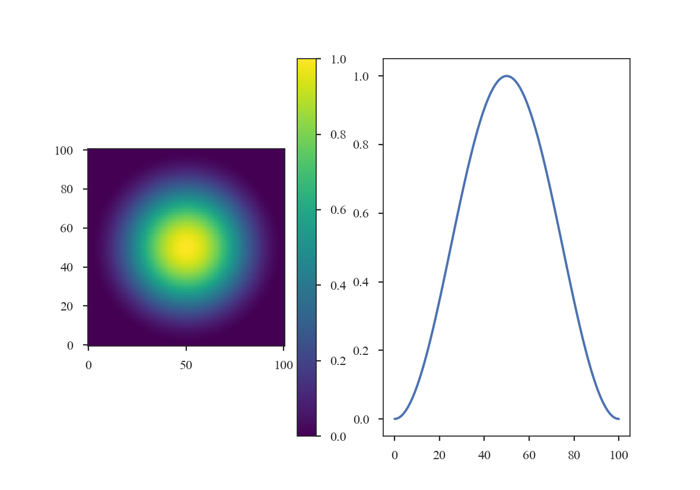
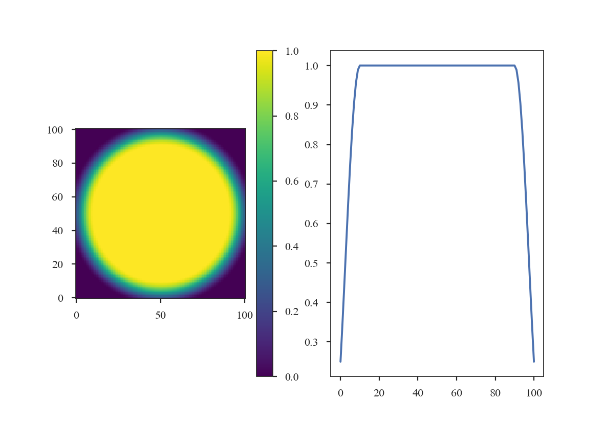
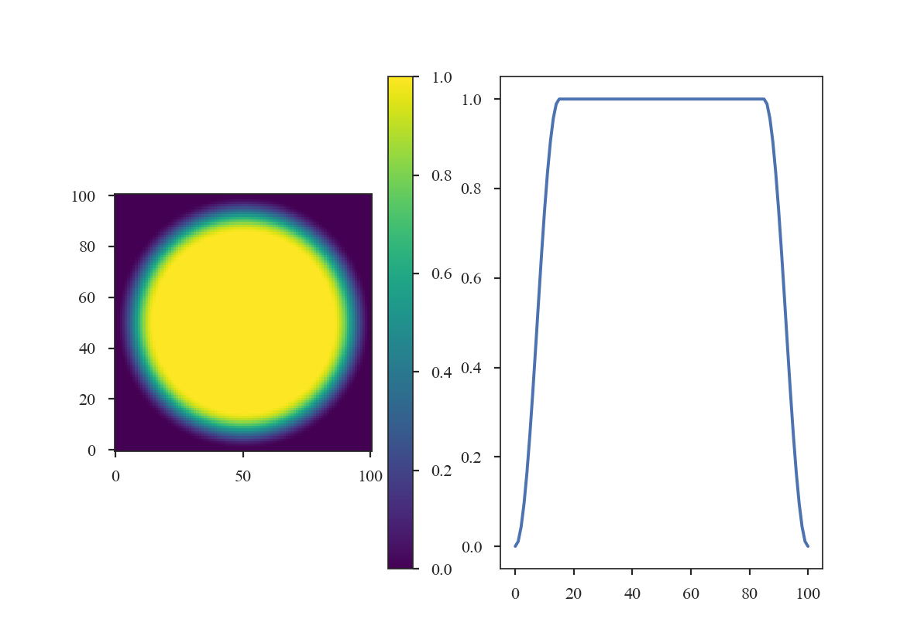
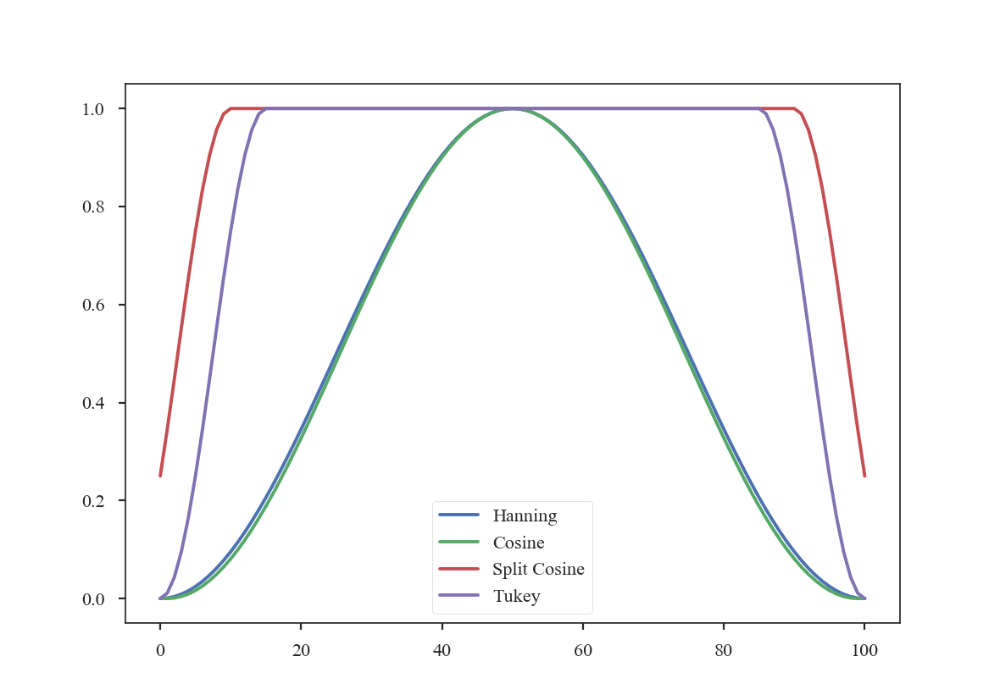
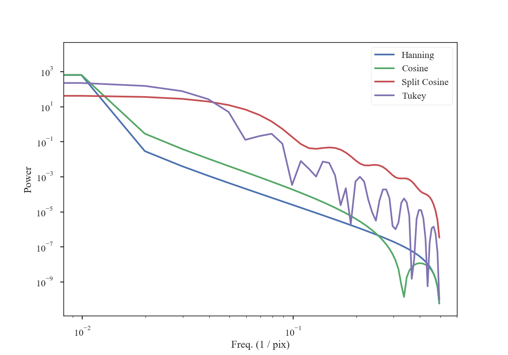
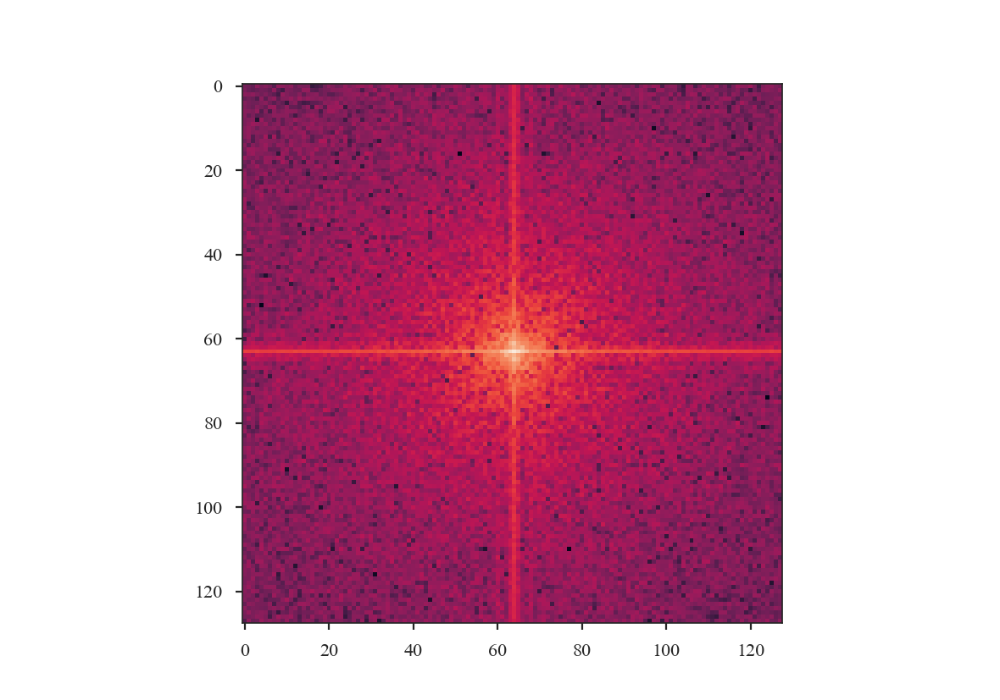
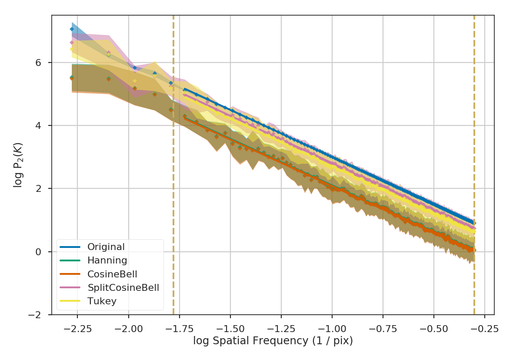

.. _apodkerns:

**********************************
Applying Apodizing Kernels to Data
**********************************

Applying Fourier transforms to images with emission at the edges can lead to severe ringing effects from the `Gibbs phenomenon <https://en.wikipedia.org/wiki/Gibbs_phenomenon>`_.  This can be an issue for all spatial power-spectra, including the :ref:`PowerSpectrum <pspec_tutorial>`, :ref:`VCA <vca_tutorial>`, and :ref:`MVC <mvc_tutorial>`.

A common way to avoid this issue is to apply a window function that smoothly tapers the values at the edges of the image to zero (e.g., `Stanimirovic et al. 1999 <https://ui.adsabs.harvard.edu/#abs/1999MNRAS.302..417S/abstract>`_).  However, the shape of the window function will also affect some frequencies in the Fourier transform. This page demonstrates these effects for some common window shapes.

TurbuStat has four built-in apodizing functions based on the implementations from `photutils <https://photutils.readthedocs.io/en/stable/psf_matching.html>`_:

The Hanning window:

    >>> from turbustat.statistics.apodizing_kernels import \
    ...    (CosineBellWindow, TukeyWindow, HanningWindow, SplitCosineBellWindow)
    >>> import matplotlib.pyplot as plt
    >>> import numpy as np
    >>> shape = (101, 101)
    >>> taper = HanningWindow()
    >>> data = taper(shape)
    >>> plt.subplot(121)  # doctest: +SKIP
    >>> plt.imshow(data, cmap='viridis', origin='lower')  # doctest: +SKIP
    >>> plt.colorbar()  # doctest: +SKIP
    >>> plt.subplot(122)  # doctest: +SKIP
    >>> plt.plot(data[shape[0] // 2])  # doctest: +SKIP

The Cosine Bell Window:

    >>> taper2 = CosineBellWindow(alpha=0.8)
    >>> data2 = taper2(shape)
    >>> plt.subplot(121)  # doctest: +SKIP
    >>> plt.imshow(data2, cmap='viridis', origin='lower')  # doctest: +SKIP
    >>> plt.colorbar()  # doctest: +SKIP
    >>> plt.subplot(122)  # doctest: +SKIP
    >>> plt.plot(data2[shape[0] // 2])  # doctest: +SKIP

.. image:: images/cosine.png

The Split-Cosine Bell Window:

    >>> taper3 = SplitCosineBellWindow(alpha=0.1, beta=0.5)
    >>> data3 = taper3(shape)
    >>> plt.subplot(121)  # doctest: +SKIP
    >>> plt.imshow(data3, cmap='viridis', origin='lower')  # doctest: +SKIP
    >>> plt.colorbar()  # doctest: +SKIP
    >>> plt.subplot(122)  # doctest: +SKIP
    >>> plt.plot(data3[shape[0] // 2])  # doctest: +SKIP

And the Tukey Window:

    >>> taper4 = TukeyWindow(alpha=0.3)
    >>> data4 = taper4(shape)
    >>> plt.subplot(121)  # doctest: +SKIP
    >>> plt.imshow(data4, cmap='viridis', origin='lower')  # doctest: +SKIP
    >>> plt.colorbar()  # doctest: +SKIP
    >>> plt.subplot(122)  # doctest: +SKIP
    >>> plt.plot(data4[shape[0] // 2])  # doctest: +SKIP

The former two windows consistently taper smoothly from the centre to the edge, while the latter two have flattened plateaus with tapering only at the edge. Plotting the 1-dimensional slices makes these differences clear:

    >>> plt.plot(data[shape[0] // 2], label='Hanning')  # doctest: +SKIP
    >>> plt.plot(data2[shape[0] // 2], label='Cosine')  # doctest: +SKIP
    >>> plt.plot(data3[shape[0] // 2], label='Split Cosine')  # doctest: +SKIP
    >>> plt.plot(data4[shape[0] // 2], label='Tukey')  # doctest: +SKIP
    >>> plt.legend(frameon=True)  # doctest: +SKIP

To get an idea of how these apodizing functions affect the data, we can examine their power-spectra:

    >>> freqs = np.fft.rfftfreq(shape[0])
    >>> plt.loglog(freqs, np.abs(np.fft.rfft(data[shape[0] // 2]))**2, label='Hanning')  # doctest: +SKIP
    >>> plt.loglog(freqs, np.abs(np.fft.rfft(data2[shape[0] // 2]))**2, label='Cosine')  # doctest: +SKIP
    >>> plt.loglog(freqs, np.abs(np.fft.rfft(data3[shape[0] // 2]))**2, label='Split Cosine')  # doctest: +SKIP
    >>> plt.loglog(freqs, np.abs(np.fft.rfft(data4[shape[0] // 2]))**2, label='Tukey')  # doctest: +SKIP
    >>> plt.legend(frameon=True)  # doctest: +SKIP
    >>> plt.xlabel("Freq. (1 / pix)")  # doctest: +SKIP
    >>> plt.ylabel("Power")  # doctest: +SKIP

The smoothly-varying windows (Hanning and Cosine) have power-spectra that consistently decrease the power. This means that the use of a Hanning or Cosine window will affect the shape of power-spectra over a larger range of frequencies than the Split-Cosine or Tukey windows.

These apodizing kernels are azimuthally-symmetric. However, as an example, the 2D power-spectrum of the Tukey Window, which is used below, has this structure::

    >>> plt.imshow(np.log10(np.fft.fftshift(np.abs(np.fft.fft2(data4))**2)))  # doctest: +SKIP

As an example, we will compare the effect each of the windows has on a red-noise image.

    >>> from turbustat.simulator import make_extended
    >>> from turbustat.io.sim_tools import create_fits_hdu
    >>> from astropy import units as u
    >>> # Image drawn from red-noise
    >>> rnoise_img = make_extended(256, powerlaw=3.)
    >>> # Define properties to generate WCS information
    >>> pixel_scale = 3 * u.arcsec
    >>> beamfwhm = 3 * u.arcsec
    >>> imshape = rnoise_img.shape
    >>> restfreq = 1.4 * u.GHz
    >>> bunit = u.K
    >>> # Create a FITS HDU
    >>> plaw_hdu = create_fits_hdu(rnoise_img, pixel_scale, beamfwhm, imshape, restfreq, bunit)
    >>> plt.imshow(plaw_hdu.data)  # doctest: +SKIP

.. image:: images/rednoise_slope3_img.png

The image should have a power-spectrum index of 3 with mean values centred at 0. By running `~turbustat.statistics.PowerSpectrum`, we can confirm that the index is indeed 3 (see the variable `x1` in the output):

    >>> from turbustat.statistics import PowerSpectrum
    >>> pspec = PowerSpectrum(plaw_hdu)
    >>> pspec.run(verbose=True, radial_pspec_kwargs={'binsize': 1.0},
    ...           fit_2D=False,
    ...           low_cut=1. / (60 * u.pix))  # doctest: +SKIP
                                OLS Regression Results
    ==============================================================================
    Dep. Variable:                      y   R-squared:                       1.000
    Model:                            OLS   Adj. R-squared:                  1.000
    Method:                 Least Squares   F-statistic:                 8.070e+06
    Date:                Thu, 21 Jun 2018   Prob (F-statistic):               0.00
    Time:                        11:43:47   Log-Likelihood:                 701.40
    No. Observations:                 177   AIC:                            -1399.
    Df Residuals:                     175   BIC:                            -1392.
    Df Model:                           1
    Covariance Type:            nonrobust
    ==============================================================================
                     coef    std err          t      P>|t|      [0.025      0.975]
    ------------------------------------------------------------------------------
    const          0.0032      0.001      3.952      0.000       0.002       0.005
    x1            -2.9946      0.001  -2840.850      0.000      -2.997      -2.992
    ==============================================================================
    Omnibus:                      252.943   Durbin-Watson:                   1.077
    Prob(Omnibus):                  0.000   Jarque-Bera (JB):            26797.433
    Skew:                          -5.963   Prob(JB):                         0.00
    Kurtosis:                      62.087   Cond. No.                         4.55
    ==============================================================================

.. image:: images/rednoise_pspec_slope3.png

The slope is nearly 3, as expected. Note that we have limited the range of frequencies fit over to avoid the largest scales using the parameter ``low_cut``. Also note that there is a "hole" in the centre of the 2D power-spectrum on the right panel in the image. This is the zero-frequency of the image and scales with the mean value of the image. Since this image is centred at 0, there is no power at the zero-frequency point in the centre of the 2D power-spectrum.

From the figure, it is clear that the samples on larger scales deviate from a power-law. This deviation is a result of the lack of samples on these large-scales. It can be avoided by increasing the size of the radial bins, but we will use small bins here to highlight the effect of the apodizing kernels on the power-spectrum shape.

Before exploring the effect of the apodizing kernels, we can demonstrate the need for an apodizing kernel by taking a slice of the red-noise image, such that the edges are no longer periodic.

    >>> pspec_partial = PowerSpectrum(rnoise_img[:128, :128], header=plaw_hdu.header).run(verbose=False, fit_2D=False, low_cut=1 / (60. * u.pix))
    >>> plt.imshow(np.log10(pspec_partial.ps2D))  # doctest: +SKIP

The ringing at large scales is evident in the cross-shape in the 2D power spectrum. This affects the azimuthally-averaged 1D power-spectrum, and therefore the slope of the power-spectrum.  Tapering the values at the edges can account for this.

The power-spectrum also appears noisier than the original, yet no noise has been added to the image.  This is due to the image no longer being fully sampled for a power-spectrum index of :math:`3`. This index has most of its power on large scales, so the most prominent structure is on large scales, and slicing has removed significant portions of the large-scale structure.  Also note that there is no "hole" at the centre of the 2D power-spectrum since the mean of the sliced image is not :math:`0`.

We will now compare the how the different apodizing kernels change the power-spectrum shape. The power-spectra will be fit up to scales of :math:`60` pixels (or a frequency of :math:`0.01667`), avoiding scales that are poorly sampled in the sliced image. The following code computes the power-spectrum of the sliced image using all four of the apodizing kernels shown above.

    >>> pspec2 = PowerSpectrum(plaw_hdu)
    >>> pspec2.run(verbose=False, radial_pspec_kwargs={'binsize': 1.0},
    ...            fit_2D=False,
    ...            low_cut=1. / (60 * u.pix),
    ...            apodize_kernel='hanning',)  # doctest: +SKIP

    >>> pspec3 = PowerSpectrum(plaw_hdu)
    >>> pspec3.run(verbose=False, radial_pspec_kwargs={'binsize': 1.0},
    ...            fit_2D=False,
    ...            low_cut=1. / (60 * u.pix),
    ...            apodize_kernel='cosinebell', alpha=0.98)  # doctest: +SKIP

    >>> pspec4 = PowerSpectrum(plaw_hdu)
    >>> pspec4.run(verbose=False, radial_pspec_kwargs={'binsize': 1.0},
    ...            fit_2D=False,
    ...            low_cut=1. / (60 * u.pix),
    ...            apodize_kernel='splitcosinebell', alpha=0.3, beta=0.8)  # doctest: +SKIP

    >>> pspec5 = PowerSpectrum(plaw_hdu)
    >>> pspec5.run(verbose=False, radial_pspec_kwargs={'binsize': 1.0},
    ...            fit_2D=False,
    ...            low_cut=1. / (60 * u.pix),
    ...            apodize_kernel='tukey', alpha=0.3)  # doctest: +SKIP

For brevity, we will plot only the 1D power-spectra using the different apodizing kernels.

    >>> # Change the colours and comment these lines if you don't use seaborn
    >>> import seaborn as sb  # doctest: +SKIP
    >>> col_pal = sb.color_palette()  # doctest: +SKIP
    >>> pspec.plot_fit(color=col_pal[0], label='Original')  # doctest: +SKIP
    >>> pspec2.plot_fit(color=col_pal[1], label='Hanning')  # doctest: +SKIP
    >>> pspec3.plot_fit(color=col_pal[2], label='CosineBell')  # doctest: +SKIP
    >>> pspec4.plot_fit(color=col_pal[3], label='SplitCosineBell')  # doctest: +SKIP
    >>> pspec5.plot_fit(color=col_pal[4], label='Tukey')  # doctest: +SKIP
    >>> plt.legend(frameon=True, loc='lower left')  # doctest: +SKIP
    >>> plt.ylim([2, 9.5])  # doctest: +SKIP
    >>> plt.tight_layout()  # doctest: +SKIP

Comparing the different power spectra with different apodizing kernels, the only variations occur on large scales.  However, as noted above, the large frequencies suffer from a lack of samples and tend to have underestimated errors.  The well-sampled range of frequencies, from 1 to 60 pixels, have a slope that is relatively unaffected regardless of the apodizing kernel that is used. The fitted slopes are:

    >>> print("Original: {0:.2f} \nHanning: {1:.2f} \nCosineBell: {2:.2f} \n"
    ...       "SplitCosineBell: {3:.2f} "
    ...       "\nTukey: {4:.2f}".format(pspec.slope,
    ...                                 pspec2.slope,
    ...                                 pspec3.slope,
    ...                                 pspec4.slope,
    ...                                 pspec5.slope))  # doctest: +SKIP
    Original: -3.00
    Hanning: -2.95
    CosineBell: -2.95
    SplitCosineBell: -3.00
    Tukey: -3.01

Each of the slopes are close to the expected value of :math:`-3`. The Cosine and Hanning kernels moderately flatten the power-spectra on all scales. This is evident from the figure above comparing the 1D power-spectra of the four kernels.

.. warning:: The range of frequencies affected by the apodizing kernel depends on the properties of the kernel used. The shape of the kernels are controlled by the :math:`\alpha` and/or :math:`\beta` parameters (see above). Narrower shapes will tend to have a larger effect on the power-spectrum. It is prudent to check the effect of the apodizing kernel by comparing different choices for the shape!

The optimal choice of apodizing kernel, and the shape parameters for that kernel, will depend on the data that is being used. If there is severe ringing in the power-spectrum, the Hanning or CosineBell kernels are most effective at removing ringing.  However, as shown above, these kernels bias the slope at all frequencies. The SplitCosineBell or Tukey are not as affective at removing ringing in extreme cases but they do only bias the shape of the power-spectrum at large frequencies (:math:`\sim1/2` of the image size and larger).
