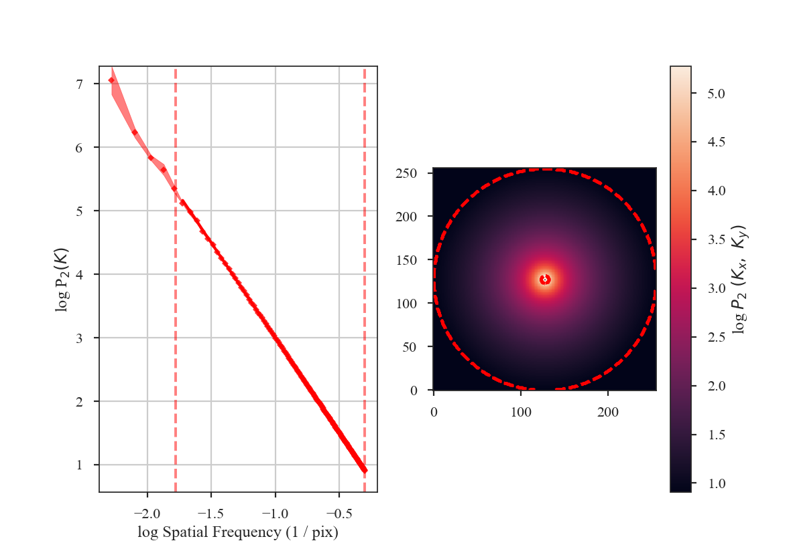
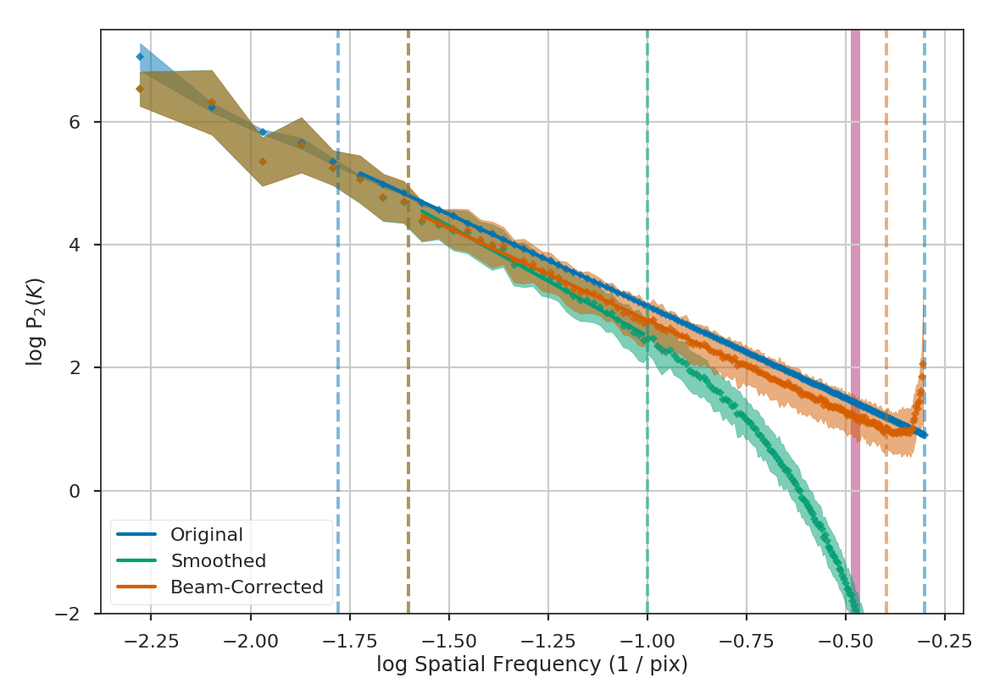

.. _correcting_for_beam:

*****************************
Accounting for the beam shape
*****************************

.. warning:: The beam size of an observation introduces artificial correlations into the data
    on scales near to and below the beam size. This affects the shape of various turbulence statistics that
    measure spatial properties (Spatial Power-Spectrum, MVC, VCA, Delta-Variance, Wavelets, SCF).

The beam size is typically expressed as the full-width-half-max (FWHM). However, it is
important to note that the data will still be correlated beyond the FWHM. For example,
consider a randomly-drawn image with a specified power-law index:

    >>> import matplotlib.pyplot as plt
    >>> from turbustat.simulator import make_extended
    >>> from turbustat.io.sim_tools import create_fits_hdu
    >>> from astropy import units as u
    >>> # Image drawn from red-noise
    >>> rnoise_img = make_extended(256, powerlaw=3.)
    >>> # Define properties to generate WCS information
    >>> pixel_scale = 3 * u.arcsec
    >>> beamfwhm = 3 * u.arcsec
    >>> imshape = rnoise_img.shape
    >>> restfreq = 1.4 * u.GHz
    >>> bunit = u.K
    >>> # Create a FITS HDU
    >>> plaw_hdu = create_fits_hdu(rnoise_img, pixel_scale, beamfwhm, imshape, restfreq, bunit)
    >>> plt.imshow(plaw_hdu.data)  # doctest: +SKIP

.. image:: images/rednoise_slope3_img.png

The power-spectrum of the image should give a slope of 3:

    >>> from turbustat.statistics import PowerSpectrum
    >>> pspec = PowerSpectrum(plaw_hdu)
    >>> pspec.run(verbose=True, radial_pspec_kwargs={'binsize': 1.0},
    ...           fit_kwargs={'weighted_fit': True}, fit_2D=False,
    ...           low_cut=1. / (60 * u.pix))  # doctest: +SKIP
                                OLS Regression Results
    ==============================================================================
    Dep. Variable:                      y   R-squared:                       1.000
    Model:                            OLS   Adj. R-squared:                  1.000
    Method:                 Least Squares   F-statistic:                 8.070e+06
    Date:                Thu, 21 Jun 2018   Prob (F-statistic):               0.00
    Time:                        11:43:47   Log-Likelihood:                 701.40
    No. Observations:                 177   AIC:                            -1399.
    Df Residuals:                     175   BIC:                            -1392.
    Df Model:                           1
    Covariance Type:            nonrobust
    ==============================================================================
                     coef    std err          t      P>|t|      [0.025      0.975]
    ------------------------------------------------------------------------------
    const          0.0032      0.001      3.952      0.000       0.002       0.005
    x1            -2.9946      0.001  -2840.850      0.000      -2.997      -2.992
    ==============================================================================
    Omnibus:                      252.943   Durbin-Watson:                   1.077
    Prob(Omnibus):                  0.000   Jarque-Bera (JB):            26797.433
    Skew:                          -5.963   Prob(JB):                         0.00
    Kurtosis:                      62.087   Cond. No.                         4.55
    ==============================================================================

Now we will smooth this image with a Gaussian beam. The easiest way to do this is to use the built-in
tools from the `spectral-cube <https://spectral-cube.readthedocs.io/en/latest/>`_ and
`radio_beam <https://github.com/radio-astro-tools/radio-beam/blob/master/docs/index.rst>`_ packages.
We will convert the FITS HDU to a spectral-cube `Projection`, and define a pencil beam for the
initial image:

    >>> from spectral_cube import Projection
    >>> from radio_beam import Beam
    >>> pencil_beam = Beam(0 * u.deg)
    >>> plaw_proj = Projection.from_hdu(plaw_hdu)
    >>> plaw_proj = plaw_proj.with_beam(pencil_beam)

Next we will define the beam to smooth to. A 3-pixel wide FWHM is reasonable:

    >>> new_beam = Beam(3 * plaw_hdu.header['CDELT2'] * u.deg)
    >>> plaw_conv = plaw_proj.convolve_to(new_beam)
    >>> plaw_conv.quicklook()  # doctest: +SKIP

.. image:: images/rednoise_slope3_img_smoothed.png

How has smoothing changed the shape of the power-spectrum?

    >>> # Change the colours and comment these lines if you don't use seaborn
    >>> import seaborn as sb  # doctest: +SKIP
    >>> col_pal = sb.color_palette()  # doctest: +SKIP
    >>> pspec2 = PowerSpectrum(plaw_conv)
    >>> pspec2.run(verbose=True, xunit=u.pix**-1, fit_2D=False,
    ...            low_cut=0.025 / u.pix, high_cut=0.1 / u.pix,
    ...            radial_pspec_kwargs={'binsize': 1.0},
    ...            apodize_kernel='tukey')  # doctest: +SKIP
    >>> plt.axvline(np.log10(1 / 3.), color=col_pal[3], linewidth=8, alpha=0.8,
    ...             zorder=1)  # doctest: +SKIP
                                OLS Regression Results
    ==============================================================================
    Dep. Variable:                      y   R-squared:                       0.988
    Model:                            OLS   Adj. R-squared:                  0.988
    Method:                 Least Squares   F-statistic:                     2059.
    Date:                Thu, 21 Jun 2018   Prob (F-statistic):           1.54e-25
    Time:                        14:23:19   Log-Likelihood:                 35.997
    No. Observations:                  27   AIC:                            -67.99
    Df Residuals:                      25   BIC:                            -65.40
    Df Model:                           1
    Covariance Type:            nonrobust
    ==============================================================================
                     coef    std err          t      P>|t|      [0.025      0.975]
    ------------------------------------------------------------------------------
    const         -1.0626      0.098    -10.848      0.000      -1.264      -0.861
    x1            -3.5767      0.079    -45.378      0.000      -3.739      -3.414
    ==============================================================================
    Omnibus:                        3.417   Durbin-Watson:                   0.840
    Prob(Omnibus):                  0.181   Jarque-Bera (JB):                2.072
    Skew:                          -0.650   Prob(JB):                        0.355
    Kurtosis:                       3.391   Cond. No.                         15.7
    ==============================================================================

The slope of the power-spectrum is significantly steepened on small scales by the beam (see the reported result in variable ``x1`` above).
And this steepening occurs on scales much larger than the beam FWHM, which is indicated by
the thick purple vertical line in the left-hand side of the plot.  The fitting was restricted to scales much larger than three times the beam width. However, the recovered slope is still steeper than the original -3.

Also note that convolving the image with the beam causes some tapering at the edges of the
image, breaking the periodicity at the edges. The image was apodized with a Tukey window,
which causes some of the deviations at large scales (small frequencies). See the
:ref:`tutorial page on apodizing kernels for more <apodkerns>`.

The beam size must be corrected for in the image prior to fitting the power-spectrum. This can
be done by (1) including a Gaussian beam component in the model used to fit the power-spectrum,
or (2) divide the power-spectrum of the image by the power-spectrum of the beam response. The
former requires using a non-linear model, and is not currently implemented in TurbuStat (see `Martin et al. 2015 <https://ui.adsabs.harvard.edu/#abs/2015ApJ...809..153M/abstract>`_ for an example). The
latter method can be applied prior to fitting, allowing a linear model to still be used for
fitting.

The beam correction in TurbuStat requires the optional package `radio_beam <https://github.com/radio-astro-tools/radio-beam/blob/master/docs/index.rst>`_ to be installed. `radio_beam` allows the beam response for any 2D elliptical Gaussian to be returned. For statistics that create a power-spectrum (Spatial Power-Spectrum, VCA, MVC), the beam correction can be applied by specifying `beam_correct=True`:

    >>> pspec3 = PowerSpectrum(plaw_conv)
    >>> pspec3.run(verbose=True, xunit=u.pix**-1, fit_2D=False,
    ...            low_cut=0.025 / u.pix, high_cut=0.4 / u.pix,
    ...            apodize_kernel='tukey', beam_correct=True)  # doctest: +SKIP
    >>> plt.axvline(np.log10(1 / 3.), color=col_pal[3], linewidth=8, alpha=0.8,
    ...             zorder=1)  # doctest: +SKIP
                                OLS Regression Results
    ==============================================================================
    Dep. Variable:                      y   R-squared:                       0.998
    Model:                            OLS   Adj. R-squared:                  0.998
    Method:                 Least Squares   F-statistic:                 8.828e+04
    Date:                Thu, 21 Jun 2018   Prob (F-statistic):          5.55e-192
    Time:                        14:38:33   Log-Likelihood:                 268.87
    No. Observations:                 137   AIC:                            -533.7
    Df Residuals:                     135   BIC:                            -527.9
    Df Model:                           1
    Covariance Type:            nonrobust
    ==============================================================================
                     coef    std err          t      P>|t|      [0.025      0.975]
    ------------------------------------------------------------------------------
    const         -0.2247      0.008    -27.671      0.000      -0.241      -0.209
    x1            -2.9961      0.010   -297.116      0.000      -3.016      -2.976
    ==============================================================================
    Omnibus:                        7.089   Durbin-Watson:                   1.500
    Prob(Omnibus):                  0.029   Jarque-Bera (JB):                9.274
    Skew:                           0.285   Prob(JB):                      0.00969
    Kurtosis:                       4.140   Cond. No.                         5.50
    ==============================================================================

.. image:: images/rednoise_pspec_slope3_smoothed_beamcorr.png

The shape of the power-spectrum has been restored and we recover the correct slope. The deviation on small scales (large frequencies) occurs on scales smaller than about the FWHM of the beam where the information has been lost by the spatial smoothing applied to the image. If the beam is over-sampled by a larger factor --- say with a 6-pixel FWHM instead of 3 --- the increase in power on small scales will affect a larger region of the power-spectrum. This region should be excluded from the power-spectrum fit. A reasonable lower-limit to fit the power-spectrum to is the FWHM of the beam. Additional noise in the image will tend to flatten the power-spectrum to larger scales, so setting the lower fitting limit to a couple times the beam width may be necessary. **We recommend visually examining the quality of the fit.**

Here are the three power-spectra shown above overplotted to highlight the shape changes from spatial smoothing:

    >>> pspec.plot_fit(color=col_pal[0], label='Original')  # doctest: +SKIP
    >>> pspec2.plot_fit(color=col_pal[1], label='Smoothed')  # doctest: +SKIP
    >>> pspec3.plot_fit(color=col_pal[2], label='Beam-Corrected')  # doctest: +SKIP
    >>> plt.legend(frameon=True, loc='lower left')  # doctest: +SKIP
    >>> plt.axvline(np.log10(1 / 3.), color=col_pal[3], linewidth=8, alpha=0.8, zorder=-1)  # doctest: +SKIP
    >>> plt.ylim([-2, 7.5])  # doctest: +SKIP
    >>> plt.tight_layout()  # doctest: +SKIP

Similar fitting restrictions apply to the MVC and VCA, as well. The beam correction can be applied in the same manner as described above. For other spatial methods which do not use the power-spectrum, the scales of the beam should at least be excluded from any fitting. For example, lag scales smaller than the beam in the :ref:`Delta-Variance <delvar_tutorial>`, :ref:`Wavelets <wavelet_tutorial>`, and :ref:`SCF <scf_tutorial>` should not be fit. The spatial filtering used to measure :ref:`Statistical Moments <statmoments_tutorial>` should be set to a width of at least the beam size.
