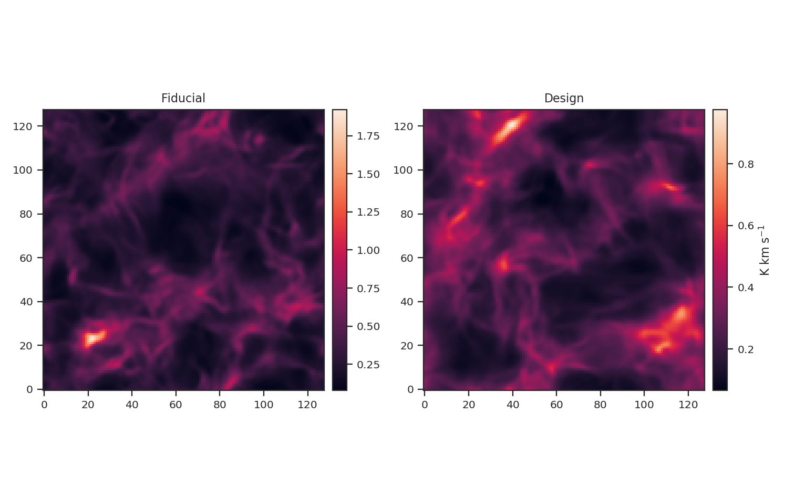

.. _data_for_tutorial:

Data for tutorials
******************

Two data sets are used for the tutorials and can be downloaded `here <https://girder.hub.yt/#user/57b31aee7b6f080001528c6d/folder/59721a30cc387500017dbe37>`_. The data are synthetic :math:`^{13}{\rm CO}(2\rightarrow)1` spectral-line data cubes from different ENZO adaptive-mesh-refinement simulations.  The simulations setup and input parameters are given in `Koch et al. 2017 <https://ui.adsabs.harvard.edu/#abs/2017MNRAS.471.1506K/abstract>`_ (see Table 1). One of the data sets is a "Fiducial" and the other is a "Design" simulation; the input parameters for the solenoidal fraction, virial parameter, plasma beta, Mach number, and driving scale all differ between the two simulations.

+---------------------+----------+--------+
| Parameter           | Fiducial | Design |
+=====================+==========+========+
| Solenoidal Fraction |    1/2   |  1/3   |
+---------------------+----------+--------+
| Virial Parameter    |     6    |   2    |
+---------------------+----------+--------+
| Plasma beta         |     1    |   2    |
+---------------------+----------+--------+
| Mach number         |    8.5   |   5    |
+---------------------+----------+--------+
| Driving scale       |    2-8   |  2-4   |
+---------------------+----------+--------+

The simulations were performed on a :math:`128^3` base grid with a fixed random turbulent driving field and the boundaries are continuous (i.e., periodic box). The data cubes were produced from one time step after gravity is turned one (:math:`\sim0.1` of the free-fall time). The spectral resolution (i.e., channel width) of the cubes is :math:`40` m/s.

Moment maps can also be downloaded from the data cubes with the link above. Each data cube has a zeroth (integrated intensity), first (centroid), and square of the second (line width) moment maps.

These data have a limited inertial range, which is evident in the :ref:`Spatial Power Spectrum tutorial <pspec_tutorial>`. Turbulent dissipation causes the power-spectrum to steepen on small scales and it is necessary to limit the range of scales that are fit.

The following image shows the integrated intensity (zeroth moment) maps of the tutorial data::

Note how the integrated intensity scale varies between the two data sets.
