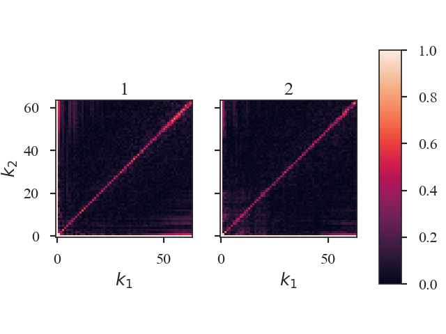

.. _bispecdist:

*******************
Bispectrum Distance
*******************

See :ref:`the tutorial <bispec_tutorial>` for a description of the bispectrum.

The distance metric for the bispectrum is `~turbustat.statistics.Bispectrum_Distance`. There are two definitions of a distance:

1. The surface distance is the L2 norm between the bicoherence surfaces of two 2D images:
    .. math::
        d_{\rm surface} = ||b_1(k_1, k_2) - b_2(k_1, k_2)||^2

The :math:`k_1,\,k_2` are wavenumbers and :math:`b_1,\,b_2` are the bicoherence arrays for each image.

.. warning:: The images must have the same shape to use this definition of distance.

2. The mean distance is the absolute difference between the mean bicoherence of two 2D images:
    .. math::
        d_{\rm mean} = |\bar{b_1(k_1, k_2)} - \bar{b_1(k_1, k_2)}|

This distance metric can be used with images of different shapes.

The bicoherence surface is used for the distance metric because it is normalized between 0 and 1, and this normalization removes the effect of the mean of the images (`meansub` in the :ref:`bispectrum tutorial <bispec_tutorial>`).

More information on the distance metric definitions can be found in `Koch et al. 2017 <https://ui.adsabs.harvard.edu/#abs/2017MNRAS.471.1506K/abstract>`_

Using
-----

**The data in this tutorial are available** `here <https://girder.hub.yt/#user/57b31aee7b6f080001528c6d/folder/59721a30cc387500017dbe37>`_.

We need to import the `~turbustat.statistics.Bispectrum_Distance` class, along with a few other common packages:

    >>> from turbustat.statistics import Bispectrum_Distance
    >>> from astropy.io import fits
    >>> import matplotlib.pyplot as plt

And we load in the two data sets; in this case, two integrated intensity (zeroth moment) maps:

    >>> moment0 = fits.open("Design4_flatrho_0021_00_radmc_moment0.fits")[0]  # doctest: +SKIP
    >>> moment0_fid = fits.open("Fiducial0_flatrho_0021_00_radmc_moment0.fits")[0]  # doctest: +SKIP

The images are passed to the `~turbustat.statistics.Bispectrum_Distance` class. Keyword arguments to `~turbustat.statistics.Bispectrum.run` can also be given as the dictionary `stat_kwargs`. In this case, we will increase the number of random samples used to estimate the bispectrum:

    >>> bispec = Bispectrum_Distance(moment0_fid, moment0,
    ...                              stat_kwargs={'nsamples': 10000})  # doctest: +SKIP

This call executes `~turbustat.statistics.Bispectrum.run` for both images and may take a few minutes to run (reduce the number of samples to speed things up).  Within `~turbustat.statistics.Bispectrum_Distance` is a `~turbustat.statistics.Bispectrum` for each image: `~turbustat.statistics.Bispectrum_Distance.bispec1` and `~turbustat.statistics.Bispectrum_Distance.bispec2`. Each of these class instances can be run separately with, as shown in the :ref:`bispectrum tutorial <bispec_tutorial>`, to fine-tune or alter how the bispectrum is computed.

Once the bispectra are computed, we can calculate the distances between the two bispectra and create a summary plot with:

    >>> bispec.distance_metric(verbose=True)  # doctest: +SKIP

The bicoherence surfaces of both images are shown. By default, the plots are labelled with "1" and "2" in the order the data were given to `~turbustat.statistics.Bispectrum_Distance`. Custom labels can be set by setting `label1` and `label2` in the distance metric call.

The distances between these images are:

    >>> bispec.surface_distance  # doctest: +SKIP
    3.169320958026329

    Since these images have equal shapes, `~turbustat.statistics.Bispectrum_Distance.surface_distance` is defined. If the images do not have equal shapes, the distance will be `NaN`.

    >>> bispec.mean_distance  # doctest: +SKIP
    0.009241794373870557

.. warning:: Caution must be used when passing a pre-computed `~turbustat.statistics.Bispectrum` instead of the data for `moment0` or `moment0_fid` as there are no checks to ensure the bispectra were computed the same way (e.g., do both have `mean_sub=True` set?). Ensure that the keyword arguments for the pre-computed statistic match those specified to `~turbustat.statistics.Bispectrum_Distance`. See :ref:`the distance metric introduction <runmetrics>`.

References
----------

`Boyden et al. 2016 <https://ui.adsabs.harvard.edu/#abs/2016ApJ...833..233B/abstract>`_

`Koch et al. 2017 <https://ui.adsabs.harvard.edu/#abs/2017MNRAS.471.1506K/abstract>`_

`Boyden et al. 2018 <https://ui.adsabs.harvard.edu/#abs/2018ApJ...860..157B/abstract>`_
