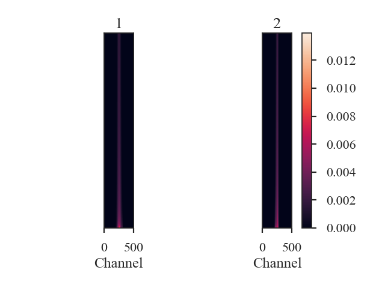

.. _cramerdist:

***************
Cramer Distance
***************

The Cramer statistic was introduced by `Baringhaus & Franz (2004) <https://www.sciencedirect.com/science/article/pii/S0047259X03000794>`_ for multivariate two-sample testing.  The statistic is defined as the difference of the Euclidean distances between the two data sets subtracted by half of the distances measured within each data set.

`Yeremi et al. 2015 <https://ui.adsabs.harvard.edu/#abs/2014ApJ...783...93Y/abstract>`_ applied this to position-position-velocity data cubes by selecting a sample of the brightest pixels in each spectral channel to reduce the cube to a 2D data matrix. It was also used tested in `Koch et al. 2017 <https://ui.adsabs.harvard.edu/#abs/2017MNRAS.471.1506K/abstract>`_, and the definition used in TurbuStat can be found there.

.. warning:: `Koch et al. 2017 <https://ui.adsabs.harvard.edu/#abs/2017MNRAS.471.1506K/abstract>`_ find that this test is unsuitable for comparing data cubes that have a large difference in their mean intensities. When using this metric, be sure that the intensity distributions have similar mean intensities or apply some normalization prior to running the metric. Be cautious when interpreting these results and ensure that the distances are compared to a well-understood fiducial.

Using
-----

**The data in this tutorial are available** `here <https://girder.hub.yt/#user/57b31aee7b6f080001528c6d/folder/59721a30cc387500017dbe37>`_.

We need to import the `~turbustat.statistics.Cramer_Distance` class, along with a few other common packages:

    >>> from turbustat.statistics import Cramer_Distance
    >>> from astropy.io import fits
    >>> import matplotlib.pyplot as plt

And we load in the two data sets. The Cramer statistic needs two cubes:

    >>> cube = fits.open("Design4_flatrho_0021_00_radmc.fits")[0]  # doctest: +SKIP
    >>> cube_fid = fits.open("Fiducial0_flatrho_0021_00_radmc.fits")[0]  # doctest: +SKIP

`~turbustat.statistics.Cramer_Distance` takes the two cubes as inputs. Minimum intensity values for the statistic to consider can be specified with `noise_value1` and `noise_value2`.

    >>> cramer = Cramer_Distance(cube_fid, cube, noise_value1=-np.inf,
    ...                          noise_value2=-np.inf)  # doctest: +SKIP

Note that, since the Cramer statistic defaults to using the upper 20% of the values in each spectral channel, there may not be large differences in the distance when the noise values are low.

The 2D data matrices and the Cramer statistic can now be calculated with:

    >>> cramer.distance_metric(normalize=True, n_jobs=1, verbose=True)  # doctest: +SKIP

Setting `verbose=True` creates this figure, where the data matrices are shown for each data cube. The x-axis are the spectral channels and the y-axis are, ordered with the largest at the bottom, the largest pixel values in that spectral channel. Custom labels can be set by setting `label1` and `label2` in the distance metric call above.

The argument `n_jobs` sets how many cores to use when calculating pairwise distances with the sklearn `paired_distances <http://scikit-learn.org/stable/modules/generated/sklearn.metrics.pairwise.paired_distances.html#sklearn.metrics.pairwise.paired_distances>`_ function. This is the slowest step in computing the Cramer statistic; see `~turbustat.statistics.Cramer_Distance.format_data` for more information.

The distance between the data cubes is:

    >>> cramer.distance  # doctest: +SKIP
    0.18175851051788378

`~turbustat.statistics.Cramer_Distance.distance_metric` performs two steps: `~turbustat.statistics.Cramer_Distance.format_data` to find the 2D data matrix for each cube, and `~turbustat.statistics.Cramer_Distance.cramer_statistic` to calculate the distance. These steps can be run separately to allow for changes in the keyword arguments of both.

References
----------

`Baringhaus & Franz 2004 <https://www.sciencedirect.com/science/article/pii/S0047259X03000794>`_

`Yeremi et al. 2015 <https://ui.adsabs.harvard.edu/#abs/2014ApJ...783...93Y/abstract>`_

`Boyden et al. 2016 <https://ui.adsabs.harvard.edu/#abs/2016ApJ...833..233B/abstract>`_

`Koch et al. 2017 <https://ui.adsabs.harvard.edu/#abs/2017MNRAS.471.1506K/abstract>`_

`Boyden et al. 2018 <https://ui.adsabs.harvard.edu/#abs/2018ApJ...860..157B/abstract>`_
