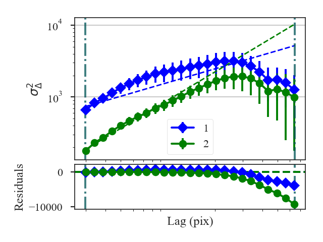
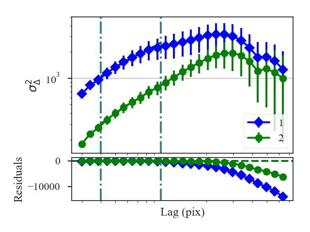
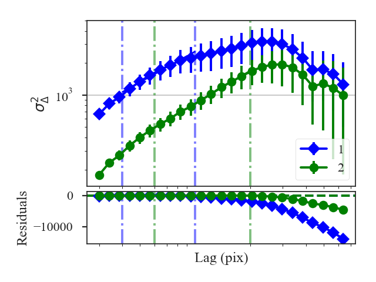

.. _delvardist:

***********************
Delta-Variance Distance
***********************

See :ref:`the tutorial <delvar_tutorial>` for a description of Delta-Variance.

The distance metric for Delta-Variance is `~turbustat.statistics.DeltaVariance_Distance`. There are two definitions of a distance:

1. The curve distance is the L2 norm between the delta-variance curves normalized by the sum of each curve:
    .. math::
        d_{curve} = \left|\left|\frac{\sigma_{\Delta,1}^2 (\ell)}{\sum_i \sigma_{\Delta,1}^2 (\ell)} - \frac{\sigma_{\Delta,2}^2 (\ell)}{\sum_i \sigma_{\Delta,2}^2 (\ell)}\right|\right|

    :math:`\sigma_{\Delta,i}` are the delta-variance values at lag :math:`\ell`.

    This is a non-parametric attempt to describe the entire delta-variance curve, including regions that are not well fit by a power-law model.

   .. warning:: This distance requires the delta-variance to be measured at the same lags in angular units. This is described further below.

2. The slope distance is the t-statistic of the difference in the fitted slopes:
    .. math::
        d_{\rm slope} = \frac{|\beta_1 - \beta_2|}{\sqrt{\sigma_{\beta_1}^2 + \sigma_{\beta_1}^2}}

    :math:`\beta_i` are the slopes of the delta-variance curves and :math:`\sigma_{\beta_i}` are the uncertainty of the slopes.

More information on the distance metric definitions can be found in `Koch et al. 2017 <https://ui.adsabs.harvard.edu/#abs/2017MNRAS.471.1506K/abstract>`_

Using
-----

**The data in this tutorial are available** `here <https://girder.hub.yt/#user/57b31aee7b6f080001528c6d/folder/59721a30cc387500017dbe37>`_.

We need to import the `~turbustat.statistics.DeltaVariance_Distance` class, along with a few other common packages:

    >>> from turbustat.statistics import DeltaVariance_Distance
    >>> from astropy.io import fits
    >>> import matplotlib.pyplot as plt

And we load in the two data sets; in this case, two integrated intensity (zeroth moment) maps:

    >>> moment0 = fits.open("Design4_flatrho_0021_00_radmc_moment0.fits")[0]  # doctest: +SKIP
    >>> moment0_fid = fits.open("Fiducial0_flatrho_0021_00_radmc_moment0.fits")[0]  # doctest: +SKIP

The error maps are saved in the second extension of these FITS files. These can be used as weights for the Delta-Variance:

    >>> moment0_err = fits.open("Design4_flatrho_0021_00_radmc_moment0.fits")[1]  # doctest: +SKIP
    >>> moment0_fid_err = fits.open("Fiducial0_flatrho_0021_00_radmc_moment0.fits")[1]  # doctest: +SKIP

The images (and optionally the error maps) are passed to the `~turbustat.statistics.DeltaVariance_Distance` class:

    >>> delvar = DeltaVariance_Distance(moment0_fid, moment0, weights1=moment0_err,
    ...                                weights2=moment0_fid_err)  # doctest: +SKIP
    >>> delvar.distance_metric(verbose=True, xunit=u.pix)  # doctest: +SKIP
                                WLS Regression Results
    ==============================================================================
    Dep. Variable:                      y   R-squared:                       0.688
    Model:                            WLS   Adj. R-squared:                  0.674
    Method:                 Least Squares   F-statistic:                     11.70
    Date:                Thu, 01 Nov 2018   Prob (F-statistic):            0.00234
    Time:                        13:32:37   Log-Likelihood:                 4.9953
    No. Observations:                  25   AIC:                            -5.991
    Df Residuals:                      23   BIC:                            -3.553
    Df Model:                           1
    Covariance Type:                  HC3
    ==============================================================================
                     coef    std err          z      P>|z|      [0.025      0.975]
    ------------------------------------------------------------------------------
    const          2.5660      0.155     16.602      0.000       2.263       2.869
    x1             0.6353      0.186      3.421      0.001       0.271       0.999
    ==============================================================================
    Omnibus:                        3.845   Durbin-Watson:                   0.313
    Prob(Omnibus):                  0.146   Jarque-Bera (JB):                3.114
    Skew:                          -0.858   Prob(JB):                        0.211
    Kurtosis:                       2.784   Cond. No.                         7.05
    ==============================================================================
                                WLS Regression Results
    ==============================================================================
    Dep. Variable:                      y   R-squared:                       0.956
    Model:                            WLS   Adj. R-squared:                  0.954
    Method:                 Least Squares   F-statistic:                     66.34
    Date:                Thu, 01 Nov 2018   Prob (F-statistic):           3.15e-08
    Time:                        13:32:37   Log-Likelihood:                 14.779
    No. Observations:                  25   AIC:                            -25.56
    Df Residuals:                      23   BIC:                            -23.12
    Df Model:                           1
    Covariance Type:                  HC3
    ==============================================================================
                     coef    std err          z      P>|z|      [0.025      0.975]
    ------------------------------------------------------------------------------
    const          1.6490      0.118     14.001      0.000       1.418       1.880
    x1             1.3072      0.160      8.145      0.000       0.993       1.622
    ==============================================================================
    Omnibus:                        0.251   Durbin-Watson:                   0.559
    Prob(Omnibus):                  0.882   Jarque-Bera (JB):                0.394
    Skew:                           0.195   Prob(JB):                        0.821
    Kurtosis:                       2.523   Cond. No.                         10.8
    ==============================================================================

A summary of the fits are printed along with a plot of the two delta-variance curves and the fit residuals when `verbose=True`. Custom labels can be set by setting `label1` and `label2` in the distance metric call.

The distances between these two datasets are:

    >>> delvar.curve_distance  # doctest: +SKIP
    0.8374744762224977
    >>> delvar.slope_distance  # doctest: +SKIP
    2.737516700717662

In this case, the default settings were used and all portions of the delta-variance curves were used in the fit, yielding poor fits. Setting can be passed to `~turbustat.statistics.DeltaVariance.run` by specifying inputs to `delvar_kwargs`. For example, we will now limit the Delta-Variance fitting between 4 and 10 pixel lags:

    >>>  delvar_fit = DeltaVariance_Distance(moment0_fid, moment0, weights1=moment0_err,
    ...                                      weights2=moment0_fid_err,
    ...                                      delvar_kwargs={'xlow': 4 * u.pix,
    ...                                                     'xhigh': 10 * u.pix})  # doctest: +SKIP
    >>> delvar_fit.distance_metric(verbose=True, xunit=u.pix)  # doctest: +SKIP
                                WLS Regression Results
    ==============================================================================
    Dep. Variable:                      y   R-squared:                       0.985
    Model:                            WLS   Adj. R-squared:                  0.982
    Method:                 Least Squares   F-statistic:                     77.59
    Date:                Thu, 01 Nov 2018   Prob (F-statistic):           0.000313
    Time:                        13:32:37   Log-Likelihood:                 20.519
    No. Observations:                   7   AIC:                            -37.04
    Df Residuals:                       5   BIC:                            -37.15
    Df Model:                           1
    Covariance Type:                  HC3
    ==============================================================================
                     coef    std err          z      P>|z|      [0.025      0.975]
    ------------------------------------------------------------------------------
    const          2.4484      0.087     28.186      0.000       2.278       2.619
    x1             0.9605      0.109      8.809      0.000       0.747       1.174
    ==============================================================================
    Omnibus:                          nan   Durbin-Watson:                   0.931
    Prob(Omnibus):                    nan   Jarque-Bera (JB):                0.657
    Skew:                          -0.378   Prob(JB):                        0.720
    Kurtosis:                       1.704   Cond. No.                         16.7
    ==============================================================================
                                WLS Regression Results
    ==============================================================================
    Dep. Variable:                      y   R-squared:                       0.995
    Model:                            WLS   Adj. R-squared:                  0.994
    Method:                 Least Squares   F-statistic:                     206.3
    Date:                Thu, 01 Nov 2018   Prob (F-statistic):           2.95e-05
    Time:                        13:32:37   Log-Likelihood:                 23.185
    No. Observations:                   7   AIC:                            -42.37
    Df Residuals:                       5   BIC:                            -42.48
    Df Model:                           1
    Covariance Type:                  HC3
    ==============================================================================
                     coef    std err          z      P>|z|      [0.025      0.975]
    ------------------------------------------------------------------------------
    const          1.7989      0.065     27.823      0.000       1.672       1.926
    x1             1.1402      0.079     14.363      0.000       0.985       1.296
    ==============================================================================
    Omnibus:                          nan   Durbin-Watson:                   1.289
    Prob(Omnibus):                    nan   Jarque-Bera (JB):                0.654
    Skew:                           0.062   Prob(JB):                        0.721
    Kurtosis:                       1.507   Cond. No.                         16.6
    ==============================================================================

The fits are improved, particularly for the first data set (`moment0_fid`), with the limits specified. Both of the distances are changed: the slope distance from the improved fits and curve distance because the comparison is limited to the fit limits:

    >>> delvar_fit.curve_distance  # doctest: +SKIP
    0.06769078224562503
    >>> delvar_fit.slope_distance  # doctest: +SKIP
    1.3324272202721044

What if you want to set different limits for the two datasets? Or how can you handle datasets with different boundary conditions in the convolution (i.e., observations vs simulated observations)? A second set of kwargs can be given with `delvar2_kwargs`, which specifies the parameters for the second dataset. For example, to pass a different set of fit limits for the second dataset (`moment0`):

    >>>  delvar_fitdiff = DeltaVariance_Distance(moment0_fid, moment0, weights1=moment0_err,
    ...                                          weights2=moment0_fid_err,
    ...                                          delvar_kwargs={'xlow': 4 * u.pix,
    ...                                                         'xhigh': 10 * u.pix},
    ...                                          delvar2_kwargs={'xlow': 6 * u.pix,
    ...                                                          'xhigh': 20 * u.pix})  # doctest: +SKIP
    >>> delvar_fitdiff.distance_metric(verbose=True, xunit=u.pix)  # doctest: +SKIP
                                WLS Regression Results
    ==============================================================================
    Dep. Variable:                      y   R-squared:                       0.985
    Model:                            WLS   Adj. R-squared:                  0.982
    Method:                 Least Squares   F-statistic:                     77.59
    Date:                Thu, 01 Nov 2018   Prob (F-statistic):           0.000313
    Time:                        13:32:38   Log-Likelihood:                 20.519
    No. Observations:                   7   AIC:                            -37.04
    Df Residuals:                       5   BIC:                            -37.15
    Df Model:                           1
    Covariance Type:                  HC3
    ==============================================================================
                     coef    std err          z      P>|z|      [0.025      0.975]
    ------------------------------------------------------------------------------
    const          2.4484      0.087     28.186      0.000       2.278       2.619
    x1             0.9605      0.109      8.809      0.000       0.747       1.174
    ==============================================================================
    Omnibus:                          nan   Durbin-Watson:                   0.931
    Prob(Omnibus):                    nan   Jarque-Bera (JB):                0.657
    Skew:                          -0.378   Prob(JB):                        0.720
    Kurtosis:                       1.704   Cond. No.                         16.7
    ==============================================================================
                                WLS Regression Results
    ==============================================================================
    Dep. Variable:                      y   R-squared:                       0.999
    Model:                            WLS   Adj. R-squared:                  0.999
    Method:                 Least Squares   F-statistic:                 1.084e+04
    Date:                Thu, 01 Nov 2018   Prob (F-statistic):           1.99e-12
    Time:                        13:32:38   Log-Likelihood:                 36.872
    No. Observations:                   9   AIC:                            -69.74
    Df Residuals:                       7   BIC:                            -69.35
    Df Model:                           1
    Covariance Type:                  HC3
    ==============================================================================
                     coef    std err          z      P>|z|      [0.025      0.975]
    ------------------------------------------------------------------------------
    const          1.8957      0.010    198.429      0.000       1.877       1.914
    x1             1.0257      0.010    104.110      0.000       1.006       1.045
    ==============================================================================
    Omnibus:                        0.438   Durbin-Watson:                   3.074
    Prob(Omnibus):                  0.803   Jarque-Bera (JB):                0.436
    Skew:                           0.381   Prob(JB):                        0.804
    Kurtosis:                       2.237   Cond. No.                         16.6
    ==============================================================================

The fit limits, shown with the dot-dashed vertical lines in the plot, differ between the datasets. This will change the slope distance:

    >>> delvar_fit.slope_distance  # doctest: +SKIP
    0.5956856398497301

But the curve distance is no longer defined:

    >>> delvar_fit.curve_distance  # doctest: +SKIP
    nan

The curve distance is only valid when the same set of lags are used to compute the delta-variance. Thus having different fit limits violates this condition and the distance is returned as a `nan`.

The curve distance will also be undefined if different sets of lags are used for the datasets. By default, `use_common_lags=True` is used in `~turbustat.statistics.DeltaVariance_Distance`, which will find a common set of scales in angular units between the two datasets.

For further fine-tuning of the delta-variance for either dataset, the `~turbustat.statistics.DeltaVariance` classes for each dataset can be accessed as `~turbustat.statistics.DeltaVariance_Distance.delvar1` and `~turbustat.statistics.DeltaVariance_Distance.delvar2`. Each of these class instances can be run separately, as shown in the :ref:`delta-variance tutorial <delvar_tutorial>`, to fine-tune or alter how the delta-variance is computed.

References
----------

`Boyden et al. 2016 <https://ui.adsabs.harvard.edu/#abs/2016ApJ...833..233B/abstract>`_

`Koch et al. 2017 <https://ui.adsabs.harvard.edu/#abs/2017MNRAS.471.1506K/abstract>`_

`Boyden et al. 2018 <https://ui.adsabs.harvard.edu/#abs/2018ApJ...860..157B/abstract>`_
