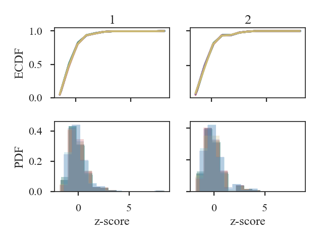
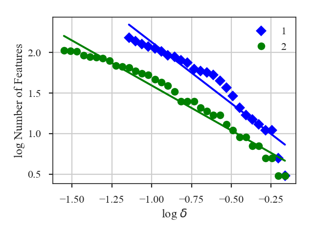

.. _dendrodist:

*******************
Dendrogram Distance
*******************

See :ref:`the tutorial <dendro_tutorial>` for a description of the dendrogram statistics.

.. warning:: **Requires the optional astrodendro package to be installed. See the** `documentation <http://dendrograms.org/>`_

Using the two comparisons defined by `Burkhart et al. 2013 <https://ui.adsabs.harvard.edu/#abs/2013ApJ...770..141B/abstract>`_, `~turbustat.statistics.Dendro_Distance` provides two distance metrics:

1. The distance between histograms of peak intensity in the leaves of the dendrogram, measured over a range of minimum branch heights, is:

    .. math::
        d_{\mathrm{Hist}} = \left[\sum H(p_{1,\delta_I},p_{2,\delta_I})\right]/N_\delta

    :math:`p_{i,\delta_I}` are the histograms with minimum branch height of :math:`\delta_I`, :math:`H(i, j)` is the `Hellinger distance <https://en.wikipedia.org/wiki/Hellinger_distance#Discrete_distributions>`_, and :math:`N_{\delta}` is the number of branch heights (and histograms) that the dendrogram was computed for.

2. The slopes of the linear relation fit to the log of the number of features in the tree as a function of minimum branch height:

    .. math::
        d_{\rm slope} = \frac{|\beta_1 - \beta_2|}{\sqrt{\sigma_{\beta_1}^2 + \sigma_{\beta_1}^2}}

    :math:`\beta_i` are the slopes of the fitted lines and :math:`\sigma_{\beta_i}` are the uncertainty of the slopes.

More information on the distance metric definitions can be found in `Koch et al. 2017 <https://ui.adsabs.harvard.edu/#abs/2017MNRAS.471.1506K/abstract>`_

Using
-----

**The data in this tutorial are available** `here <https://girder.hub.yt/#user/57b31aee7b6f080001528c6d/folder/59721a30cc387500017dbe37>`_.

We need to import the `~turbustat.statistics.Dendrogram_Distance` class, along with a few other common packages:

    >>> from turbustat.statistics import Dendrogram_Distance
    >>> from astropy.io import fits
    >>> import matplotlib.pyplot as plt

And we load in the two data sets. `~turbustat.statistics.Dendrogram_Distance` can be given two 2D images or cubes. For this example, we will use two cubes:

    >>> cube = fits.open("Design4_flatrho_0021_00_radmc.fits")[0]  # doctest: +SKIP
    >>> cube_fid = fits.open("Fiducial0_flatrho_0021_00_radmc.fits")[0]  # doctest: +SKIP

`~turbustat.statistics.Dendrogram_Distance` requires the two datasets to be given. A number of other parameters can be specified to control the dendrogram settings or fitting settings. This example sets the minimum deltas (branch height) for the dendrograms, as explained in the :ref:`dendrogram tutorial <dendro_tutorial>`. Other dendrogram settings, such as the minimum pixel intensity to use and the minimum number of pixels per structure, are also set.

    >>> dend_dist = Dendrogram_Distance(cube_fid, cube,
    ...                                 min_deltas=np.logspace(-2, 0, 50),
    ...                                 min_features=100,
    ...                                 dendro_params={"min_value": 0.005,
    ...                                                "min_npix": 50})  # doctest: +SKIP

The `min_features` sets a threshold on the number of 'features' in a dendrogram needed for it to be included to calculate the distances. "Features" is the number of branches and leaves in the dendrogram. As delta is increased in the dendrogram, the number of features drops significantly, with large values leaving only a few features in the dendrogram. `min_features` ensures a meaningful histogram can be measured from the dendrogram properties.

If additional parameters need to be set to create the dendrograms, `dendro_kwargs` takes a dictionary as input and passes the arguments to `~turbustat.statistics.Dendrogram_Stats.run`. Separate settings can be given for each dataset by specifying both `dendro_kwargs` and `dendro2_kwargs`. The individual `~turbustat.statistics.Dendrogram_Stats` objects can be also be accessed as `~turbustat.statistics.Dendrogram_Distance.dendro1` and `~turbustat.statistics.Dendrogram_Distance.dendro2` (see the :ref:`dendrogram tutorial <dendro_tutorial>` for more information).

To calculate the two dendrogram distances, we run:
    >>> dend_dist.distance_metric(verbose=True)  # doctest: +SKIP

The distance computation is very fast for both methods so both distance metrics are always computed.

Verbose mode creates two plots, which can be saved by specifying `save_name` in the call above. The first plot shows the histograms used in the Hellinger distance.

The top two panels are the ECDFs of the histograms of peak intensity within features (branches or leaves) of the dendrogram.  The histograms are shown in the bottom two panels. The first dataset is shown in the first column plots and the second in the second column plots.  Note that the intensity values are `standardized <https://en.wikipedia.org/wiki/Standard_score#Calculation_from_raw_score>`_ in all plots.  There are several curves/histograms shown in each plot. Each one is the dendrogram with different cut-offs of the minimum delta (branch height).

The histogram distance is:

    >>> dend_dist.histogram_distance  # doctest: +SKIP
    0.14298381514818145

The second plot shows the log of the number of features (branches + leaves) in a dendrogram as a function of log delta (minimum branch height):

A line is fit to this relation, and the difference in the slopes of those lines is used to calculate the distance:

    >>> dend_dist.num_distance  # doctest: +SKIP
    2.7987025053709766

For both plots, the plotting labels can be changed from `1` and `2` by setting `label1` and `label2` in `~turbustat.statistics.Dendrogram_Distance.distance_metric`.

For large data sets, creating the dendrogram can be slow. Particularly when comparing many datasets to a fiducial dataset, recomputing the dendrogram each time wastes a lot of time. `~turbustat.statistics.Dendrogram_Distance` can be passed a precomputed `~turbustat.statistics.Dendrogram_Stats` instead of giving a dataset. See :ref:`the distance metric introduction <runmetrics>`.

.. warning:: The saved dendrograms should be run with the same `min_deltas` given to `~turbustat.statistics.Dendrogram_Stats`. The histogram distance is only valid when comparing dendrograms measured with the same deltas.

References
----------

`Boyden et al. 2016 <https://ui.adsabs.harvard.edu/#abs/2016ApJ...833..233B/abstract>`_

`Boyden et al. 2018 <https://ui.adsabs.harvard.edu/#abs/2018ApJ...860..157B/abstract>`_

`Koch et al. 2017 <https://ui.adsabs.harvard.edu/#abs/2017MNRAS.471.1506K/abstract>`_
