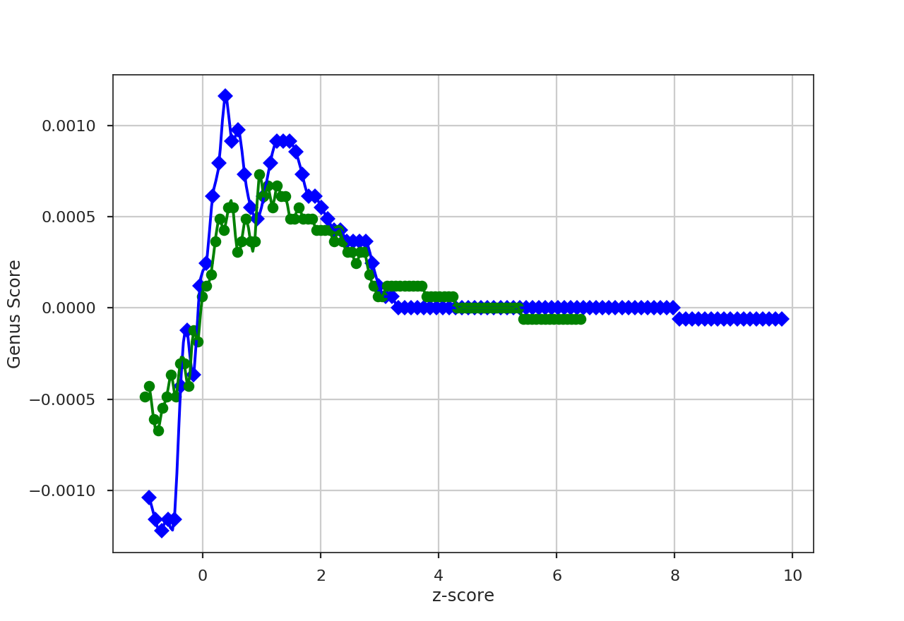

.. _genusdist:

**************
Genus Distance
**************

See :ref:`the tutorial <genus_tutorial>` for a description of Genus statistics.

The distance metric for Genus is `~turbustat.statistics.Genus_Distance`. The distance between the Genus curves is defined as:

.. math::
    d_{\mathrm{genus}} = \left|\left|\frac{G_{1}\left(I_{0,i}\right)}{A_1} - \frac{G_{2}\left(I_{0,i}\right)}{A_2}\right|\right|

where :math:`G_{j}\left(I_{0, i}\right)` are the Genus curves, and :math:`A_{j}` is the total area each Genus curve is measured over to normalize comparisons of images of different sizes.

More information on the distance metric definitions can be found in `Koch et al. 2017 <https://ui.adsabs.harvard.edu/#abs/2017MNRAS.471.1506K/abstract>`_

Using
-----

**The data in this tutorial are available** `here <https://girder.hub.yt/#user/57b31aee7b6f080001528c6d/folder/59721a30cc387500017dbe37>`_.

We need to import the `~turbustat.statistics.Genus_Distance` class, along with a few other common packages:

    >>> from turbustat.statistics import Genus_Distance
    >>> from astropy.io import fits
    >>> import astropy.units as u
    >>> import numpy as np

And we load in the two data sets; in this case, two integrated intensity (zeroth moment) maps:

    >>> moment0 = fits.open("Design4_flatrho_0021_00_radmc_moment0.fits")[0]  # doctest: +SKIP
    >>> moment0_fid = fits.open("Fiducial0_flatrho_0021_00_radmc_moment0.fits")[0]  # doctest: +SKIP

The two images are passed to the `~turbustat.statistics.Genus_Distance` class:

    >>> genus = Genus_Distance(moment0_fid, moment0,
    ...                        lowdens_percent=15, highdens_percent=85, numpts=100,
    ...                        genus_kwargs=dict(min_size=4 * u.pix**2))  # doctest: +SKIP

`~turbustat.statistics.Genus_Distance` accepts similar keyword arguments to `~turbustat.statistics.Genus`. Keywords to `~turbustat.statistics.Genus.run` can be specified in a dictionary to `genus_kwargs`. Separate keywords for the second image (`moment0`) can be specified in a second dictionary to `genus2_kwargs`.

To find the distance between the images:

    >>> genus.distance_metric(verbose=True)  # doctest: +SKIP

This returns a figure that plots the Genus curves of the two images, where the image values are standardized (zero mean and standard deviation of one). Colours, labels, and symbols in the plot can be changed. See `~turbustat.statistics.Genus_Distance.distance_metric`.

When comparing many images to a fiducial image, a pre-computed `~turbustat.statistics.Genus` can be passed instead of a dataset. See :ref:`the distance metric introduction <runmetrics>`.

References
----------

`Boyden et al. 2016 <https://ui.adsabs.harvard.edu/#abs/2016ApJ...833..233B/abstract>`_

`Koch et al. 2017 <https://ui.adsabs.harvard.edu/#abs/2017MNRAS.471.1506K/abstract>`_

`Boyden et al. 2018 <https://ui.adsabs.harvard.edu/#abs/2018ApJ...860..157B/abstract>`_
