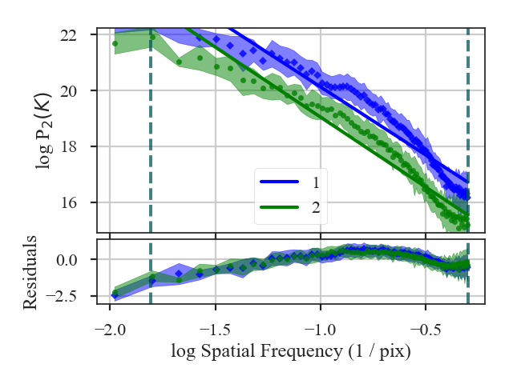
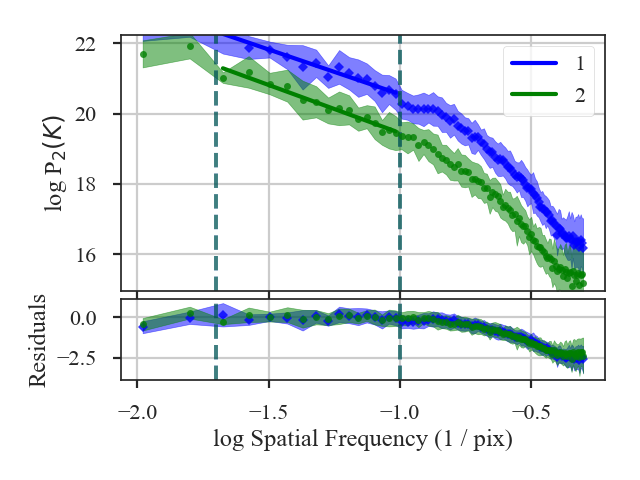

.. _mvcdistmet:

************
MVC Distance
************

See :ref:`the tutorial <mvc_tutorial>` for a description of Modified Velocity Centroids (MVC).

The distance metric for MVC is based on the t-statistics of the difference between the power spectrum slopes:

.. math::
    d_{\rm MVC} = \frac{\left| \beta_1 - \beta_2 \right|}{\sqrt{\sigma_{\beta_1}^2 + \sigma_{\beta_1}^2}}

:math:`\beta_i` and :math:`\sigma_{\beta_i}` is the index and index uncertainty, respectively.

More information on the distance metric definitions can be found in `Koch et al. 2017 <https://ui.adsabs.harvard.edu/#abs/2017MNRAS.471.1506K/abstract>`_.

Using
-----

**The data in this tutorial are available** `here <https://girder.hub.yt/#user/57b31aee7b6f080001528c6d/folder/59721a30cc387500017dbe37>`_.

We need to import the `~turbustat.statistics.MVC_Distance` class, along with a few other common packages:

    >>> from turbustat.statistics import MVC_Distance
    >>> from astropy.io import fits
    >>> import matplotlib.pyplot as plt

MVC is the only (current) statistic in TurbuStat that requires multiple moment arrays. Because of this, the input for `~turbustat.statistics.MVC_Distance` has a different format than the other distance metrics: a dictionary that contains the array and headers:

    >>> moment0 = fits.open("Design4_flatrho_0021_00_radmc_moment0.fits")[0]  # doctest: +SKIP
    >>> centroid = fits.open("Design4_flatrho_0021_00_radmc_centroid.fits")[0]  # doctest: +SKIP
    >>> lwidth = fits.open("Design4_flatrho_0021_00_radmc_linewidth.fits")[0]  # doctest: +SKIP
    >>> data = {"moment0": [moment0.data, moment0.header],
    ...         "centroid": [centroid.data, centroid.header],
    ...         "linewidth": [lwidth.data, lwidth.header]}  # doctest: +SKIP

And we create a second dictionary for the data set to compare with:

    >>> moment0_fid = fits.open("Fiducial0_flatrho_0021_00_radmc_moment0.fits")[0]  # doctest: +SKIP
    >>> centroid_fid = fits.open("Fiducial0_flatrho_0021_00_radmc_centroid.fits")[0]  # doctest: +SKIP
    >>> lwidth_fid = fits.open("Fiducial0_flatrho_0021_00_radmc_linewidth.fits")[0]  # doctest: +SKIP
    >>> data_fid = {"moment0": [moment0.data, moment0.header],
    ...             "centroid": [centroid.data, centroid.header],
    ...             "linewidth": [lwidth.data, lwidth.header]}  # doctest: +SKIP

These dictionaries can optionally include uncertainty arrays for the moments using the same format with keywords `moment0_error`, `centroid_error`, and `linewidth_error`.

These dictionaries get passed to `~turbustat.statistics.MVC_Distance`:

    >>> mvc = MVC_Distance(data_fid, data)  # doctest: +SKIP

To calculate the distance between the MVC power-spectra is calculated with:

    >>> mvc.distance_metric(verbose=True, xunit=u.pix**-1)  # doctest: +SKIP
                                OLS Regression Results
    ==============================================================================
    Dep. Variable:                      y   R-squared:                       0.925
    Model:                            OLS   Adj. R-squared:                  0.924
    Method:                 Least Squares   F-statistic:                     378.5
    Date:                Tue, 13 Nov 2018   Prob (F-statistic):           8.18e-34
    Time:                        10:21:40   Log-Likelihood:                -62.343
    No. Observations:                  91   AIC:                             128.7
    Df Residuals:                      89   BIC:                             133.7
    Df Model:                           1
    Covariance Type:                  HC3
    ==============================================================================
                     coef    std err          z      P>|z|      [0.025      0.975]
    ------------------------------------------------------------------------------
    const         15.2461      0.161     94.965      0.000      14.931      15.561
    x1            -4.8788      0.251    -19.455      0.000      -5.370      -4.387
    ==============================================================================
    Omnibus:                        5.193   Durbin-Watson:                   0.068
    Prob(Omnibus):                  0.075   Jarque-Bera (JB):                4.522
    Skew:                          -0.459   Prob(JB):                        0.104
    Kurtosis:                       2.408   Cond. No.                         4.40
    ==============================================================================
                                OLS Regression Results
    ==============================================================================
    Dep. Variable:                      y   R-squared:                       0.941
    Model:                            OLS   Adj. R-squared:                  0.941
    Method:                 Least Squares   F-statistic:                     477.5
    Date:                Tue, 13 Nov 2018   Prob (F-statistic):           1.55e-37
    Time:                        10:21:40   Log-Likelihood:                -52.867
    No. Observations:                  91   AIC:                             109.7
    Df Residuals:                      89   BIC:                             114.8
    Df Model:                           1
    Covariance Type:                  HC3
    ==============================================================================
                     coef    std err          z      P>|z|      [0.025      0.975]
    ------------------------------------------------------------------------------
    const         14.0302      0.144     97.714      0.000      13.749      14.312
    x1            -5.0144      0.229    -21.853      0.000      -5.464      -4.565
    ==============================================================================
    Omnibus:                        3.541   Durbin-Watson:                   0.129
    Prob(Omnibus):                  0.170   Jarque-Bera (JB):                3.488
    Skew:                          -0.469   Prob(JB):                        0.175
    Kurtosis:                       2.800   Cond. No.                         4.40
    ==============================================================================

The MVC spectra are plotted in the figure and the fit summaries are printed out. The distance between the indices is:

    >>> mvc.distance  # doctest: +SKIP
    0.3988169606167437

This is an awful fit. We want to limit where the spectra are fit. Keywords for `~turbustat.statistics.MVC` can be passed with `low_cut`, `high_cut`, `breaks`, `pspec_kwargs` and `pspec2_kwargs`. If separate parameters need to be set, a two-element list or array can be given to `low_cut`, `high_cut` and `breaks`; the second element will be used for the second data set. For example, limiting the fit region can be done with:

    >>> mvc = MVC_Distance(data_fid, data, low_cut=0.02 / u.pix,
    ...                    high_cut=0.4 / u.pix)  # doctest: +SKIP
    >>> mvc.distance_metric(verbose=True, xunit=u.pix**-1)  # doctest: +SKIP
                                OLS Regression Results
    ==============================================================================
    Dep. Variable:                      y   R-squared:                       0.946
    Model:                            OLS   Adj. R-squared:                  0.942
    Method:                 Least Squares   F-statistic:                     135.6
    Date:                Tue, 13 Nov 2018   Prob (F-statistic):           2.99e-08
    Time:                        10:36:41   Log-Likelihood:                 10.700
    No. Observations:                  15   AIC:                            -17.40
    Df Residuals:                      13   BIC:                            -15.98
    Df Model:                           1
    Covariance Type:                  HC3
    ==============================================================================
                     coef    std err          z      P>|z|      [0.025      0.975]
    ------------------------------------------------------------------------------
    const         17.9988      0.266     67.588      0.000      17.477      18.521
    x1            -2.5502      0.219    -11.647      0.000      -2.979      -2.121
    ==============================================================================
    Omnibus:                        1.189   Durbin-Watson:                   2.376
    Prob(Omnibus):                  0.552   Jarque-Bera (JB):                0.814
    Skew:                          -0.200   Prob(JB):                        0.666
    Kurtosis:                       1.931   Cond. No.                         13.5
    ==============================================================================
                                OLS Regression Results
    ==============================================================================
    Dep. Variable:                      y   R-squared:                       0.951
    Model:                            OLS   Adj. R-squared:                  0.948
    Method:                 Least Squares   F-statistic:                     70.08
    Date:                Tue, 13 Nov 2018   Prob (F-statistic):           1.36e-06
    Time:                        10:36:41   Log-Likelihood:                 10.420
    No. Observations:                  15   AIC:                            -16.84
    Df Residuals:                      13   BIC:                            -15.42
    Df Model:                           1
    Covariance Type:                  HC3
    ==============================================================================
                     coef    std err          z      P>|z|      [0.025      0.975]
    ------------------------------------------------------------------------------
    const         16.7135      0.390     42.879      0.000      15.950      17.477
    x1            -2.7335      0.327     -8.371      0.000      -3.373      -2.094
    ==============================================================================
    Omnibus:                        0.831   Durbin-Watson:                   2.076
    Prob(Omnibus):                  0.660   Jarque-Bera (JB):                0.621
    Skew:                          -0.449   Prob(JB):                        0.733
    Kurtosis:                       2.568   Cond. No.                         13.5
    ==============================================================================

The distance is now:

    >>> mvc.distance  # doctest: +SKIP
    0.46621655722371613

A pre-computed `~turbustat.statistics.MVC` class can also be passed instead of giving a dataset as the input. See :ref:`the distance metric introduction <runmetrics>`.

References
----------

`Koch et al. 2017 <https://ui.adsabs.harvard.edu/#abs/2017MNRAS.471.1506K/abstract>`_

`Boyden et al. 2018 <https://ui.adsabs.harvard.edu/#abs/2018ApJ...860..157B/abstract>`_
