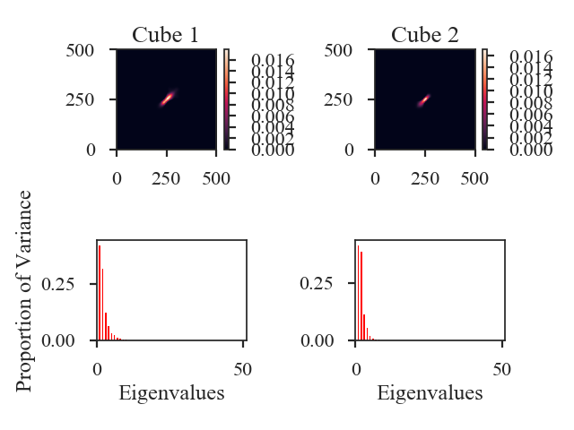

.. _pcadistmet:

************
PCA Distance
************

See :ref:`the tutorial <pca_tutorial>` for a description of Principal Component Analysis (PCA).

We define the PCA distance as the L2 distance between the normalized eigenvalues of two spectral-line data cubes:

.. math::
  d_{\mathrm{PCA}} = \left|\left|\lambda_{1}' - \lambda_{2}'\right|\right|

The normalized eigenvalues are :math:`\lambda_{i} / \sum_i \lambda_{i}`.

More information on the distance metric definitions can be found in `Koch et al. 2017 <https://ui.adsabs.harvard.edu/#abs/2017MNRAS.471.1506K/abstract>`_.

Using
-----

**The data in this tutorial are available** `here <https://girder.hub.yt/#user/57b31aee7b6f080001528c6d/folder/59721a30cc387500017dbe37>`_.

We need to import the `~turbustat.statistics.PCA_Distance` class, along with a few other common packages:

    >>> from turbustat.statistics import PCA_Distance
    >>> from astropy.io import fits
    >>> import matplotlib.pyplot as plt

`~turbustat.statistics.PCA_Distance` takes two data cubes as input:

    >>> cube = fits.open("Design4_flatrho_0021_00_radmc.fits")[0]  # doctest: +SKIP
    >>> cube_fid = fits.open("Fiducial0_flatrho_0021_00_radmc.fits")[0]  # doctest: +SKIP
    >>> pca = PCA_Distance(cube_fid, cube, n_eigs=50, mean_sub=True)  # doctest: +SKIP

There are two additional keywords that set the number of eigenvalues to include in the distance calculation (`n_eigs`), and whether to subtract the mean from each spectral channel (`mean_sub`).

To calculate the distance between the eigenvalues:

    >>> pca.distance_metric(verbose=True)  # doctest: +SKIP
    Proportions of total variance: 1 - 1.000, 2 - 1.000

This prints out what fraction of the total variance is included in the eigenvalue vectors for each data cube. The image shows the covariance matrix for each data cube in the first row and a bar chart of the eigenvalues in the second row.

And the distance is:

    >>> pca.distance  # doctest: +SKIP
    0.07211706060387167

Note that a comparison of the size-line width from PCA as a distance metric is not yet implemented.

A pre-computed `~turbustat.statistics.PCA` class can also be passed instead of a dataset. See :ref:`the distance metric introduction <runmetrics>`.

References
----------

`Yeremi et al. 2015 <https://ui.adsabs.harvard.edu/#abs/2014ApJ...783...93Y/abstract>`_

`Boyden et al. 2016 <https://ui.adsabs.harvard.edu/#abs/2016ApJ...833..233B/abstract>`_

`Koch et al. 2017 <https://ui.adsabs.harvard.edu/#abs/2017MNRAS.471.1506K/abstract>`_

`Boyden et al. 2018 <https://ui.adsabs.harvard.edu/#abs/2018ApJ...860..157B/abstract>`_
