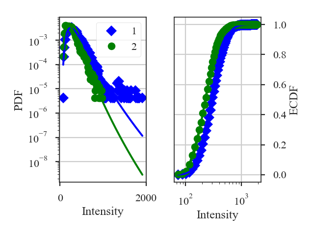

.. _pdfdistmet:

************
PDF Distance
************

See :ref:`the tutorial <pdf_tutorial>` for a description of PDFs.

There are multiple ways to define the distance between PDFs. Two of the metrics are non-parametric:

1. The `Hellinger distance <https://en.wikipedia.org/wiki/Hellinger_distance#Discrete_distributions>`_ between the PDFs (computed over the same set of bins):
    .. math::
        d_{\rm Hellinger}(p_1,p_2) = \frac{1}{\sqrt{2}}\left\{\sum_{\tilde{I}} \left[ \sqrt{p_1(\tilde{I})} - \sqrt{p_{2}(\tilde{I})} \right]^2\right\}^{1/2}.

    where :math:`p_i` are the histogram values at the bin :math:`\tilde{I}`.

2. The `Kolmogorov-Smirnov Distance <https://en.wikipedia.org/wiki/Kolmogorov%E2%80%93Smirnov_test#Kolmogorov%E2%80%93Smirnov_statistic>`_ between the ECDFs of the PDFs:
    .. math::
        d_{\rm KS}(P_1, P_2) = {\rm sup} \left| P_1(\tilde{I}) - P_2(\tilde{I}) \right|

    where :math:`P_i` is the ECDF at the value :math:`\tilde{I}`.

There is also one parametric distance metric included in `~turbustat.statistics.PDF_Distance`: the t-statistic of the difference in the fitted log-normal widths:

.. math::
    d_{\rm LN} = \frac{\left| w_1 - w_2 \right|}{\sqrt{\sigma_{w_1}^2 + \sigma_{w_1}^2}}

where :math:`w_i` is the width of the log-normal distribution fit.

More information on the distance metric definitions can be found in `Koch et al. 2017 <https://ui.adsabs.harvard.edu/#abs/2017MNRAS.471.1506K/abstract>`_.

Using
-----

**The data in this tutorial are available** `here <https://girder.hub.yt/#user/57b31aee7b6f080001528c6d/folder/59721a30cc387500017dbe37>`_.

We need to import the `~turbustat.statistics.PDF_Distance` class, along with a few other common packages:

    >>> from turbustat.statistics import PDF_Distance
    >>> from astropy.io import fits
    >>> import matplotlib.pyplot as plt

And we load in the two data sets. `~turbustat.statistics.PDF_Distance` can be given two 2D images or cubes. For this example, we will use two integrated intensity images::

    >>> moment0 = fits.open(osjoin(data_path, "Design4_flatrho_0021_00_radmc_moment0.fits"))[0]  # doctest: +SKIP
    >>> moment0_fid = fits.open(osjoin(data_path, "Fiducial0_flatrho_0021_00_radmc_moment0.fits"))[0]  # doctest: +SKIP

These two images are given as the inputs to `~turbustat.statistics.PDF_Distance`. Other parameters can be set here, including the minimum images values to be included in the histograms (`min_val1`/`min_val2`), whether to fit a log-normal distribution (`do_fit`), and what type of normalization to use on the data (`normalization_type`; see the :ref:`PDF tutorial <pdf_tutorial>`):

    >>> pdf = PDF_Distance(moment0_fid, moment0, min_val1=0.0, min_val2=0.0,
    ...                    do_fit=True, normalization_type=None)  # doctest: +SKIP

This will create and run two `~turbustat.statistics.PDF` instances using a common set of bins for the histograms. These can be accessed as `~turbustat.statistics.PDF_Distance.pdf1` and `~turbustat.statistics.PDF_Distance.pdf2`.

To calculate the distances, we run:

    >>> pdf.distance_metric(verbose=True)  # doctest: +SKIP
    Optimization terminated successfully.
             Current function value: 6.335450
             Iterations: 36
             Function evaluations: 72
    Optimization terminated successfully.
             Current function value: 6.007851
             Iterations: 34
             Function evaluations: 69
                                  Likelihood Results
    ==============================================================================
    Dep. Variable:                      y   Log-Likelihood:            -1.0380e+05
    Model:                     Likelihood   AIC:                         2.076e+05
    Method:            Maximum Likelihood   BIC:                         2.076e+05
    Date:                Wed, 14 Nov 2018
    Time:                        09:58:10
    No. Observations:               16384
    Df Residuals:                   16382
    Df Model:                           2
    ==============================================================================
                     coef    std err          z      P>|z|      [0.025      0.975]
    ------------------------------------------------------------------------------
    par0           0.4553      0.003    181.019      0.000       0.450       0.460
    par1         299.8377      1.067    281.114      0.000     297.747     301.928
    ==============================================================================
                                  Likelihood Results
    ==============================================================================
    Dep. Variable:                      y   Log-Likelihood:                -98433.
    Model:                     Likelihood   AIC:                         1.969e+05
    Method:            Maximum Likelihood   BIC:                         1.969e+05
    Date:                Wed, 14 Nov 2018
    Time:                        09:58:10
    No. Observations:               16384
    Df Residuals:                   16382
    Df Model:                           2
    ==============================================================================
                     coef    std err          z      P>|z|      [0.025      0.975]
    ------------------------------------------------------------------------------
    par0           0.4360      0.002    181.019      0.000       0.431       0.441
    par1         225.6771      0.769    293.602      0.000     224.171     227.184
    ==============================================================================

This returns a summary of the log-normal fits (if `do_fit=True`) and a plot of the PDF and ECDF of each data set. The solid lines in the plot are the fitted distributions.

By default, all three distance metrics are run. For these images, the distances are:

    >>> pdf.hellinger_distance  # doctest: +SKIP
    0.23007068347013115

    >>> pdf.ks_distance  # doctest: +SKIP
    0.24285888671875

    >>> pdf.lognormal_distance  # doctest: +SKIP
    5.561198154785891

Each distance metric can be run separately by running its function in `~turbustat.statistics.PDF_Distance`, or by setting the `statistic` keyword in `~turbustat.statistics.PDF_Distance.distance_metric`.

Because of the Hellinger distance requires that the PDF histograms have the same bins, there is no input to give a pre-computed fiducial `~turbustat.statistics.PDF`, unlike most of the other distance metric classes.

References
----------

`Boyden et al. 2016 <https://ui.adsabs.harvard.edu/#abs/2016ApJ...833..233B/abstract>`_

`Koch et al. 2017 <https://ui.adsabs.harvard.edu/#abs/2017MNRAS.471.1506K/abstract>`_

`Boyden et al. 2018 <https://ui.adsabs.harvard.edu/#abs/2018ApJ...860..157B/abstract>`_
