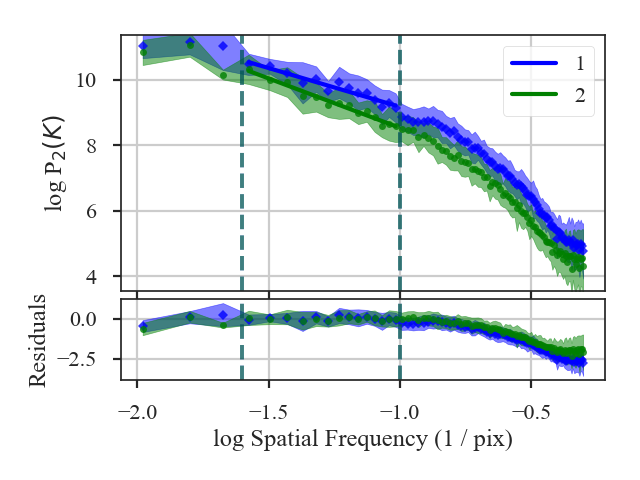

.. _pspecdist:

*******************************
Spatial Power Spectrum Distance
*******************************

See :ref:`the tutorial <pspec_tutorial>` for a description of the spatial power-spectrum.

The distance metric for the power-spectrum is `~turbustat.statistics.PSpec_Distance`. The distance is defined as the t-statistic between the indices of the power-spectra:

.. math::
    d_{\rm slope} = \frac{|\beta_1 - \beta_2|}{\sqrt{\sigma_{\beta_1}^2 + \sigma_{\beta_1}^2}}

:math:`\beta_i` are the slopes of the power-spectra and :math:`\sigma_{\beta_i}` are the uncertainties.

More information on the distance metric definitions can be found in `Koch et al. 2017 <https://ui.adsabs.harvard.edu/#abs/2017MNRAS.471.1506K/abstract>`_

Using
-----

**The data in this tutorial are available** `here <https://girder.hub.yt/#user/57b31aee7b6f080001528c6d/folder/59721a30cc387500017dbe37>`_.

We need to import the `~turbustat.statistics.Pspec_Distance` class, along with a few other common packages:

    >>> from turbustat.statistics import PSpec_Distance
    >>> from astropy.io import fits
    >>> import matplotlib.pyplot as plt
    >>> import astropy.units as u

And we load in the two data sets; in this case, two integrated intensity (zeroth moment) maps:

    >>> moment0 = fits.open("Design4_flatrho_0021_00_radmc_moment0.fits")[0]  # doctest: +SKIP
    >>> moment0_fid = fits.open("Fiducial0_flatrho_0021_00_radmc_moment0.fits")[0]  # doctest: +SKIP

These two images are given as inputs to `~turbustat.statistics.Pspec_Distance`. We know from the :ref:`power-spectrum tutorial <pspec_tutorial>` that there should be limits set on where the power-spectra are fit. These can be specified with `low_cut` and `high_cut`, along with `breaks` if the power-spectrum is best fit with a broken power-law model. In this case, we will use the same fit limits for both power-spectra, but separate limits can be given for each image by giving a two-element list to any of these three keywords.

    >>> pspec = PSpec_Distance(moment0_fid, moment0,
    ...                        low_cut=0.025 / u.pix, high_cut=0.1 / u.pix,)  # doctest: +SKIP

This will create and run two `~turbustat.statistics.PowerSpectrum` instances, which can be accessed as `~turbustat.statistics.Pspec_Distance.pspec1` and `~turbustat.statistics.Pspec_Distance.pspec2`.

To find the distance between these two images, we run:

    >>> pspec.distance_metric(verbose=True, xunit=u.pix**-1)  # doctest: +SKIP
                                OLS Regression Results
    ==============================================================================
    Dep. Variable:                      y   R-squared:                       0.930
    Model:                            OLS   Adj. R-squared:                  0.924
    Method:                 Least Squares   F-statistic:                     222.2
    Date:                Wed, 14 Nov 2018   Prob (F-statistic):           4.18e-09
    Time:                        10:21:04   Log-Likelihood:                 11.044
    No. Observations:                  14   AIC:                            -18.09
    Df Residuals:                      12   BIC:                            -16.81
    Df Model:                           1
    Covariance Type:                  HC3
    ==============================================================================
                     coef    std err          z      P>|z|      [0.025      0.975]
    ------------------------------------------------------------------------------
    const          6.8004      0.202     33.648      0.000       6.404       7.197
    x1            -2.3745      0.159    -14.905      0.000      -2.687      -2.062
    ==============================================================================
    Omnibus:                        0.495   Durbin-Watson:                   2.400
    Prob(Omnibus):                  0.781   Jarque-Bera (JB):                0.547
    Skew:                          -0.148   Prob(JB):                        0.761
    Kurtosis:                       2.078   Cond. No.                         15.2
    ==============================================================================
                                OLS Regression Results
    ==============================================================================
    Dep. Variable:                      y   R-squared:                       0.971
    Model:                            OLS   Adj. R-squared:                  0.968
    Method:                 Least Squares   F-statistic:                     495.9
    Date:                Wed, 14 Nov 2018   Prob (F-statistic):           3.96e-11
    Time:                        10:21:04   Log-Likelihood:                 14.077
    No. Observations:                  14   AIC:                            -24.15
    Df Residuals:                      12   BIC:                            -22.87
    Df Model:                           1
    Covariance Type:                  HC3
    ==============================================================================
                     coef    std err          z      P>|z|      [0.025      0.975]
    ------------------------------------------------------------------------------
    const          5.5109      0.171     32.289      0.000       5.176       5.845
    x1            -3.0223      0.136    -22.269      0.000      -3.288      -2.756
    ==============================================================================
    Omnibus:                        0.901   Durbin-Watson:                   2.407
    Prob(Omnibus):                  0.637   Jarque-Bera (JB):                0.718
    Skew:                          -0.215   Prob(JB):                        0.698
    Kurtosis:                       1.977   Cond. No.                         15.2
    ==============================================================================

The fit summaries and a plot of the power-spectra with their fits are returned when `verbose=True`. Colours, labels, and symbols can be altered in the plot with the keywords `plot_kwargs1` and `plot_kwargs2` in `~turbustat.statistics.Pspec_Distance.distance_metric`.

The distance between these two images is:
    >>> pspec.distance  # doctest: +SKIP
    3.0952798493530262

Recomputing an already compute power-spectrum can be avoided by passing a pre-computed `~turbustat.statistics.PowerSpectrum` instead of a dataset. See :ref:`the distance metric introduction <runmetrics>`.

References
----------

`Boyden et al. 2016 <https://ui.adsabs.harvard.edu/#abs/2016ApJ...833..233B/abstract>`_

`Koch et al. 2017 <https://ui.adsabs.harvard.edu/#abs/2017MNRAS.471.1506K/abstract>`_

`Boyden et al. 2018 <https://ui.adsabs.harvard.edu/#abs/2018ApJ...860..157B/abstract>`_
