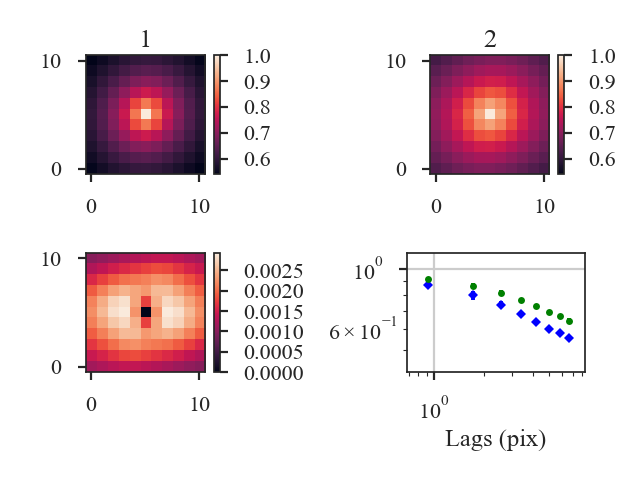

.. _scfdistmet:

************
SCF Distance
************

See :ref:`the tutorial <scf_tutorial>` for a description of the Spectral Correlation Function (SCF).

The SCF creates a surface by shifting a spectral-line cube and calculating the correlation of the shifted cube with the original cube. The distance metric defined in `~turbustat.statistics.SCF_Distance` is the L2 distance between the correlation surfaces, weighted by the inverse of the lag:

.. math::
      d_{\mathrm{SCF}} = \left( \frac{\sum_{\boldsymbol{\ell}}[S_1(\boldsymbol{\ell})-S_2(\boldsymbol{\ell})]^2/|\boldsymbol{\ell}|}{\sum_{\boldsymbol{\ell}} 1/|\boldsymbol{\ell}|}\right)^{1/2}.

where :math:`S_i` is the correlation surface and :math:`\ell` is the spatial lag between the shifted and original cubes.

This direct comparison between the correlation surfaces requires that a common set of spatial lags be used. `~turbustat.statistics.SCF_Distance` creates a common set of angular lags to compare two data cubes.

More information on the distance metric definitions can be found in `Koch et al. 2017 <https://ui.adsabs.harvard.edu/#abs/2017MNRAS.471.1506K/abstract>`_

Using
-----

**The data in this tutorial are available** `here <https://girder.hub.yt/#user/57b31aee7b6f080001528c6d/folder/59721a30cc387500017dbe37>`_.

We need to import the `~turbustat.statistics.SCF_Distance` class, along with a few other common packages:

    >>> from turbustat.statistics import SCF_Distance
    >>> from astropy.io import fits
    >>> import matplotlib.pyplot as plt

`~turbustat.statistics.SCF_Distance` takes two data cubes as input:

    >>> cube = fits.open("Design4_flatrho_0021_00_radmc.fits")[0]  # doctest: +SKIP
    >>> cube_fid = fits.open("Fiducial0_flatrho_0021_00_radmc.fits")[0]  # doctest: +SKIP
    >>> scf = SCF_Distance(cube_fid, cube, size=11)  # doctest: +SKIP

This call runs `~turbustat.statistics.SCF` for the two cubes, which can be accessed with `~turbustat.statistics.SCF_Distance.scf1` and `~turbustat.statistics.SCF_Distance.scf2`.

The default setting assumes that the boundaries are continuous (e.g., simulated observations from a periodic-box simulation, like this example). To change how boundaries are handled, `boundary` can be set in `~turbustat.statistics.SCF_Distance`. For example, for observational data, `boundary='cut'` should be used. When comparing a simulated observation to a real observation, different boundary conditions can be given: `boundary=['cut', 'continuous']`. The first list item will be used for the first cube given to `~turbustat.statistics.SCF_Distance` and the same for the second list item.

To calculate the distance between the cubes:

    >>> scf.distance_metric(verbose=True)  # doctest: +SKIP

With `verbose=True`, this function creates a plot of the SCF correlation surfaces (top row), the weighted difference between the surfaces (left, second row), and azimuthally-averaged SCF curves for both cubes (right, second row).

The distance between the SCF surfaces is:

    >>> scf.distance  # doctest: +SKIP
    0.08101015924738914

By default, the distance between the surfaces is weighted by the lag (see equation above). This weighting can be disabled by setting `weighted=False` in `~turbustat.statistics.SCF_Distance.distance_metric`, and the distance metrics reduces to the L2 norm between the surfaces.

A pre-computed `~turbustat.statistics.SCF` class can be also passed instead of a data cube. However, the SCF will need to be recomputed if the lags are different from the common set defined in `~turbustat.statistics.SCF_Distance`. See :ref:`the distance metric introduction <runmetrics>`.

References
----------

`Yeremi et al. 2015 <https://ui.adsabs.harvard.edu/#abs/2014ApJ...783...93Y/abstract>`_

`Boyden et al. 2016 <https://ui.adsabs.harvard.edu/#abs/2016ApJ...833..233B/abstract>`_

`Koch et al. 2017 <https://ui.adsabs.harvard.edu/#abs/2017MNRAS.471.1506K/abstract>`_

`Boyden et al. 2018 <https://ui.adsabs.harvard.edu/#abs/2018ApJ...860..157B/abstract>`_
