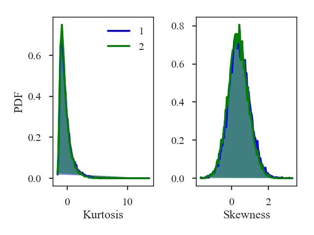

.. _statmomentsdistmet:

****************************
Statistical Moments Distance
****************************

See :ref:`the tutorial <statmoments_tutorial>` for a description of the statistics moments.

`~turbustat.statistics.StatsMoments` calculates the first four moments---the mean, variance, skewness, and kurtosis---in circular regions of a map. For comparisons between different images, we utilize the skewness and kurtosis as metrics since they are not affected by offsets in the mean and are normalized by the variance. We reduce the moment images to histograms and define metrics from differences in the histograms. The histogram difference is converted to a distance by using the Hellinger distance:

.. math::
  H(p_1,p_2) = \frac{1}{\sqrt{2}}\left\{\sum_{\tilde{I}} \left[ \sqrt{p_1(\tilde{I})} - \sqrt{p_{2}(\tilde{I})} \right]^2\right\}^{1/2}.

where :math:`p_i` is the histogram of an image and :math:`\tilde{I}` is the bin of the histogram. The same definition is used for the skewness and kurtosis.

More information on the distance metric definitions can be found in `Koch et al. 2017 <https://ui.adsabs.harvard.edu/#abs/2017MNRAS.471.1506K/abstract>`_

Using
-----

**The data in this tutorial are available** `here <https://girder.hub.yt/#user/57b31aee7b6f080001528c6d/folder/59721a30cc387500017dbe37>`_.

We need to import the `~turbustat.statistics.StatMoments_Distance` class, along with a few other common packages:

    >>> from turbustat.statistics import StatMoments_Distance
    >>> from astropy.io import fits
    >>> import matplotlib.pyplot as plt
    >>> import astropy.units as u

And we load in the two data sets; in this case, two integrated intensity (zeroth moment) maps:

    >>> moment0 = fits.open("Design4_flatrho_0021_00_radmc_moment0.fits")[0]  # doctest: +SKIP
    >>> moment0_fid = fits.open("Fiducial0_flatrho_0021_00_radmc_moment0.fits")[0]  # doctest: +SKIP

These images are given as inputs to `~turbustat.statistics.StatMoments_Distance`:

    >>> moments = StatMoments_Distance(moment0_fid, moment0, radius=5 * u.pix,
    ...                                periodic1=True, periodic2=True)  # doctest: +SKIP

This runs `~turbustat.statistics.StatMoments` for both images, which can be accessed with `~turbustat.statistics.StatMoments_Distance.moments1` and `~turbustat.statistics.StatMoments_Distance.moments2`.

Since the moments are calculated in circular regions, it is important that the a common circular region be used for both images. `~turbustat.statistics.StatMoments_Distance` scales the given `radius` to a common angular scale using the WCS information in the headers.

The boundary handling can also be changed by setting `periodic1` and `periodic2` for the first and second images, respectively. By default, periodic boundaries are used, as is appropriated for simulated observations from a periodic-box (like this example). For real observations, periodic boundaries will likely need to be disabled.

To calculate the distance between the images:

    >>> moments.distance_metric(verbose=True)  # doctest: +SKIP

Additional arguments for the figure and the number of bins can also be given.  The default number of bins for the histogram is set to :math:`\sqrt{{\rm min}(N_1, N_2)}` where :math:`N_i` is the number of pixels in each image with a finite value.

The distances for the skewness and kurtosis are:

    >>> print(moments.skewness_distance, moments.kurtosis_distance)  # doctest: +SKIP
    0.01189910501201634 0.019870935761084074

A pre-computed `~turbustat.statistics.StatMoments` class can be passed instead of an image. However, the moments will need to be recomputed if the `size` differs from the common scale determined in `~turbustat.statistics.StatMoments_Distance`. See :ref:`the distance metric introduction <runmetrics>`.

References
----------

`Boyden et al. 2016 <https://ui.adsabs.harvard.edu/#abs/2016ApJ...833..233B/abstract>`_

`Koch et al. 2017 <https://ui.adsabs.harvard.edu/#abs/2017MNRAS.471.1506K/abstract>`_

`Boyden et al. 2018 <https://ui.adsabs.harvard.edu/#abs/2018ApJ...860..157B/abstract>`_
