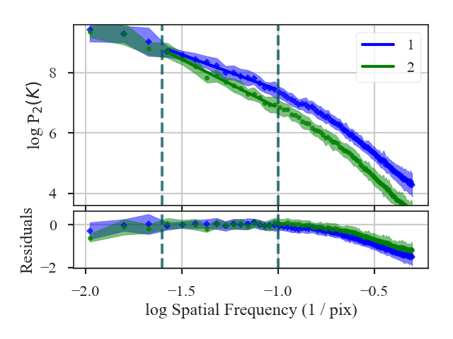
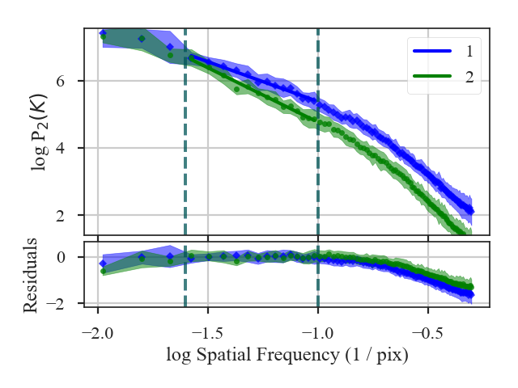

.. _vcadistmet:

************
VCA Distance
************

See :ref:`the tutorial <vca_tutorial>` for a description of Velocity Channel Analysis (VCA).

The VCA distance is defined as the t-statistic of the difference in the fitted slopes:

.. math::
        d_{\rm slope} = \frac{|\beta_1 - \beta_2|}{\sqrt{\sigma_{\beta_1}^2 + \sigma_{\beta_1}^2}}

:math:`\beta_i` are the slopes of the VCA spectra and :math:`\sigma_{\beta_i}` are the uncertainty of the slopes.

More information on the distance metric definitions can be found in `Koch et al. 2017 <https://ui.adsabs.harvard.edu/#abs/2017MNRAS.471.1506K/abstract>`_.

Using
-----

**The data in this tutorial are available** `here <https://girder.hub.yt/#user/57b31aee7b6f080001528c6d/folder/59721a30cc387500017dbe37>`_.

We need to import the `~turbustat.statistics.VCA_Distance` class, along with a few other common packages:

    >>> from turbustat.statistics import VCA_Distance
    >>> from astropy.io import fits
    >>> import matplotlib.pyplot as plt
    >>> import astropy.units as u

`~turbustat.statistics.VCA_Distance` takes two data cubes as input:

    >>> cube = fits.open("Design4_flatrho_0021_00_radmc.fits")[0]  # doctest: +SKIP
    >>> cube_fid = fits.open("Fiducial0_flatrho_0021_00_radmc.fits")[0]  # doctest: +SKIP

From the :ref:`VCA tutorial <vca_tutorial>`, we know that limits should be placed on the power-spectra.  These limits can be specified with `low_cut` and `high_cut`:

    >>> vca = VCA_Distance(cube_fid, cube, low_cut=0.025 / u.pix,
    ...                    high_cut=0.1 / u.pix)  # doctest: +SKIP

This will run `~turbustat.statistics.VCA` on the given cubes, which can be accessed as `~turbustat.statistics.VCA_Distance.vca1` and `~turbustat.statistics.VCA_Distance.vca2`.

Additional parameters can be specified to `~turbustat.statistics.VCA`. Different fit limits for the two cubes can be given as a two-element list (e.g., `low_cut=[0.025 / u.pix, 0.04 / u.pix]`). Estimated break points in the power-spectra can be given in the same format, which will enable fitting with a broken-linear model.

To find the distance between the cubes:
    >>> vca.distance_metric(verbose=True)  # doctest: +SKIP
                                OLS Regression Results
    ==============================================================================
    Dep. Variable:                      y   R-squared:                       0.985
    Model:                            OLS   Adj. R-squared:                  0.984
    Method:                 Least Squares   F-statistic:                     436.3
    Date:                Fri, 16 Nov 2018   Prob (F-statistic):           8.40e-11
    Time:                        10:16:28   Log-Likelihood:                 22.506
    No. Observations:                  14   AIC:                            -41.01
    Df Residuals:                      12   BIC:                            -39.73
    Df Model:                           1
    Covariance Type:                  HC3
    ==============================================================================
                     coef    std err          z      P>|z|      [0.025      0.975]
    ------------------------------------------------------------------------------
    const          5.0853      0.137     37.170      0.000       4.817       5.353
    x1            -2.3350      0.112    -20.887      0.000      -2.554      -2.116
    ==============================================================================
    Omnibus:                        0.981   Durbin-Watson:                   1.483
    Prob(Omnibus):                  0.612   Jarque-Bera (JB):                0.712
    Skew:                          -0.138   Prob(JB):                        0.700
    Kurtosis:                       1.930   Cond. No.                         15.2
    ==============================================================================
                                OLS Regression Results
    ==============================================================================
    Dep. Variable:                      y   R-squared:                       0.986
    Model:                            OLS   Adj. R-squared:                  0.985
    Method:                 Least Squares   F-statistic:                     722.3
    Date:                Fri, 16 Nov 2018   Prob (F-statistic):           4.33e-12
    Time:                        10:16:28   Log-Likelihood:                 18.704
    No. Observations:                  14   AIC:                            -33.41
    Df Residuals:                      12   BIC:                            -32.13
    Df Model:                           1
    Covariance Type:                  HC3
    ==============================================================================
                     coef    std err          z      P>|z|      [0.025      0.975]
    ------------------------------------------------------------------------------
    const          3.6086      0.141     25.636      0.000       3.333       3.884
    x1            -3.2136      0.120    -26.876      0.000      -3.448      -2.979
    ==============================================================================
    Omnibus:                       13.847   Durbin-Watson:                   2.394
    Prob(Omnibus):                  0.001   Jarque-Bera (JB):                9.666
    Skew:                          -1.631   Prob(JB):                      0.00796
    Kurtosis:                       5.434   Cond. No.                         15.2
    ==============================================================================

This function returns a summary of the fits to the VCA spectra and plots the two spectra with the fits. Colours, symbols and labels in the plot can be changed with `plot_kwargs1` and `plot_kwargs2` in `~turbustat.statistics.VCA_Distance.distance_metric`.

The distance is:
    >>> vca.distance  # doctest: +SKIP
    5.366955632554179

Changing the width of the velocity channels affects the contribution of the turbulent velocity field to the spectrum, thereby altering the measured index (`Lazarian & Pogosyan 2000 <https://ui.adsabs.harvard.edu/#abs/2000ApJ...537..720L/abstract>`_). It is generally advisable to compare cubes with a similar velocity resolution.

In `~turbustat.statistics.VCA_Distance`, the channel width can be changed with `channel_width`. The new channel width should be (1) larger than the current channel widths of the cubes, and (2) in similar units to the spectral axis of the cubes (i.e., a width in velocity should be given for a spectral axis in velocity).

.. warning:: Changing the spectral resolution will be slow for large cubes. Consider changing the velocity resolution of large cubes before running VCA.

In this example, we will change the velocity resolution to 400 m/s:

    >>> vca = VCA_Distance(cube_fid, cube, low_cut=0.025 / u.pix,
    ...                    high_cut=0.1 / u.pix, channel_width=400 * u.m / u.s)  # doctest: +SKIP
    >>> vca.distance_metric(verbose=True)  # doctest: +SKIP
                                OLS Regression Results
    ==============================================================================
    Dep. Variable:                      y   R-squared:                       0.985
    Model:                            OLS   Adj. R-squared:                  0.983
    Method:                 Least Squares   F-statistic:                     419.3
    Date:                Fri, 16 Nov 2018   Prob (F-statistic):           1.06e-10
    Time:                        10:16:28   Log-Likelihood:                 22.121
    No. Observations:                  14   AIC:                            -40.24
    Df Residuals:                      12   BIC:                            -38.96
    Df Model:                           1
    Covariance Type:                  HC3
    ==============================================================================
                     coef    std err          z      P>|z|      [0.025      0.975]
    ------------------------------------------------------------------------------
    const          3.0105      0.141     21.350      0.000       2.734       3.287
    x1            -2.3639      0.115    -20.478      0.000      -2.590      -2.138
    ==============================================================================
    Omnibus:                        0.854   Durbin-Watson:                   1.515
    Prob(Omnibus):                  0.652   Jarque-Bera (JB):                0.676
    Skew:                          -0.144   Prob(JB):                        0.713
    Kurtosis:                       1.963   Cond. No.                         15.2
    ==============================================================================
                                OLS Regression Results
    ==============================================================================
    Dep. Variable:                      y   R-squared:                       0.985
    Model:                            OLS   Adj. R-squared:                  0.984
    Method:                 Least Squares   F-statistic:                     684.5
    Date:                Fri, 16 Nov 2018   Prob (F-statistic):           5.94e-12
    Time:                        10:16:28   Log-Likelihood:                 17.855
    No. Observations:                  14   AIC:                            -31.71
    Df Residuals:                      12   BIC:                            -30.43
    Df Model:                           1
    Covariance Type:                  HC3
    ==============================================================================
                     coef    std err          z      P>|z|      [0.025      0.975]
    ------------------------------------------------------------------------------
    const          1.5197      0.146     10.408      0.000       1.234       1.806
    x1            -3.2379      0.124    -26.163      0.000      -3.481      -2.995
    ==============================================================================
    Omnibus:                       13.778   Durbin-Watson:                   2.379
    Prob(Omnibus):                  0.001   Jarque-Bera (JB):                9.575
    Skew:                          -1.633   Prob(JB):                      0.00833
    Kurtosis:                       5.398   Cond. No.                         15.2
    ==============================================================================

The VCA power-spectra with 400 m/s channels have a similar slope to the original velocity resolution. The distance then has not significantly changed:

    >>> vca.distance  # doctest: +SKIP
    5.164776059129051

A pre-computed `~turbustat.statistics.VCA` class can be also passed instead of a data cube. See :ref:`the distance metric introduction <runmetrics>`.

References
----------

`Boyden et al. 2016 <https://ui.adsabs.harvard.edu/#abs/2016ApJ...833..233B/abstract>`_

`Koch et al. 2017 <https://ui.adsabs.harvard.edu/#abs/2017MNRAS.471.1506K/abstract>`_

`Boyden et al. 2018 <https://ui.adsabs.harvard.edu/#abs/2018ApJ...860..157B/abstract>`_
