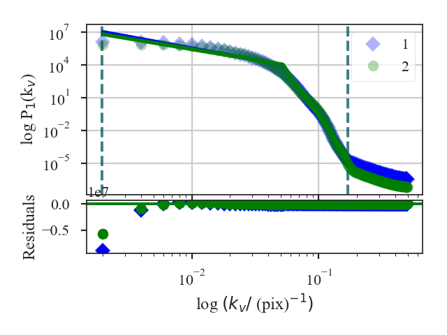

.. _vcsdistmet:

************
VCS Distance
************

See :ref:`the tutorial <vcs_tutorial>` for a description of Velocity Coordinate Spectrum (VCS).

There are two asymptotic regimes of the VCS corresponding to high and low resolution (`Lazarian & Pogosyan 2006 <https://ui.adsabs.harvard.edu/#abs/2006ApJ...652.1348L/abstract>`_). The transition between these regimes depends on the spatial resolution (i.e., beam size) of the data, the spectral resolution of the data, and the velocity dispersion. The current VCS implementation in TurbuStat fits a broken linear model to approximate the asymptotic regimes, rather than fitting with the full VCS formalism (`Chepurnov et al. 2010 <https://ui.adsabs.harvard.edu/#abs/2010ApJ...714.1398C/abstract>`_, `Chepurnov et al. 2015 <https://ui.adsabs.harvard.edu/#abs/2015ApJ...810...33C/abstract>`_).  We assume that the break point lies at the transition point between the regimes and label velocity frequencies smaller than the break as "large-scale" and frequencies larger than the break as "small-scale".

There are four distance definitions for the VCS based on the broken linear modelling described above. All of these distance metrics are based on t-statistics between the VCS for each cube:

1. The difference between the fitted slopes on "large-scales" (below the break position): `~turbustat.statistics.VCS_Distance.large_scale_distance`.
    .. math::
            d_{\rm large-scale} = \frac{|\beta_{{\rm LS}, 1} - \beta_{{\rm LS}, 2}|}{\sqrt{\sigma_{\beta_{{\rm LS}, 1}}^2 + \sigma_{\beta_{{\rm LS}, 2}}^2}}

    :math:`\beta_{{\rm LS}, i}` are the slopes of the VCS on large-scales and :math:`\sigma_{\beta_{{\rm LS}, i}}` are the uncertainty of the slopes.

2. The difference between the fitted slopes on "small-scales" (above the break position): `~turbustat.statistics.VCS_Distance.small_scale_distance`.
    .. math::
            d_{\rm small-scale} = \frac{|\beta_{{\rm SS}, 1} - \beta_{{\rm SS}, 2}|}{\sqrt{\sigma_{\beta_{{\rm SS}, 1}}^2 + \sigma_{\beta_{{\rm SS}, 2}}^2}}

    :math:`\beta_{{\rm SS}, i}` are the slopes of the VCS on small-scales and :math:`\sigma_{\beta_{{\rm SS}, i}}` are the uncertainty of the slopes.

3. The sum of the differences between the slopes in both regimes: `~turbustat.statistics.VCS_Distance.distance`
    .. math::
        d_{{\rm all}} = d_{\rm large-scale} + d_{\rm small-scale}

4. The difference in the fitted break points: `~turbustat.statistics.VCS_Distance.break_distance`
    .. math::
        d_{\rm break} = \frac{|b_{1} - b_{2}|}{\sqrt{\sigma_{b_{1}}^2 + \sigma_{b_{2}}^2}}

    :math:`b_{i}` are the break locations of the VCS and :math:`\sigma_{b_{i}}` are the uncertainties.

More information on the distance metric definitions can be found in `Koch et al. 2017 <https://ui.adsabs.harvard.edu/#abs/2017MNRAS.471.1506K/abstract>`_.

Using
-----

**The data in this tutorial are available** `here <https://girder.hub.yt/#user/57b31aee7b6f080001528c6d/folder/59721a30cc387500017dbe37>`_.

We need to import the `~turbustat.statistics.VCS_Distance` class, along with a few other common packages:

    >>> from turbustat.statistics import VCS_Distance
    >>> from astropy.io import fits
    >>> import matplotlib.pyplot as plt
    >>> import astropy.units as u

`~turbustat.statistics.VCS_Distance` takes two data cubes as input:

    >>> cube = fits.open("Design4_flatrho_0021_00_radmc.fits")[0]  # doctest: +SKIP
    >>> cube_fid = fits.open("Fiducial0_flatrho_0021_00_radmc.fits")[0]  # doctest: +SKIP

From the :ref:`VCS tutorial <vcs_tutorial>`, we know that limits should be placed on the power-spectra.  These limits can be specified with `low_cut` and `high_cut`:

    >>> vcs = VCS_Distance(cube_fid, cube,
    ...                    fit_kwargs=dict(low_cut=0.025 / u.pix,
    ...                                    high_cut=0.1 / u.pix))  # doctest: +SKIP

This will run `~turbustat.statistics.VCS` on the given cubes, which can be accessed as `~turbustat.statistics.VCS_Distance.vcs1` and `~turbustat.statistics.VCS_Distance.vcs2`.

Settings for the VCS fitting can be passed with `fit_kwargs`, and `fit_kwargs2` when different setting are required for the second cube. In this example, we set the fitting limits to be used.

To find the distances between the cube:
    >>> vcs.distance_metric(verbose=True)  # doctest: +SKIP
                                OLS Regression Results
    ==============================================================================
    Dep. Variable:                      y   R-squared:                       0.993
    Model:                            OLS   Adj. R-squared:                  0.992
    Method:                 Least Squares   F-statistic:                     3678.
    Date:                Fri, 16 Nov 2018   Prob (F-statistic):           1.96e-86
    Time:                        11:20:09   Log-Likelihood:                -17.089
    No. Observations:                  85   AIC:                             42.18
    Df Residuals:                      81   BIC:                             51.95
    Df Model:                           3
    Covariance Type:            nonrobust
    ==============================================================================
                     coef    std err          t      P>|t|      [0.025      0.975]
    ------------------------------------------------------------------------------
    const          1.2848      0.295      4.354      0.000       0.698       1.872
    x1            -2.1220      0.171    -12.428      0.000      -2.462      -1.782
    x2           -14.5354      0.317    -45.812      0.000     -15.167     -13.904
    x3             0.0715      0.129      0.553      0.582      -0.186       0.329
    ==============================================================================
    Omnibus:                        2.570   Durbin-Watson:                   0.089
    Prob(Omnibus):                  0.277   Jarque-Bera (JB):                2.546
    Skew:                          -0.378   Prob(JB):                        0.280
    Kurtosis:                       2.616   Cond. No.                         21.5
    ==============================================================================
                                OLS Regression Results
    ==============================================================================
    Dep. Variable:                      y   R-squared:                       0.988
    Model:                            OLS   Adj. R-squared:                  0.987
    Method:                 Least Squares   F-statistic:                     2212.
    Date:                Fri, 16 Nov 2018   Prob (F-statistic):           1.43e-77
    Time:                        11:20:09   Log-Likelihood:                -38.551
    No. Observations:                  85   AIC:                             85.10
    Df Residuals:                      81   BIC:                             94.87
    Df Model:                           3
    Covariance Type:            nonrobust
    ==============================================================================
                     coef    std err          t      P>|t|      [0.025      0.975]
    ------------------------------------------------------------------------------
    const          1.5246      0.380      4.014      0.000       0.769       2.280
    x1            -1.9578      0.220     -8.908      0.000      -2.395      -1.520
    x2           -14.7109      0.408    -36.020      0.000     -15.524     -13.898
    x3             0.1178      0.167      0.707      0.482      -0.214       0.449
    ==============================================================================
    Omnibus:                        7.714   Durbin-Watson:                   0.059
    Prob(Omnibus):                  0.021   Jarque-Bera (JB):                3.123
    Skew:                          -0.127   Prob(JB):                        0.210
    Kurtosis:                       2.096   Cond. No.                         21.5
    ==============================================================================

This function returns a summary of the broken linear fits to the VCS for each cube. The plot shows the VCS for both cubes; in this example, the two are quite similar.

The distances between the cubes, as defined above, are:

    >>> vcs.large_scale_distance  # doctest: +SKIP
    0.5901343561262037
    >>> vcs.small_scale_distance  # doctest: +SKIP
    0.01921401163828633
    >>> vcs.distance  # doctest: +SKIP
    0.60934836776449
    >>> vcs.break_distance  # doctest: +SKIP
    0.0023172070537929865

The difference in the slopes is dominated by `vcs.large_scale_distance`, while the small-scale slopes are quite similar. The break locations are also similar and give a small `vcs.break_distance`.

A pre-computed `~turbustat.statistics.VCS` class can be also passed instead of a data cube. See :ref:`the distance metric introduction <runmetrics>`.

References
----------

`Boyden et al. 2016 <https://ui.adsabs.harvard.edu/#abs/2016ApJ...833..233B/abstract>`_

`Koch et al. 2017 <https://ui.adsabs.harvard.edu/#abs/2017MNRAS.471.1506K/abstract>`_

`Boyden et al. 2018 <https://ui.adsabs.harvard.edu/#abs/2018ApJ...860..157B/abstract>`_
