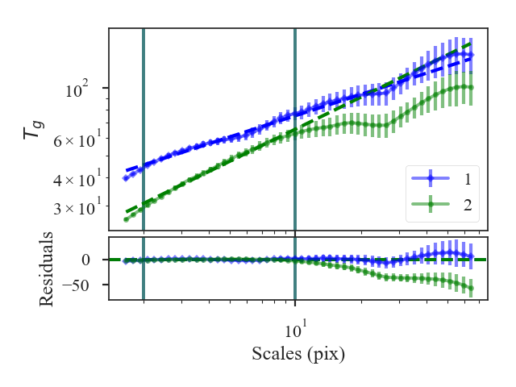

.. _wavedist:

****************
Wavelet Distance
****************

See :ref:`the tutorial <wavelet_tutorial>` for a description of Delta-Variance.

The distance metric for wavelets is `~turbustat.statistics.Wavelet_Distance`. The distance is defined as the t-statistic of the difference between the slopes of the wavelet transforms:

.. math::
        d_{\rm slope} = \frac{|\beta_1 - \beta_2|}{\sqrt{\sigma_{\beta_1}^2 + \sigma_{\beta_1}^2}}

:math:`\beta_i` are the slopes of the wavelet transforms and :math:`\sigma_{\beta_i}` are the uncertainty of the slopes.

More information on the distance metric definitions can be found in `Koch et al. 2017 <https://ui.adsabs.harvard.edu/#abs/2017MNRAS.471.1506K/abstract>`_

Using
-----

**The data in this tutorial are available** `here <https://girder.hub.yt/#user/57b31aee7b6f080001528c6d/folder/59721a30cc387500017dbe37>`_.

We need to import the `~turbustat.statistics.Wavelet_Distance` class, along with a few other common packages:

    >>> from turbustat.statistics import Wavelet
    >>> from astropy.io import fits
    >>> import matplotlib.pyplot as plt
    >>> import astropy.units as u

And we load in the two data sets; in this case, two integrated intensity (zeroth moment) maps:

    >>> moment0 = fits.open("Design4_flatrho_0021_00_radmc_moment0.fits")[0]  # doctest: +SKIP
    >>> moment0_fid = fits.open("Fiducial0_flatrho_0021_00_radmc_moment0.fits")[0]  # doctest: +SKIP

The two images are input to `~turbustat.statistics.Wavelet_Distance`:

    >>> wavelet = Wavelet_Distance(moment0_fid, moment0, xlow=2 * u.pix,
    ...                            xhigh=10 * u.pix)  # doctest: +SKIP

This call will run `~turbustat.statistics.Wavelet` on both of the images, which can be accessed with `~turbustat.statistics.Wavelet_Distance.wt1` and `~turbustat.statistics.Wavelet_Distance.wt2`.

In this example, we have limited the fitting regions with `xlow` and `xhigh`. Separate fitting limits for each image can be given by giving a two-element list for either keywords (e.g., `xlow=[1 * u.pix, 2 * u.pix]`). Additional fitting keyword arguments can be passed with `fit_kwargs` and `fit_kwargs2` for the first and second images, respectively.

To calculate the distance:

    >>> delvar.distance_metric(verbose=True, xunit=u.pix)  # doctest: +SKIP
                           OLS Regression Results
    ==============================================================================
    Dep. Variable:                      y   R-squared:                       0.983
    Model:                            OLS   Adj. R-squared:                  0.982
    Method:                 Least Squares   F-statistic:                     1013.
    Date:                Fri, 16 Nov 2018   Prob (F-statistic):           1.31e-18
    Time:                        17:55:59   Log-Likelihood:                 73.769
    No. Observations:                  22   AIC:                            -143.5
    Df Residuals:                      20   BIC:                            -141.4
    Df Model:                           1
    Covariance Type:                  HC3
    ==============================================================================
                     coef    std err          z      P>|z|      [0.025      0.975]
    ------------------------------------------------------------------------------
    const          1.5636      0.006    267.390      0.000       1.552       1.575
    x1             0.3137      0.010     31.832      0.000       0.294       0.333
    ==============================================================================
    Omnibus:                        3.421   Durbin-Watson:                   0.195
    Prob(Omnibus):                  0.181   Jarque-Bera (JB):                1.761
    Skew:                          -0.397   Prob(JB):                        0.414
    Kurtosis:                       1.864   Cond. No.                         7.05
    ==============================================================================
                                OLS Regression Results
    ==============================================================================
    Dep. Variable:                      y   R-squared:                       0.993
    Model:                            OLS   Adj. R-squared:                  0.993
    Method:                 Least Squares   F-statistic:                     1351.
    Date:                Fri, 16 Nov 2018   Prob (F-statistic):           7.76e-20
    Time:                        17:55:59   Log-Likelihood:                 75.406
    No. Observations:                  22   AIC:                            -146.8
    Df Residuals:                      20   BIC:                            -144.6
    Df Model:                           1
    Covariance Type:                  HC3
    ==============================================================================
                     coef    std err          z      P>|z|      [0.025      0.975]
    ------------------------------------------------------------------------------
    const          1.3444      0.008    158.895      0.000       1.328       1.361
    x1             0.4728      0.013     36.752      0.000       0.448       0.498
    ==============================================================================
    Omnibus:                        4.214   Durbin-Watson:                   0.170
    Prob(Omnibus):                  0.122   Jarque-Bera (JB):                3.493
    Skew:                          -0.958   Prob(JB):                        0.174
    Kurtosis:                       2.626   Cond. No.                         7.05
    ==============================================================================

A summary of the fits are printed along with a plot of the two wavelet transforms and the fit residuals. Colours, labels, and symbols can be specified in the plot with `plot_kwargs1` and `plot_kwargs2`.

The distances between these two datasets are:

    >>> wavelet.curve_distance  # doctest: +SKIP
    9.81949754947785

A pre-computed `~turbustat.statistics.Wavelet` class can be also passed instead of a data cube. See :ref:`the distance metric introduction <runmetrics>`.

References
----------

`Boyden et al. 2016 <https://ui.adsabs.harvard.edu/#abs/2016ApJ...833..233B/abstract>`_

`Koch et al. 2017 <https://ui.adsabs.harvard.edu/#abs/2017MNRAS.471.1506K/abstract>`_

`Boyden et al. 2018 <https://ui.adsabs.harvard.edu/#abs/2018ApJ...860..157B/abstract>`_
