.. _missing_data:

Dealing with missing data
*************************

When running any statistic in TurbuStat on data set with noise, there is a question of whether or not to mask out noisy data. Masking noisy data is a common practice with observational data and is often crucial for recovering scientifically-usable results.  However, some of the statistics in TurbuStat implicitly assume the map is continuous.  This page demonstrates the pros and cons of masking data versus including noisy regions.

We will create a red noise image to use as an example::

    >>> import numpy as np
    >>> import matplotlib.pyplot as plt
    >>> from turbustat.simulator import make_extended
    >>> img = make_extended(256, powerlaw=3., randomseed=54398493)
    >>> # Now shuffle so the peak is near the centre
    >>> img = np.roll(img, (128, -30), (0, 1))
    >>> img -= img.min()
    >>> plt.imshow(img, origin='lower')  # doctest: +SKIP
    >>> plt.colorbar()  # doctest: +SKIP

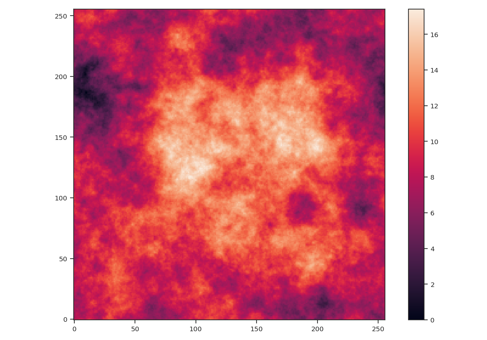

After creating the image, we centered the peak of the map to be near the centre. We also subtracted the minimum value from the image to remove negative values to better mimic observational data.

We will compare the effect of noise and masking on two statistics: the :ref:`PowerSpectrum <pspec_tutorial>` and the :ref:`Delta-variance <delvar_tutorial>`. The power-spectrum relies on a Fast Fourier Transform (FFT), which implicitly assumes that the map edges are periodic. This assumption presents an issue for observational maps with emission at their edge and requires an :ref:`apodizing kernel <apodkerns>` to be applied to the data prior to computing the power-spectrum. The delta-variance relies on convolving the map by a set of kernels with increasing size.  While the convolution also uses a Fourier transform, noisy or missing regions in the data are down-weighted so this method can be used on observational data with arbitrary shape (`Ossenkopf at al. 2008a <https://ui.adsabs.harvard.edu/#abs/2008A&A...485..917O/abstract>`_).

.. note:: Throughout this example, we will not create realistic WCS information for the image because we will be altering the image in each step.  For brevity, we pass `fits.PrimaryHDU(img)` which creates a FITS HDU without complete WCS information. For a tutorial on how TurbuStat creates mock WCS information, see :ref:`here <simobs_tutorial>`.

First, we will use both statistics on the unaltered image::

    >>> from astropy.io import fits
    >>> from turbustat.statistics import PowerSpectrum, DeltaVariance
    >>> pspec = PowerSpectrum(fits.PrimaryHDU(img))
    >>> pspec.run(verbose=True)  # doctest: +SKIP
                                OLS Regression Results
    ==============================================================================
    Dep. Variable:                      y   R-squared:                       1.000
    Model:                            OLS   Adj. R-squared:                  1.000
    Method:                 Least Squares   F-statistic:                 3.239e+05
    Date:                Thu, 14 Feb 2019   Prob (F-statistic):          1.61e-293
    Time:                        17:08:19   Log-Likelihood:                 610.32
    No. Observations:                 181   AIC:                            -1217.
    Df Residuals:                     179   BIC:                            -1210.
    Df Model:                           1
    Covariance Type:                  HC3
    ==============================================================================
                     coef    std err          z      P>|z|      [0.025      0.975]
    ------------------------------------------------------------------------------
    const          2.3594      0.003    755.971      0.000       2.353       2.366
    x1            -2.9893      0.005   -569.096      0.000      -3.000      -2.979
    ==============================================================================
    Omnibus:                      150.694   Durbin-Watson:                   1.634
    Prob(Omnibus):                  0.000   Jarque-Bera (JB):             5853.912
    Skew:                          -2.593   Prob(JB):                         0.00
    Kurtosis:                      30.374   Cond. No.                         4.15
    ==============================================================================

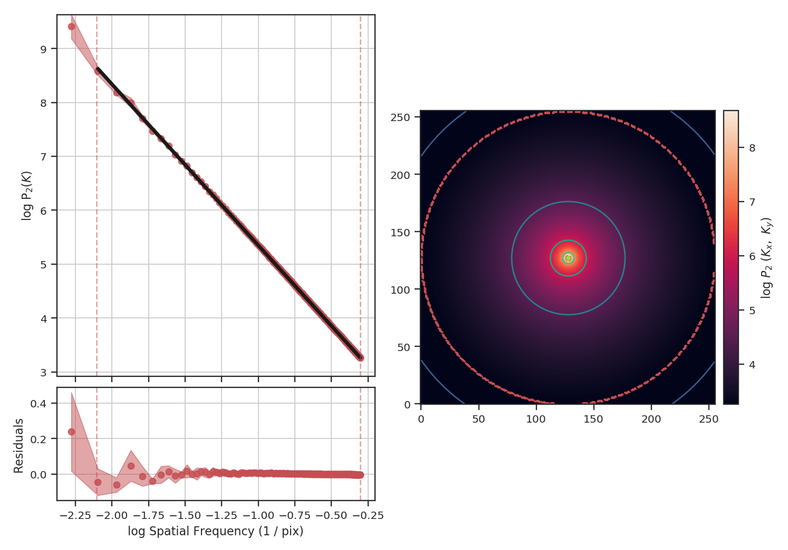

The power-spectrum recovers the expected slope of :math:`-3`. The delta-variance slope should be :math:`-\beta -2`, where :math:`\beta` is the power-spectrum slope, so we should find a slope of :math:`1`::

    >>> delvar = DeltaVariance(fits.PrimaryHDU(img))
    >>> delvar.run(verbose=True)  # doctest: +SKIP
                           WLS Regression Results
    ==============================================================================
    Dep. Variable:                      y   R-squared:                       0.999
    Model:                            WLS   Adj. R-squared:                  0.999
    Method:                 Least Squares   F-statistic:                     1741.
    Date:                Thu, 14 Feb 2019   Prob (F-statistic):           3.50e-23
    Time:                        17:13:16   Log-Likelihood:                 48.412
    No. Observations:                  25   AIC:                            -92.82
    Df Residuals:                      23   BIC:                            -90.39
    Df Model:                           1
    Covariance Type:                  HC3
    ==============================================================================
                     coef    std err          z      P>|z|      [0.025      0.975]
    ------------------------------------------------------------------------------
    const         -1.8780      0.017   -113.441      0.000      -1.910      -1.846
    x1             0.9986      0.024     41.723      0.000       0.952       1.046
    ==============================================================================
    Omnibus:                        6.913   Durbin-Watson:                   1.306
    Prob(Omnibus):                  0.032   Jarque-Bera (JB):                6.334
    Skew:                           0.535   Prob(JB):                       0.0421
    Kurtosis:                       5.221   Cond. No.                         12.1
    ==============================================================================

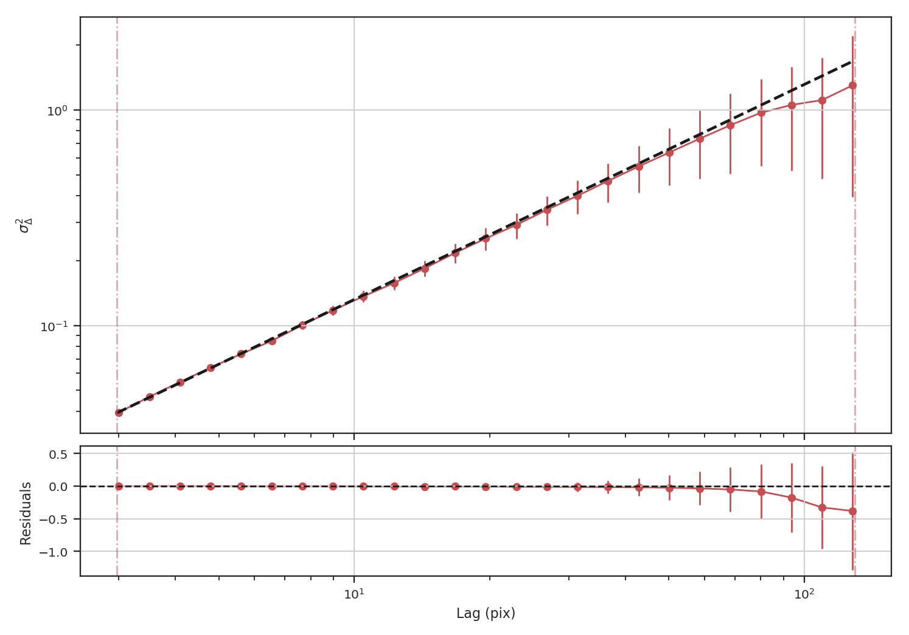

Indeed, we recover the correct slope from the delta-variance.

To demonstrate how masking affects each of these statistics, we will arbitrarily mask low values below the 25 percentile in the example image and run each statistic::

    >>> masked_img = img.copy()
    >>> masked_img[masked_img < np.percentile(img, 25)] = np.NaN
    >>> plt.imshow(masked_img, origin='lower')  # doctest: +SKIP
    >>> plt.colorbar()  # doctest: +SKIP

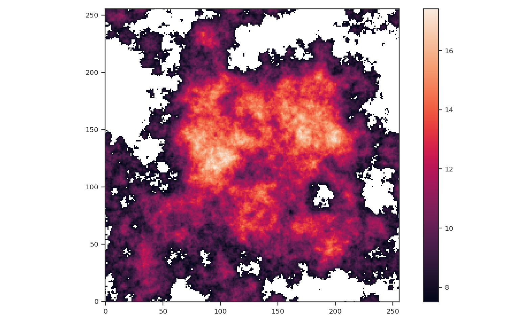

The central bright region remains but much of the fainter features around the image edges have been masked.::

    >>> pspec_masked = PowerSpectrum(fits.PrimaryHDU(masked_img))
    >>> pspec_masked.run(verbose=True, high_cut=10**-1.25 / u.pix)  # doctest: +SKIP
                                OLS Regression Results
    ==============================================================================
    Dep. Variable:                      y   R-squared:                       0.993
    Model:                            OLS   Adj. R-squared:                  0.993
    Method:                 Least Squares   F-statistic:                     2636.
    Date:                Thu, 14 Feb 2019   Prob (F-statistic):           3.45e-19
    Time:                        17:19:21   Log-Likelihood:                 27.859
    No. Observations:                  18   AIC:                            -51.72
    Df Residuals:                      16   BIC:                            -49.94
    Df Model:                           1
    Covariance Type:                  HC3
    ==============================================================================
                     coef    std err          z      P>|z|      [0.025      0.975]
    ------------------------------------------------------------------------------
    const          3.5321      0.080     44.347      0.000       3.376       3.688
    x1            -2.6362      0.051    -51.344      0.000      -2.737      -2.536
    ==============================================================================
    Omnibus:                        0.336   Durbin-Watson:                   2.692
    Prob(Omnibus):                  0.845   Jarque-Bera (JB):                0.445
    Skew:                           0.259   Prob(JB):                        0.800
    Kurtosis:                       2.429   Cond. No.                         14.6
    ==============================================================================

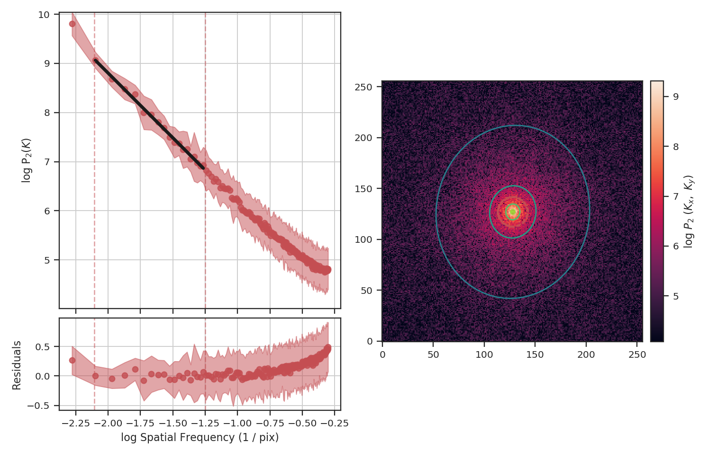

Masking has significantly flattened the power-spectrum, even with the restriction we added to fit only scales larger than :math:`10^{1.25}\sim18` pixels. In fact, flattening the power-spectrum is similar to how noise effects the power-spectrum. Why is this? FFTs cannot be used on data with missing values specified as `NaNs`. Instead, we have to choose a finite value to _fill_ the missing data; we typically choose to fill these regions with :math:`0`.  When large regions are missing, the fill value leads to a large region with constant values that, by itself, would have a power-spectrum index of :math:`0`.

The delta-variance avoids the filling issue for masked data by introducing weights. Places with missing data have a very low weight or remained masked. The `astropy convolution <http://docs.astropy.org/en/stable/convolution/>`_ package has routines for interpolating over masked data, which is useful when small regions are missing data but is not typically useful when the missing data lies at the edge of emission in a map. With the masked image, the delta-variance curve we find is::

    >>> delvar_masked = DeltaVariance(fits.PrimaryHDU(masked_img))
    >>> delvar_masked.run(verbose=True, xlow=2 * u.pix, xhigh=50 * u.pix)  # doctest: +SKIP
                                WLS Regression Results
    ==============================================================================
    Dep. Variable:                      y   R-squared:                       0.999
    Model:                            WLS   Adj. R-squared:                  0.999
    Method:                 Least Squares   F-statistic:                     1860.
    Date:                Thu, 14 Feb 2019   Prob (F-statistic):           5.52e-18
    Time:                        17:30:29   Log-Likelihood:                 52.504
    No. Observations:                  18   AIC:                            -101.0
    Df Residuals:                      16   BIC:                            -99.23
    Df Model:                           1
    Covariance Type:                  HC3
    ==============================================================================
                     coef    std err          z      P>|z|      [0.025      0.975]
    ------------------------------------------------------------------------------
    const         -1.8679      0.015   -120.680      0.000      -1.898      -1.838
    x1             0.9520      0.022     43.128      0.000       0.909       0.995
    ==============================================================================
    Omnibus:                        4.484   Durbin-Watson:                   1.339
    Prob(Omnibus):                  0.106   Jarque-Bera (JB):                2.180
    Skew:                           0.694   Prob(JB):                        0.336
    Kurtosis:                       3.991   Cond. No.                         11.7
    ==============================================================================

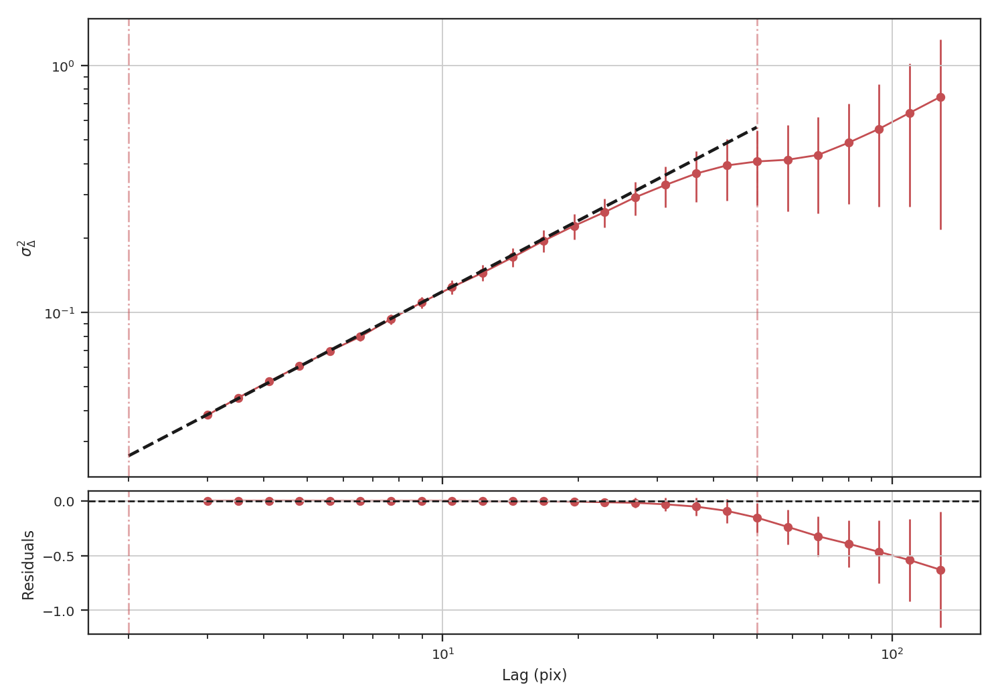

When restricting the fit to scales of less than 50 pixels (about a quarter of the image), we recover a slope of :math:`0.95`, significantly closer to the expected value of :math:`1.0` relative to the power-spectrum.

Another issue that could be encountered with observational data are large empty regions in a map, either due to masking (similar to the above example) or when we want to investigate a single object and have masked out all others. This situation could arise when the data are segmented into individual _"blobs"_ and we want to study the properties of each blob. To mimic this situation, we will pad the edges (following the `numpy example <https://docs.scipy.org/doc/numpy-1.15.0/reference/generated/numpy.pad.html>`_) of the image with empty values as::

    >>> def pad_with(vector, pad_width, iaxis, kwargs):
    ...    pad_value = kwargs.get('padder', 0.)
    ...    vector[:pad_width[0]] = pad_value
    ...    vector[-pad_width[1]:] = pad_value
    ...    return vector
    >>> padded_masked_img = np.pad(masked_img, 128, pad_with, padder=np.NaN)

We are also only going to keep the biggest continuous region in the padded image to mimic studying a single object picked from a larger image::

    >>> from scipy import ndimage as nd
    >>> labs, num = nd.label(np.isfinite(padded_masked_img), np.ones((3, 3)))
    >>> # Keep the largest region only
    >>> padded_masked_img[np.where(labs > 1)] = np.NaN
    >>> plt.imshow(padded_masked_img, origin='lower')  # doctest: +SKIP
    >>> plt.colorbar()  # doctest: +SKIP

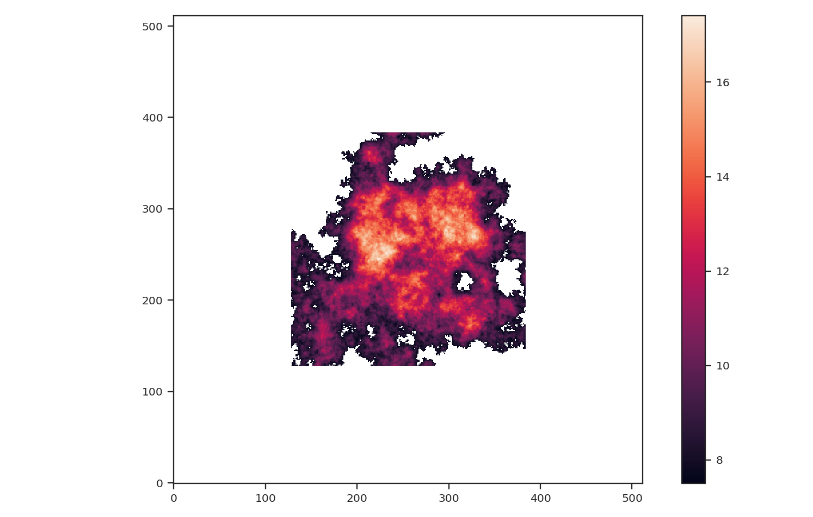

The unmasked region is now surrounded by huge empty regions. How does this affect the power-spectrum and delta-variance?::

    >>> pspec_masked_pad = PowerSpectrum(fits.PrimaryHDU(padded_masked_img))
    >>> pspec_masked_pad.run(verbose=True, high_cut=10**-1.25 / u.pix)  # doctest: +SKIP

                                OLS Regression Results
    ==============================================================================
    Dep. Variable:                      y   R-squared:                       0.985
    Model:                            OLS   Adj. R-squared:                  0.985
    Method:                 Least Squares   F-statistic:                     1166.
    Date:                Fri, 15 Feb 2019   Prob (F-statistic):           1.41e-29
    Time:                        13:43:42   Log-Likelihood:                 35.094
    No. Observations:                  39   AIC:                            -66.19
    Df Residuals:                      37   BIC:                            -62.86
    Df Model:                           1
    Covariance Type:                  HC3
    ==============================================================================
                     coef    std err          z      P>|z|      [0.025      0.975]
    ------------------------------------------------------------------------------
    const          3.4746      0.123     28.245      0.000       3.233       3.716
    x1            -2.6847      0.079    -34.144      0.000      -2.839      -2.531
    ==============================================================================
    Omnibus:                        1.962   Durbin-Watson:                   2.222
    Prob(Omnibus):                  0.375   Jarque-Bera (JB):                1.840
    Skew:                          -0.489   Prob(JB):                        0.399
    Kurtosis:                       2.580   Cond. No.                         12.2
    ==============================================================================

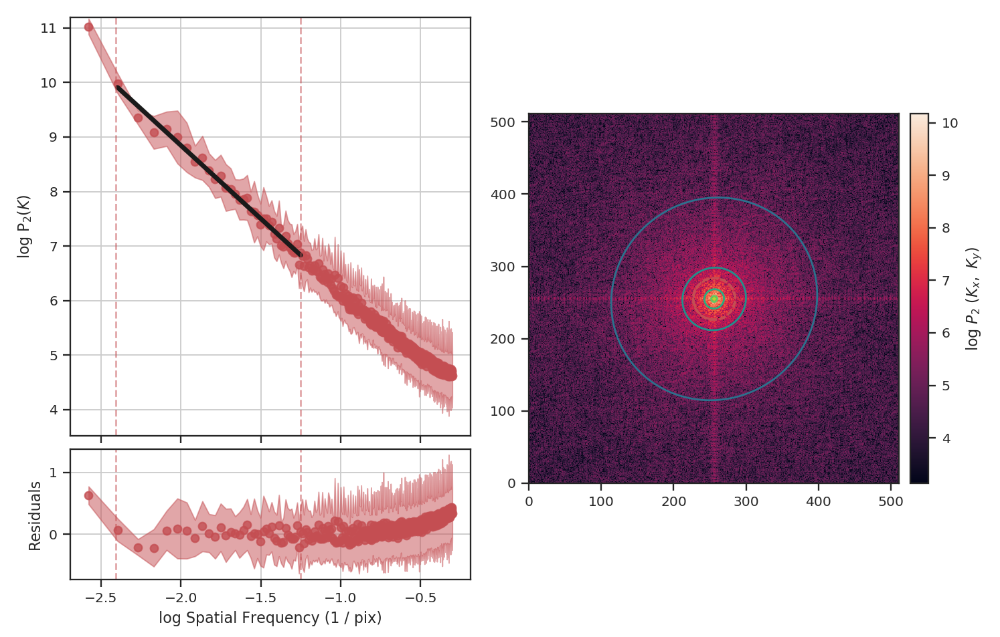

The power-spectrum is similarly flattened as in the non-padded case. However, the sharp cut-off at the edges of the non-masked region lead to the Gibbs phenomenon (i.e., ringing) evident from the horizontal and vertical stripes in the 2D power-spectrum on the right. The ringing can be minimized by utilizing an :ref:`apodizing kernel <apodkerns>`.

    >>> delvar_masked_padded = DeltaVariance(fits.PrimaryHDU(padded_masked_img))
    >>> delvar_masked_padded.run(verbose=True, xlow=2 * u.pix, xhigh=70 * u.pix)  # doctest: +SKIP
                                WLS Regression Results
    ==============================================================================
    Dep. Variable:                      y   R-squared:                       0.999
    Model:                            WLS   Adj. R-squared:                  0.999
    Method:                 Least Squares   F-statistic:                 1.120e+04
    Date:                Fri, 15 Feb 2019   Prob (F-statistic):           3.37e-24
    Time:                        13:48:37   Log-Likelihood:                 48.777
    No. Observations:                  18   AIC:                            -93.55
    Df Residuals:                      16   BIC:                            -91.77
    Df Model:                           1
    Covariance Type:                  HC3
    ==============================================================================
                     coef    std err          z      P>|z|      [0.025      0.975]
    ------------------------------------------------------------------------------
    const         -1.8663      0.004   -425.902      0.000      -1.875      -1.858
    x1             0.9501      0.009    105.823      0.000       0.933       0.968
    ==============================================================================
    Omnibus:                       26.283   Durbin-Watson:                   1.593
    Prob(Omnibus):                  0.000   Jarque-Bera (JB):               41.814
    Skew:                          -2.253   Prob(JB):                     8.32e-10
    Kurtosis:                       8.953   Cond. No.                         11.6
    ==============================================================================

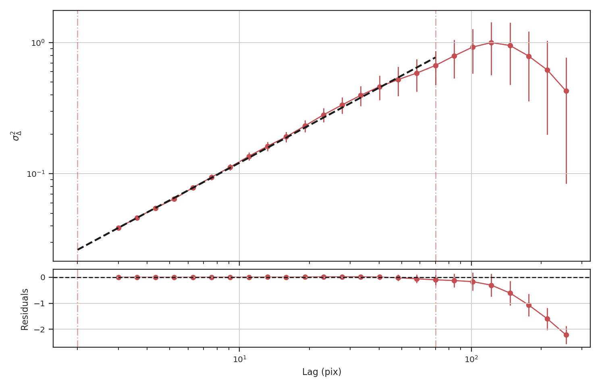

The delta-variance is similarly unaffected by the padded region. Because of the weighting functions, the convolution steps in the delta-variance do not suffer from ringing like the power-spectrum does. We note that this delta-variance curve extends to larger scales because of the padding. What is notable on these larger scales is the lack of emission, which causes the delta-variance to decrease. This is the expected behaviour when large regions of an image are masked and the user can either (i) limit the lags to smaller values, or (ii) exclude large scales from the fit (as we do in this example).

Now, we will compare the masking examples above to when noise is added to the image (without padding). We will add noise to the image drawn from a normal distribution with standard deviation of 1.::

    >>> noise_rms = 1.
    >>> noisy_img = img + np.random.normal(0., noise_rms, img.shape)
    >>> plt.imshow(noisy_img, origin='lower')  # doctest: +SKIP
    >>> plt.colorbar()  # doctest: +SKIP

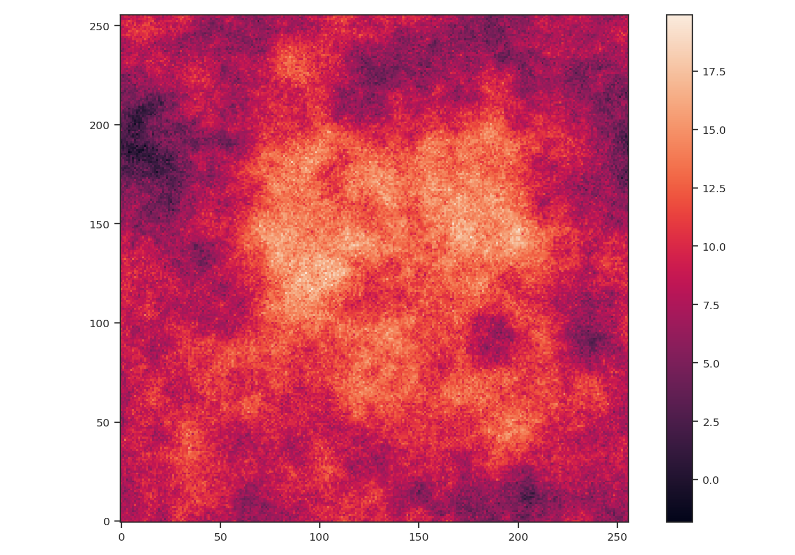

Since the noise distribution is spatially-uncorrelated, the power-spectrum of only the noise will be 0. We expect then that the power-spectrum will be flattened on small scales due to the noise::

    >>> pspec_noisy = PowerSpectrum(fits.PrimaryHDU(noisy_img))
    >>> pspec_noisy.run(verbose=True, high_cut=10**-1.2 / u.pix)  # doctest: +SKIP
                                OLS Regression Results
    ==============================================================================
    Dep. Variable:                      y   R-squared:                       0.999
    Model:                            OLS   Adj. R-squared:                  0.999
    Method:                 Least Squares   F-statistic:                     7447.
    Date:                Fri, 15 Feb 2019   Prob (F-statistic):           4.08e-26
    Time:                        13:58:28   Log-Likelihood:                 47.231
    No. Observations:                  21   AIC:                            -90.46
    Df Residuals:                      19   BIC:                            -88.37
    Df Model:                           1
    Covariance Type:                  HC3
    ==============================================================================
                     coef    std err          z      P>|z|      [0.025      0.975]
    ------------------------------------------------------------------------------
    const          2.4964      0.048     51.948      0.000       2.402       2.591
    x1            -2.9054      0.034    -86.298      0.000      -2.971      -2.839
    ==============================================================================
    Omnibus:                        3.284   Durbin-Watson:                   2.477
    Prob(Omnibus):                  0.194   Jarque-Bera (JB):                1.493
    Skew:                           0.450   Prob(JB):                        0.474
    Kurtosis:                       3.948   Cond. No.                         13.3
    ==============================================================================

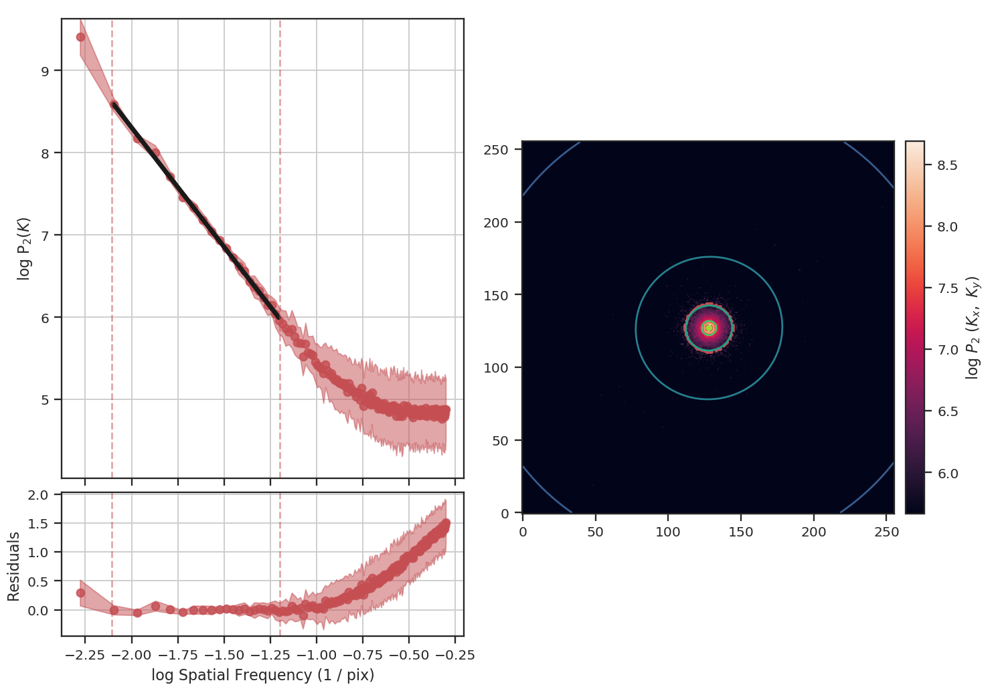

The power-spectrum does indeed approach an index of 0 on small scales due to the noise. By excluding scales smaller than :math:`10^{1.25}\sim18` pixels, however, we recover a index of :math:`-2.9`, much closer to the actual index of :math:`-3` than the masking example above. The extent that the power-spectrum index will be biased by the noise will depend on the level of noise relative to the signal. An alternative approach to model the power-spectrum would be to include a noise component (e.g., `Miville-Deschenes et al. 2010 <https://ui.adsabs.harvard.edu/#abs/2010A&A...518L.104M/abstract>`_) but this is not currently implemented in TurbuStat.

Running delta-variance on the noisy image gives::

    >>> delvar_noisy = DeltaVariance(fits.PrimaryHDU(noisy_img))
    >>> delvar_noisy.run(verbose=True, xlow=10 * u.pix, xhigh=70 * u.pix)  # doctest: +SKIP
                                WLS Regression Results
    ==============================================================================
    Dep. Variable:                      y   R-squared:                       0.999
    Model:                            WLS   Adj. R-squared:                  0.998
    Method:                 Least Squares   F-statistic:                     842.9
    Date:                Fri, 15 Feb 2019   Prob (F-statistic):           9.52e-12
    Time:                        14:17:20   Log-Likelihood:                 41.456
    No. Observations:                  13   AIC:                            -78.91
    Df Residuals:                      11   BIC:                            -77.78
    Df Model:                           1
    Covariance Type:                  HC3
    ==============================================================================
                     coef    std err          z      P>|z|      [0.025      0.975]
    ------------------------------------------------------------------------------
    const         -1.8245      0.041    -45.005      0.000      -1.904      -1.745
    x1             0.9480      0.033     29.034      0.000       0.884       1.012
    ==============================================================================
    Omnibus:                        7.660   Durbin-Watson:                   1.670
    Prob(Omnibus):                  0.022   Jarque-Bera (JB):                3.768
    Skew:                          -1.137   Prob(JB):                        0.152
    Kurtosis:                       4.336   Cond. No.                         20.7
    ==============================================================================

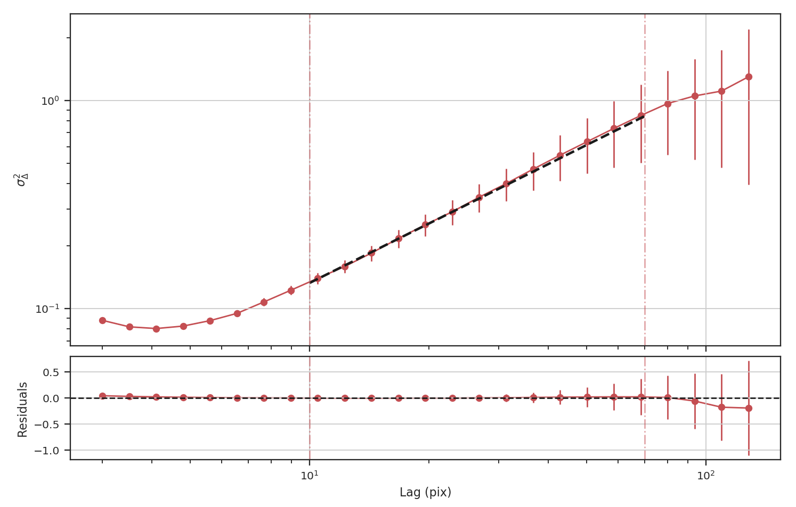

The delta-variance slope is flatter by about the same amount as in the masked image example above (:math:`0.95`). Thus masking and noise (at this level) have the same effect on the slope of the delta-variance.

From these examples, we see that the power-spectrum is more biased by masking than by keeping noisy regions in the image. The delta-variance is similarly biased in both cases because of how noisy regions are down-weighted in the convolution step.

.. note:: We encourage users to test a statistic with and without masking their data to determine how the statistic is affected by masking.

Where noise matters
*******************

Noise will affect all the statistics and metrics in TurbuStat to some extent. This section lists common issues that may be encountered with observational data.

* The previous section shows an example of how noise flattens a power-spectrum. This will effect the spatial power-spectrum, MVC, VCA, VCS (at small scales), the Wavelet transform, and the delta-variance. If the noise level is moderate, the range that is fit can be altered to avoid the scales where noise severely flattens the power-spectrum or equivalent relation.

* Fits to the PDF can be affected by noise. These values will tend to cluster the low values in an image to around 0. If the noise is (mostly) uncorrelated, the noise component will be a Gaussian. A minimum value to include in the PDF should be set to avoid this region. Furthermore, the default log-normal model cannot handle negative values and will raise an error in this case.

* Many of the distance metrics are defined in terms of the significance of the difference between two values. For example, the power-spectrum distance is the absolute difference between two indices normalized by the square root of the sum of the variance from the fit uncertainty (:math:`d=|\beta_1 - \beta_2|\, /\, \sqrt{\sigma_1^2 + \sigma_2^2}`). If one data set is significantly noisier than the other, this will _lower_ the distance. It is important to compare all distance to a common baseline. This will determine the *significance* of a distance rather than its value. `Koch et al. 2017 <https://ui.adsabs.harvard.edu/#abs/2017MNRAS.471.1506K/abstract>`_ explore this in detail.

