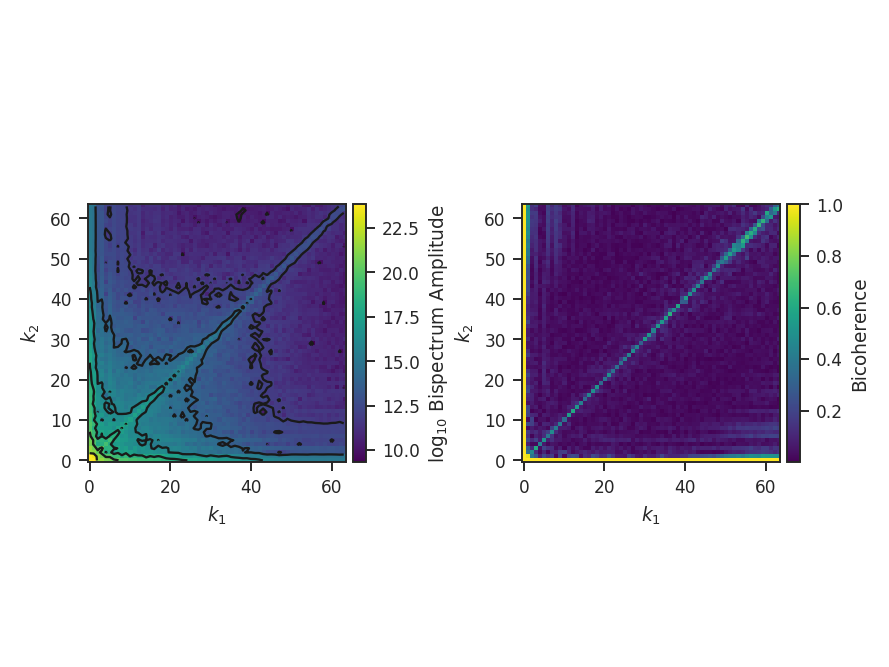
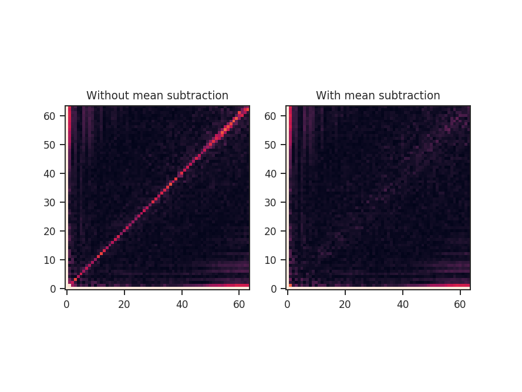

**********
Bispectrum
**********

Overview
--------

The `bispectrum <https://en.wikipedia.org/wiki/Bispectrum>`_ is the Fourier transform of the three-point covariance function. It represents the next higher-order expansion upon the more commonly used two-point statistics, whose autocorrelation function is the power spectrum. The bispectrum is computed using:

.. math::
    B(k_1, k_2) = F^{\ast}(k_1 + k_2)\,F(k_1)\,F(k_2)

where :math:`\ast` denotes the complex conjugate, :math:`F` is the Fourier transform of some signal, and :math:`k_1,\,k_2` are wavenumbers.

The bispectrum retains phase information which is lost in the :ref:`power spectrum <pspec_tutorial>`, and is therefore useful for investigating phase coherence and coupling.

The use of the bispectrum in the ISM was introduced by :ref:`Burkhart et al. 2009 <ref-burkhart2009>`, and recently extended in :ref:`Burkhart et al. 2016 <ref-burkhart2016>`.

The phase information retained by the bispectrum requires it to be a complex quantity. A real, normalized version can be expressed through the `bicoherence <https://en.wikipedia.org/wiki/Bicoherence>`_. The bicoherence is a measure of phase coupling alone, where the maximal values of 1 and 0 represent complete coupled and uncoupled, respectively. The form that is used here is defined by :ref:`Hagihira et al. 2001 <ref-hagihira2001>`:

.. math::
    b(k_1, k_2) = \frac{|B(k_1, k_2)|}{\sum_{k_1, k_2} |F(k_1)F(k_2)F^{\ast}(k_1 + k_2)|}

The denominator normalizes out the "power" at the modes :math:`k_1,\,k_2`; this is effectively dividing out the value of the power spectrum, leaving a fractional difference that is entirely the result of the phase coupling. Alternatively, the denominator can be thought of as the value attained if the modes :math:`k_1\,k_2` are completely phase coupled, and therefore is the maximal value attainable.

In the recent work of :ref:`Burkhart et al. 2016 <ref-burkhart2016>`, they used a *phase coherence technique* (PCI), alternative to the bispectrum, to measure phase coherence as a function of radial and azimuthal changes (so called *lags* averaged over radius or angle in the bispectrum plane). This is defined as

.. math::
    C(R) = \frac{L_{\rm PRS}(R) - L_{\rm ORG}(R)}{L_{\rm PRS}(R) - L_{\rm PCS}(R)}

where :math:`L(R)` is the relevant averaged quantity calculated at different lags (denoted generally by :math:`R`). ORG is the original signal, PRS is the signal with randomized phases, and PCS is the signal with phases set to be correlated. For each value of R, this yields a normalized value (:math:`C(R)`) between 0 and 1, similar to the bispectrum. **Note: PCI will be added to the existing TurbuStat code, but is not yet complete.**.

Using
-----

**The data in this tutorial are available** `here <https://girder.hub.yt/#user/57b31aee7b6f080001528c6d/folder/57e55670a909a80001d301ae>`_.

We need to import the `~turbustat.statistics.BiSpectrum` code, along with a few other common packages:

    >>> from turbustat.statistics import BiSpectrum
    >>> from astropy.io import fits

And we load in the data:

    >>> moment0 = fits.open("Design4_flatrho_0021_00_radmc_moment0.fits")[0]  # doctest: +SKIP

While the bispectrum can be extended to sample in N-dimensions, the current implementation requires a 2D input. In all previous work, the computation is performed on an integrated intensity or column density map.

First, the `~turbustat.statistics.BiSpectrum` class is initialized:

    >>> bispec = BiSpectrum(moment0)  # doctest: +SKIP

The bispectrum requires only the image, not a header, so passing any arbitrary 2D array will work.

Even using a small 2D image (128x128 here), the number of possible combinations for :math:`k_1,\,k_2` is massive (the maximum value of :math:`k_1,\,k_2` is half of the largest dimension size in the image). To save time, we can randomly sample some number of *phases* for each value of :math:`k_1,\,k_2` (so :math:`k_1 + k_2`, the coupling term, changes). This is set by `nsamples`. There is shot noise associated with this random sampling, and the effect of changing `nsamples` should be tested. For this example, structure begins to become apparent with about 1000 samples. The figures here use 10000 samples to make the structure more evident. **This will take about 10 minutes to run!**

The computing the bispectrum and bicoherence maps is performed through `~turbustat.statistics.BiSpectrum.run`:

    >>> bispec.run(verbose=True, nsamples=10000)  # doctest: +SKIP

`~turbustat.statistics.BiSpectrum.run` really only performs a single step: `~turbustat.statistics.BiSpectrum.compute_bispectrum`. For this, there are two optional inputs that may be set:

    >>> bispec.run(nsamples=10000, mean_subtract=True, seed=4242424)  # doctest: +SKIP

`seed` sets the random seed for the sampling, and `mean_subtract` removes the mean from the data before computing the bispectrum. This removes the "zero frequency" power defined based on the largest scale in the image that provides gives the phase coupling along :math:`k_1 = k_2` line. Removing the mean highlights the non-linear mode interactions:

The figure shows the effect on the bicoherence from subtracting the mean. The colorbar is limited between 0 and 1, with black representing 1.

References
----------

.. _ref-burkhart2009:

`Burkhart et al. 2009 <https://ui.adsabs.harvard.edu/#abs/2009ApJ...693..250B/abstract>`_

.. _ref-burkhart2016:

`Burkhart et al. 2016 <https://ui.adsabs.harvard.edu/#abs/2016ApJ...827...26B/abstract>`_

.. _ref-hagihira2001:

`Hagihira et al. 2001 <https://www.ncbi.nlm.nih.gov/pubmed/11574365>`_
