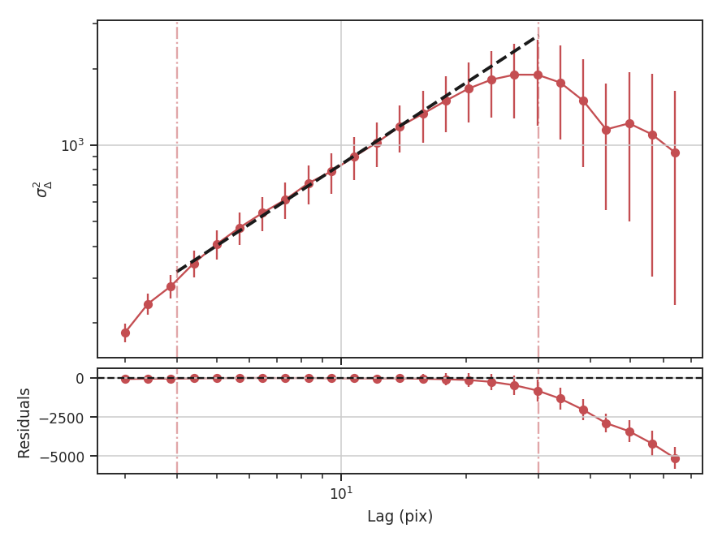
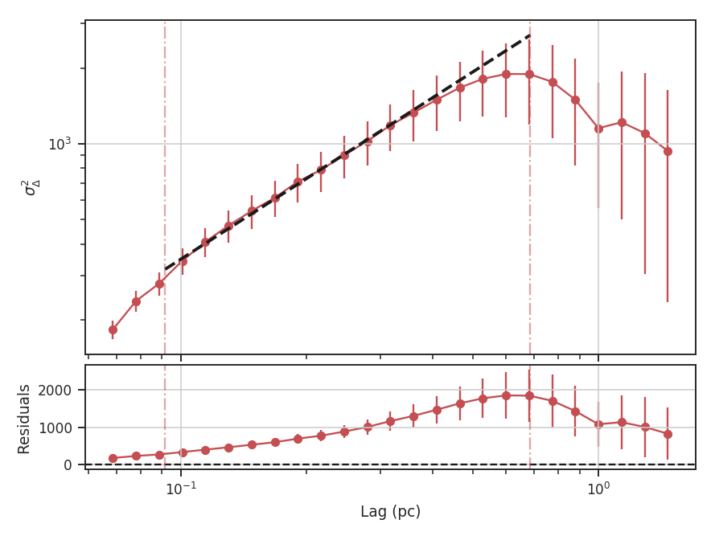

.. _delvar_tutorial:

**************
Delta-Variance
**************

Overview
--------

The :math:`\Delta`-variance technique was introduced by `Stutzki et al. 1998 <https://ui.adsabs.harvard.edu/#abs/1998A&A...336..697S/abstract>`_ as a generalization of *Allan-variance*, a technique used to study the drift in instrumentation. They found that molecular cloud structures are well characterized by fractional Brownian motion structure, which results from a power-law power spectrum with a random phase distribution. The technique was extended by `Bensch et al. 2001. <https://ui.adsabs.harvard.edu/#abs/2001A&A...366..636B/abstract>`_ to account for the effects of beam smoothing and edge effects on a discretely sampled grid. With this approach, they identified a functional form to recover the index of the near power-law relation. The technique was extended again by `Ossenkopf at al. 2008a <https://ui.adsabs.harvard.edu/#abs/2008A&A...485..917O/abstract>`_, where the computation using filters of different scales was moved into the Fourier domain, allowing for a significant improvement in speed. The following description uses the Fourier-domain formulation.

Delta-variance measures the amount of structure on a given range of scales. Each delta-variance point is calculated by filtering an image with an azimuthally symmetric kernel - a French hat or Ricker kernels - and computing the variance of the filtered map. Due to the effects of a finite grid that typically does not have periodic boundaries and the effects of noise, `Ossenkopf at al. 2008a <https://ui.adsabs.harvard.edu/#abs/2008A&A...485..917O/abstract>`_ proposed a convolution based method that splits the kernel into its central peak and outer annulus, convolves the separate regions, and subtracts the annulus-convolved map from the peak-convolved map. The Ricker kernel separation can be defined using two Gaussian functions. A weight map was also introduced to minimize noise effects where there is low S/N regions in the data. Altogether, this is expressed as:

.. math::
    F(r) = \frac{G_{\rm core}(r)}{W_{\rm core}(r)} - \frac{G_{\rm ann}(r)}{W_{\rm ann}(r)}

where :math:`r` is the kernel size, :math:`G` is the convolved image map, and :math:`W` is the convolved weight map. The delta-variance is then,

.. math::
    \sigma_{\delta}(r) = \frac{\Sigma_{\rm map} \mathrm{Var}(F(r)) W_{\rm tot}(r)}{\Sigma_{\rm map} W_{\rm tot}(r)}

where :math:`W_{\rm tot}(r) = W_{\rm core}(r)\,W_{\rm ann}(r)`.

Since the kernel is separated into two components, the ratio between their widths can be set independently. `Ossenkopf at al. 2008a <https://ui.adsabs.harvard.edu/#abs/2008A&A...485..917O/abstract>`_ find an optimal ratio of 1.5 for the Ricker kernel, which is the element used in TurbuStat.

Performing this operation yields a power-law-like relation between the scales :math:`r` and the delta-variance. This power-law relation measured in the real-domain is analogous to the two-point structure function (e.g., `Miesch & Bally 1994 <https://ui.adsabs.harvard.edu/#abs/1994ApJ...429..645M/abstract>`_). Its use of the convolution kernel, as well as handling for map edges, makes it faster to compute and more robust to oddly-shaped regions of signal.

This technique shares many similarities to the :ref:`Wavelet transform <wavelet_tutorial>`.

Using
-----

**The data in this tutorial are available** `here <https://girder.hub.yt/#user/57b31aee7b6f080001528c6d/folder/59721a30cc387500017dbe37>`_.

We need to import the `~turbustat.statistics.DeltaVariance` code, along with a few other common packages:

    >>> from turbustat.statistics import DeltaVariance
    >>> from astropy.io import fits

Then, we load in the data and the associated error array:

    >>> moment0 = fits.open("Design4_flatrho_0021_00_radmc_moment0.fits")[0]  # doctest: +SKIP
    >>> moment0_err = fits.open("Design4_flatrho_0021_00_radmc_moment0.fits")[1]  # doctest: +SKIP

Next, we initialize the `~turbustat.statistics.DeltaVariance` class:

    >>> delvar = DeltaVariance(moment0, weights=moment0_err, distance=250 * u.pc)  # doctest: +SKIP

The weight array is optional but is recommended to down-weight noisy data (particularly near the map edge). Note that this is not the exact form of the weight array used by `Ossenkopf at al. 2008b <https://ui.adsabs.harvard.edu/#abs/2008A&A...485..719O/abstract>`_; they use the square root of the number of elements along the line of sight used to create the integrated intensity map. This doesn't take into account the varying S/N of each element used, however. In the case with the simulated data, the two are nearly identical, since the noise value associated with each element is constant. If no weights are given, a uniform array of ones is used.

To compute the delta-variance curve, the image is convolved with a set of kernels. The width of each kernel is referred to as the "lag." By default, 25 lag values will be used, logarithmically spaced between 3 pixels to half of the minimum axis size. Alternative lags can be specified by setting the `lags` keyword. If a `~numpy.ndarray` is passed, it is assumed to be in pixel units. Lags can also be given in angular units using `astropy.units.Quantity` objects. The diameter between the inner and outer convolution kernels is set by `diam_ratio`. By default, this is set to 1.5 (`Ossenkopf at al. 2008a <https://ui.adsabs.harvard.edu/#abs/2008A&A...485..917O/abstract>`_).

The entire process is performed through `~turbustat.statistics.DeltaVariance.run`:

    >>> delvar.run(verbose=True, xunit=u.pix)  # doctest: +SKIP
                                WLS Regression Results
    ==============================================================================
    Dep. Variable:                      y   R-squared:                       0.946
    Model:                            WLS   Adj. R-squared:                  0.943
    Method:                 Least Squares   F-statistic:                     400.2
    Date:                Wed, 18 Oct 2017   Prob (F-statistic):           4.80e-16
    Time:                        18:38:51   Log-Likelihood:                 13.625
    No. Observations:                  25   AIC:                            -23.25
    Df Residuals:                      23   BIC:                            -20.81
    Df Model:                           1
    Covariance Type:            nonrobust
    ==============================================================================
                     coef    std err          t      P>|t|      [0.025      0.975]
    ------------------------------------------------------------------------------
    const          1.6826      0.036     46.701      0.000       1.608       1.757
    x1             1.2654      0.063     20.006      0.000       1.135       1.396
    ==============================================================================
    Omnibus:                        0.195   Durbin-Watson:                   0.506
    Prob(Omnibus):                  0.907   Jarque-Bera (JB):                0.403
    Skew:                          -0.047   Prob(JB):                        0.818
    Kurtosis:                       2.385   Cond. No.                         10.6
    ==============================================================================

.. image:: images/delvar_design4.png

`xunit` is the unit the lags will be converted to in the plot. The plot includes a linear fit to the Delta-variance curve, however there is a significant deviation from a single power-law on large scales. We can restrict the fitting to reflect this:

    >>> delvar.run(verbose=True, xunit=u.pix, xlow=4 * u.pix, xhigh=30 * u.pix)  # doctest: +SKIP
                                WLS Regression Results
    ==============================================================================
    Dep. Variable:                      y   R-squared:                       0.994
    Model:                            WLS   Adj. R-squared:                  0.993
    Method:                 Least Squares   F-statistic:                     2167.
    Date:                Wed, 18 Oct 2017   Prob (F-statistic):           9.44e-17
    Time:                        18:38:52   Log-Likelihood:                 38.238
    No. Observations:                  16   AIC:                            -72.48
    Df Residuals:                      14   BIC:                            -70.93
    Df Model:                           1
    Covariance Type:            nonrobust
    ==============================================================================
                     coef    std err          t      P>|t|      [0.025      0.975]
    ------------------------------------------------------------------------------
    const          1.8620      0.017    106.799      0.000       1.825       1.899
    x1             1.0630      0.023     46.549      0.000       1.014       1.112
    ==============================================================================
    Omnibus:                        0.142   Durbin-Watson:                   0.746
    Prob(Omnibus):                  0.931   Jarque-Bera (JB):                0.271
    Skew:                          -0.182   Prob(JB):                        0.873
    Kurtosis:                       2.475   Cond. No.                         11.4
    ==============================================================================

`xlow`, `xhigh`, and `xunit` can also be passed any angular unit, and since a distance was given, physical units can also be passed. For example, using the previous example:

    >>> delvar.run(verbose=True, xunit=u.pc, xlow=4 * u.pix, xhigh=30 * u.pix)  # doctest: +SKIP
                                WLS Regression Results
    ==============================================================================
    Dep. Variable:                      y   R-squared:                       0.994
    Model:                            WLS   Adj. R-squared:                  0.993
    Method:                 Least Squares   F-statistic:                     2167.
    Date:                Wed, 18 Oct 2017   Prob (F-statistic):           9.44e-17
    Time:                        18:38:52   Log-Likelihood:                 38.238
    No. Observations:                  16   AIC:                            -72.48
    Df Residuals:                      14   BIC:                            -70.93
    Df Model:                           1
    Covariance Type:            nonrobust
    ==============================================================================
                     coef    std err          t      P>|t|      [0.025      0.975]
    ------------------------------------------------------------------------------
    const          1.8620      0.017    106.799      0.000       1.825       1.899
    x1             1.0630      0.023     46.549      0.000       1.014       1.112
    ==============================================================================
    Omnibus:                        0.142   Durbin-Watson:                   0.746
    Prob(Omnibus):                  0.931   Jarque-Bera (JB):                0.271
    Skew:                          -0.182   Prob(JB):                        0.873
    Kurtosis:                       2.475   Cond. No.                         11.4
    ==============================================================================

Since the Delta-variance is based on a series of convolutions, there is a choice for how the boundaries should be treated. This is set by the `boundary` keyword in `~turbustat.statistics.DeltaVariance.run`. By default, `boundary='wrap'` as is appropriate for simulated data in a periodic box. If the data is *not* periodic in the spatial dimensions, `boundary='fill'` should be used. This mode pads the edges of the data based on the size of the convolution kernel used.

When an image contains NaNs, there are two important parameters for the convolution: `preserve_nan` and `nan_treatment`. Setting `preserve_nan=True` will set pixels that were originally a NaN to a NaN in the convolved image.  This is useful for when the image has a border of NaNs. When the edges are not handled correctly, the delta-variance curve will have large spikes at small lag values.

If an image has missing values within the image, setting `nan_treatment='interpolate'` will interpolate over the missing regions, providing a smoothed version of the convolved image.  However, interpolation may perform poorly when the image has a border of NaNs. In this case, `nan_treatment='fill'` will fill NaN values with a constant value (the default is :math:`0.0`).  Since the edge effects may be extreme with interpolation, the default setting is `nan_treatment='fill'`.

If an image has both missing regions and a border of NaNs, manual treatment may be necessary to convert the edges to NaNs while correctly handling the interpolating regions in the interior. See the `convolution <http://docs.astropy.org/en/stable/api/astropy.convolution.convolve_fft.html#astropy.convolution.convolve_fft>`_ page on astropy for more information.

Similar to the fitting for other statistics, the Delta-variance curve can be fit with a segmented linear model:

    >>> delvar.run(verbose=True, xunit=u.pc, xlow=4 * u.pix, xhigh=40 * u.pix, brk=8 * u.pix)  # doctest: +SKIP
                                WLS Regression Results
    ==============================================================================
    Dep. Variable:                      y   R-squared:                       0.996
    Model:                            WLS   Adj. R-squared:                  0.995
    Method:                 Least Squares   F-statistic:                     1168.
    Date:                Thu, 19 Oct 2017   Prob (F-statistic):           4.97e-17
    Time:                        15:36:23   Log-Likelihood:                 45.438
    No. Observations:                  18   AIC:                            -82.88
    Df Residuals:                      14   BIC:                            -79.31
    Df Model:                           3
    Covariance Type:            nonrobust
    ==============================================================================
                     coef    std err          t      P>|t|      [0.025      0.975]
    ------------------------------------------------------------------------------
    const          1.8454      0.015    121.610      0.000       1.813       1.878
    x1             1.0860      0.020     54.133      0.000       1.043       1.129
    x2            -1.1586      0.253     -4.585      0.000      -1.701      -0.617
    x3            -0.0064      0.042     -0.153      0.881      -0.096       0.083
    ==============================================================================
    Omnibus:                        0.130   Durbin-Watson:                   1.082
    Prob(Omnibus):                  0.937   Jarque-Bera (JB):                0.037
    Skew:                           0.009   Prob(JB):                        0.982
    Kurtosis:                       2.778   Cond. No.                         127.
    ==============================================================================

.. image:: images/delvar_design4_break.png

The range here was chosen to force the model to fit a break near the turn-over, and the result is not great. This is not a realistic example; it is included only to highlight how the segmented model is enabled.

There will now be two slopes and a break point returned:

    >>> delvar.slope  # doctest: +SKIP
    array([ 1.08598566, -0.07259903])
    >>> delvar.brk  # doctest: +SKIP
    <Quantity 19.413294229328802 pix>

.. warning:: The turn-over at large scales (usually larger than half the image size) tends to be dominated by the kernel shape rather than the data.  On scales smaller than the beam size, the curve will tend to steepen.  This is due to the enhanced correlations from over-sampling the beam, which is standard for radio and submillimetre observational data. See `Bensch et al. 2001. <https://ui.adsabs.harvard.edu/#abs/2001A&A...366..636B/abstract>`_ for a discussion of how the beam affects the delta-variance curves.

Volker Ossenkopf-Okada's IDL Delta-Variance codes is available `here <https://hera.ph1.uni-koeln.de/~ossk/Myself/deltavariance.html>`__.

References
----------

`Stutzki et al. 1998 <https://ui.adsabs.harvard.edu/#abs/1998A&A...336..697S/abstract>`_

`Bensch et al. 2001. <https://ui.adsabs.harvard.edu/#abs/2001A&A...366..636B/abstract>`_

`Ossenkopf at al. 2001 <https://ui.adsabs.harvard.edu/#abs/2001A&A...379.1005O/abstract>`_

`Ossenkopf at al. 2008a <https://ui.adsabs.harvard.edu/#abs/2008A&A...485..917O/abstract>`_

`Ossenkopf at al. 2008b <https://ui.adsabs.harvard.edu/#abs/2008A&A...485..719O/abstract>`_

`Bertram et al. 2015 <https://ui.adsabs.harvard.edu/#abs/2015MNRAS.451..196B/abstract>`_
