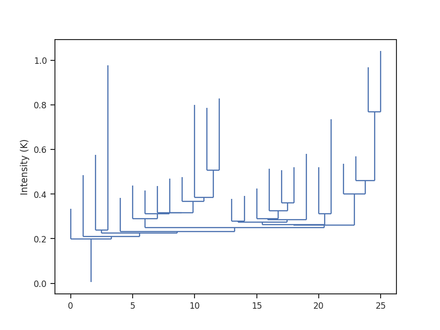
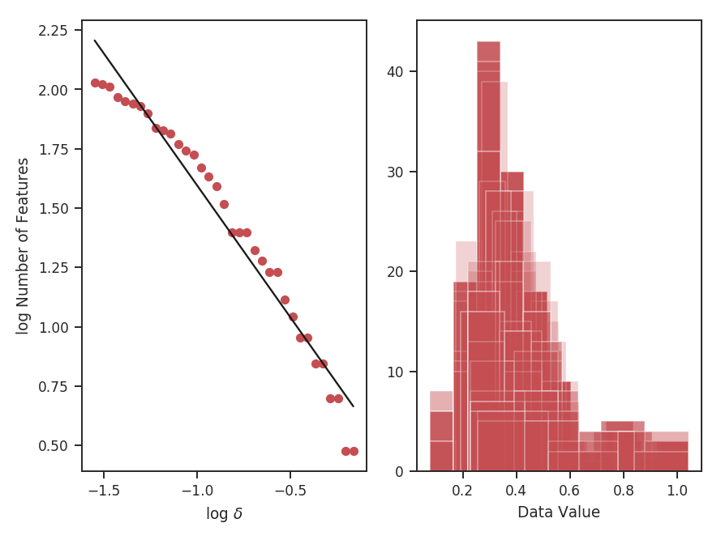

***********
Dendrograms
***********

Overview
--------

In general, dendrograms provide a hierarchical description of datasets, which may be used to identify clusters of similar objects or variables. This is known as `hierarchical clustering <https://en.wikipedia.org/wiki/Hierarchical_clustering>`_. In the case of position-position-velocity (PPV) cubes, a dendrogram is a hierarchical decomposition of the emission in the cube. This decomposition was introduced by `Rosolowsky et al. 2008 <ref-rosolowsky2008>` to calculate the multiscale properties of molecular gas in nearby clouds. The tree structure is comprised of branches and leaves. Branches are the connections, while leaves are the tips of the branches.

`Burkhart et al. 2013 <ref-burkhart2013>` introduced two statistics for comparing the dendrograms of two cubes: the relationship between the number of leaves and branches in the tree versus the minimum branch length, and a histogram comparison of the peak intensity in a branch or leaf. The former statistic shows a power-law like turn-off with increasing branch length.

Using
-----

**The data in this tutorial are available** `here <https://girder.hub.yt/#user/57b31aee7b6f080001528c6d/folder/57e55670a909a80001d301ae>`_.

**Requires the optional astrodendro package to be installed. See documentation ** `here <http://dendrograms.org/>`_

Importing the dendrograms code, along with a few other common packages:

    >>> from turbustat.statistics import Dendro_Statistics
    >>> from astropy.io import fits
    >>> import astropy.units as u
    >>> from astrodendro import Dendrogram
    >>> import matplotlib.pyplot as plt
    >>> import numpy as np

And we load in the data:

    >>> cube = fits.open("Design4_21_0_0_flatrho_0021_13co.fits")[0]  # doctest: +SKIP

Before running the statistics side, we can first compute the dendrogram itself to see what we're dealing with:

    >>> d = Dendrogram.compute(cube, min_value=0.005, min_delta=0.1, min_npix=50, verbose=True)
    >>> ax = plt.subplot(111)
    >>> d.plotter().plot_tree(ax)
    >>> plt.ylabel("Intensity (K)")

We see a number of leaves of varying height throughout the tree. Their minimum height is set by `min_delta`. As we increase this value, the tree becomes *pruned*: more and more structure will be deleted, leaving only the brightest regions on the tree.

**While this tutorial uses a PPV cube, a 2D image may also be used! The same tutorial code can be used for both, likely with changes needed for the choice of `min_delta`.**

The statistics are computed through `~turbustat.statistics.Dendro_Statistics`:

    >>> dend_stat = Dendro_Statistics(cube, min_deltas=np.logspace(-2, 0, 50),
                                      dendro_params={"min_value": 0.005, "min_npix": 50})

I've specified the values that `min_delta` should take. These are completely dependent on the range of intensities within your data cube. I've also specified the minimum number of pixels are region must have (`min_npix`) and the minimum intensity of the data to consider (`min_value`).

To run the statistics, we use `~turbustat.statistics.Dendro_Statistics.run`:

    >>> dend_stat.run(verbose=True)
                                OLS Regression Results
    ==============================================================================
    Dep. Variable:                      y   R-squared:                       0.973
    Model:                            OLS   Adj. R-squared:                  0.971
    Method:                 Least Squares   F-statistic:                     640.6
    Date:                Mon, 03 Oct 2016   Prob (F-statistic):           1.60e-15
    Time:                        17:08:42   Log-Likelihood:                 9.6972
    No. Observations:                  20   AIC:                            -15.39
    Df Residuals:                      18   BIC:                            -13.40
    Df Model:                           1
    Covariance Type:            nonrobust
    ==============================================================================
                     coef    std err          t      P>|t|      [95.0% Conf. Int.]
    ------------------------------------------------------------------------------
    const         -0.5729      0.101     -5.688      0.000        -0.785    -0.361
    x1            -3.7769      0.149    -25.311      0.000        -4.090    -3.463
    ==============================================================================
    Omnibus:                        1.882   Durbin-Watson:                   0.386
    Prob(Omnibus):                  0.390   Jarque-Bera (JB):                1.135
    Skew:                          -0.256   Prob(JB):                        0.567
    Kurtosis:                       1.951   Cond. No.                         6.02
    ==============================================================================

On the left is the relationship between the value of `min_delta` and the number of features in the tree. On the right is a stack of histograms, showing the distribution of peak intensities for all values of `min_delta`. The results of the linear fit are also printed, where `x1` is the slope of the power-law tail.

Computing dendrograms can be time-consuming when working with large datasets. We can avoid recomputing a dendrogram by loading from an HDF5 file:
    >>> dend_stat = Dendro_Statistics.load_dendrogram("design4_dendrogram.hdf5", min_deltas=np.logspace(-2, 0, 50))

Saving the dendrogram structure is explained in the `astrodendro documentation <http://dendrograms.org/>`_. **The saved dendrogram must have `min_delta` set to the minimum of the given `min_deltas`. Otherwise pruning is ineffective.**

If the dendrogram isn't saved (say you have just run it in the same terminal), you may pass the computed dendrogram into `~turbustat.statistics.Dendro_Statistics.run`:
    >>> d = Dendrogram.compute(cube, min_value=0.005, min_delta=0.01, min_npix=50, verbose=True)
    >>> dend_stat = Dendro_Statistics(cube, min_deltas=np.logspace(-2, 0, 50))
    >>> dend_stat.run(verbose=True, dendro_obj=d)

Once the statistics have been run, the results can be saved as a pickle file:
    >>> dend_stat.save_results(output_name="Design4_dendro_statistics.pkl", keep_data=False)

`keep_data=False` will avoid saving the entire cube, and is the default setting.

Saving can also be enabled with `~turbustat.statistics.Dendro_Statistics.run`:
    >>> dend_stat.run(save_results=True, output_name="Design4_dendro_statistics.pkl")

The results may then be reloaded:
    >>> dend_stat = Dendro_Statistics.load_results("Design4_dendro_statistics.pkl")

Note that the dendrogram and data are **NOT** saved, and only the statistic outputs will be accessible.

References
----------

.. _ref-rosolowsky2008:

`Rosolowsky et al. 2008 <https://ui.adsabs.harvard.edu/#abs/2008ApJ...679.1338R/abstract>`_

.. _ref-goodman2009:

`Goodman et al. 2008 <https://ui.adsabs.harvard.edu/#abs/2009Natur.457...63G/abstract>`_

.. _ref-burkhart2013:

`Burkhart et al. 2013 <https://ui.adsabs.harvard.edu/#abs/2013ApJ...770..141B/abstract>`_
