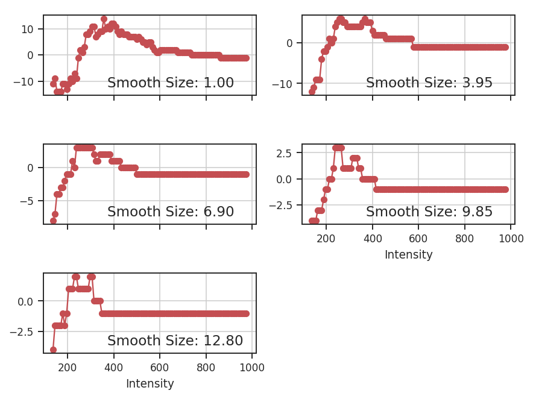
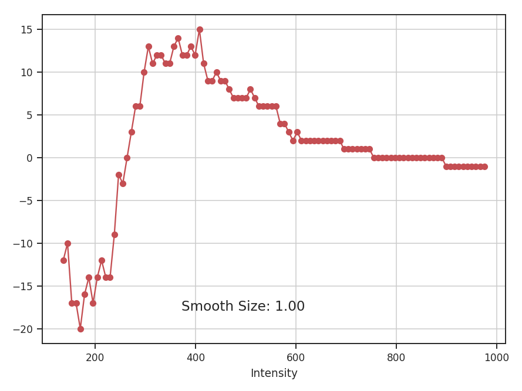
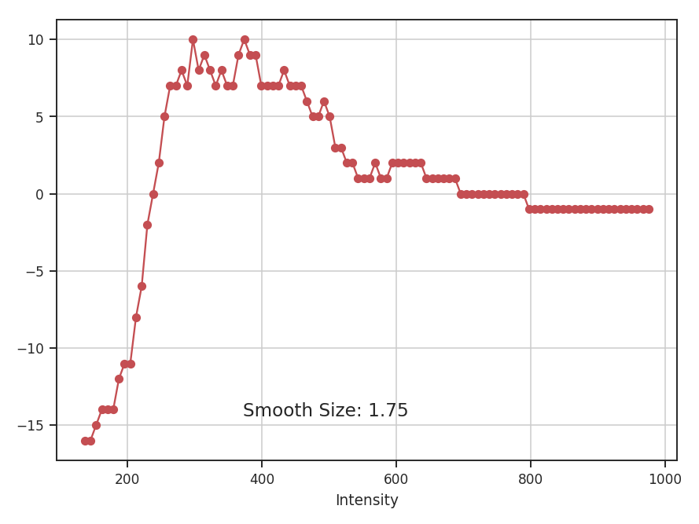

.. _genus_tutorial:

*****
Genus
*****

Overview
--------

Genus statistics provide a measure of a region's topology. At a given value in the data, the Genus value is the number of discrete regions above the value minus the number of regions below it. When this process is repeated over a range of values, a Genus curve can be constructed. The technique has previously been used to study CMB deviations from a Gaussian distribution.

If a region has a negative Genus statistics, it is dominated by holes in the emission ("swiss cheese" morphology). A positive Genus value implies a "meatball" morphology, where the emission is localized into clumps. The Genus curve of a Gaussian field is shown below. Note that at the mean value (0.0), the Genus value is zero: at the mean intensity, there is no preference to either morphological type.

`Kowal et al. 2007 <https://ui.adsabs.harvard.edu/#abs/2007ApJ...658..423K/abstract>`_ constructed Genus curves for a set of simulations to investigate the effect of changing the Mach number and the Alfvenic Mach number. The isocontours were taken for a range of density values in the full position-position-position space. Applications to observations includes `Chepurnov et al. 2008 <https://ui.adsabs.harvard.edu/#abs/2008ApJ...688.1021C/abstract>`_ and `Burkhart et al. 2012 <https://ui.adsabs.harvard.edu/#abs/2012ApJ...749..145B/abstract>`_.

Using
-----

**The data in this tutorial are available** `here <https://girder.hub.yt/#user/57b31aee7b6f080001528c6d/folder/59721a30cc387500017dbe37>`_.

We need to import the `~turbustat.statistics.Genus` code, along with a few other common packages:

    >>> from turbustat.statistics import Genus
    >>> from astropy.io import fits
    >>> import astropy.units as u
    >>> import numpy as np

And we load in the data:

    >>> moment0 = fits.open("Design4_flatrho_0021_00_radmc_moment0.fits")[0]  # doctest: +SKIP

The FITS HDU is passed to initialize `~turbustat.statistics.Genus`:

    >>> genus = Genus(moment0, lowdens_percent=15, highdens_percent=85, numpts=100,
    ...               smoothing_radii=np.linspace(1, moment0.shape[0] / 10., 5))  # doctest: +SKIP

`lowdens_percent` and `highdens_percent` set the upper and lower percentiles in the data to measure the Genus value at. When using observational data, `lowdens_percent` should be set above the noise level. Alternatively, specific values for the low and high cut-offs can be passed using `min_value` and `max_value`, respectively. The `min_value` and `max_value` settings are overridden when `lowdens_percent > min_value` or `highdens_percent < max_value`.

The `numpts` parameter sets how many Genus values to compute between the given percentiles. Finally, `smoothing_radii` allows for the data to be smoothed, minimizing the influence of noise on the Genus curve at the expense of resolution. The values given are used as the radii of a Gaussian smoothing kernel. The values given above (`np.linspace(1, moment0.shape[0] / 10., 5)`) are used by default when no values are given.

Computing the curves is accomplished using `~turbustat.statistics.Genus.run`:

    >>> genus.run(verbose=True, min_size=4)  # doctest: +SKIP

If `min_value` and `max_value` are set instead:

    >>> genus = Genus(moment0, min_value=137, max_value=353, numpts=100)  # doctest: +SKIP
    >>> genus.run(verbose=True, min_size=4)  # doctest: +SKIP

I have set `min_value` and `max_value` to the same percentiles used above and so we get the same result.

The basic sinusoid seen in the Genus curve of the Gaussian field is still evident. As we smooth the data on larger scales, the topological information is lost, and the curve becomes degraded. To avoid spurious noise features, the minimum area a region must have to be considered is set by `min_size`. This is simulated data, so a small value has been chosen.

Often the smallest size that can be "trusted" in a radio image is the beam area. In this example, a FITS HDU was passed, including an associated header. If the beam information is contained in the header, the size threshold can be set to the beam area using `use_beam=True`:

    >>> moment0.header["BMAJ"] = 2e-5  # deg.   # doctest: +SKIP
    >>> genus = Genus(moment0, lowdens_percent=15, highdens_percent=85,
    ...               smoothing_radii=[1] * u.pix)  # doctest: +SKIP
    >>> genus.run(verbose=True, use_beam=True)  # doctest: +SKIP

.. editing note by AG: I couldn't parse the first sentence of this next paragraph, so I edited it to something that makes English sense, but I don't know if it's correct.  It seems right, based on what's going on, but please correct it if there's an error.

The curve has far less detail than in the earlier example because of the new requirement for large, connected regions. Note that the FITS keywords "BMIN" and "BPA" are also read and used when available. More options for reading beam information are available when the optional package `radio_beam <https://github.com/radio-astro-tools/radio_beam>`_ is installed. If the beam information is not contained in the header, or you wish to use any other minimum area, the size can be passed using `min_size`. To get the same result as the last example:

    >>> genus.run(verbose=True, use_beam=True, min_size=2e-5**2 * np.pi * u.deg**2)  # doctest: +SKIP

.. note by AG: The above area is a circle with radius = FWHM of the beam, which must be wrong.  A Gaussian beam would have equivalent area to a top-hat with radius 2 * pi * sigma^2 = 2 * pi * (fwhm/2.35)**2, so the above should be ``min_size=(2e-5/np.sqrt(8*np.log(2)))**2 * 2 * np.pi * u.deg**2``.  This probably warrants correction in the code too.

If a distance is given to `~turbustat.statistics.Genus`, areas and smoothing radii can be passed in physical units:

    >>> genus = Genus(moment0, lowdens_percent=15, highdens_percent=85,
    ...               smoothing_radii=u.Quantity([0.04 * u.pc]), distance=500 * u.pc)  # doctest: +SKIP
    >>> genus.run(verbose=True, min_size=40 * u.AU**2)  # doctest: +SKIP

Note that the smooth size shown in the plots is always the smoothing radius in pixels.

References
----------

`Kowal et al. 2007 <https://ui.adsabs.harvard.edu/#abs/2007ApJ...658..423K/abstract>`_

`Chepurnov et al. 2008 <https://ui.adsabs.harvard.edu/#abs/2008ApJ...688.1021C/abstract>`_

`Burkhart et al. 2012 <https://ui.adsabs.harvard.edu/#abs/2012ApJ...749..145B/abstract>`_
