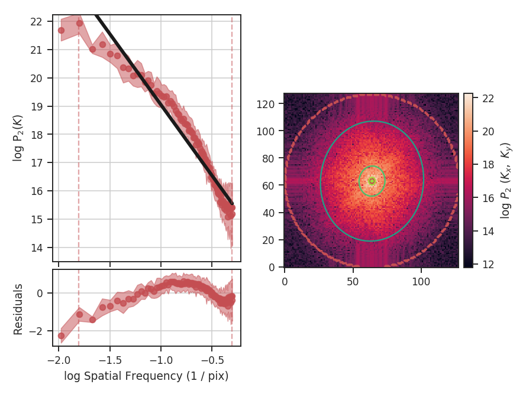

***************************
Modified Velocity Centroids
***************************

Overview
--------

Centroid statistics have been used to study molecular clouds for decades. One of the best known works by :ref:`Miesch & Bally 1994 <ref-miesch_bally1994>` created structure functions of the centroid surfaces from CO data in a number of nearby clouds. The slope of the structure function is one way to measure the size-line width relation of a region. One small scales, however, the contribution from density fluctuations can dominate, and the normalized centroids of the form

.. math::

M_1 = \Sigma_{v} v I(x, v) \delta v / \Sigma_{v} I(x, v)  \delta v = \Sigma_{v} v I(x, v) \delta v / M_0,

where :math:`I(x, v)` is a PPV cube and :math:`M_0` is the integrated intensity, are contaminated on these small scales. These centroids make sense intuitively, however, since this is simply the mean weighted by the intensity. :ref:`Lazarian & Esquivel 2003 <ref-lazarian_esquivel_2003>` proposed Modified Velocity Centroids (MVC) as a technique to remove the small scale density contamination. This involves an unnormalized centroid

.. math::

\Sigma_{v} v I(x, v) \delta v.

The structure function of the modified velocity centroid is then the squared difference of the unnormalized centroid with the squared difference of :math:`M_0` times the velocity dispersion (:math:`<v^2>`) subtracted to remove the density contribution. This is both easier to express and compute in the Fourier domain, which yields a two-dimensional power spectrum:

.. math::

P_2(k) = |\mathcal{M}_0\mathcal{M}_1|^2 - <M_2>_{x}|\mathcal{M}_0|^2,

where :math:`\mathcal{M}_i` denotes the Fourier transform of the ith moment.

Using
-----

We need to import the `~turbustat.statistics.MVC` code, along with a few other common packages:

    >>> from turbustat.statistics import MVC
    >>> from astropy.io import fits

Most statistics in TurbuStat require only a single data input. MVC requires *3*, as you can see in the last equation. The zeroth (integrated intensity), first (centroid), and second (velocity dispersion) moments of the data cube are needed:

    >>> moment0 = fits.open("Design4_21_0_0_flatrho_0021_13co.moment0.fits")[0]  # doctest: +SKIP
    >>> moment1 = fits.open("Design4_21_0_0_flatrho_0021_13co.centroid.fits")[0]  # doctest: +SKIP
    >>> lwidth = fits.open("Design4_21_0_0_flatrho_0021_13co.linewidth.fits")[0]  # doctest: +SKIP

The unnormalized centroid can be recovered by multiplying the normal centroid value by the zeroth moment. The line width array here is the square root of the velocity dispersion. These three arrays must be passed to `~turbustat.statistics.MVC`:

    >>> mvc = MVC(moment1, moment0, lwidth)  # doctest: +SKIP
                               OLS Regression Results
    ==============================================================================
    Dep. Variable:                      y   R-squared:                       0.967
    Model:                            OLS   Adj. R-squared:                  0.966
    Method:                 Least Squares   F-statistic:                     1504.
    Date:                Wed, 05 Oct 2016   Prob (F-statistic):           4.69e-40
    Time:                        17:12:36   Log-Likelihood:                 2.3737
    No. Observations:                  54   AIC:                           -0.7474
    Df Residuals:                      52   BIC:                             3.231
    Df Model:                           1
    Covariance Type:            nonrobust
    ==============================================================================
                     coef    std err          t      P>|t|      [95.0% Conf. Int.]
    ------------------------------------------------------------------------------
    const          2.5007      0.085     29.534      0.000         2.331     2.671
    x1            -3.1349      0.081    -38.784      0.000        -3.297    -2.973
    ==============================================================================
    Omnibus:                        4.847   Durbin-Watson:                   1.042
    Prob(Omnibus):                  0.089   Jarque-Bera (JB):                4.076
    Skew:                           0.664   Prob(JB):                        0.130
    Kurtosis:                       3.224   Cond. No.                         5.08
    ==============================================================================

The header is read in from `moment1` to convert into angular scales. Alternatively, a different header can be given with the `header` keyword.

Calculating the power spectrum, radially averaging, and fitting a power-law are accomplished through the `~turbustat.statistics.MVC.run` command:

    >>> mvc.run(verbose=True, ang_units=True, unit=u.arcsec)  # doctest: +SKIP

Note that `ang_units=True` requires a header to be given. The angular units the power-spectrum is shown in is set by `units`.

Many of the techniques in TurbuStat are derived from two-dimensional power spectra. Because of this, the radial averaging and fitting code for these techniques are contained within a common base class, `~turbustat.statistics.base_pspec2.StatisticBase_PSpec2D`. Fitting options may be passed as keyword arguments to `~turbustat.statistics.MVC.run`. Alterations to the power-spectrum binning can be passed in `~turbustat.statistics.MVC.compute_radial_pspec`, after which the fitting routine (`~turbustat.statistics.MVC.fit_pspec`) may be run.

References
----------

.. _ref-miesch_bally1994::

`Miesch & Bally 1994 <https://ui.adsabs.harvard.edu/#abs/1994ApJ...429..645M/abstract>`_

.. _ref-lazarian_esquivel_2003::

`Lazarian & Esquivel 2003 <https://ui.adsabs.harvard.edu/#abs/2003ApJ...592L..37L/abstract>`_
