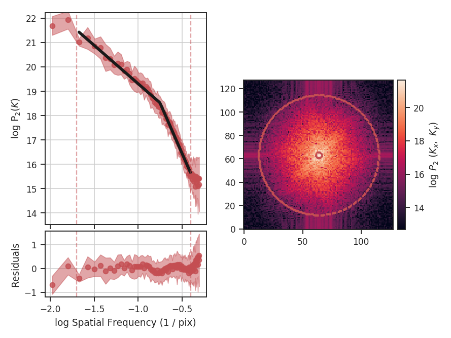
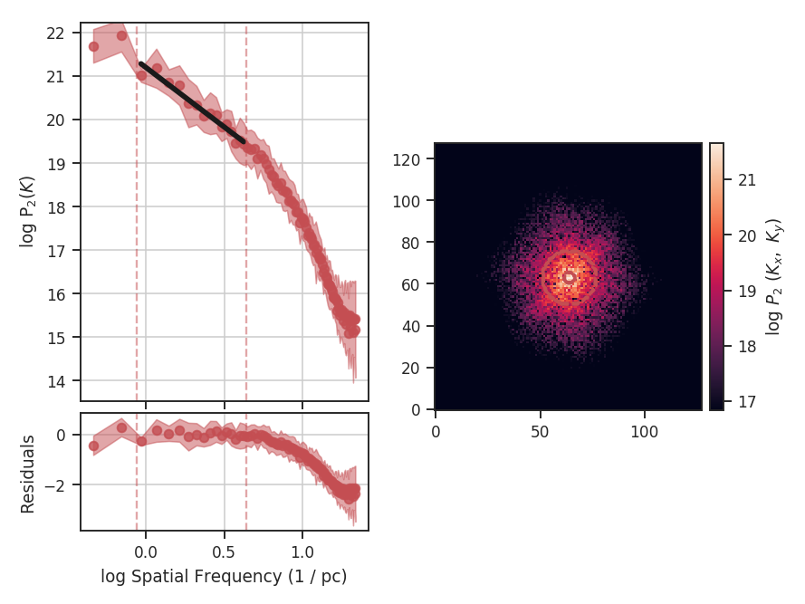
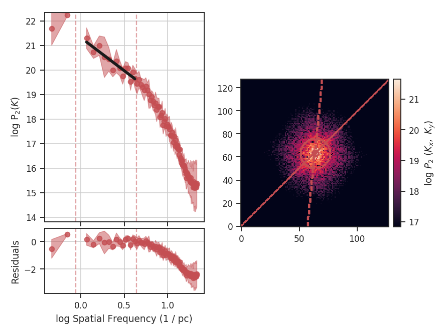

.. _mvc_tutorial:

***************************
Modified Velocity Centroids
***************************

Overview
--------

Centroid statistics have been used to study molecular clouds for decades. For example, `Miesch & Bally 1994 <https://ui.adsabs.harvard.edu/#abs/1994ApJ...429..645M/abstract>`_ created structure functions of the centroid surfaces from CO data in a number of nearby clouds. The slope of the structure function is one way to measure the size-line width relation of a region. The normalized centroids take the form

.. edit comment by AG: including the `\delta v`'s in the equation below is strange since these are strict sums; the delta-v should only be included if these are integrals, right?

.. math::
    M_1 = \frac{\Sigma_{v}\, v \,I(x, v)}{\Sigma_{v}\, I(x, v)} = \frac{\Sigma_{v}\, v\, I(x, v)}{M_0},

where :math:`I(x, v)` is a PPV cube with :math:`x` representing the spatial coordinate, :math:`v` the velocity coordinate, and :math:`M_0` the integrated intensity (moment zero).   On small scales, however, the contribution from density fluctuations can dominate, and the first moment is contaminated on these small scales. These centroids make sense intuitively, however, since this is simply the mean weighted by the intensity. `Lazarian & Esquivel 2003 <https://ui.adsabs.harvard.edu/#abs/2003ApJ...592L..37L/abstract>`_ proposed Modified Velocity Centroids (MVC) as a technique to remove the small scale density contamination. This involves an unnormalized centroid

.. math::
    \Sigma_{v}\, v I(x, v)

.. consider writing out the text below in math?

The structure function of the modified velocity centroid is then the squared difference of the unnormalized centroid with the squared difference of :math:`M_0` times the velocity dispersion (:math:`<v^2>`) subtracted to remove the density contribution. This is both easier to express and compute in the Fourier domain, which yields a two-dimensional power spectrum:

.. math::
    P_2(k) = |\mathcal{M}_0\,\mathcal{M}_1|^2 - <M_2>_{x}\,|\mathcal{M}_0|^2,

where :math:`\mathcal{M}_i` denotes the Fourier transform of the ith moment. MVC is also explored in `Esquivel & Lazarian 2005 <https://ui.adsabs.harvard.edu/#abs/2005ApJ...631..320E/abstract>`_.

Using
-----

**The data in this tutorial are available** `here <https://girder.hub.yt/#user/57b31aee7b6f080001528c6d/folder/59721a30cc387500017dbe37>`_.

We need to import the `~turbustat.statistics.MVC` code, along with a few other common packages:

    >>> from turbustat.statistics import MVC
    >>> from astropy.io import fits

Most statistics in TurbuStat require only a single data input. MVC requires *3*, as you can see in the last equation. The zeroth (integrated intensity), first (centroid), and second (velocity dispersion) moments of the data cube are needed:

    >>> moment0 = fits.open("Design4_flatrho_0021_00_radmc_moment0.fits")[0]  # doctest: +SKIP
    >>> moment1 = fits.open("Design4_flatrho_0021_00_radmc_centroid.fits")[0]  # doctest: +SKIP
    >>> lwidth = fits.open("Design4_flatrho_0021_00_radmc_linewidth.fits")[0]  # doctest: +SKIP

The unnormalized centroid can be recovered by multiplying the normal centroid value by the zeroth moment. The line width array here is the square root of the velocity dispersion. These three arrays must be passed to `~turbustat.statistics.MVC`:

    >>> mvc = MVC(moment1, moment0, lwidth)  # doctest: +SKIP

The header is read in from `moment1` to convert into angular scales. Alternatively, a different header can be given with the `header` keyword.

Calculating the power spectrum, radially averaging, and fitting a power-law are accomplished through the `~turbustat.statistics.MVC.run` command:

    >>> mvc.run(verbose=True, xunit=u.pix**-1)  # doctest: +SKIP
                                OLS Regression Results
    ==============================================================================
    Dep. Variable:                      y   R-squared:                       0.941
    Model:                            OLS   Adj. R-squared:                  0.941
    Method:                 Least Squares   F-statistic:                     1425.
    Date:                Mon, 10 Jul 2017   Prob (F-statistic):           1.46e-56
    Time:                        16:34:01   Log-Likelihood:                -52.840
    No. Observations:                  91   AIC:                             109.7
    Df Residuals:                      89   BIC:                             114.7
    Df Model:                           1
    Covariance Type:            nonrobust
    ==============================================================================
                     coef    std err          t      P>|t|      [0.025      0.975]
    ------------------------------------------------------------------------------
    const         14.0317      0.103    136.541      0.000      13.827      14.236
    x1            -5.0142      0.133    -37.755      0.000      -5.278      -4.750
    ==============================================================================
    Omnibus:                        3.535   Durbin-Watson:                   0.129
    Prob(Omnibus):                  0.171   Jarque-Bera (JB):                3.484
    Skew:                          -0.468   Prob(JB):                        0.175
    Kurtosis:                       2.796   Cond. No.                         4.40
    ==============================================================================

.. image:: images/mvc_design4.png

The code returns a summary of the one-dimensional fit and a figure showing the one-dimensional spectrum and model on the left, and the two-dimensional power-spectrum on the right. If `fit_2D=True` is set in `~turbustat.statistics.MVC.run` (the default setting), the contours on the two-dimensional power-spectrum are the fit using an elliptical power-law model. We will discuss the models in more detail below. The dashed red lines (or contours) on both plots are the limits of the data used in the fits. See the :ref:`PowerSpectrum tutorial <pspec_tutorial>` for a discussion of the two-dimensional fitting.

The fit here is not very good since the spectrum deviates from a single power-law on small scales. In this case, the deviation is caused by the :ref:`limited inertial range in the simulation <data_for_tutorial>` from which this spectral-line data cube was created. We can specify `low_cut` and `high_cut` in frequency units to limit the fitting to the inertial range:

    >>> mvc.run(verbose=True, xunit=u.pix**-1, low_cut=0.02 / u.pix, high_cut=0.1 / u.pix)  # doctest: +SKIP
                                OLS Regression Results
    ==============================================================================
    Dep. Variable:                      y   R-squared:                       0.952
    Model:                            OLS   Adj. R-squared:                  0.948
    Method:                 Least Squares   F-statistic:                     255.9
    Date:                Mon, 10 Jul 2017   Prob (F-statistic):           6.22e-10
    Time:                        16:34:01   Log-Likelihood:                 10.465
    No. Observations:                  15   AIC:                            -16.93
    Df Residuals:                      13   BIC:                            -15.51
    Df Model:                           1
    Covariance Type:            nonrobust
    ==============================================================================
                     coef    std err          t      P>|t|      [0.025      0.975]
    ------------------------------------------------------------------------------
    const         16.7121      0.220     75.957      0.000      16.237      17.187
    x1            -2.7357      0.171    -15.997      0.000      -3.105      -2.366
    ==============================================================================
    Omnibus:                        0.814   Durbin-Watson:                   2.077
    Prob(Omnibus):                  0.666   Jarque-Bera (JB):                0.614
    Skew:                          -0.445   Prob(JB):                        0.736
    Kurtosis:                       2.564   Cond. No.                         13.5
    ==============================================================================

Note the drastic change in the slope! Specifying the correct fit region for the data you are using is critical for interpreting the results of the method. This example has used the default ordinary least-squares fitting. A weighted least-squares can be enabled with `weighted_fit=True` (this cannot be used for the segmented model described below).

Breaks in the power-law behaviour in observations (and higher-resolution simulations) can result from differences in the physical processes dominating at those scales. To capture this behaviour, `MVC` can be passed a break point to enable fitting with a segmented linear model (`~turbustat.statistics.Lm_Seg`). Note that the 2D fitting is disabled for this section as it does not handle fitting break points. From the above plot, we can estimate the break point to be near `0.1 / u.pix`:

    >>> mvc.run(verbose=True, xunit=u.pix**-1, low_cut=0.02 / u.pix,
    ...         high_cut=0.4 / u.pix,
    ...         fit_kwargs=dict(brk=0.1 / u.pix), fit_2D=False)  # doctest: +SKIP
                                OLS Regression Results
    ==============================================================================
    Dep. Variable:                      y   R-squared:                       0.994
    Model:                            OLS   Adj. R-squared:                  0.994
    Method:                 Least Squares   F-statistic:                     4023.
    Date:                Mon, 10 Jul 2017   Prob (F-statistic):           1.50e-75
    Time:                        16:41:34   Log-Likelihood:                 53.269
    No. Observations:                  71   AIC:                            -98.54
    Df Residuals:                      67   BIC:                            -89.49
    Df Model:                           3
    Covariance Type:            nonrobust
    ==============================================================================
                     coef    std err          t      P>|t|      [0.025      0.975]
    ------------------------------------------------------------------------------
    const         16.1749      0.094    172.949      0.000      15.988      16.362
    x1            -3.1436      0.085    -36.870      0.000      -3.314      -2.973
    x2            -5.0895      0.205    -24.855      0.000      -5.498      -4.681
    x3            -0.0020      0.054     -0.037      0.970      -0.110       0.106
    ==============================================================================
    Omnibus:                        9.161   Durbin-Watson:                   1.074
    Prob(Omnibus):                  0.010   Jarque-Bera (JB):                8.815
    Skew:                          -0.747   Prob(JB):                       0.0122
    Kurtosis:                       3.865   Cond. No.                         21.5
    ==============================================================================

`brk` is the initial guess at where the break point is. Here I've set it to near the extent of the inertial range of the simulation. `log_break` should be enabled if the given `brk` is already the log (base-10) value (since the fitting is done in log-space). The segmented linear model iteratively optimizes the location of the break point, trying to minimize the gap between the different components. This is the `x3` parameter above. The slopes of the components are `x1` and `x2`, but the second slope is defined *relative to the first slope* (i.e., if `x2=0`, the slopes of the components would be the same). The true slopes can be accessed through `mvc.slope` and `mvc.slope_err`. The location of the fitted break point is given by `mvc.brk`, and its uncertainty `mvc.brk_err`. If the fit does not find a good break point, it will revert to a linear fit without the break.

Many of the techniques in TurbuStat are derived from two-dimensional power spectra. Because of this, the radial averaging and fitting code for these techniques are contained within a common base class, `~turbustat.statistics.base_pspec2.StatisticBase_PSpec2D`. Fitting options may be passed as keyword arguments to `~turbustat.statistics.MVC.run`. Alterations to the power-spectrum binning can be passed in `~turbustat.statistics.MVC.compute_radial_pspec`, after which the fitting routine (`~turbustat.statistics.MVC.fit_pspec`) may be run.

The frequency units of the final plot (`xunit`) and the units of `low_cut` and `high_cut` can be given in angular units, as well as physical units when a distance is given. For example:

    >>> mvc = MVC(centroid, moment0, lwidth, distance=250 * u.pc)  # doctest: +SKIP
    >>> mvc.run(verbose=True, xunit=u.pc**-1, low_cut=0.02 / u.pix,
    ...         high_cut=0.1 / u.pix, fit_2D=False)  # doctest: +SKIP
                                OLS Regression Results
    ==============================================================================
    Dep. Variable:                      y   R-squared:                       0.952
    Model:                            OLS   Adj. R-squared:                  0.948
    Method:                 Least Squares   F-statistic:                     255.9
    Date:                Sun, 16 Jul 2017   Prob (F-statistic):           6.22e-10
    Time:                        14:18:45   Log-Likelihood:                 10.465
    No. Observations:                  15   AIC:                            -16.93
    Df Residuals:                      13   BIC:                            -15.51
    Df Model:                           1
    Covariance Type:            nonrobust
    ==============================================================================
                     coef    std err          t      P>|t|      [0.025      0.975]
    ------------------------------------------------------------------------------
    const         16.7121      0.220     75.957      0.000      16.237      17.187
    x1            -2.7357      0.171    -15.997      0.000      -3.105      -2.366
    ==============================================================================
    Omnibus:                        0.814   Durbin-Watson:                   2.077
    Prob(Omnibus):                  0.666   Jarque-Bera (JB):                0.614
    Skew:                          -0.445   Prob(JB):                        0.736
    Kurtosis:                       2.564   Cond. No.                         13.5
    ==============================================================================

Alternatively, the fitting limits could be passed in units of `u.pc**-1`.

Constraints on the azimuthal angles used to compute the one-dimensional power-spectrum can also be given:

    >>> mvc = MVC(centroid, moment0, lwidth, distance=250 * u.pc)  # doctest: +SKIP
    >>> mvc.run(verbose=True, xunit=u.pc**-1, low_cut=0.02 / u.pix, high_cut=0.1 / u.pix,
    ...         fit_2D=False,
    ...         radial_pspec_kwargs={"theta_0": 1.13 * u.rad, "delta_theta": 40 * u.deg})  # doctest: +SKIP
                                OLS Regression Results
    ==============================================================================
    Dep. Variable:                      y   R-squared:                       0.806
    Model:                            OLS   Adj. R-squared:                  0.791
    Method:                 Least Squares   F-statistic:                     53.85
    Date:                Fri, 29 Sep 2017   Prob (F-statistic):           5.68e-06
    Time:                        14:51:27   Log-Likelihood:                 1.4445
    No. Observations:                  15   AIC:                             1.111
    Df Residuals:                      13   BIC:                             2.527
    Df Model:                           1
    Covariance Type:            nonrobust
    ==============================================================================
                     coef    std err          t      P>|t|      [0.025      0.975]
    ------------------------------------------------------------------------------
    const         17.3709      0.401     43.271      0.000      16.504      18.238
    x1            -2.2897      0.312     -7.338      0.000      -2.964      -1.616
    ==============================================================================
    Omnibus:                        1.198   Durbin-Watson:                   2.743
    Prob(Omnibus):                  0.549   Jarque-Bera (JB):                0.809
    Skew:                          -0.185   Prob(JB):                        0.667
    Kurtosis:                       1.924   Cond. No.                         13.5
    ==============================================================================

The azimuthal limits now appear as contours on the two-dimensional power-spectrum in the figure. See the :ref:`PowerSpectrum tutorial <pspec_tutorial>` for more information on giving azimuthal constraints.

If strong emission continues to the edge of the map (and the map does not have periodic boundaries), ringing in the FFT can introduce a cross pattern in the 2D power-spectrum. This effect and the use of apodizing kernels to taper the data is covered :ref:`here <apodkerns>`.

Most observational data will be smoothed over the beam size, which will steepen the power spectrum on small scales.  To account for this, the 2D power spectrum can be divided by the beam response. This is demonstrated :ref:`here <correcting_for_beam>` for spatial power-spectra.

References
----------

`Miesch & Bally 1994 <https://ui.adsabs.harvard.edu/#abs/1994ApJ...429..645M/abstract>`_

`Lazarian & Esquivel 2003 <https://ui.adsabs.harvard.edu/#abs/2003ApJ...592L..37L/abstract>`_

`Esquivel & Lazarian 2005 <https://ui.adsabs.harvard.edu/#abs/2005ApJ...631..320E/abstract>`_
