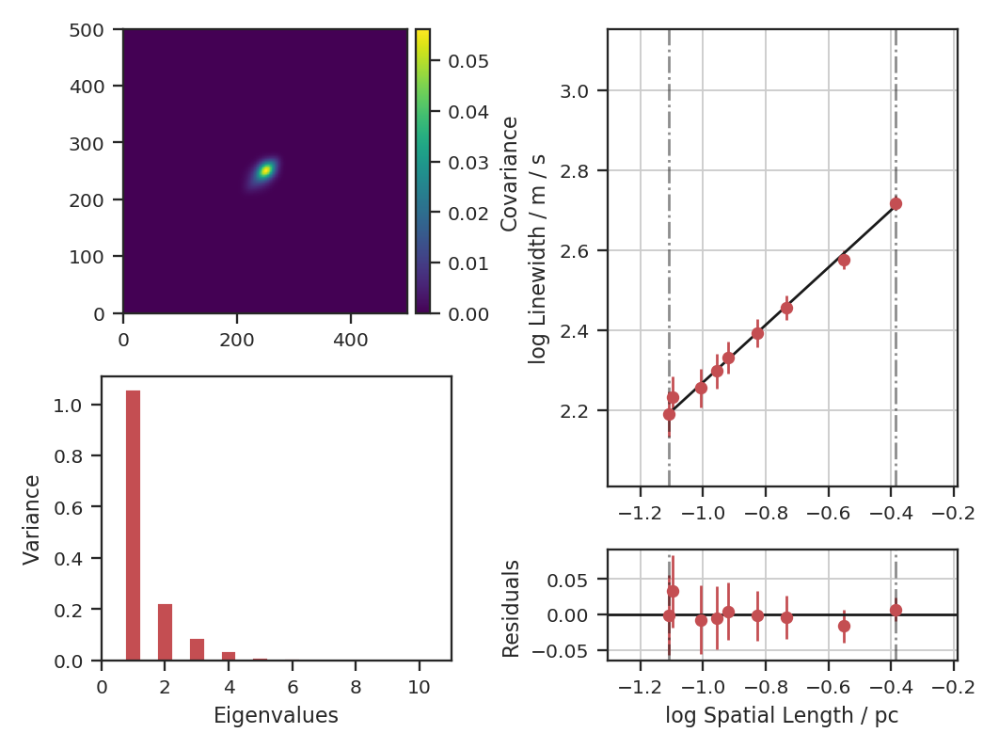
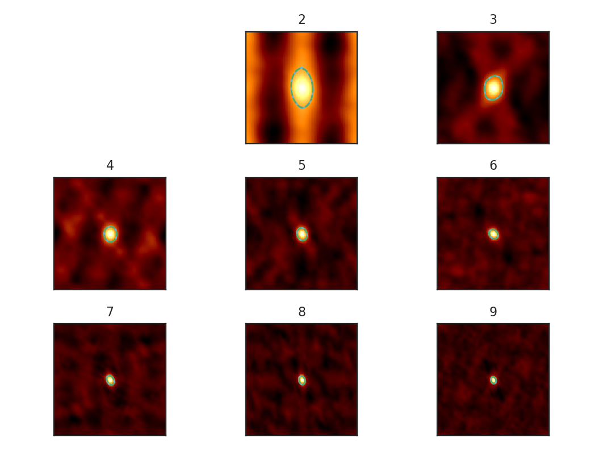
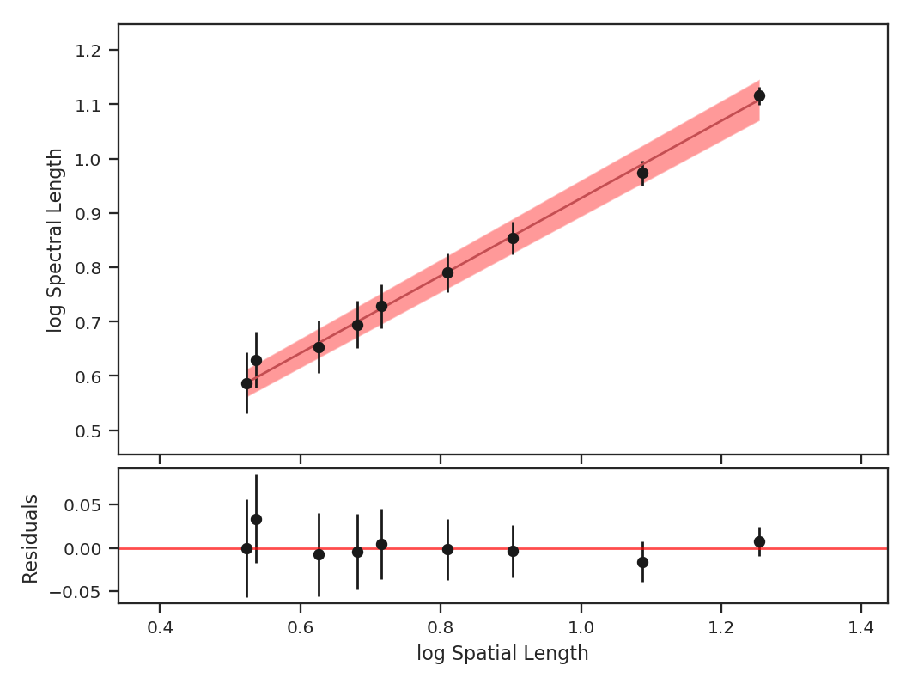
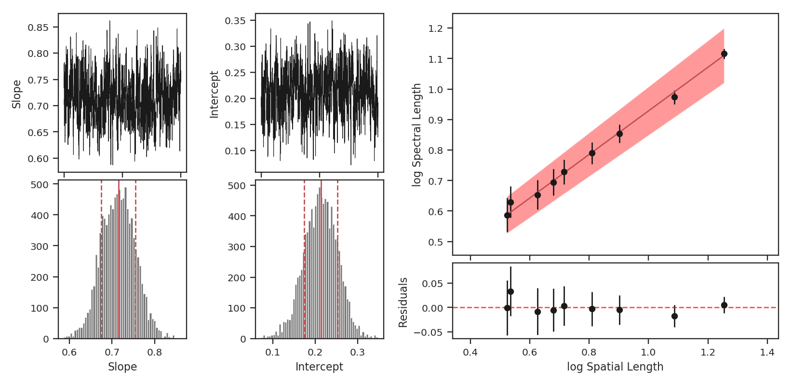

.. _pca_tutorial:

***
PCA
***

Overview
--------

Principal Component Analysis (PCA) is primarily a dimensionality reduction technique. Generally the data are arranged into a set of columns (representing dimensions or variables) and the set of samples is contained within each row. A covariance matrix is then constructed between each pair of columns. Performing an eigenvalue decomposition of this matrix gives an orthogonal basis for the data, the components of which are the principal components (eigenvectors). The associated eigenvalues correspond to the variance in the data described by each principal component.

By ordering the principal components from the largest to smallest eigenvalue, a minimal set of eigenvectors can be found that account for a large portion of the variance within the data. These first N principal components have a (usually) much reduced dimensionality, while still containing the majority of the structure in the data. The `PCA Wikipedia <https://en.wikipedia.org/wiki/Principal_component_analysis>`_ page has a much more thorough explanation.

The use of PCA on spectral-line data cubes was introduced by `Heyer & Schloerb 1997 <https://ui.adsabs.harvard.edu/#abs/1997ApJ...475..173H/abstract>`_, and thoroughly extended in a number of other papers (e.g., `Brunt & Heyer 2002a <https://ui.adsabs.harvard.edu/#abs/2002ApJ...566..276B/abstract>`_, `Brunt & Heyer 2002b <https://ui.adsabs.harvard.edu/#abs/2002ApJ...566..289B/abstract>`_, `Roman-Duval et al. 2011 <https://ui.adsabs.harvard.edu/#abs/2011ApJ...740..120R/abstract>`_). An analytical derivation is given in `Brunt & Heyer 2013 <https://ui.adsabs.harvard.edu/#abs/2013MNRAS.433..117B/abstract>`_. Briefly, they use the PCA decomposition to measure the associated spectral and spatial width scales associated with each principal component. An eigenvalue can be multiplied by each spectral channel to produce an eigenimage. The autocorrelation function of that eigenimage gives an estimate of the spatial scale of that principal component. The autocorrelation of the eigenvector itself gives an associated spectral width. Using the spatial and spectral widths from the first N principal components give an estimate of the size-line width relation.

Using
-----

**The data in this tutorial are available** `here <https://girder.hub.yt/#user/57b31aee7b6f080001528c6d/folder/59721a30cc387500017dbe37>`_.

We need to import the PCA code, along with a few other common packages:

    >>> from turbustat.statistics import PCA
    >>> from astropy.io import fits
    >>> import astropy.units as u
    >>> import matplotlib.pyplot as plt

And we load in the data:

    >>> cube = fits.open("Design4_flatrho_0021_00_radmc.fits")[0]  # doctest: +SKIP

The `~turbustat.statistics.PCA` class is first initialized, and the distance to the region (if desired) can be given:

    >>> pca = PCA(cube, distance=250. * u.pc)  # doctest: +SKIP

If the distance is given, you will have the option to convert spatial widths to physical units. *Note that we're using simulated data and the distance of 250 pc has no special meaning in this case.* If no distance is provided, conversions to the physical units will return an error.

The simplest way to run the entire process is using the `~turbustat.statistics.PCA.run` command:

    >>> pca.run(verbose=True, min_eigval=1e-4, spatial_output_unit=u.pc,
    ...         spectral_output_unit=u.m / u.s, brunt_beamcorrect=False)  # doctest: +SKIP
    Proportion of Variance kept: 0.9996934513444623
    Index: 0.72 (0.70, 0.73)
    Gamma: 0.90 (0.55, 1.26)
    Sonic length: 4.419e+00 (3.306e+00, 5.532e+00) pix at 10.0 K

Note that we have specified the output units for the spectral and spatial units. By default, these would be kept in pixel units.
The key properties are shown when `verbose=True`: a summary of the results with a plot of the covariance matrix (top left), the variance described by the principal components (bottom left) and the size-line width relation (right). The proportion of variance is the variance contained in the N eigenvalues kept. In this case, we consider all eigenvalues with values above 1e-4 to be important. In observational data, `min_eigval` should be set to the variance of the noise (square of the rms uncertainty).  Typically, only the first :math:`\sim10` eigenvalues contain signal in observational data.

In the output above `index` is the slope of the size-line width relation, and `gamma` is the the slope with a correction factor applied (see `~turbustat.statistics.PCA.gamma`). The sonic length is derived from the intercept of the size-line width relation using a default temperature of 10 K (see below on how to change this).

Since these data are simulated, this example does not account for a finite beam size. If it did, however, we would want to deconvolve the spatial widths with the beam. To see this effect, let us assume these data have a 20" circular beam:

    >>> pca.run(verbose=True, min_eigval=1e-4, spatial_output_unit=u.pc,
    ...         spectral_output_unit=u.m / u.s, brunt_beamcorrect=True,
    ...         beam_fwhm=10 * u.arcsec)  # doctest: +SKIP
    Proportion of Variance kept: 0.9996934513444623
    Index: 0.71 (0.70, 0.73)
    Gamma: 0.89 (0.54, 1.25)
    Sonic length: 4.394e+00 (3.284e+00, 5.505e+00) pix at 10.0 K

Since the correction is not linear, the slope changes with the beam correction. If the header of the data has the beam information defined, it will be automatically read in and `beam_fwhm` will not have to be given.

Both of the PCA runs above do *not* subtract the mean of the data before creating the covariance matrix. Technically, this is not how PCA is defined (see Overview above) and the decomposition is not performed on a true covariance matrix. The justification used in `Brunt & Heyer 2002a <https://ui.adsabs.harvard.edu/#abs/2002ApJ...566..276B/abstract>`_ and `Brunt & Heyer 2002b <https://ui.adsabs.harvard.edu/#abs/2002ApJ...566..289B/abstract>`_ is that the mean has a physical meaning in this case: it's the largest spatial scale across the map. If we *do* subtract the mean, how does this affect the index?

    >>> pca.run(verbose=True, min_eigval=1e-4, spatial_output_unit=u.pc,
    ...         spectral_output_unit=u.m / u.s, brunt_beamcorrect=True,
    ...         beam_fwhm=10 * u.arcsec, mean_sub=True)  # doctest: +SKIP
    Proportion of Variance kept: 0.9998085325029037
    Index: 0.86 (0.83, 0.89)
    Gamma: 1.12 (0.72, 1.53)
    Sonic length: 3.947e+00 (3.107e+00, 4.787e+00) pix at 10.0 K

The plot shows how the structure of the covariance matrix has changed. There remains a central peak, though it is smaller, and the positive structure around it is more elongated. The bar plot shows that the relative values of the eigenvalues have changed significantly; this intuitively makes sense as the covariance structure was changed. The index measured is significantly higher than the `0.71` measured above. If we compare the points on the size-line width relation, we see that the steeper relation results from the spectral width remaining the same as in the the non-mean subtracted case, while the spatial size is decreased.

The default setting is to *not* subtract the mean in order to best reproduce the established Brunt & Heyer formalism. This comparison is included to demonstrate its effect and to highlight that, in not subtracting the mean, some of the assumptions used in PCA are violated. See the `PCA Wikipedia <https://en.wikipedia.org/wiki/Principal_component_analysis>`_ page for more information.

The `~turbustat.statistics.PCA.run` command has several steps hidden within it. To demonstrate the whole process, the individual steps are broken down below. There are 4 major steps: decomposition, spatial fitting, spectral fitting, and fitting of the size-line width relation.

First, the eigenvalue decomposition is performed using `~turbustat.statistics.PCA.compute_pca`:

    >>> pca.compute_pca(mean_sub=False, n_eigs='auto', min_eigval=1e-4, eigen_cut_method='value')  # doctest: +SKIP
    >>> pca.n_eigs  # doctest: +SKIP
    10

`mean_sub` controls whether to subtract the channel means when calculating the covariance matrix. Formally, this is implied when calculating any covariance matrix, but is not done in the Brunt & Heyer works (see above). `n_eigs` sets the number of important principal components (which will be used to fit the size-line width relation). This can be an integer, or the code will determine the number of important components based off of a threshold given in `min_eigval`. When `eigen_cut_method='value'`, `min_eigval` is the smallest eigenvalue to consider important. Since the variance is related to the level of variance due to noise in the data, it is practical to set this to a few times the noise variance. When `eigen_cut_method='proportion'`, `min_eigval` now corresponds to the total proportion of variance that is considered important:

    >>> pca.compute_pca(mean_sub=False, n_eigs='auto', min_eigval=0.99, eigen_cut_method='proportion')  # doctest: +SKIP
    >>> pca.n_eigs  # doctest: +SKIP
    4

This will keep the number of components that describe 99% of the variance in the data. The percentage of variance described by a principal component is its eigenvalue divided by the sum of all eigenvalues (the total variance in the data). All other components beyond these levels are due to irreducible noise. These noise components can be thought of as an N-dimensional sphere, where it becomes impossible to diminish the remaining variance as there is no preferred direction.

The eigenvalues of the important components can be generated with:

    >>> pca.eigvals  # doctest: +SKIP

This will return the full set of eigenvalues as a two-dimensional array with a shape equal to the number of spectral channels in the data. To only return the important eigenvalues, use:

    >>> pca.eigvals[:, :pca.n_eigs]  # doctest: +SKIP

Eigenimages have the same shape as the spatial dimensions of the data. To save memory, eigenimages are not cached and are calculated from the data and set of eigenvalues:

    >>> eigimgs = pca.eigimages()  # doctest: +SKIP

`eigimgs` is a three-dimensional array, with two spatial axes and the third the number of eigenimages requested. By default, the number of eigenimages returned is equal to `pca.n_eigs`. To instead return the first `n` eigenimages:

    >>> n = 40
    >>> eigimgs = pca.eigimages(n)  # doctest: +SKIP

The second step is to calculate the spatial size scales from the autocorrelation of the eigenimages (reverting back to the PCs from `eigen_cut_method='value'`):

    >>> pca.compute_pca(mean_sub=False, n_eigs='auto', min_eigval=1e-4,
    ...                 eigen_cut_method='value')  # doctest: +SKIP
    >>> pca.find_spatial_widths(method='contour', beam_fwhm=10 * u.arcsec,
    ...                         brunt_beamcorrect=True, diagnosticplots=True)  # doctest: +SKIP

This will find the spatial widths by fitting an ellipse to the 1/e contour about the peak in the autocorrelation image, following the fitting technique described by Brunt & Heyer. The first 9 autocorrelation images are shown in the above image, where the cyan contours are the true 1/e contour, and the green dashed line is the elliptical fit. Note that the first autocorrelation image is not shown. This is because the fitting routine failed; if the 1/e level is not reached in the data, there is no contour to fit to. This means that the largest spatial scale in the data (which critically depends on the mean) is *larger* than the spatial size of the data. For a periodic-box simulation, which this example data is produced from, it is not surprising that this has occurred. **Note: If this issue is encountered in observational data (or anything without periodic boundaries), try padding the data cube in the spatial directions with zeros to simulate a larger map size.**

`method` may also be set to `fit` to fit a 2D Gaussian to the peak, `interpolate` which estimates the 1/e from the peak using a fine grid about the peak region, and `xinterpolate` which first fits a 2D Gaussian to better determine the fine grid to use in interpolation. The default method is `contour`.

When beam correction is applied (`brunt_beamcorrect`), the angular FWHM of the beam is needed. This is to deconvolve the spatial widths with the beam size. Note that all spatial scales that cannot be deconvolved from the beam will be set to `NaN`. If the `BMAJ` keyword is set in the FITS header in `cube`, this will be read automatically (also if the `radio_beam <https://github.com/radio-astro-tools/radio_beam>`_ package is installed, a few other keywords will be recognized). Otherwise, this must be specified in `beam_fwhm`. If the data do not have a beam size, `brunt_beamcorrect=False` will need to be specified in `~turbustat.statistics.PCA.find_spatial_widths` and `~turbustat.statistics.PCA.run`.

Third, we find the spectral widths:

    >>> pca.find_spectral_widths(method='walk-down')  # doctest: +SKIP
    >>> autocorr_spec = pca.autocorr_spec()  # doctest: +SKIP
    >>> x = np.fft.rfftfreq(500) * 500  # doctest: +SKIP
    >>> fig, axes = plt.subplots(3, 3, sharex=True, sharey=True)  # doctest: +SKIP
    >>> for i, ax in zip(range(9), axes.ravel()):  # doctest: +SKIP
    >>>     ax.plot(x, autocorr_spec[:251, i])  # doctest: +SKIP
    >>>     ax.axhline(np.exp(-1), label='exp(-1)', color='r', linestyle='--')  # doctest: +SKIP
    >>>     ax.axvline(pca.spectral_width(u.pix)[i].value,
    ...                label='Fitted Width', color='g', linestyle='-.')  # doctest: +SKIP
    >>>     ax.set_title("{}".format(i + 1))  # doctest: +SKIP
    >>>     ax.set_xlim([0, 50])  # doctest: +SKIP
    >>>     if i == 0:  # doctest: +SKIP
    >>>         ax.legend()  # doctest: +SKIP

.. image:: images/pca_autocorrspec_Design4.png

The above image shows the 50 components of the first 9 autocorrelation spectra (the data cube has 500 channels in total, but this is the region of interest). The local minima referred to in the next paragraph are the first minimum points in each of the spectra.

There are three methods available to estimate spectral widths of the autocorrelation spectra. `walk-down` starts from the peak and continues until the 1/e level is reached. The width is estimated by averaging the points before and after this level is reached. This is the method used by Brunt & Heyer. Otherwise, `method` may be set to `fit`, which fits a Gaussian to the data before the first local minimum occurs, and `interpolate`, which does the same, but through interpolating onto a finer grid. As shown in the above figure, the number of oscillations in the autocorrelation spectrum increases with the Nth principal component. The width of interest is determined from the first peak to the first minimum.

**Note: If your input data have few spectral channels, it may be necessary to pad additional channels of zeros onto the data. Otherwise the 1/e level may not be reached. This should not have a significant effect on the results, as the added eigenvalues of these channels will be zero and should not be considered.**

Finally, we fit the size-line width relation. There is no clear independent variable to fit, and significant errors in both dimensions which must be taken into account. This is the *error-in-variables problem*, and an excellent explanation is provided in `Hogg, Bovy & Lang 2010 <https://ui.adsabs.harvard.edu/#abs/2010arXiv1008.4686H/abstract>`_. The Brunt & Heyer works have used the bisector method. In TurbuStat, two fitting methods are available: `Orthogonal Distance Regression (ODR) <http://docs.scipy.org/doc/scipy/reference/odr.html>`_, and a Markov Chain Monte Carlo (MCMC) method. Practically both methods are doing the same thing, but the MCMC provides a direct sampling (assuming uniform priors). The MCMC method requires the `emcee <http://dan.iel.fm/emcee/current/>`_ package to be installed.

To run ODR:

    >>> pca.fit_plaw(fit_method='odr', verbose=True)  # doctest: +SKIP

And to run the MCMC:

    >>> pca.fit_plaw(fit_method='bayes', verbose=True)  # doctest: +SKIP

Additional arguments for setting the chain properties can be passed as well. See documentation for `~turbustat.statistics.fitting_utils.bayes_linear`. The verbose mode shows the fit results along with the data points.

The interesting outputs from this analysis are estimates of the slopes of the size-line width relation (:math:`\gamma`) and the sonic length:

    >>> pca.gamma  # doctest: +SKIP
    0.897
    >>> pca.sonic_length(T_k=10 * u.K, mu=1.36, unit=u.pc)  # doctest: +SKIP
    (<Quantity 0.10021154 pc>, <Quantity [0.09024886, 0.111332  ] pc>)

Sonic length is defined as the length at which the fitted line intersects the sounds speed (temperature can be specified with `T_k` above).  Since the sonic length depends on temperature and :math:`\mu`, this is a function and not a property like :math:`\gamma`. `PCA.sonic_length` also returns the 1-sigma error bounds. The error bounds in :math:`\gamma` can be accessed with `PCA.gamma_error_range`.

References
----------

`Heyer & Schloerb 1997 <https://ui.adsabs.harvard.edu/#abs/1997ApJ...475..173H/abstract>`_

`Brunt & Heyer 2013 <https://ui.adsabs.harvard.edu/#abs/2013MNRAS.433..117B/abstract>`_

`Brunt & Heyer 2002a <https://ui.adsabs.harvard.edu/#abs/2002ApJ...566..276B/abstract>`_

`Brunt & Heyer 2002b <https://ui.adsabs.harvard.edu/#abs/2002ApJ...566..289B/abstract>`_

`Heyer et al. 2008 <https://ui.adsabs.harvard.edu/#abs/2008ApJ...680..420H/abstract>`_

`Hogg, Bovy & Lang 2010 <https://ui.adsabs.harvard.edu/#abs/2010arXiv1008.4686H/abstract>`_

`Roman-Duval et al. 2011 <https://ui.adsabs.harvard.edu/#abs/2011ApJ...740..120R/abstract>`_

`Bertram et al. 2014 <https://ui.adsabs.harvard.edu/#abs/2014MNRAS.440..465B/abstract>`_

`Correia et al. 2016 <https://ui.adsabs.harvard.edu/#abs/2016ApJ...818..118C/abstract>`_
