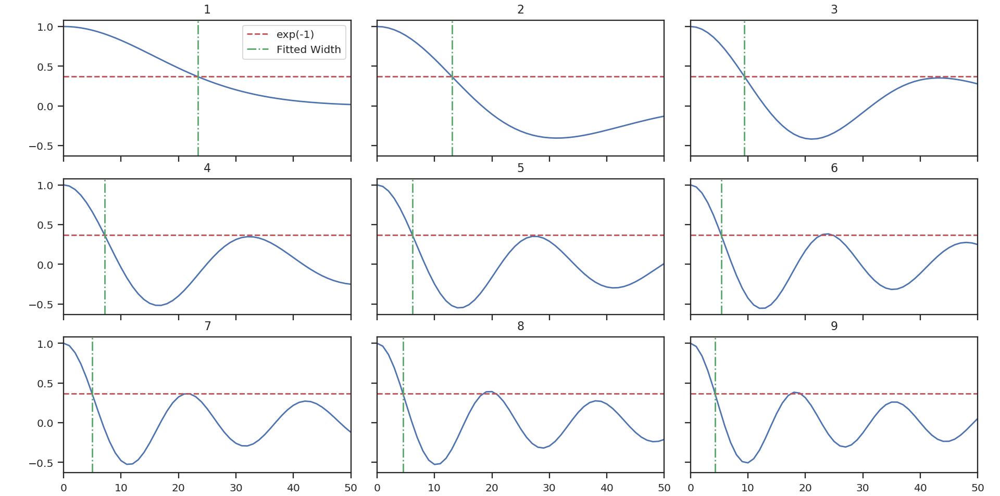

***
PCA
***

Overview
--------

Principal Component Analysis is primarily a dimensionality reduction technique. Generally the data are arranged into a set of columns (representing dimensions or variables) and the set of samples is contained within each row. A covariance matrix is then constructed between each pair of columns. Performing an eigenvalue decomposition of this matrix gives an orthogonal basis for the data, the components of which are the prinipal components (eigenvectors). The associated eigenvalues correspond to the variance in the data described by each principal component.

By ordering the principal components from the largest to smallest eigenvalue, a minimal set of eigenvectors can be found that account for a large portion of the variance within the data. These first N principal components have a (usually) much reduced dimensionality, while still containing the majority of the structure in the data. The `PCA Wikipedia <https://en.wikipedia.org/wiki/Principal_component_analysis>`_ page has a much more thorough explanation.

The use of PCA on spectral-line data cubes was introduced by :ref:`Heyer & Schloerb 1997 <ref-heyer_schloerb1997>`, and thoroughly extended in a number of other papers (e.g., :ref:`Brunt, C. & Heyer, M. 2002a <_ref-brunt_heyer2002_i>`, :ref:`Brunt, C. & Heyer, M. 2002b <_ref-brunt_heyer2002_ii>`). An analytical derivation is given in :ref:`Brunt, C. & Heyer, M. 2013 <brunt_heyer2013>`. Briefly, they use the PCA decomposition to measure the associated spectral and spatial width scales associated with each principal component. An eigenvalue can be multiplied by each spectral channel to produce an eigenimage. The autocorrelation function of that eigenimage gives an estimate of the spatial scale of that principal component. The autocorrelation of the eigenvector itself gives an associated spectral width. Using the spatial and spectral widths from the first N principal components give an estimate the size-line width relation.

Using
-----

**The data in this tutorial are available** `here <https://girder.hub.yt/#user/57b31aee7b6f080001528c6d/folder/57e55670a909a80001d301ae>`_.

We need to import the PCA code, along with a few other common packages:

    >>> from turbustat.statistics import PCA
    >>> from astropy.io import fits
    >>> import astropy.units as u

And we load in the data:

    >>> cube = fits.open("Design4_21_0_0_flatrho_0021_13co.fits")[0]  # doctest: +SKIP

The `spectral-cube <http://spectral-cube.readthedocs.io/en/latest/>`_ package can also be used to load in data.

    >>> from spectral_cube import SpectralCube
    >>> cube = SpectralCube.read("Design4_21_0_0_flatrho_0021_13co.fits")  # doctest: +SKIP

The `~turbustat.statistics.PCA` class is first initialized, and the distance to the region (if desired) can be given along with an appropriate distance unit:

    >>> pca = PCA(cube, distance=250. * u.pc)  # doctest: +SKIP

If the distance is given, spatial widths are converted to the physical unit given in the distance (so parsecs here).

The simplest way to run the entire process is through the `~turbustat.statistics.PCA.run` command:

    >>> pca.run(verbose=True, min_eigval=0.005)  # doctest: +SKIP
    Proportion of Variance kept: 0.973266632968
    Index: 0.50 (0.48, 0.53)
    Gamma: 0.31 (0.27, 0.36)
    Sonic length: 7.083e-02 (5.910e-02, 8.256e-02) pc at 10.0 K

.. image:: images/pca_design4_default.png

This will use the default settings, and will show print a summary of the results with a plot of the covariance matrix (top left), the variance described by the principal components (bottom left) and the size-line width relation (right). This routine combines 4 steps, which we break down below.

First, the eigenvalue decomposition is performed using `~turbustat.statistics.PCA.compute_pca`:

    >>> pca.compute_pca(mean_sub=False, n_eigs='auto', min_eigval=0.005, eigen_cut_method='value')  # doctest: +SKIP
    >>> pca.n_eigs  # doctest: +SKIP
    24

`mean_sub` controls whether to subtract the channel means when calculating the covariance matrix. Formally, this is implied when calculating any covariance matrix, but is not done in the Brunt & Heyer works. `n_eigs` sets the number of important principal components (which will be used to fit the size-line width relation). This can be an integer, or the code will determine the number of important components based off of a threshold given in `min_eigval`. When `eigen_cut_method='value'`, `min_eigval` is the smallest eigenvalue to consider important. Since the variance is related to the level of variance due to noise in the data, it is practical to set this to a few times the noise variance. When `eigen_cut_method='proportion'`, `min_eigval` now corresponds to the total proportion of variance that is considered important:

    >>> pca.compute_pca(mean_sub=False, n_eigs='auto', min_eigval=0.99, eigen_cut_method='proportion')  # doctest: +SKIP
    >>> pca.n_eigs  # doctest: +SKIP
    30

This will keep the number of components that describe 99% of the variance in the data. The percentage of variance described by a principal component is its eigenvalue divided by the sum of all eigenvalues (the total variance in the data). All other components beyond these levels are due to irreducible noise. These noise components can be thought of as an N-dimensional sphere, where it becomes impossible to diminish the remaining variance as there is no preferred direction.

Second, we calculate the spatial size scales from the autocorrelation of the eigenimages:

    >>> pca.find_spatial_widths(method='contour', beam_fwhm=None, brunt_beamcorrect=True)  # doctest: +SKIP

.. image:: images/pca_autocorrimgs_contourfit_Design4.png

This will find the spatial widths by fitting an ellipse to the 1/e contour about the peak in the autocorrelation image, following the fitting technique described by Brunt & Heyer. The first 9 autocorrelation images are shown in the above image, where the cyan contours are the true 1/e contour, and the green dashed line is the elliptical fit.

`method` may also be set to `fit` to fit a 2D Gaussian to the peak, `interpolate` which estimates the 1/e from the peak using a fine grid about the peak region, and `xinterpolate` which first fits a 2D Gaussian to better determine the fine grid to use in interpolation. The default method is `contour`.

When beam correction is applied (`brunt_beamcorrect`), the angular FWHM of the beam is needed. If the `BMAJ` keyword is set in the FITS header in `cube`, this will be read automatically (also if the `radio_beam <https://github.com/radio-astro-tools/radio_beam>`_ package is installed, a few other keywords will be recognized). Otherwise, this must be specified in `beam_fwhm`.

Third, we find the spectral widths:

    >>> pca.find_spectral_widths(method='walk-down')  # doctest: +SKIP

The above image shows the first 100 components of the first 9 autocorrelation spectra (the data cube has 500 channels in total, but this is the region of interest). The local minima referred to in the next paragraph is the first minimum point in each of the spectra.

There are three methods available to estimate spectral widths of the autocorrelation spectra. `walk-down` starts from the peak and continues until the 1/e level is reached. The width is estimated by averaging the points before and after this level is reached. This is the method used by Brunt & Heyer. Otherwise, `method` may be set to `fit`, which fits a Gaussian to the data before the fits local minima occurs, and `interpolate`, which does the same, but through interpolating onto a finer grid. As shown in the above figure, the number of oscillations in the autocorrelation spectrum increases with the Nth principal component. The width of interest is determined from the first peak to the first minima.

**Note: If your input data has few spectral channels, it may be necessary to pad additional channels of zeros onto the data. Otherwise the 1/e level may not be reached. This should not have a significant effect on the results, as the added eigenvalues of these channels will be zero and should not be considered.**

Finally, we fit the size-line width relation. There is no clear independent variable to fit, and significant errors in both dimensions which must be taken into account. This is the *error-in-variables problem*, and an excellent explanation is provided in :ref:`Hogg, D, Bovy, J, & Lang D. <ref-hogg_fitting>`. The Brunt & Heyer works have used the bisector method, which has several drawbacks. In TurbuStat, two fitting methods are available: `Orthogonal Distance Regression (ODR) <http://docs.scipy.org/doc/scipy/reference/odr.html>`_, and a Markov Chain Monte Carlo (MCMC) method. Practically both methods are doing the same thing, but the MCMC provides a direct sampling (assuming uniform priors). The MCMC method requires the `emcee <http://dan.iel.fm/emcee/current/>`_ package to be installed.

To run ODR:

    >>> pca.fit_plaw(fit_method='odr', verbose=True)  # doctest: +SKIP

.. image:: images/pca_design4_plaw_odr.png

And to run the MCMC:

    >>> pca.fit_plaw(fit_method='bayes', verbose=True)  # doctest: +SKIP

.. image:: images/pca_design4_plaw_mcmc.png

Additional arguments for setting the chain properties can be passed as well. See documentation for `~turbustat.statistics.fitting_utils.bayes_linear`. The verbose mode shows the fit results along with the data points.

The interesting outputs from this analysis are esitmates of the slopes of the size-line width relation (:math:`\gamma`) and the sonic length:

    >>> pca.gamma  # doctest: +SKIP
    0.322
    >>> pca.sonic_length(T_k=10 * u.K, mu=1.36)  # doctest: +SKIP
    (<Quantity 0.0732300348697346 pc>, <Quantity [ 0.04773552, 0.11210492] pc>)

Since the sonic length depends on temperature and :math:`\mu`, this is a function and not a property like :math:`\gamma`. `PCA.sonic_length` also returns the 1-sigma error bounds. The error bounds in :math:`\gamma` can be accessed with `PCA.gamma_error_range`.

References
----------

.. _ref-heyer_schloerb1997:

`Heyer, M., & Schloerb, P. 1997 <https://ui.adsabs.harvard.edu/#abs/1997ApJ...475..173H/abstract>`_

.. _ref-brunt_heyer2013:

`Brunt, C. & Heyer, M. 2013 <https://ui.adsabs.harvard.edu/#abs/2013MNRAS.433..117B/abstract>`_

.. _ref-brunt_heyer2002_i:

`Brunt, C. & Heyer, M. 2002a <https://ui.adsabs.harvard.edu/#abs/2002ApJ...566..276B/abstract>`_

.. _ref-brunt_heyer2002_ii:

`Brunt, C. & Heyer, M. 2002b <https://ui.adsabs.harvard.edu/#abs/2002ApJ...566..289B/abstract>`_

.. _ref-hogg_fitting:

`Hogg, D, Bovy, J, & Lang D. <https://ui.adsabs.harvard.edu/#abs/2010arXiv1008.4686H/abstract>`_

