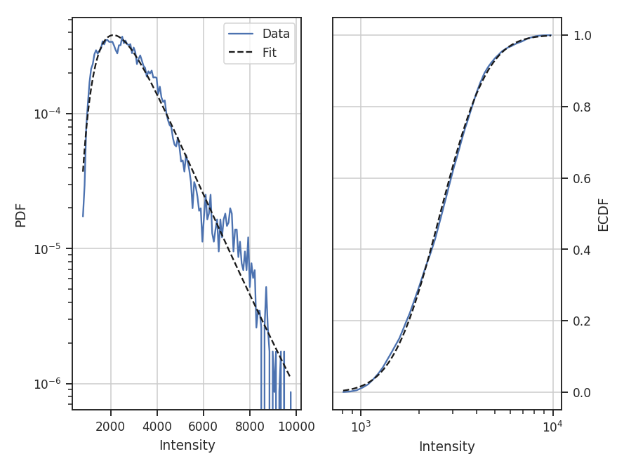
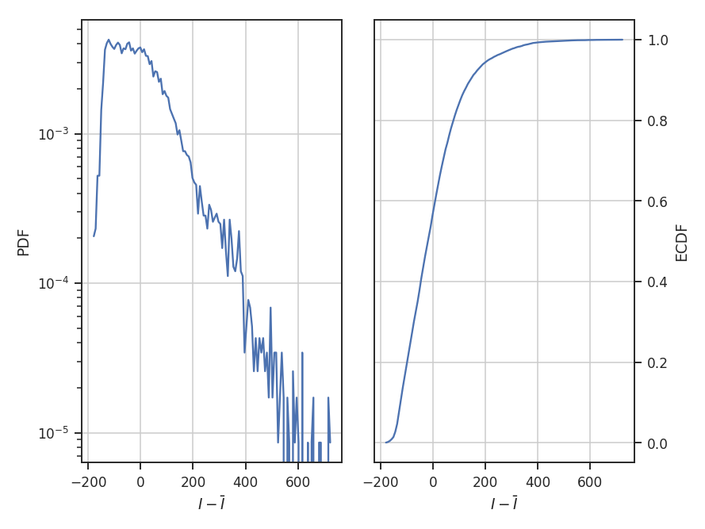
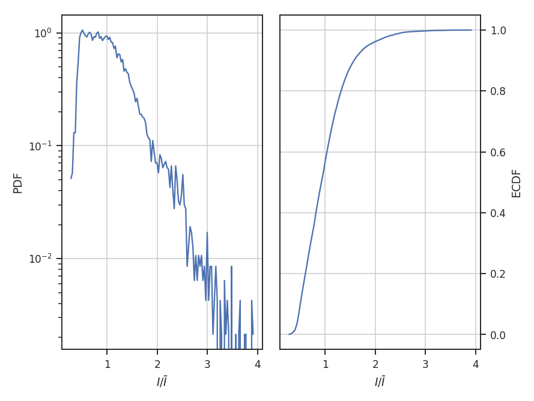
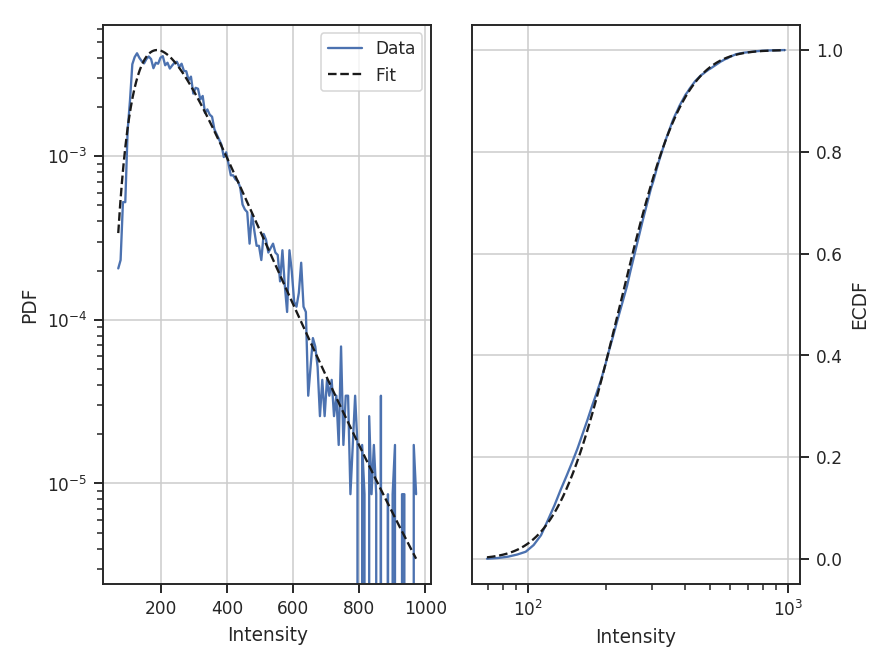
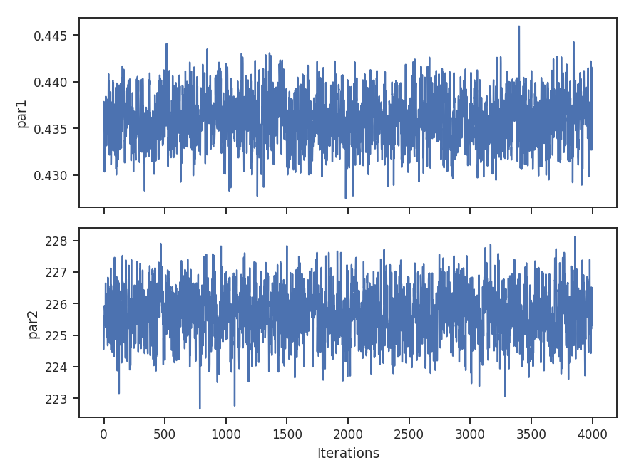
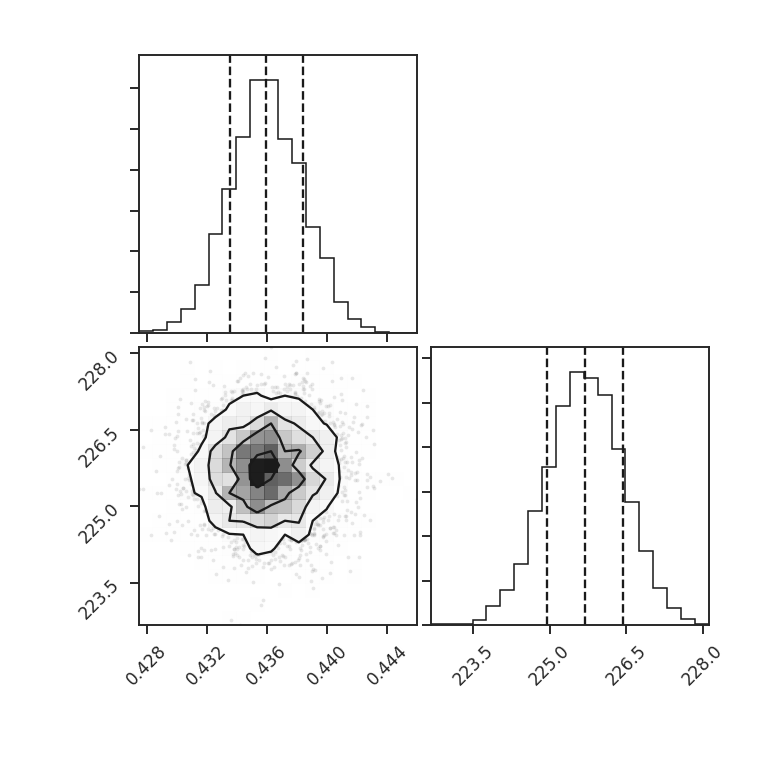
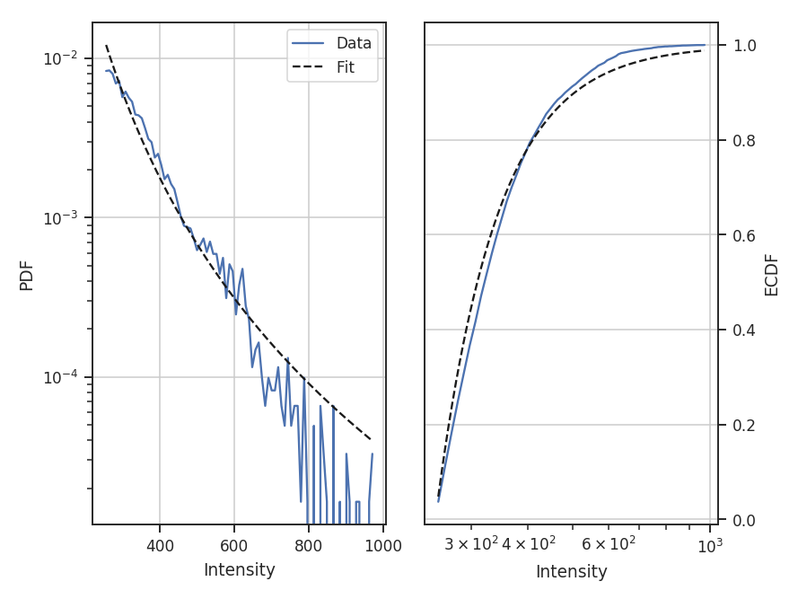
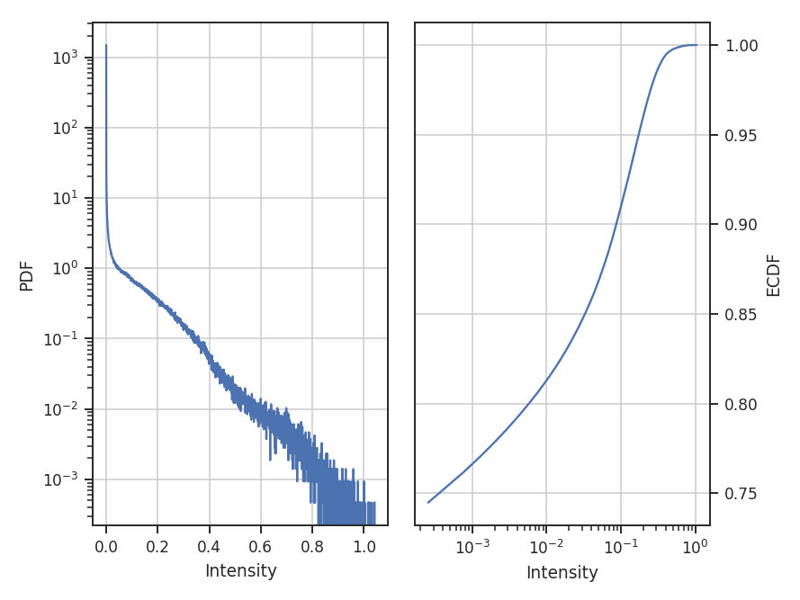

.. _pdf_tutorial:

***
PDF
***

Overview
--------

A common technique used in ISM and molecular cloud studies is measurement of the shape of the probability density function (PDF). Often, column density or extinction values are used to construct the PDF. Intensities may also be used, but may be subject to more severe optical depth effects. Properties of the PDF, when related to an analytical form, have been found to correlate with changes in the turbulent properties (e.g., `Kowal et al. 2007 <https://ui.adsabs.harvard.edu/#abs/2007ApJ...658..423K/abstract>`_, `Federrath et al. 2010 <https://ui.adsabs.harvard.edu/#abs/2010A&A...512A..81F/abstract>`_) and gravity (e.g., `Burkhart et al. 2015 <https://ui.adsabs.harvard.edu/#abs/2015ApJ...808...48B/abstract>`_, `Burkhart et al. 2017 <https://ui.adsabs.harvard.edu/#abs/2017ApJ...834L...1B/abstract>`_).

A plethora of papers are devoted to this topic, and there is much debate over the form of these PDFs (`Lombardi et al. 2015 <https://ui.adsabs.harvard.edu/#abs/2015A&A...576L...1L/abstract>`_). TurbuStat's implementation seeks to be flexible because of this. Parametric and non-parametric measures to describe PDFs are shown below.

Using
-----

**The data in this tutorial are available** `here <https://girder.hub.yt/#user/57b31aee7b6f080001528c6d/folder/59721a30cc387500017dbe37>`_.

We need to import the `~turbustat.statistics.PDF` code, along with a few other common packages:

    >>> from turbustat.statistics import PDF
    >>> from astropy.io import fits

Since the PDF is a one-dimensional view of the data, any dimension data can be passed. For this tutorial, we will use the zeroth moment (integrated intensity):

    >>> moment0 = fits.open("Design4_flatrho_0021_00_radmc_moment0.fits")[0]  # doctest: +SKIP
    >>> pdf_mom0 = PDF(moment0, min_val=0.0, bins=None)  # doctest: +SKIP
    >>> pdf_mom0.run(verbose=True)  # doctest: +SKIP
    Optimization terminated successfully.
             Current function value: 6.007851
             Iterations: 34
             Function evaluations: 69
                                  Likelihood Results
    ==============================================================================
    Dep. Variable:                      y   Log-Likelihood:                -98433.
    Model:                     Likelihood   AIC:                         1.969e+05
    Method:            Maximum Likelihood   BIC:                         1.969e+05
    Date:                Sun, 16 Jul 2017
    Time:                        15:06:22
    No. Observations:               16384
    Df Residuals:                   16382
    Df Model:                           2
    ==============================================================================
                     coef    std err          z      P>|z|      [0.025      0.975]
    ------------------------------------------------------------------------------
    par0           0.4360      0.002    181.019      0.000       0.431       0.441
    par1         225.6771      0.769    293.602      0.000     224.171     227.184
    ==============================================================================

The resulting PDF and ECDF of the data are plotted, along with a log-normal fit to the PDF. ECDF is the empirical cumulative distribution function defined as the cumulative sum of the data. By default, `~turbustat.statistics.PDF` will fit a log-normal to the PDF. Choosing other models and disabling the fitting are discussed below.

The fit parameters can be accessed from `~turbustat.statistics.PDF.model_params` and the standard errors from `~turbustat.statistics.PDF.model_stderrs`. The fitting in `~turbustat.statistics.PDF` uses the `~scipy.stats` distributions. The scipy implementation for a `log-normal <https://docs.scipy.org/doc/scipy/reference/generated/scipy.stats.lognorm.html>`_ defines the two fit parameters as `par0 = exp(mu)` and `par1 = sigma`.

There are several options that can be set. Using `min_val` will set the lower limit on values to consider in the PDF. `bins` allows a custom array of bins (edges) to be given. By default, the bins are of equal width, with the number set by the square root of the number of data points (a good estimate when the number of samples is >100).

With the ECDF calculated, we can check the percentile of different values in the data:

    >>> pdf_mom0.find_percentile(500)  # doctest: +SKIP
    96.3134765625

Or if we want to find the value at a certain percentile:

    >>> pdf_mom0.find_at_percentile(96.3134765625)  # doctest: +SKIP
    499.98911349468841

The values are not exact between the two operations because the ECDF function was computed with finite values. *Note that brightness unit conversions are not yet supported and data values should be passed as floats.*

If an array of the uncertainties is available, these may be passed as weights:

    >>> moment0_err = fits.open("Design4_flatrho_0021_00_radmc_moment0.fits")[1]  # doctest: +SKIP
    >>> pdf_mom0 = PDF(moment0, min_val=0.0, bins=None, weights=moment0_error.data**-2)  # doctest: +SKIP
    >>> pdf_mom0.run(verbose=True)  # doctest: +SKIP
    Optimization terminated successfully.
             Current function value: 8.470342
             Iterations: 43
             Function evaluations: 86
                                  Likelihood Results
    ==============================================================================
    Dep. Variable:                      y   Log-Likelihood:            -1.3878e+05
    Model:                     Likelihood   AIC:                         2.776e+05
    Method:            Maximum Likelihood   BIC:                         2.776e+05
    Date:                Sun, 16 Jul 2017
    Time:                        15:06:23
    No. Observations:               16384
    Df Residuals:                   16382
    Df Model:                           2
    ==============================================================================
                     coef    std err          z      P>|z|      [0.025      0.975]
    ------------------------------------------------------------------------------
    par0           0.4468      0.002    181.019      0.000       0.442       0.452
    par1        2584.0353      9.019    286.499      0.000    2566.358    2601.713
    ==============================================================================

Since the data are now defined as `data / stderr^2`, the fit parameters have changed. While this scaling makes it difficult to use the fit parameters to compare with theoretical preductions, it can be useful when comparing data sets non-parametrically.

When comparing to the PDFs from other data, adopting a common normalization scheme can aid in highlighting similarities and differences. The four normalizations that can be set with `normalization_type` are demonstrated below. Adopting different normalizations highlights different portions of the data, making it important to choose a normalization appropriate for the data. Each of these normalizations subtly makes assumptions on the data's properties. Note that fitting is disabled here since some of the normalization types scale the data to negative values and cannot be fit with a log-normal distribution.

`standardize` subtracts the mean and divides by the standard deviation; this is appropriate for normally-distributed data:

    >>> pdf_mom0 = PDF(moment0, normalization_type='standardize')  # doctest: +SKIP
    >>> pdf_mom0.run(verbose=True, do_fit=False)  # doctest: +SKIP

.. image:: images/pdf_design4_mom0_stand.png

`center` subtracts the mean from the data:

    >>> pdf_mom0 = PDF(moment0, normalization_type='center')  # doctest: +SKIP
    >>> pdf_mom0.run(verbose=True, do_fit=False)  # doctest: +SKIP

`normalize` subtracts the minimum in the data and divides by the range in the data, thereby scaling the data between 0 and 1:

    >>> pdf_mom0 = PDF(moment0, normalization_type='normalize')  # doctest: +SKIP
    >>> pdf_mom0.run(verbose=True, do_fit=False)  # doctest: +SKIP

.. image:: images/pdf_design4_mom0_norm.png

`normalize_by_mean` divides the data by its mean. This is the most common normalization found in the literature on PDFs since the commonly used parametric forms (log-normal and power-laws) can be arbitrarily scaled by the mean.

    >>> pdf_mom0 = PDF(moment0, normalization_type='normalize_by_mean')  # doctest: +SKIP
    >>> pdf_mom0.run(verbose=True, do_fit=False)  # doctest: +SKIP

The example data are well-described by a log-normal, making the normalization by the mean an appropriate choice. Note how the shape of the distribution appears unchanged in these examples, but the axis they're defined on changes.

The distribution fitting shown above uses a maximum likelihood estimate (MLE) to find the parameter values and their uncertainties. This works well for well-behaved data, like those used in this tutorial, where the parametric description fits the data well. When this is not the case, the standard errors can be extremely under-estimated. One solution is to adopt a Monte Carlo approach for fitting. When the `emcee <http://dan.iel.fm/emcee/current/>`_ package is installed, `~turbustat.statistics.PDF.fit_pdf` will fit the distribution using MCMC. Note that all keyword arguments to `~turbustat.statistics.PDF.fit_pdf` can also be passed to `~turbustat.statistics.PDF.run`.

    >>> pdf_mom0 = PDF(moment0, min_val=0.0, bins=None)  # doctest: +SKIP
    >>> pdf_mom0.run(verbose=True, fit_type='mcmc')  # doctest: +SKIP
    Ran chain for 2000 iterations
    Used 20 walkers
    Mean acceptance fraction of 0.722775
    Parameter values: [   0.43589657  225.69177379]
    15th to 85th percentile ranges: [ 0.00498541  1.51322986]

The MCMC fit finds the same parameter values (see the first example above) with a ~1-sigma range about twice that of the MLE fit. The MCMC chain is ran for 200 burn-in steps, followed by 2000 steps that are used to estimate the distribution parameters. These can be altered by passing `burnin` and `steps` to the run command above. Other accepted keywords can be found in the `emcee documentation <http://dan.iel.fm/emcee/current/api/#emcee.EnsembleSampler.run_mcmc>`_.

.. warning:: MCMC results should **not** be blindly accepted. It is important to check the behaviour of the chain to ensure it converged and has adequately explored the parameter space around the converged result.

To check if the MCMC has converged, a trace plot of parameter value versus step in the chain can be made::

    >>> pdf_mom0.trace_plot()  # doctest: +SKIP

We can also look at the sample distributions for each fit parameter using a corner plot. This requires the `corner.py <https://corner.readthedocs.io/en/latest/>`_ package to be installed.

    >>> pdf_mom0.corner_plot()  # doctest: +SKIP

Each parameter distribution is showed (1D histograms) and their interaction (2D histogram), which is useful for exploring covariant parameters in the fit. The dotted lines show the 16th, 50th, and 84th quantiles. Each of the distributions here is close to normally-distributed and appears well-behaved.

The log-normal distribution is typically not used for observational data since low column densities or extinction regions have greater uncertainties and/or are incompletely sampled in the data (see `Lombardi et al. 2015 <https://ui.adsabs.harvard.edu/#abs/2015A&A...576L...1L/abstract>`_). A power-law model may be a better model choice in this case. We can choose to fit other models by passing different `~scipy.stats.rv_continuous` models to `model` in `~turbustat.statistics.PDF.run`. Note that the fit will fail if the data are outside of the accepted range for the given model (such as negative values for the log-normal distribution).

For this example, let us consider values below 250 K m/s to be unreliable. We will fit a `pareto <https://docs.scipy.org/doc/scipy-0.19.0/reference/generated/scipy.stats.pareto.html#scipy.stats.pareto>`_ distribution to the integrated intensities above this (the scipy powerlaw model requires a positive index).

    >>> import scipy.stats as stats  # doctest: +SKIP
    >>> plaw_data = stats.pareto.rvs(2, size=5000)  # doctest: +SKIP
    >>> pdf_mom0 = PDF(moment0, min_val=250.0, normalization_type=None)  # doctest: +SKIP
    >>> pdf_mom0.run(verbose=True, model=stats.pareto,
    ...              fit_type='mle', floc=False)  # doctest: +SKIP
    Optimization terminated successfully.
             Current function value: 5.641058
             Iterations: 84
             Function evaluations: 159
    Fitted parameters: [   3.27946996   -0.58133183  250.61486355]
    Covariance calculation failed.

Based on the deviations in the ECDF plot, the log-normal fit was better for this data, though the power-law does adequately describe the data at high integrated intensities. But, there are issues with the fit. The MLE routine diverges when calculating the covariance matrix and standard errors. There are important nuances for fitting heavy-tailed distributions that are not included in the MLE fitting here. See the `powerlaw <https://github.com/jeffalstott/powerlaw>`_ package for the correct approach.

Note that an additional parameter, `floc`, has been set. This stops the `loc` parameter from being fixed in the fit, which is appropriate for the default fitting of a log-normal distribution. The `scale` parameter can similarly be fixed with `fscale`. See the `scipy.stats documentation <https://docs.scipy.org/doc/scipy-0.19.0/reference/generated/scipy.stats.rv_continuous.html#scipy.stats.rv_continuous>`_ for an explanation of these parameters.

All of these examples use the zeroth moment from the data. Since PDFs are equally valid for any dimension of data, we can also find the PDF for the PPV cube. The class and function calls are identical:

    >>> from spectral_cube import SpectralCube
    >>> cube = SpectralCube.read("Design4_flatrho_0021_00_radmc.fits")[0]  # doctest: +SKIP
    >>> pdf_cube = PDF(cube).run(verbose=True, do_fit=False)  # doctest: +SKIP

References
----------

As stated above, there are a ton of papers measuring properties of the PDF. Below are just a few examples with different PDF uses and discussions:

`Miesch et al. 1995 <https://ui.adsabs.harvard.edu/#abs/1995ApJ...450L..27M/abstract>`_

`Ostriker et al. 2001 <https://ui.adsabs.harvard.edu/#abs/2001ApJ...546..980O/abstract>`_

`Kowal et al. 2007 <https://ui.adsabs.harvard.edu/#abs/2007ApJ...658..423K/abstract>`_

`Federrath et al. 2008 <https://ui.adsabs.harvard.edu/#abs/2008ApJ...688L..79F/abstract>`_

`Goodman et al. 2009 <https://ui.adsabs.harvard.edu/#abs/2009ApJ...692...91G/abstract>`_

`Federrath et al. 2010 <https://ui.adsabs.harvard.edu/#abs/2010A&A...512A..81F/abstract>`_

`Burkhart et al. 2015 <https://ui.adsabs.harvard.edu/#abs/2015ApJ...808...48B/abstract>`_

`Lombardi et al. 2015 <https://ui.adsabs.harvard.edu/#abs/2015A&A...576L...1L/abstract>`_

`Alves et al. 2017 <https://ui.adsabs.harvard.edu/#abs/2017A&A...606L...2A/abstract>`_

`Burkhart et al. 2017 <https://ui.adsabs.harvard.edu/#abs/2017ApJ...834L...1B/abstract>`_

`Chen et al. 2018 <https://ui.adsabs.harvard.edu/#abs/2018ApJ...859..162C/abstract>`_
