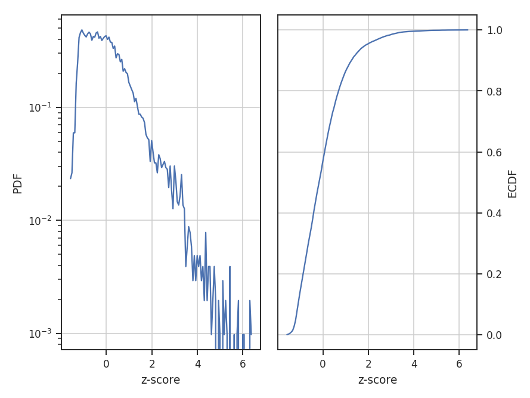

***
PDF
***

Overview
--------

A common technique used in ISM and molecular cloud studies is the probability density function (PDF). Often, column density or extinction values are used to construct the PDF. Intensities may also be used, but may be subject to more severe optical depth effects.

A plethora of papers are devoted to this topic, and there is much debate over the form of these PDFs. Because of this TurbuStat addresses only the creation of the PDF, and its associated ECDF. All comparisons purposely use non-parameteric approaches to be as general as possible.

Using
-----

**The data in this tutorial are available** `here <https://girder.hub.yt/#user/57b31aee7b6f080001528c6d/folder/57e55670a909a80001d301ae>`_.

We need to import the `~turbustat.statistics.PDF` code, along with a few other common packages:

    >>> from turbustat.statistics import PDF
    >>> from astropy.io import fits
    >>> from spectral_cube import SpectralCube

Since the PDF is a one-dimensional view of the data, any dimension data can be passed. For the tutorial, we will use the zeroth moment (integrated intensity) and the full PPV cube (using `spectral-cube <http://spectral-cube.readthedocs.io/en/latest/>`_):

    >>> moment0 = fits.open("Design4_21_0_0_flatrho_0021_13co.moment0.fits")[0]  # doctest: +SKIP
    >>> cube = SpectralCube.read("Design4_21_0_0_flatrho_0021_13co.fits")[0]  # doctest: +SKIP

Starting first with the zeroth moment, the `~turbustat.statistics.PDF` class is called:

    >>> pdf_mom0 = PDF(moment0, min_val=0.0, bins=None)  # doctest: +SKIP
    >>> pdf_mom0.run(verbose=True)  # doctest: +SKIP

.. image:: images/pdf_design4_mom0.png

The resulting PDF and ECDF of the data are displayed. Using `min_val`, a minimum value to consider in constructing the PDF can be given. A custom array of bin (edges) may also be given using `bins`. By default, the bins are of equal width, with the number set by the square root of the number of data points (a good estimate when the number of samples is >100).

If an array of the errors is available, these may be passed as weights:

    >>> moment0_err = fits.open("Design4_21_0_0_flatrho_0021_13co.moment0_error.fits")[0]  # doctest: +SKIP
    >>> pdf_mom0 = PDF(moment0, min_val=0.0, bins=None, weights=moment0_error.data**-2)  # doctest: +SKIP
    >>> pdf_mom0.run(verbose=True)  # doctest: +SKIP

.. image:: images/pdf_design4_mom0_weights.png

For comparisons to other PDFs, standardizing the data to have a mean of zero and standard deviation of one is common practice in statistics. Standardization is enabled with `use_standardized=True`:

    >>> pdf_mom0 = PDF(moment0, use_standardized=True)  # doctest: +SKIP
    >>> pdf_mom0.run(verbose=True)  # doctest: +SKIP

If you are seeking to fit a model to the PDF, the PDF values and bin centers are accessed through `~turbustat.statistics.PDF.pdf` and `~turbustat.statistics.PDF.bins`, respectfully.

The class and function calls are identical when using a PPV cube:

    >>> pdf_cube = PDF(cube).run(verbose=True)  # doctest: +SKIP

.. image:: images/pdf_design4.png

References
----------

As stated above, there are a ton of papers measuring properties of the PDF. Below are a few biased examples of papers with different PDF uses and discussions:

.. _ref-kowal2007:

`Kowal et al. 2007 <https://ui.adsabs.harvard.edu/#abs/2007ApJ...658..423K/abstract>`_

.. _ref-lombardi2015:

`Lombardi et al. 2015 <https://ui.adsabs.harvard.edu/#abs/2015A&A...576L...1L/abstract>`_

.. _ref-basu2015:

`Basu, Gil & Auddy 2015 <https://ui.adsabs.harvard.edu/#abs/2015MNRAS.449.2413B/abstract>`_
