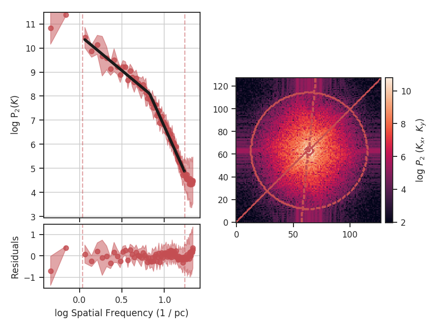
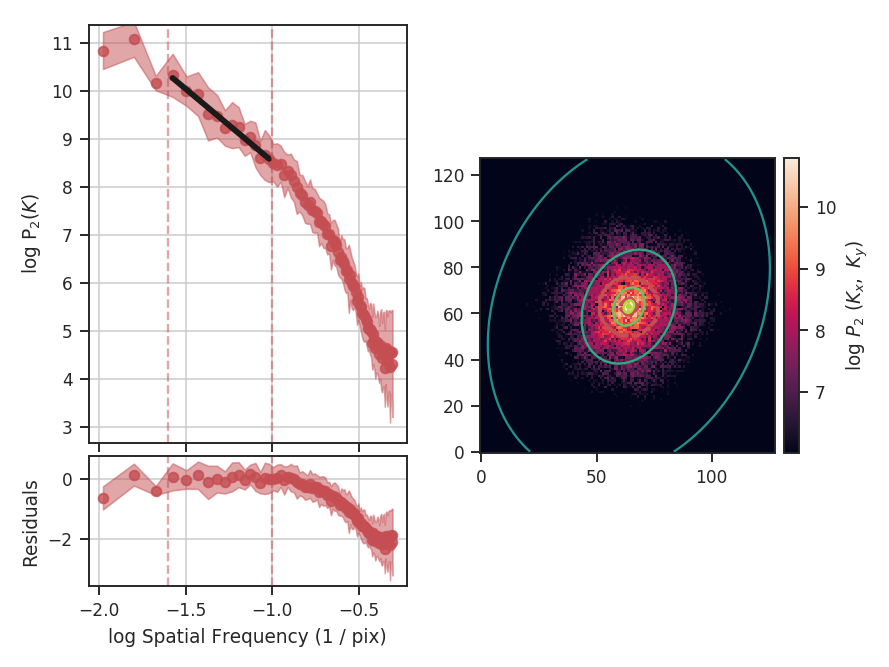

.. _pspec_tutorial:

**********************
Spatial Power Spectrum
**********************

Overview
--------

A common analysis technique for two-dimensional images is the spatial power spectrum -- the square of the 2D Fourier transform of an image. A radial profile of the 2D power spectrum gives the 1D power spectrum. The slope of this 1D spectrum can be compared to the expected indices in different physical limits. For example, the velocity field of Kolmogorov turbulence follows :math:`k^{-5/3}`, while Burgers' turbulence has :math:`k^{-2}`.

However, observations are a combination of both velocity and density fluctuations (e.g., `Lazarian & Pogosyan 2000 <https://ui.adsabs.harvard.edu/#abs/2000ApJ...537..720L/abstract>`_), and the measured index from an integrated intensity map depend on both components, as well as optical depth effects. For a turbulent optically thin tracer, an integrated intensity image (or zeroth moment) will have :math:`k^{-11/3}`, while an optically thick tracer saturates to :math:`k^{-3}` (`Lazarian & Pogosyan 2004 <https://ui.adsabs.harvard.edu/#abs/2004ApJ...616..943L/abstract>`_, `Burkhart et al. 2013 <https://ui.adsabs.harvard.edu/#abs/2013ApJ...771..123B/abstract>`_). The effect of velocity resolution is discussed in the :ref:`VCA tutorial <vca_tutorial>`.

Using
-----

**The data in this tutorial are available** `here <https://girder.hub.yt/#user/57b31aee7b6f080001528c6d/folder/59721a30cc387500017dbe37>`_.

We need to import the `~turbustat.statistics.PowerSpectrum` code, along with a few other common packages:

    >>> from turbustat.statistics import PowerSpectrum
    >>> from astropy.io import fits

And we load in the data:

    >>> moment0 = fits.open("Design4_flatrho_0021_00_radmc_moment0.fits")[0]  # doctest: +SKIP

The power spectrum is computed using:

    >>> pspec = PowerSpectrum(moment0, distance=250 * u.pc)  # doctest: +SKIP
    >>> pspec.run(verbose=True, xunit=u.pix**-1)  # doctest: +SKIP
                                OLS Regression Results
    ==============================================================================
    Dep. Variable:                      y   R-squared:                       0.941
    Model:                            OLS   Adj. R-squared:                  0.941
    Method:                 Least Squares   F-statistic:                     1426.
    Date:                Fri, 29 Sep 2017   Prob (F-statistic):           1.44e-56
    Time:                        14:32:47   Log-Likelihood:                -52.829
    No. Observations:                  91   AIC:                             109.7
    Df Residuals:                      89   BIC:                             114.7
    Df Model:                           1
    Covariance Type:            nonrobust
    ==============================================================================
                     coef    std err          t      P>|t|      [0.025      0.975]
    ------------------------------------------------------------------------------
    const          3.1677      0.103     30.828      0.000       2.964       3.372
    x1            -5.0144      0.133    -37.761      0.000      -5.278      -4.751
    ==============================================================================
    Omnibus:                        3.532   Durbin-Watson:                   0.129
    Prob(Omnibus):                  0.171   Jarque-Bera (JB):                3.481
    Skew:                          -0.468   Prob(JB):                        0.175
    Kurtosis:                       2.797   Cond. No.                         4.40
    ==============================================================================

.. image:: images/design4_pspec.png

The code returns a summary of the one-dimensional fit and a figure showing the one-dimensional spectrum and model on the left, and the two-dimensional power-spectrum on the right. If `fit_2D=True` is set in `~turbustat.statistics.PowerSpectrum.run` (the default setting), the contours on the two-dimensional power-spectrum are fit using an elliptical power-law model. The dashed red lines (or contours) on both plots are the limits of the data used in the fits.  We use an elliptical power-law model:

.. math::

    A \left[(q^2 \cos^2\theta + \sin^2\theta) x^2 
    +  2(1 - q^2) \sin\theta \cos\theta xy
    + (q^2 \sin^2\theta + \cos^2 \theta) y^2 \right]^{\Gamma/2}

Here, the power-law index is :math:`\Gamma`, the orientation angle of the ellipse with respect to the :math:`x,y` coordinate system is given by :math:`\theta` and the ellipticity is :math:`q\in [0,1)`.

The power spectrum of this simulation has a slope of :math:`-3.3\pm0.1`, but the power-spectrum deviates from a single power-law on small scales. This is due to the the :ref:`limited inertial range in this simulation <data_for_tutorial>`. The spatial frequencies used in the fit can be limited by setting `low_cut` and `high_cut`. The inputs should have frequency units in pixels, angle, or physical units. For example,

    >>> pspec.run(verbose=True, xunit=u.pix**-1, low_cut=0.025 / u.pix,
    ...           high_cut=0.1 / u.pix)  # doctest: +SKIP
                                OLS Regression Results
    ==============================================================================
    Dep. Variable:                      y   R-squared:                       0.971
    Model:                            OLS   Adj. R-squared:                  0.968
    Method:                 Least Squares   F-statistic:                     398.6
    Date:                Thu, 28 Sep 2017   Prob (F-statistic):           1.42e-10
    Time:                        17:02:20   Log-Likelihood:                 14.077
    No. Observations:                  14   AIC:                            -24.15
    Df Residuals:                      12   BIC:                            -22.87
    Df Model:                           1
    Covariance Type:            nonrobust
    ==============================================================================
                     coef    std err          t      P>|t|      [0.025      0.975]
    ------------------------------------------------------------------------------
    const          5.5109      0.190     29.021      0.000       5.097       5.925
    x1            -3.0223      0.151    -19.964      0.000      -3.352      -2.692
    ==============================================================================
    Omnibus:                        0.901   Durbin-Watson:                   2.407
    Prob(Omnibus):                  0.637   Jarque-Bera (JB):                0.718
    Skew:                          -0.215   Prob(JB):                        0.698
    Kurtosis:                       1.977   Cond. No.                         15.2
    ==============================================================================

When limiting the fit to the inertial range, the slope is :math:`-3.0\pm0.2`. `low_cut` and `high_cut` can also be given as spatial frequencies in angular units (e.g., `u.deg**-1`). And since a distance was specified, the `low_cut` and `high_cut` can also be given in physical frequency units (e.g., `u.pc**-1`).

The fit to the two-dimensional power-spectrum has also changed. These parameters aren't included in the fit summary for the 1D fit. Instead, they can be accessed through:

    >>> print(pspec.slope2D, pspec.slope2D_err)  # doctest: +SKIP
    (-3.155235947194412, 0.19744198375014044)
    >>> print(pspec.ellip2D, pspec.ellip2D_err)  # doctest: +SKIP
    (0.74395734515060385, 0.043557506230624203)
    >>> print(pspec.theta2D, pspec.theta2D_err)  # doctest: +SKIP
    (1.1364954648370515, 0.09436799399259721)

The slope is moderately steeper than in the 1D model, but within the respective uncertainty ranges. By default, the parameter uncertainties for the 2D model are determined by a bootstrap. After fitting the model, the residuals are resampled and added back to the data. The resampled data are then fit to the model. This procedure is repeated some number of times (the default is 100) to build up distributions for the fit parameters. The bootstrap estimation is enabled in the code by setting the `bootstrap` keyword to `True` in `~turbustat.statistics.PowerSpectrum.fit_2Dpspec` and the number of iterations is set with `niters` (the default is 100). These can be set in `~turbustat.statistics.PowerSpectrum.run` by passing a keyword dictionary to `fit_2D_kwargs` (e.g., `fit_2D_kwargs={'bootstrap': False}`). The other parameters are the ellipticity, which is bounded between 0 and 1 (with 1 being circular), and theta, the angle between the x-axis and the semi-major axis of the ellipse. Theta is bounded between 0 and :math:`\pi`. The 2D power spectrum here is moderately anisotropic.

Breaks in the power-law behaviour in observations (and higher-resolution simulations) can result from differences in the physical processes dominating at those scales (e.g., `Swift & Welch 2008 <https://ui.adsabs.harvard.edu/#abs/2008ApJS..174..202S/abstract>`_). To capture this behaviour, `PowerSpectrum` can be passed a break point to enable fitting with a segmented linear model (`~turbustat.statistics.Lm_Seg`):

    >>> pspec = PowerSpectrum(moment0, distance=250 * u.pc)  # doctest: +SKIP
    >>> pspec.run(verbose=True, xunit=u.pc**-1, low_cut=0.02 / u.pix, high_cut=0.4 / u.pix,
    ...           fit_kwargs={'brk': 0.1 / u.pix, 'log_break': False}, fit_2D=False)  # doctest: +SKIP
                                OLS Regression Results
    ==============================================================================
    Dep. Variable:                      y   R-squared:                       0.996
    Model:                            OLS   Adj. R-squared:                  0.995
    Method:                 Least Squares   F-statistic:                     4904.
    Date:                Fri, 29 Sep 2017   Prob (F-statistic):           1.84e-77
    Time:                        14:29:10   Log-Likelihood:                 61.421
    No. Observations:                  70   AIC:                            -114.8
    Df Residuals:                      66   BIC:                            -105.8
    Df Model:                           3
    Covariance Type:            nonrobust
    ==============================================================================
                     coef    std err          t      P>|t|      [0.025      0.975]
    ------------------------------------------------------------------------------
    const          5.1169      0.087     59.057      0.000       4.944       5.290
    x1            -3.3384      0.082    -40.924      0.000      -3.501      -3.176
    x2            -4.9624      0.191    -26.043      0.000      -5.343      -4.582
    x3            -0.0084      0.048     -0.174      0.863      -0.105       0.088
    ==============================================================================
    Omnibus:                        3.812   Durbin-Watson:                   1.096
    Prob(Omnibus):                  0.149   Jarque-Bera (JB):                2.211
    Skew:                          -0.191   Prob(JB):                        0.331
    Kurtosis:                       2.218   Cond. No.                         22.4
    ==============================================================================

.. image:: images/design4_pspec_breakfit.png

`brk` is the initial guess for where the break point location is. Here I've set it to the extent of the inertial range of the simulation. `log_break` should be enabled if the given `brk` is already the log (base-10) value (since the fitting is done in log-space). The segmented linear model iteratively optimizes the location of the break point, trying to minimize the gap between the different components. This is the `x3` parameter above. The slopes of the components are `x1` and `x2`, but the second slope is defined *relative to the first slope* (i.e., if `x2=0`, the slopes of the components would be the same). The true slopes can be accessed through `pspec.slope` and `pspec.slope_err`. The location of the fitted break point is given by `pspec.brk`, and its uncertainty `pspec.brk_err`. If the fit does not find a good break point, it will revert to a linear fit without the break.

Note that the 2D fitting was disabled in this last example. The 2D model cannot fit a break point, and will instead try to fit a single power-law for the between `low_cut` and `high_cut`, which we know already know is the wrong model. Thus, it has been disabled to avoid confusion. A strategy for fitting the 2D model when the spectrum shows a break is to first fit the 1D model, find the break point, and then fit the 2D spectrum independently using the break point as the `high_cut` in `~turbustat.statistics.PowerSpectrum.fit_2Dpspec`.

There may be cases where you want to limit the azimuthal angles used to create the 1D averaged power-spectrum. This may be useful if, for example, you want to find a measure of anistropy but the 2D power-law fit is not performing well. We will add extra constraints to the previous example with a break point:

    >>> pspec = PowerSpectrum(moment0, distance=250 * u.pc)  # doctest: +SKIP
    >>> pspec.run(verbose=True, xunit=u.pc**-1, low_cut=0.02 / u.pix, high_cut=0.4 / u.pix,
    ...           fit_2D=False, fit_kwargs={'brk': 0.1 / u.pix, 'log_break': False},
    ...           radial_pspec_kwargs={"theta_0": 1.13 * u.rad, "delta_theta": 40 * u.deg})  # doctest: +SKIP
                                OLS Regression Results
    ==============================================================================
    Dep. Variable:                      y   R-squared:                       0.990
    Model:                            OLS   Adj. R-squared:                  0.989
    Method:                 Least Squares   F-statistic:                     2113.
    Date:                Fri, 29 Sep 2017   Prob (F-statistic):           1.76e-65
    Time:                        14:29:10   Log-Likelihood:                 30.377
    No. Observations:                  70   AIC:                            -52.75
    Df Residuals:                      66   BIC:                            -43.76
    Df Model:                           3
    Covariance Type:            nonrobust
    ==============================================================================
                     coef    std err          t      P>|t|      [0.025      0.975]
    ------------------------------------------------------------------------------
    const          5.7150      0.173     33.005      0.000       5.369       6.061
    x1            -2.9371      0.154    -19.041      0.000      -3.245      -2.629
    x2            -4.9096      0.254    -19.313      0.000      -5.417      -4.402
    x3             0.0156      0.077      0.202      0.840      -0.138       0.169
    ==============================================================================
    Omnibus:                        3.679   Durbin-Watson:                   1.837
    Prob(Omnibus):                  0.159   Jarque-Bera (JB):                1.894
    Skew:                          -0.030   Prob(JB):                        0.388
    Kurtosis:                       2.196   Cond. No.                         22.9
    ==============================================================================

The azimuthal mask has been added onto the plot of the two-dimensional power spectrum. The constraints used here are based on the major axis direction from the two-dimensional fit performed above. This is given as `theta_0`. The other parameter, `delta_theta`, is the width of the azimuthal mask to use. Both parameters can be specified in any angular unit.

The default fit uses Ordinary Least Squares. A Weighted Least Squares can be enabled with `weighted_fit=True` *if* the segmented linear fit is not used:

    >>> pspec = PowerSpectrum(moment0, distance=250 * u.pc)  # doctest: +SKIP
    >>> pspec.run(verbose=True, xunit=u.pix**-1, low_cut=0.025 / u.pix, high_cut=0.1 / u.pix,
    ...           fit_kwargs={'weighted_fit': True})  # doctest: +SKIP
                                WLS Regression Results
    ==============================================================================
    Dep. Variable:                      y   R-squared:                       0.969
    Model:                            WLS   Adj. R-squared:                  0.966
    Method:                 Least Squares   F-statistic:                     372.0
    Date:                Fri, 29 Sep 2017   Prob (F-statistic):           2.13e-10
    Time:                        15:08:21   Log-Likelihood:                 13.966
    No. Observations:                  14   AIC:                            -23.93
    Df Residuals:                      12   BIC:                            -22.65
    Df Model:                           1
    Covariance Type:            nonrobust
    ==============================================================================
                     coef    std err          t      P>|t|      [0.025      0.975]
    ------------------------------------------------------------------------------
    const          5.5119      0.194     28.476      0.000       5.090       5.934
    x1            -3.0200      0.157    -19.288      0.000      -3.361      -2.679
    ==============================================================================
    Omnibus:                        0.701   Durbin-Watson:                   2.387
    Prob(Omnibus):                  0.704   Jarque-Bera (JB):                0.655
    Skew:                          -0.235   Prob(JB):                        0.721
    Kurtosis:                       2.050   Cond. No.                         15.3
    ==============================================================================

The fit has not changed significantly but may in certain cases.

If strong emission continues to the edge of the map (and the map does not have periodic boundaries), ringing in the FFT can introduce a cross pattern in the 2D power-spectrum. This effect and the use of apodizing kernels to taper the data is covered :ref:`here <apodkerns>`.

Most observational data will be smoothed over the beam size, which will steepen the power spectrum on small scales.  To account for this, the 2D power spectrum can be divided by the beam response. This is demonstrated :ref:`here <correcting_for_beam>` for spatial power-spectra.

References
----------

Many papers have utilized the power spectrum. An incomplete list is provided below:

`Crovisier & Dickey 1983 <https://ui.adsabs.harvard.edu/#abs/1983A&A...122..282C/abstract>`_

`Scalo 1984 <https://ui.adsabs.harvard.edu/#abs/1984ApJ...277..556S/abstract>`_

`Green 1993 <https://ui.adsabs.harvard.edu/#abs/1993MNRAS.262..327G/abstract>`_

`Schlegel et al. 1998 <https://ui.adsabs.harvard.edu/#abs/1998ApJ...500..525S/abstract>`_

`Lazarian & Pogosyan 2000 <https://ui.adsabs.harvard.edu/#abs/2000ApJ...537..720L/abstract>`_

`Elmegreen et al. 2001 <https://ui.adsabs.harvard.edu/#abs/2001ApJ...548..749E/abstract>`_

`Stanimirovic & Lazarian 2001 <https://ui.adsabs.harvard.edu/#abs/2001ApJ...551L..53S/abstract>`_

`Miville-Deschenes et al. 2003 <https://ui.adsabs.harvard.edu/#abs/2003A&A...411..109M/abstract>`_

`Lazarian & Pogosyan 2004 <https://ui.adsabs.harvard.edu/#abs/2004ApJ...616..943L/abstract>`_

`Esquivel et al. 2005 <https://ui.adsabs.harvard.edu/#abs/2005ApJ...631..320E/abstract>`_

`Swift & Welch 2008 <https://ui.adsabs.harvard.edu/#abs/2008ApJS..174..202S/abstract>`_

`Miville-Deschenes et al. 2010 <https://ui.adsabs.harvard.edu/#abs/2010A&A...518L.104M/abstract>`_

`Zhang et al. 2012 <https://ui.adsabs.harvard.edu/#abs/2012ApJ...754...29Z/abstract>`_

`Burkhart et al. 2013 <https://ui.adsabs.harvard.edu/#abs/2013ApJ...771..123B/abstract>`_

`Martin et al. 2015 <https://ui.adsabs.harvard.edu/#abs/2015ApJ...809..153M/abstract>`_

`Bertram et al. 2015 <https://ui.adsabs.harvard.edu/#abs/2015MNRAS.446.3777B/abstract>`_

`Kalberla et al. 2016 <https://ui.adsabs.harvard.edu/#abs/2016A&A...595A..37K/abstract>`_

`Kandel et al. 2017 <https://ui.adsabs.harvard.edu/#abs/2017MNRAS.464.3617K/abstract>`_
