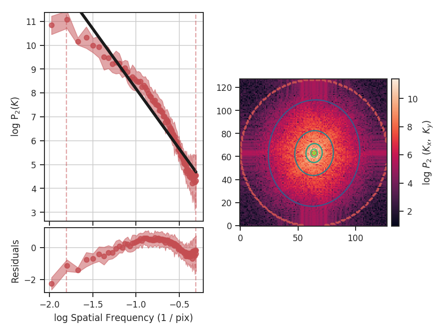
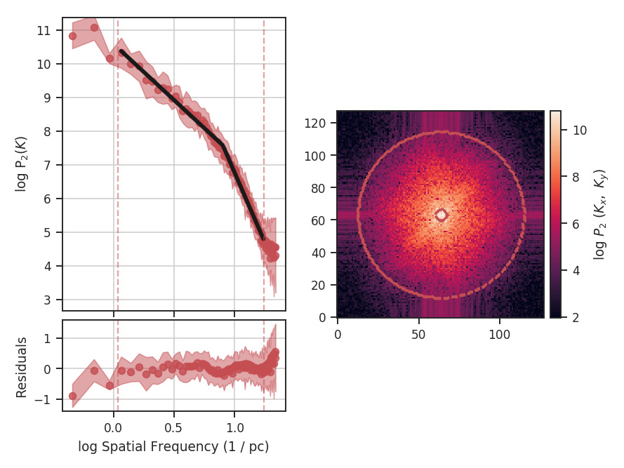

.. _pspec_tutorial:

**********************
Spatial Power Spectrum
**********************

Overview
--------

A common analysis technique for two-dimensional images is the spatial power spectrum -- the square of the 2D Fourier transform of the image. A radial profile of the 2D power spectrum gives the 1D power spectrum. The slope of this 1D spectrum can be compared to the expected indices in different physical limits. For example, the velocity field of Kolmogorov turbulence follows :math:`k^{-5/3}`, while Burgers' turbulence has :math:`k^{-2}`. However, observations are a combination of both velocity and density fluctuations (e.g., :ref:`Lazarian & Pogosyan 2000 <ref-lp00>`), and the measured index from an integrated intensity map depend on both components, as well as optical depth effects. For a turbulent optically thin tracer, an integrated intensity image (or zeroth moment) will have :math:`k^{-11/3}`, while an optically thick tracer saturates to :math:`k^{-3}` (:ref:`Lazarian & Pogosyan 2004 <ref-lp04>`, :ref:`Burkhart et al. 2013 <ref-burkhart2013>`). The effect of velocity resolution is discussed in the :ref:`VCA tutorial <vca_tutorial>`.

Using
-----

**The data in this tutorial are available** `here <https://girder.hub.yt/#user/57b31aee7b6f080001528c6d/folder/59721a30cc387500017dbe37>`_.

We need to import the `~turbustat.statistics.PowerSpectrum` code, along with a few other common packages:

    >>> from turbustat.statistics import PowerSpectrum
    >>> from astropy.io import fits

And we load in the data:

    >>> moment0 = fits.open("Design4_flatrho_0021_00_radmc_moment0.fits")[0]  # doctest: +SKIP

The power spectrum is computed using:

    >>> pspec = PowerSpectrum(moment0, distance=250 * u.pc)  # doctest: +SKIP
    >>> pspec.run(verbose=True, xunit=u.pix**-1)  # doctest: +SKIP
                                OLS Regression Results
    ==============================================================================
    Dep. Variable:                      y   R-squared:                       0.970
    Model:                            OLS   Adj. R-squared:                  0.969
    Method:                 Least Squares   F-statistic:                     1017.
    Date:                Mon, 03 Jul 2017   Prob (F-statistic):           7.94e-26
    Time:                        18:40:13   Log-Likelihood:                 15.718
    No. Observations:                  34   AIC:                            -27.44
    Df Residuals:                      32   BIC:                            -24.38
    Df Model:                           1
    Covariance Type:            nonrobust
    ==============================================================================
                     coef    std err          t      P>|t|      [0.025      0.975]
    ------------------------------------------------------------------------------
    const          5.1333      0.109     47.020      0.000       4.911       5.356
    x1            -3.2859      0.103    -31.896      0.000      -3.496      -3.076
    ==============================================================================
    Omnibus:                        5.932   Durbin-Watson:                   0.798
    Prob(Omnibus):                  0.052   Jarque-Bera (JB):                4.380
    Skew:                          -0.796   Prob(JB):                        0.112
    Kurtosis:                       3.745   Cond. No.                         7.99
    ==============================================================================

The power spectrum of this simulation has a slope of :math:`-3.3\pm0.1`, but the power-spectrum deviates from a power-law on small scales. This is due to the the limited inertial range in this simulation. The spatial frequencies used in the fit can be limited by setting `low_cut` and `high_cut`. The inputs should have frequency units in pixels, angle, or physical units. For example,

    >>> pspec.run(verbose=True, xunit=u.pix**-1, low_cut=0.02 / u.pix, high_cut=0.1 / u.pix)  # doctest: +SKIP
                                OLS Regression Results
    ==============================================================================
    Dep. Variable:                      y   R-squared:                       0.952
    Model:                            OLS   Adj. R-squared:                  0.948
    Method:                 Least Squares   F-statistic:                     255.7
    Date:                Mon, 03 Jul 2017   Prob (F-statistic):           6.26e-10
    Time:                        18:40:25   Log-Likelihood:                 10.458
    No. Observations:                  15   AIC:                            -16.92
    Df Residuals:                      13   BIC:                            -15.50
    Df Model:                           1
    Covariance Type:            nonrobust
    ==============================================================================
                     coef    std err          t      P>|t|      [0.025      0.975]
    ------------------------------------------------------------------------------
    const          5.8480      0.220     26.566      0.000       5.372       6.324
    x1            -2.7359      0.171    -15.991      0.000      -3.106      -2.366
    ==============================================================================
    Omnibus:                        0.822   Durbin-Watson:                   2.075
    Prob(Omnibus):                  0.663   Jarque-Bera (JB):                0.621
    Skew:                          -0.448   Prob(JB):                        0.733
    Kurtosis:                       2.562   Cond. No.                         13.5
    ==============================================================================

.. image:: images/design4_pspec_limitedfreq.png

When limiting the fit to the inertial range, the slope is :math:`-2.7\pm0.2`. `low_cut` and `high_cut` can also be given as spatial frequencies in angular units (e.g., `u.deg**-1`). And since a distance was specified, the `low_cut` and `high_cut` can also be given in physical frequency units (e.g., `u.pc**-1`).

Breaks in the power-law behaviour in observations (and higher-resolution simulations) can result from differences in the physical processes dominating at those scales. To capture this behaviour, `PowerSpectrum` can be passed a break point to enable fitting with a segmented linear model (`~turbustat.statistics.Lm_Seg`):

    >>> pspec.run(verbose=True, xunit=u.pc**-1, low_cut=0.02 / u.pix, high_cut=0.4 / u.pix, brk=0.1 / u.pix, log_break=False)  # doctest: +SKIP
                                OLS Regression Results
    ==============================================================================
    Dep. Variable:                      y   R-squared:                       0.994
    Model:                            OLS   Adj. R-squared:                  0.994
    Method:                 Least Squares   F-statistic:                     4024.
    Date:                Tue, 04 Jul 2017   Prob (F-statistic):           1.49e-75
    Time:                        11:16:04   Log-Likelihood:                 53.270
    No. Observations:                  71   AIC:                            -98.54
    Df Residuals:                      67   BIC:                            -89.49
    Df Model:                           3
    Covariance Type:            nonrobust
    ==============================================================================
                     coef    std err          t      P>|t|      [0.025      0.975]
    ------------------------------------------------------------------------------
    const          5.3112      0.094     56.790      0.000       5.124       5.498
    x1            -3.1436      0.085    -36.871      0.000      -3.314      -2.973
    x2            -5.0891      0.205    -24.853      0.000      -5.498      -4.680
    x3            -0.0015      0.054     -0.028      0.978      -0.109       0.106
    ==============================================================================
    Omnibus:                        9.165   Durbin-Watson:                   1.075
    Prob(Omnibus):                  0.010   Jarque-Bera (JB):                8.822
    Skew:                          -0.747   Prob(JB):                       0.0121
    Kurtosis:                       3.867   Cond. No.                         21.5
    ==============================================================================

`brk` is the initial guess at where the break point is. Here I've set it to the extent of the inertial range of the simulation. `log_break` should be enabled if the given `brk` is already the log (base-10) value (since the fitting is done in log-space). The segmented linear model iteratively optimizes the location of the break point, trying to minimize the gap between the different components. This is the `x3` parameter above. The slopes of the components are `x1` and `x2`, but the second slope is defined *relative to the first slope* (i.e., if `x2=0`, the slopes of the components would be the same). The true slopes can be accessed through `pspec.slope` and `pspec.slope_err`. The location of the fitted break point is given by `pspec.brk`, and its uncertainty `pspec.brk_err`. If the fit does not find a good break point, it will revert to a linear fit without the break.

References
----------

.. _ref-burkhart2013:

`Burkhart et al. 2013 <https://ui.adsabs.harvard.edu/#abs/2013ApJ...771..123B/abstract>`_

.. _ref-lp04:

`Lazarian & Pogosyan 2004 <https://ui.adsabs.harvard.edu/#abs/2004ApJ...616..943L/abstract>`_

.. _ref-lp00:

`Lazarian & Pogosyan 2000 <https://ui.adsabs.harvard.edu/#abs/2000ApJ...537..720L/abstract>`_
