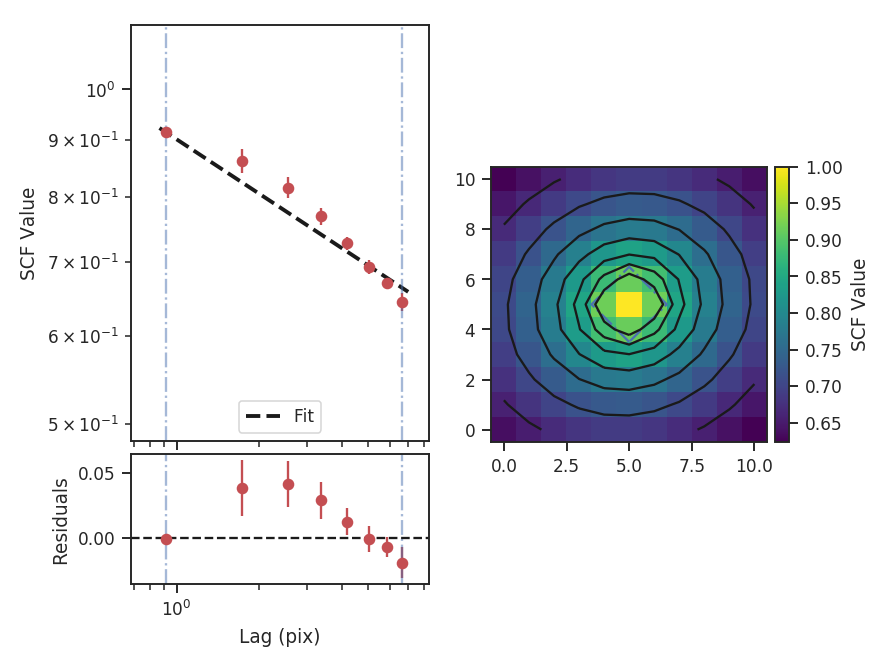

***********************************
Spectral Correlation Function (SCF)
***********************************

Overview
--------

The Spectral Correlation Function was introduced by :ref:`Rosolowsky et al. 1999 <ref-rosolowsky1999>` and :ref:`Padoan et al. 2001 <ref-padoan2001>` to quantify the correlation of a spectral-line data cube as a function of spatial separation. Formally, this can be expressed as

.. math::

    S(\boldsymbol{\ell}) = 1 - \left\langle \sqrt{\frac{\sum_v
    |I(\mathbf{x},v)-I(\mathbf{x}+\boldsymbol{\ell},v)|^2}{\sum_v
    |I(\mathbf{x},v)|^2+\sum_v |I(\mathbf{x}+\boldsymbol{\ell},v)|^2}}\right\rangle_{\mathbf{x}}.

:math:`S(\boldsymbol{\ell})` is the total correlation between the cube, and the cube shifted by the *lag*, the vector :math:`\boldsymbol{\ell}=(\Deltax, \Deltay)`. By repeating this process for a series of :math:`\Deltax, \Deltay)` in the spatial dimensions, a 2D correlation surface is created. This surface describes the spatial scales on which the spectral features begin to change.

The correlation surface can be further simplified by computing an azimuthal average, yielding a 1D spectrum of the correlation vs. length of the lag vector. This form, as is presented in XXX and XXX, yields a power-law relation, whose slope can be used to quantify differences between different spectral cubes. An example of this comparison is the study by :ref:`Gaches et al. 2015 <ref-gaches2015>`, where the effect of chemical species analyzed is traced through changes in the SCF slope.

Using
-----

**The data in this tutorial are available** `here <https://girder.hub.yt/#user/57b31aee7b6f080001528c6d/folder/57e55670a909a80001d301ae>`_.

Importing a few common packages:

    >>> from turbustat.statistics import SCF
    >>> from astropy.io import fits

And we load in the data:

    >>> cube = fits.open("Design4_21_0_0_flatrho_0021_13co.fits")[0]  # doctest: +SKIP

The cube and lags to use are given to initialize the `~turbustat.statistics.SCF`  class:

    >>> scf = SCF(cube, size=11)  # doctest: +SKIP

`size` describes the total size of one dimension of the correlation surface. Thus `size=11` will compute up to a lag size of 5 pixels in each direction. Alternatively, a set of custom lag values can be passed using `roll_lags`. No restriction is placed on the values of these lags, however the azimuthally average spectrum is only usable if the given lags are symmetric with positive and negative values.

To compute the SCF, we run:

    >>> scf.run(verbose=True)  # doctest: +SKIP
                                WLS Regression Results
    ==============================================================================
    Dep. Variable:                      y   R-squared:                       0.991
    Model:                            WLS   Adj. R-squared:                  0.989
    Method:                 Least Squares   F-statistic:                     658.8
    Date:                Thu, 27 Oct 2016   Prob (F-statistic):           2.31e-07
    Time:                        22:48:36   Log-Likelihood:                 28.480
    No. Observations:                   8   AIC:                            -52.96
    Df Residuals:                       6   BIC:                            -52.80
    Df Model:                           1
    Covariance Type:            nonrobust
    ==============================================================================
                     coef    std err          t      P>|t|      [95.0% Conf. Int.]
    ------------------------------------------------------------------------------
    const         -0.1258      0.005    -23.019      0.000        -0.139    -0.112
    x1            -0.2355      0.009    -25.667      0.000        -0.258    -0.213
    ==============================================================================
    Omnibus:                        1.126   Durbin-Watson:                   0.998
    Prob(Omnibus):                  0.570   Jarque-Bera (JB):                0.708
    Skew:                           0.371   Prob(JB):                        0.702
    Kurtosis:                       1.745   Cond. No.                         4.36
    ==============================================================================

The summary plot shows the correlation surface, a histogram of correlation values, and the 1D spectrum from the azimuthal average, plotted with the power-law fit. A weighted least-squares fit is used to find the slope of the SCF spectrum, where the inverse squared standard deviation from the azimuthal average are used as the weights.

Real data may not have a spectrum described by a single power-law. In this case, the fit limits can be specified using `xlow` and `xhigh`. These cutoffs correspond to log pixel scales.

    >>> scf.run(verbose=True, xlow=1, xhigh=np.log10(5))  # doctest: +SKIP
                                WLS Regression Results
    ==============================================================================
    Dep. Variable:                      y   R-squared:                       0.992
    Model:                            WLS   Adj. R-squared:                  0.989
    Method:                 Least Squares   F-statistic:                     263.7
    Date:                Thu, 27 Oct 2016   Prob (F-statistic):            0.00377
    Time:                        23:09:26   Log-Likelihood:                 17.473
    No. Observations:                   4   AIC:                            -30.95
    Df Residuals:                       2   BIC:                            -32.17
    Df Model:                           1
    Covariance Type:            nonrobust
    ==============================================================================
                     coef    std err          t      P>|t|      [95.0% Conf. Int.]
    ------------------------------------------------------------------------------
    const         -0.0993      0.009    -11.261      0.008        -0.137    -0.061
    x1            -0.2746      0.017    -16.238      0.004        -0.347    -0.202
    ==============================================================================
    Omnibus:                          nan   Durbin-Watson:                   2.120
    Prob(Omnibus):                    nan   Jarque-Bera (JB):                0.466
    Skew:                           0.120   Prob(JB):                        0.792
    Kurtosis:                       1.345   Cond. No.                         10.3
    ==============================================================================

The slope has steepened a bit, but the simulated cube gives a near power-law relation already. See Figure 8 in :ref:`Padoan et al. 2001 <ref-padoan2001>` shows deviations from power-law behaviour.

Computing the SCF is one of the more computationally expensive statistics in TurbuStat. This is due to shifting the entire cube along the spatial dimensions for each value in the correlation surface. The results of the SCF can be saved to avoid recomputing the statistic. As for the dendrogram statistics, the class is pickled:

    >>> scf.save_results(output_name="Design4_SCF", keep_data=False)  # doctest: +SKIP

`keep_data` will remove the data cube before saving. Having saved the results, they can be reloaded using:

    >>> scf = SCF.load_results("Design4_SCF.pkl")  # doctest: +SKIP

Note that using `keep_data=False` means the loaded version cannot be used to recalculate the SCF.

References
----------

.. _ref-rosolowsky1999:

`Rosolowsky et al. 1999 <XXX>`_

.. _ref-padoan2001:

`Padoan et al. 2001 <XXX>`_

.. _ref-gaches2015:

`Gaches et al. 2015 <XXX>`_
