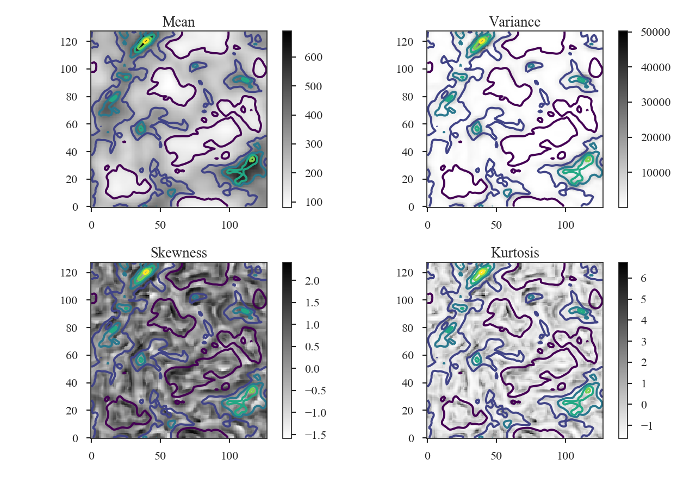

*******************
Statistical Moments
*******************

Overview
--------

A commonly used analysis technique with spectral-line data cubes is to find the moment of each spectrum (:ref:`Falgarone et al. 1994 <ref-falgarone1994>`). Alternatively, similar moment can be computed over spatial areas about each pixel. This was introduced by :ref:`Burkhart et al. 2010 <ref-burkhart2010>`, and provides an estimate of the variation in the intensity. Using different neighborhood sizes to compute these statistics will emphasize or hide variations on different spatial scales.

For the purpose of comparison between these spatial moment maps, :ref:`Burkhart et al. 2010 <ref-burkhart2010>` recommend using the third and fourth moments - the skewness and kurtosis, respectively - since they are independent of the mean and normalized by the standard deviation.

Using
-----

**The data in this tutorial are available** `here <https://girder.hub.yt/#user/57b31aee7b6f080001528c6d/folder/57e55670a909a80001d301ae>`_.

Import a few packages that are needed and read-in the zeroth moment:

    >>> from astropy.io import fits
    >>> from turbustat.statistics import StatMoments
    >>> moment0 = fits.open("Design4_21_0_0_flatrho_0021_13co.moment0.fits")[0] # doctest: +SKIP

The moment0 HDU and radius of the neighborhood (in pixels) are given to initialize `~turbustat.statistics.StatMoments`:

    >>> moments = StatMoments(moment0, radius=5, periodic=True)  # doctest: +SKIP

In this case, the simulation has periodic boundaries. The spatial moment arrays can then be computed:

    >>> moments.run(verbose=True)  # doctest: +SKIP

The mean array is simply a smoothed version of the zeroth moment. Overlaid on all four plots are the intensity contours from the zeroth moment.

Recomputing the moments with a larger radius shows variations on a larger scale:

    >>> moments = StatMoments(moment0, radius=5, periodic=True).run(verbose=True)  # doctest: +SKIP

.. image:: images/design4_statmoments_radius10.png

References
----------

.. _ref-falgarone1994:

`Falgarone et al. 1994 <XXX>`_

.. _ref-burkhart2010:

`Burkhart et al. 2010 <XXX>`_
