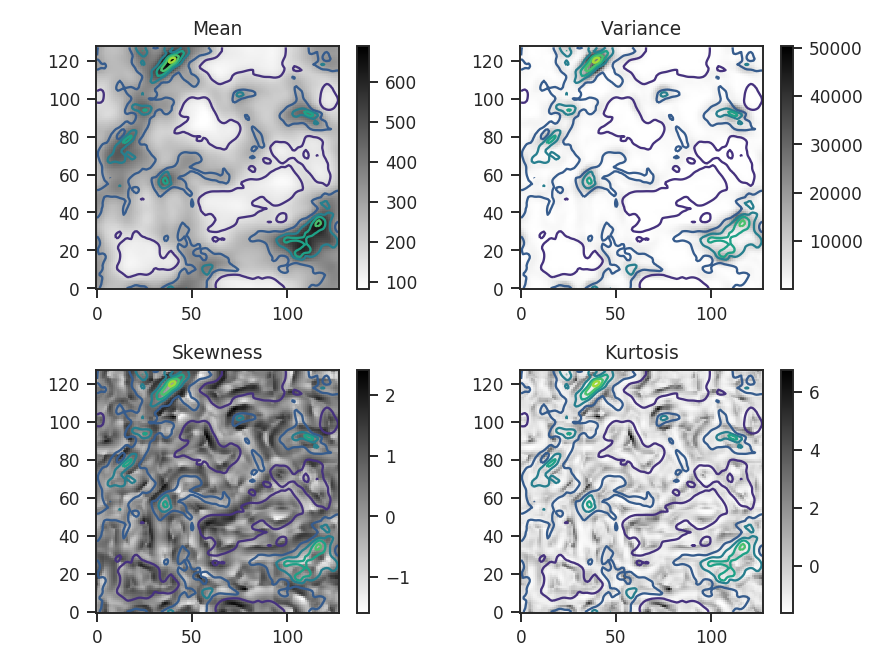
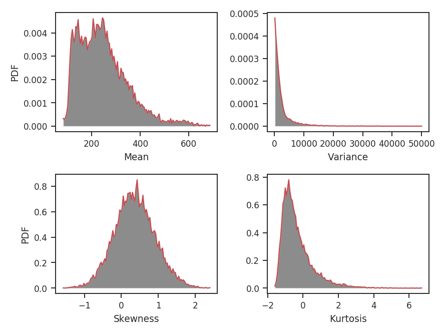
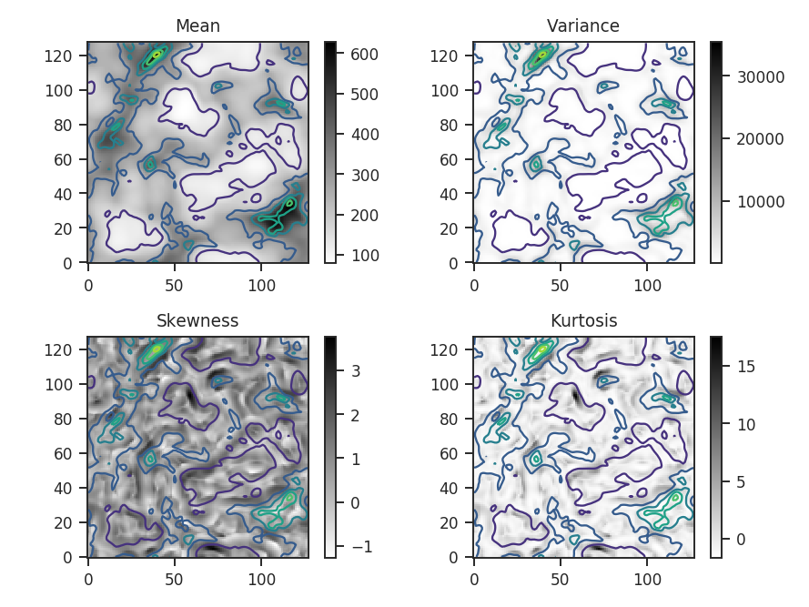
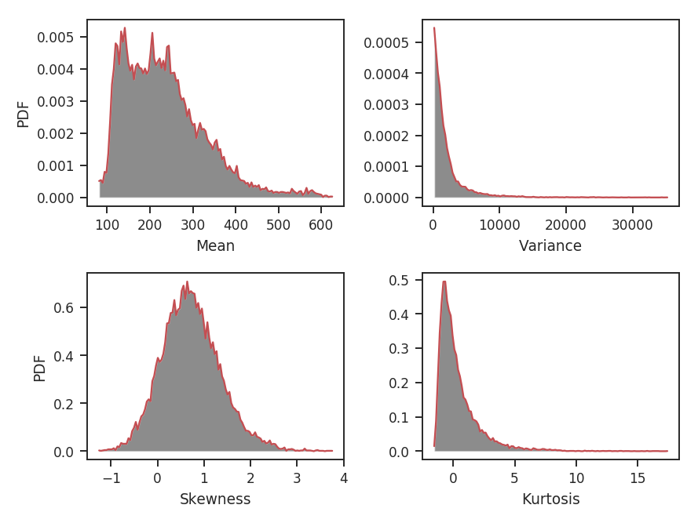
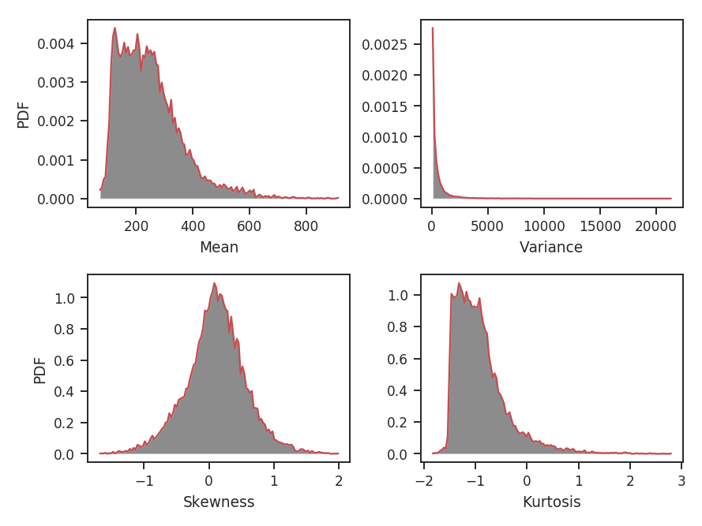
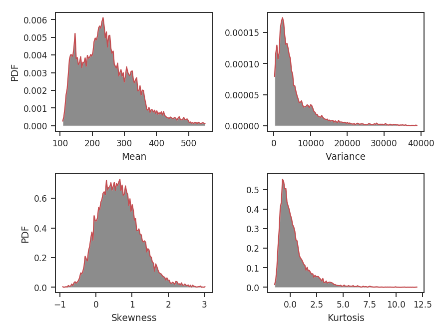
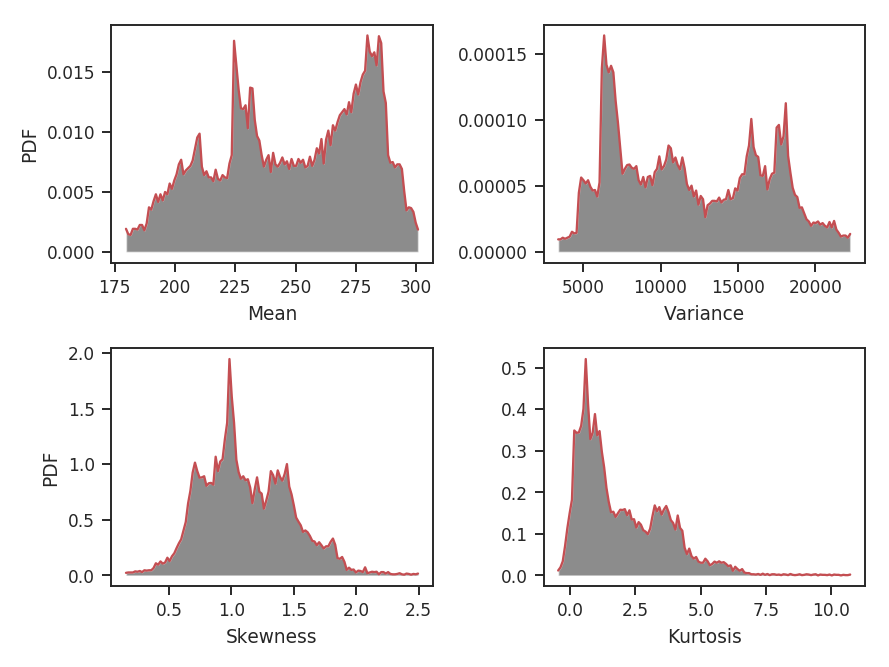
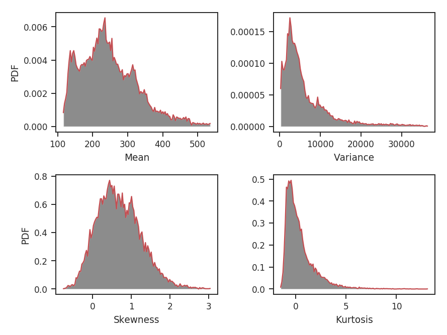

.. _statmoments_tutorial:

*******************
Statistical Moments
*******************

Overview
--------

A commonly used analysis technique with spectral-line data cubes is to find the moment of each spectrum (`Falgarone et al. 1994 <https://ui.adsabs.harvard.edu/#abs/1994ApJ...436..728F/abstract>`_). Alternatively, moments can be computed using the distribution of values in an image or a region within an image. This idea was introduced by `Kowal et al. 2007 <https://ui.adsabs.harvard.edu/#abs/2007ApJ...658..423K/abstract>`_ and extended in `Burkhart et al. 2010 <https://ui.adsabs.harvard.edu/#abs/2010ApJ...708.1204B/abstract>`_, who computed the mean, variance, skewness, and kurtosis within circular regions across an image. These moments provide an estimate of how the intensity structure varies across an image. Using different neighborhood sizes to compute these statistics will emphasize or hide variations on the different spatial scales.

The moments have the following definitions measured within a circular neighborhood :math:`|\mathbf{x}'-\mathbf{x}|\le r` with radius :math:`r` on a two-dimensional image :math:`I`:

The mean is defined as:

.. math::

    \mu_r(\mathbf{x}) = \frac{\sum_{|\mathbf{x}'-\mathbf{x}|\le r} w_i(\boldsymbol{x}) I(\boldsymbol{x})}{\sum_{|\mathbf{x}'-\mathbf{x}|\le r} w_i(\boldsymbol{x})}

where :math:`I(\boldsymbol{x})` are the values within the neighborhood region, and :math:`w_i` is the noise variance at that position (e.g., for a zeroth moment map :math:`M_0(\boldsymbol{x})`, :math:`w_i(\boldsymbol{x}) = [\sigma_{M_0}(\boldsymbol{x})]`).

The variance is defined as:

.. math::

    \sigma^2_r(\boldsymbol{x}) \equiv \frac{\sum_{|\mathbf{x}'-\mathbf{x}|\le r} w_i(\boldsymbol{x}) \left( I - \mu_r(\mathbf{x}) \right)^2}{\sum{|\mathbf{x}'-\mathbf{x}|\le r} w_i(\boldsymbol{x})}.

The skewness is defined as:

.. math::

    \gamma_{3,r}(\mathbf{x}) \equiv \frac{\sum_{|\mathbf{x}'-\mathbf{x}|\le r} w(\mathbf{x}')\left[\frac{I(\mathbf{x}')-\mu_r(\mathbf{x})}{\sigma_r(\mathbf{x})}\right]^3}{\sum_{|\mathbf{x}'-\mathbf{x}|\le r} w(\mathbf{x}')}.

And the kurtosis is defined as:

.. math::

    \gamma_{4,r}(\mathbf{x}) \equiv \frac{\sum_{|\mathbf{x}'-\mathbf{x}|\le r} w(\mathbf{x}') \left[\frac{I(\mathbf{x}')-\mu_r(\mathbf{x})}{\sigma_r(\mathbf{x})}\right]^4}{\sum_{|\mathbf{x}'-\mathbf{x}|\le r} w(\mathbf{x}')} - 3.

For the purpose of comparing these spatial moment maps between data sets, `Burkhart et al. 2010 <https://ui.adsabs.harvard.edu/#abs/2010ApJ...708.1204B/abstract>`_ recommend using the third and fourth moments---the skewness and kurtosis, respectively---since they are independent of the mean and normalized by the standard deviation.

Using
-----

**The data in this tutorial are available** `here <https://girder.hub.yt/#user/57b31aee7b6f080001528c6d/folder/59721a30cc387500017dbe37>`_.

Import a few packages that are needed and read-in the zeroth moment:

    >>> import numpy as np
    >>> from astropy.io import fits
    >>> import astropy.units as u
    >>> from turbustat.statistics import StatMoments
    >>> moment0 = fits.open("Design4_flatrho_0021_00_radmc_moment0.fits")[0] # doctest: +SKIP

The moment0 HDU and radius of the neighborhood are given to initialize `~turbustat.statistics.StatMoments`:

    >>> moments = StatMoments(moment0, radius=5 * u.pix)  # doctest: +SKIP

This simulated data has periodic boundaries, so we enable `periodic=True` when computing the spatial moment maps:

    >>> moments.run(verbose=True, periodic=True, min_frac=0.8)  # doctest: +SKIP

Overlaid on all four plots are the intensity contours from the zeroth moment, making it easier to compare the moment structures to the intensity. Some of the moment maps are more useful than others. For example the mean array is simply a smoothed version of the zeroth moment. The variance map scales closely with the peaks in emission. The skewness and kurtosis maps show perhaps the more interesting products. Both emphasize regions with sharper gradients in the intensity map, and since both are scaled by the variance, they are independent of the intensity scaling.

The moment maps are shown above, but the distributions of the moments are of greater interest for comparing with other data sets. `~turbustat.statistics.StatMoments.plot_histograms` plots, and optionally saves, the histograms:

    >>> moments.plot_histograms()  # doctest: +SKIP

Again, the mean is just a smoothed version of the zeroth moment values. The variance has a strong tail, emphasized by the square term at high intensity peak in the map. The skewness and kurtosis provide distributions of normalized parameters, making it easier to use these quantities for comparing to other data sets.

This example does not include any blanked regions, though observational data often do. To avoid edge effects near these regions, a limit can be set on the minimum fraction of finite points within each region with `min_frac`. By default, `min_frac` is set to 0.8. To completely remove edge effects, this parameter can be increased to 1 to reject all regions that contain a NaN. Note that this will increase the size of the blank region by your chosen radius.

.. warning:: This example uses data that are noiseless. If these data *did* have noise, it would be critical to remove the noise-dominated regions when computing the skewness and kurtosis, in particular, since they are normalized by the variance. To minimize the effect of noise, the data can be masked beforehand or an array of weights can be passed to down-weight noisy regions. We recommend using the latter method. For example, a weight array could be the inverse squared noise level of the data. Assume the noise level is set to make the signal-to-noise ratio 10 for every pixel in the map:

    >>> np.random.seed(3434789)
    >>> noise = moment0.data * 0.1 + np.random.normal(0, 0.1, size=moment0.data.shape)  # doctest: +SKIP
    >>> moments_weighted = StatMoments(moment0, radius=5 * u.pix,
    ...                                weights=noise**-2)  # doctest: +SKIP
    >>> moments_weighted.run(verbose=True, periodic=True)  # doctest: +SKIP

And the associated histograms:

    >>> moments_weighted.plot_histograms()  # doctest: +SKIP

An important consideration when choosing the radius is the balance between tracking small-scale variations and the increased uncertainty when estimating the moments with less data. `Burkhart et al. 2010 <https://ui.adsabs.harvard.edu/#abs/2010ApJ...708.1204B/abstract>`_ use approximate formulae for the standard errors of skewness and kurtosis for a normal distribution that are valid for large samples. These are :math:`\sqrt{6 / n}` for skewness and :math:`\sqrt{24 / n}` for kurtosis, where :math:`n` is the number of points. This also assumes all of these points are *independent* of each other. This typically is not true of observational data, where the data are correlated on at least the beam scale. Each of these points should be considered when choosing the minimum radius appropriate for the data set. For more information on the standard errors, see the sections on `skewness <https://en.wikipedia.org/wiki/Skewness#Sample_skewness>`_ and `kurtosis <https://en.wikipedia.org/wiki/Kurtosis#Sample_kurtosis>`_ on their Wikipedia pages.

What happens if the radius is chosen to be too small, making the higher-order moments highly uncertain? A new radius can be given to `~turbustat.statistics.StatMoments.run` to replace the first one given:

    >>> moments.run(verbose=False, radius=2 * u.pix)  # doctest: +SKIP
    >>> moments.plot_histograms()  # doctest: +SKIP

The skewness distribution is narrower, but the kurtosis is wider. The kurtosis uncertainty is larger than the skewness uncertainty, leading to a broader distribution. What are the distribution shapes using larger radii?

    >>> moments.run(verbose=False, radius=10 * u.pix)  # doctest: +SKIP
    >>> moments.plot_histograms()  # doctest: +SKIP

The skewness and kurtosis distributions are not significantly different from the first example, which used `radius=5 * u.pix`. This seems to suggest that radii in this range give values that are not primarily dominated by the measurement uncertainty. The variance distribution has changed though: its peak is no longer at 0. When averaging over a region larger than the size of most of the structure, the peak of the variance should start to become larger than 0. How about computing moments over a much larger radius?

    >>> moments.run(verbose=False, radius=32 * u.pix)  # doctest: +SKIP
    >>> moments.plot_histograms()  # doctest: +SKIP

This is clearly too large of a region to be using for this data. A radius of 32 pixels means using a circular region half the size of the image, and there are artifacts dominated by single prominent features in the map, leading to weird multi-model moment distributions.

Because this method relies significantly on the pixel size of the map (for small radii), comparing data sets is best done on a common grid. However, if larger radii are being used, the pixel-to-pixel variation will not be as important.

Often it is more convenient to specify scales in angular or physical units, rather than pixels. `radius` can be given as either, so long as a distance is provided. For example, assume the distance to the cloud in this data is 250 pc and we want the radius to be 0.23 pc:

    >>> moments = StatMoments(moment0, radius=0.23 * u.pc)  # doctest: +SKIP
    >>> moments.run(verbose=False, periodic=True)  # doctest: +SKIP
    >>> moments.plot_histograms()  # doctest: +SKIP

When a radius is given in angular or physical units, the radius of the region used is rounded *down* to the nearest integer. In this case, 0.23 pc rounds down to 10 pixels and we find the same distributions shown above for the `radius=10*u.pix` case.

References
----------

`Falgarone et al. 1994 <https://ui.adsabs.harvard.edu/#abs/1994ApJ...436..728F/abstract>`_

`Padoan et al. 1999 <https://ui.adsabs.harvard.edu/#abs/1999ApJ...525..318P/abstract>`_

`Kowal et al. 2007 <https://ui.adsabs.harvard.edu/#abs/2007ApJ...658..423K/abstract>`_

`Burkhart et al. 2009 <https://ui.adsabs.harvard.edu/#abs/2009ApJ...693..250B/abstract>`_

`Burkhart et al. 2010 <https://ui.adsabs.harvard.edu/#abs/2010ApJ...708.1204B/abstract>`_

`Burkhart et al. 2013 <https://ui.adsabs.harvard.edu/#abs/2013ApJ...771..122B/abstract>`_

`Burkhart et al. 2015 <https://ui.adsabs.harvard.edu/#abs/2015ApJ...808...48B/abstract>`_
