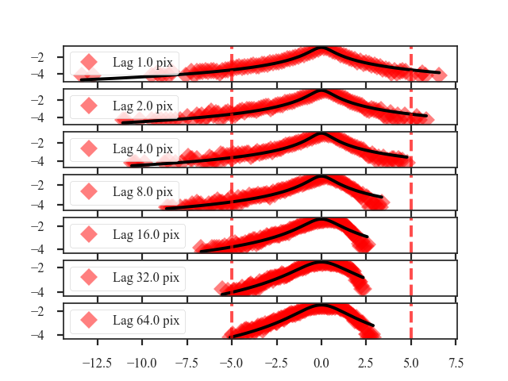
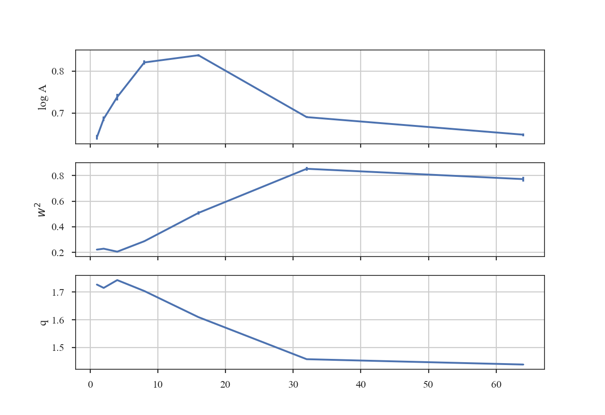
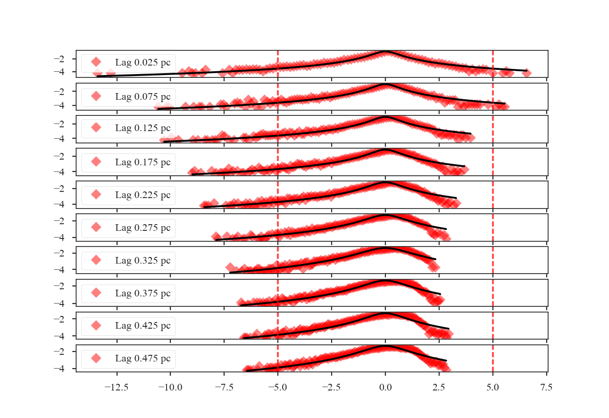
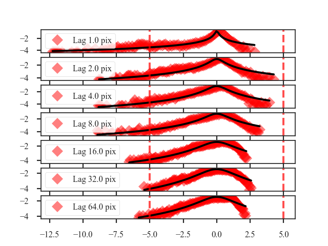
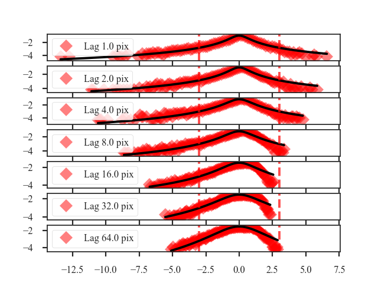
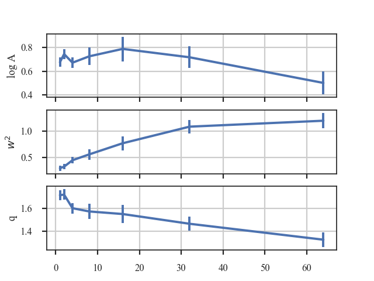

******************
Tsallis Statistics
******************

Overview
--------

The `Tsallis statistic <https://en.wikipedia.org/wiki/Tsallis_statistics>`_ was introduced by `Tsallis 1988 <https://link.springer.com/article/10.1007%2FBF01016429>`_ for describing multi-fractal (non-Gaussian) systems. Its use for describing properties of the ISM has been explored in `Esquivel & Lazarian 2010 <https://ui.adsabs.harvard.edu/#abs/2010ApJ...710..125E/abstract>`_ and `Tofflemire et al. 2011 <https://ui.adsabs.harvard.edu/#abs/2011ApJ...736...60T/abstract>`_. In both of these works, they consider describing an incremental lags in a field by the Tsallis distribution. The specific form of this Tsallis distribution is the `q-Gaussian distribution <https://en.wikipedia.org/wiki/Q-Gaussian_distribution>`_:

.. math::
    R_q = a \left[ 1 + \left( q - 1 \right) \frac{\left[ \Delta f(r) \right]^2}{w^2} \right]^{\frac{-1}{q - 1}}

where :math:`a` is the normalization, :math:`q` controls how "peaked" the distribution is (and is therefore closely related to the kurtosis; :ref:`Moments tutorial <statmoments_tutorial>`), and :math:`w` is the width of the distribution. As :math:`q \rightarrow 1` the distribution approaches a Gaussian, while :math:`q > 1` gives a flattened distribution with heavier tails. The field is a standardized measure of some quantity: :math:`\Delta f(r) = \left[ f(x, r) - \left< f(x, r) \right>_x \right] / \sqrt{{\rm var}\left[f(x, r)\right]}`, where the angle brackets indicate an average over :math:`x`. The input quantity is the difference over some scale :math:`r` of a field :math:`f(x)`:  :math:`f(x, r) = f(x) - f(x + r)`. The :math:`x, r` are vectors for multi-dimensional data and the formalism is valid for any dimension of data. One distribution is generated for each scale :math:`r`, and the variation of the distribution parameters with changing :math:`r` can be tracked.

Both `Esquivel & Lazarian 2010 <https://ui.adsabs.harvard.edu/#abs/2010ApJ...710..125E/abstract>`_ and `Tofflemire et al. 2011 <https://ui.adsabs.harvard.edu/#abs/2011ApJ...736...60T/abstract>`_ calculate the Tsallis distribution properties for 3D (spatial) and 2D (column density) fields for different sets of simulations. Since TurbuStat is intended to work solely for observable quantities, only the integrated intensity or column density maps can currently be used.

Using
-----

**The data in this tutorial are available** `here <https://girder.hub.yt/#user/57b31aee7b6f080001528c6d/folder/59721a30cc387500017dbe37>`_.

We need to import the `~turbustat.statistics.Tsallis` code, along with a few other common packages:

    >>> from turbustat.statistics import Tsallis
    >>> from astropy.io import fits
    >>> import astropy.units as u
    >>> import numpy as np

And we load in the data:

    >>> moment0 = fits.open("Design4_flatrho_0021_00_radmc_moment0.fits")[0]  # doctest: +SKIP

With default values, the Tsallis distribution fits are calculated using:

    >>> tsallis = Tsallis(moment0).run(verbose=True)  # doctest: +SKIP
    lags      logA            w2             q         logA_stderr       w2_stderr         q_stderr      redchisq [1]
    pix
    ---- -------------- -------------- ------------- ---------------- ---------------- ---------------- --------------
     1.0 0.642229857292 0.222031894177 1.72708275041 0.00558780778548 0.00392936618184 0.00103432936045 0.202923321877
     2.0 0.686145334852 0.229079180855 1.71512052919 0.00601337392851 0.00465774887931 0.00120261353862 0.314920328798
     4.0 0.738130813081 0.205824741132 1.74329506331 0.00782571325777 0.00483708991946 0.00165192806993 0.455329606682
     8.0 0.820591668413 0.287364084649 1.70387371009 0.00512574211395 0.00699865080392  0.0016250542739  0.64092221368
    16.0  0.83785933956 0.508262278484 1.60949351842 0.00275789013817  0.0115039005934  0.0015760977175 0.613100600322
    32.0 0.690126682101 0.852684323374 1.45747128702 0.00207752670078  0.0150332422006 0.00122083964724 0.386135737083
    64.0 0.648192026832 0.772095703182 1.43822716004  0.0033147013027  0.0194318148758 0.00200724866629 0.556200738841

This returns an astropy table of the fits to each of the parameters, their standard errors, and the reduced :math:`\chi^2` values (`~turbustat.statistics.Tsallis.tsallis_table`). The figure shows the histograms at each lag and their respective fits. The solid black line is the fit and the dashed red lines indicated which data were used to fit the distribution. The x-axis shows the standardized values of the difference maps at each lag, such that the mean is zero and the standard deviation is one. Because of this, there is no mean parameter fit in the Tsallis distribution. Examining the histograms and the fits is useful for showing where the histograms deviate significantly from the model, something that is difficult to determine from the reduced :math:`\chi^2` values alone.

A key to the works of `Esquivel & Lazarian 2010 <https://ui.adsabs.harvard.edu/#abs/2010ApJ...710..125E/abstract>`_ and `Tofflemire et al. 2011 <https://ui.adsabs.harvard.edu/#abs/2011ApJ...736...60T/abstract>`_ is how the fit parameters vary at the different lags. Plots showing the fit parameters as a function of the lag can be shown by running:

    >>> tsallis.plot_parameters()  # doctest: +SKIP

The amplitude of the fit, shown on the top, simply sets the normalization. The more interesting shape parameters :math:`w^2` and :math:`q` are shown in the second and third panels. As explained in the overview, :math:`w^2` is analogous to the width of a Gaussian curve, while :math:`q` determines how peaked the distribution is and if closely related to the kurtosis.

.. warning:: These parameters are not independent in this fit! The plot shows that the two are anti-correlated. This means that their standard errors are underestimated, even if the requirements for the non-linear least squares fit are met by the data. When examining and interpreting the parameter fits, this covariance should be kept in mind.

The lag values were automatically determined in the previous example. The default lag size, when none are provided, is to use powers of two up to half of the smallest axis size in the image. The example data is a 128-by-128 pixel image and so the lags used are 1, 2, 4, 8, 16, 32, and 64 pixels. If custom values for the lags are given, they must have an attached unit in pixel, angular or physical units. The latter requires passing a distance to `~turbustat.statistics.Tsallis`. For example, assume that the region in the simulated data is located at a distance of 250 pc:

    >>> distance = 250 * u.pc
    >>> phys_lags = np.arange(0.025, 0.5, 0.05) * u.pc
    >>> tsallis = Tsallis(moment0, lags=phys_lags, distance=distance)  # doctest: +SKIP
    >>> tsallis.run(verbose=True)  # doctest: +SKIP
     lags      logA            w2             q         logA_stderr       w2_stderr          q_stderr      redchisq [1]
      pc
    ----- -------------- -------------- ------------- ---------------- ---------------- ----------------- --------------
    0.025 0.642229857292 0.222031894177 1.72708275041 0.00558780778548 0.00392936618184  0.00103432936045 0.202923321877
    0.075 0.705449362909 0.218319248608 1.72354565147 0.00737330905613 0.00519808619425  0.00152701310901 0.412646518168
    0.125 0.789721056553 0.229683344052 1.75057343162 0.00538732578554 0.00423363268573  0.00128094113344 0.409462321776
    0.175 0.812924754652  0.26193847697 1.72229438044 0.00582788661761 0.00641904864759   0.0016875791307 0.591453809951
    0.225 0.819013579917 0.327952306938 1.68254342712 0.00414539826435 0.00769391172561  0.00152138140139 0.602749326188
    0.275  0.84019947484  0.43700081371 1.65129052189 0.00319162263733    0.01060267014  0.00161948565142 0.572638168121
    0.325 0.775203769634 0.638231616687 1.55766127541 0.00157464300665  0.0112005405935 0.000945367175158 0.390439429254
    0.375  0.83785933956 0.508262278484 1.60949351842 0.00275789013817  0.0115039005934   0.0015760977175 0.613100600322
    0.425  0.82517267059 0.439101136039 1.61618300379 0.00412874845191  0.0131188204054  0.00230155968913 0.823108982477
    0.475 0.780592562471 0.538751135268 1.56786712441 0.00244860804161  0.0114898743283  0.00145531646909 0.571370986301

The lags given here correspond to pixel scales of 1 to about 21 pixels. Whenever lags are given that convert to a fraction of a pixel, the next smallest integer value is used as the lag. The lags given in the output table are always kept in the units they were given in, not the equivalent pixel size in the image.

Calculating the difference in the image at a given lag requires shuffling the data in different directions, and then taking its difference (similar to the :ref:`SCF <scf_tutorial>`). If the data is periodic in the spatial dimensions, like the example data used here, we want to keep the portion of the data that was rolled passed the edge. The periodic boundary handling is enabled by default. To disable treating the edges as periodic, `periodic=False` can be passed:

    >>> tsallis_noper = Tsallis(moment0).run(verbose=True, periodic=False)  # doctest: +SKIP
    lags      logA             w2             q         logA_stderr       w2_stderr         q_stderr      redchisq [1]
    pix
    ---- -------------- --------------- ------------- ---------------- ---------------- ---------------- --------------
     1.0 0.897012384613 0.0118349188867 2.23324265255   0.166620498872 0.00017563398593 0.00483817878284  1.05048714536
     2.0 0.896022807195  0.163157700047 1.82635786848  0.0143795839865 0.00540543040786 0.00328264939428 0.856843401609
     4.0 0.786658543433  0.300038576861 1.68212189627 0.00663851190583  0.0102461537338 0.00237396765607 0.760443068549
     8.0 0.783914175933  0.357145631871 1.65368430773  0.0046022510611  0.0103614381214 0.00184930165344 0.667505258089
    16.0 0.790689760595  0.674952448852   1.546507737 0.00215124566812  0.0142829674771 0.00129998567864 0.557924881035
    32.0 0.713731153997  0.771328751704 1.47897488745 0.00283752579166  0.0172594116452 0.00169658285939 0.475827962986
    64.0 0.783452488524  0.742301900184 1.52244838954 0.00300307934231  0.0179167808952 0.00177362923754 0.606593199807

The histograms are quite different, partially because we are throwing out extra data as the lags increase.

Throughout these examples, the fitting has been limited to :math:`\pm 5` of the standard deviation, as indicated by the dashed red lines in the histogram plots. If the limits need to be changed, the `sigma_clip` keyword can be passed:

    >>> tsallis = Tsallis(moment0).run(verbose=True, sigma_clip=3)  # doctest: +SKIP
    lags      logA            w2             q         logA_stderr       w2_stderr         q_stderr       redchisq [1]
    pix
    ---- -------------- -------------- ------------- ---------------- ---------------- ---------------- ---------------
     1.0 0.676668795627  0.29391426291 1.71669037083 0.00157383166087 0.00261634517218 0.00198839049982  0.057608469887
     2.0 0.745791738309 0.322366742708 1.72147347306 0.00183938037718 0.00274517409678 0.00215767963285 0.0624568707002
     4.0 0.673011928843 0.444372636313 1.60204004903 0.00201910360961 0.00408585675961 0.00216448599475 0.0701353589419
     8.0 0.726710296991 0.555894748784 1.57342987012 0.00563401682478 0.00969116551888 0.00448516671654  0.127621910509
    16.0 0.789370379072 0.767631108873 1.55063965451  0.0107467878091  0.0179646081854 0.00625731804422  0.166963375365
    32.0 0.718628894604  1.08365218957 1.46486083229 0.00825834877876  0.0154641791221  0.0038873537526 0.0866162406828
    64.0 0.502202769666  1.19658833745 1.32473447015 0.00947708275941  0.0217408584935 0.00436354465126  0.120069117864

Since there are still many points to fit, the fit qualities have not significantly worsened from lowering the sigma limit. However the fit parameters have changed:

The same basic trend of the fit parameters with increasing lag size can be seen, but the values have changed by a large amount. This is another example that caution needs to be used when interpreting the fit standard errors and the reduced :math:`\chi^2`.

One final parameter can be changed: the number of bins used to create the histogram. For most images, the number of data points will be large, and so the default bin number is set to be the square-root of the number of data points. This is a good estimate in the limit of many data points, but will become poor if there are less than :math:`\sim100` data points from the image. To change the number of bins used, `num_bins` can be passed to `~turbustat.statistics.Tsallis.run`.

References
----------

`Tsallis 1988 <https://link.springer.com/article/10.1007%2FBF01016429>`_

`Esquivel & Lazarian 2010 <https://ui.adsabs.harvard.edu/#abs/2010ApJ...710..125E/abstract>`_

`Tofflemire et al. 2011 <https://ui.adsabs.harvard.edu/#abs/2011ApJ...736...60T/abstract>`_

`Burkhart et al. 2013 <https://ui.adsabs.harvard.edu/#abs/2013ApJ...771..122B/abstract>`_

`Burkhart et al. 2015 <https://ui.adsabs.harvard.edu/#abs/2015ApJ...808...48B/abstract>`_

`Gonz'alez-Casanova et al. 2018 <https://ui.adsabs.harvard.edu/#abs/2018MNRAS.475.3324G>`_
