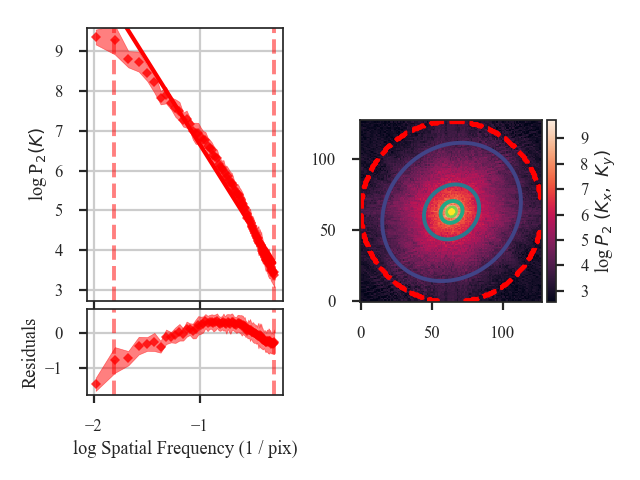
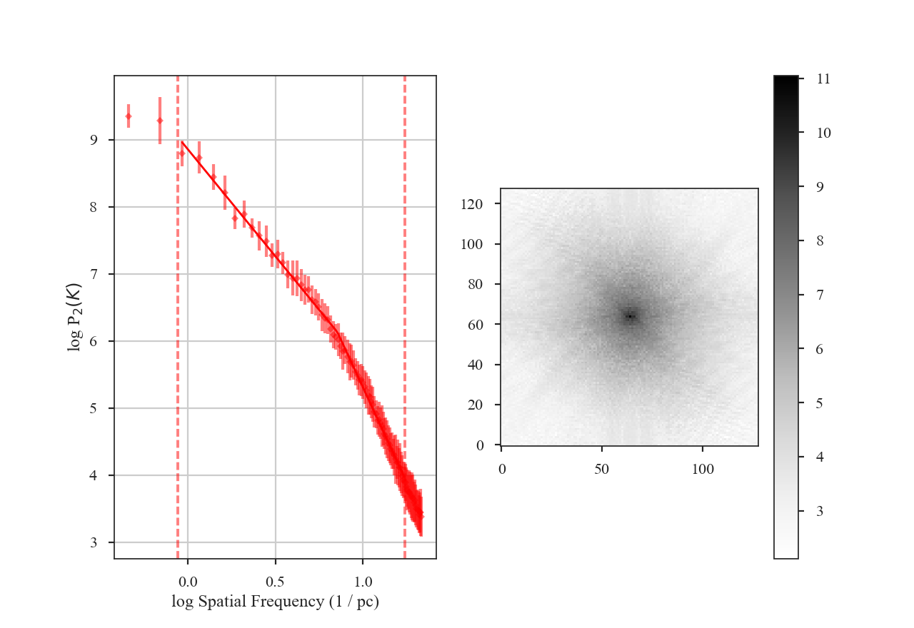
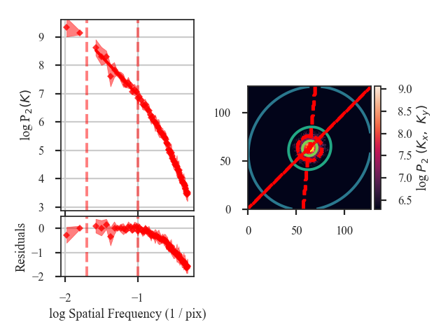

.. _vca_tutorial:

*******************************
Velocity Channel Analysis (VCA)
*******************************

Overview
--------

A major advantage of a spectral-line data cube, rather than an integrated two-dimensional image, is that it captures aspects of both the density and velocity fluctuations in the field of observation. `Lazarian & Pogosyan 2000 <https://ui.adsabs.harvard.edu/#abs/2000ApJ...537..720L/abstract>`_ and `Lazarian & Pogosyan 2004 <https://ui.adsabs.harvard.edu/#abs/2004ApJ...616..943L/abstract>`_ derived how the power spectrum from a cube depends on the statistics of the density and velocity fields for the 21-cm Hydrogen line, allowing for each of their properties to be examined (provided the data have sufficient spectral resolution).

The Lazarian & Pogosyan theory predicts two regimes based on the the power-spectrum slope: the *shallow* (:math:`n < -3`) and the *steep* (:math:`n < -3`) regimes. In the case of optically thick line emission, `Lazarian & Pogosyan 2004 <https://ui.adsabs.harvard.edu/#abs/2004ApJ...616..943L/abstract>`_ show that the slope saturates to :math:`n = -3` (see `Burkhart et al. 2013 <https://ui.adsabs.harvard.edu/#abs/2013ApJ...771..123B/abstract>`_ as well). The VCA predictions in these different regimes are shown in Table 1 of `Chepurnov & Lazarian 2009 <https://ui.adsabs.harvard.edu/#abs/2009ApJ...693.1074C/abstract>`_ (also see Table 3 in `Lazarian 2009 <https://ui.adsabs.harvard.edu/#abs/2009SSRv..143..357L/abstract>`_). The complementary :ref:`Velocity Coordinate Spectrum <vca_tutorial>` can be used in tandem with VCA.

Using
-----

**The data in this tutorial are available** `here <https://girder.hub.yt/#user/57b31aee7b6f080001528c6d/folder/59721a30cc387500017dbe37>`_.

We need to import the `~turbustat.statistics.VCA` class, along with a few other common packages:

    >>> from turbustat.statistics import VCA
    >>> from astropy.io import fits

And we load in the data cube:

    >>> cube = fits.open("Design4_flatrho_0021_00_radmc.fits")[0]  # doctest: +SKIP

The VCA spectrum is computed using:

    >>> vca = VCA(cube)  # doctest: +SKIP
    >>> vca.run(verbose=True)  # doctest: +SKIP
                                OLS Regression Results
    ==============================================================================
    Dep. Variable:                      y   R-squared:                       0.973
    Model:                            OLS   Adj. R-squared:                  0.973
    Method:                 Least Squares   F-statistic:                     3188.
    Date:                Thu, 20 Jul 2017   Prob (F-statistic):           1.75e-71
    Time:                        15:14:32   Log-Likelihood:                -1.2719
    No. Observations:                  91   AIC:                             6.544
    Df Residuals:                      89   BIC:                             11.57
    Df Model:                           1
    Covariance Type:            nonrobust
    ==============================================================================
                     coef    std err          t      P>|t|      [0.025      0.975]
    ------------------------------------------------------------------------------
    const          2.3928      0.058     41.036      0.000       2.277       2.509
    x1            -4.2546      0.075    -56.459      0.000      -4.404      -4.105
    ==============================================================================
    Omnibus:                        4.747   Durbin-Watson:                   0.069
    Prob(Omnibus):                  0.093   Jarque-Bera (JB):                4.622
    Skew:                          -0.550   Prob(JB):                       0.0992
    Kurtosis:                       2.916   Cond. No.                         4.40
    ==============================================================================

The code returns a summary of the one-dimensional fit and a figure showing the one-dimensional spectrum and model on the left, and the two-dimensional power-spectrum on the right. If `fit_2D=True` is set in `~turbustat.statistics.VCA.run` (the default setting), the contours on the two-dimensional power-spectrum are the fit using an elliptical power-law model. We will discuss the models in more detail below. The dashed red lines (or contours) on both plots are the limits of the data used in the fits. See the :ref:`PowerSpectrum tutorial <pspec_tutorial>` for a discussion of the two-dimensional fitting.

The VCA power spectrum from this simulated data cube is :math:`-4.25\pm0.08`, which is steeper than the power spectrum we found using the zeroth moment (:ref:`PowerSpectrum tutorial <pspec_tutorial>`). However, as was the case for the power-spectrum of the zeroth moment, there are deviations from a single power-law on small scales due to the :ref:`inertial range in the simulation <data_for_tutorial>`. The spatial frequencies used in the fit can be limited by setting `low_cut` and `high_cut`. The inputs should have frequency units in pixels, angle, or physical units. In this case, we will limit the fitting between frequencies of `0.02 / pix` and `0.1 / pix` (where the conversion to pixel scales in the simulation is just `1 / freq`):

    >>> vca.run(verbose=True, xunit=u.pix**-1, low_cut=0.02 / u.pix,
    ...         high_cut=0.1 / u.pix)  # doctest: +SKIP
                                OLS Regression Results
    ==============================================================================
    Dep. Variable:                      y   R-squared:                       0.985
    Model:                            OLS   Adj. R-squared:                  0.984
    Method:                 Least Squares   F-statistic:                     866.6
    Date:                Thu, 20 Jul 2017   Prob (F-statistic):           2.77e-13
    Time:                        15:28:29   Log-Likelihood:                 17.850
    No. Observations:                  15   AIC:                            -31.70
    Df Residuals:                      13   BIC:                            -30.28
    Df Model:                           1
    Covariance Type:            nonrobust
    ==============================================================================
                     coef    std err          t      P>|t|      [0.025      0.975]
    ------------------------------------------------------------------------------
    const          3.7695      0.134     28.031      0.000       3.479       4.060
    x1            -3.0768      0.105    -29.438      0.000      -3.303      -2.851
    ==============================================================================
    Omnibus:                        1.873   Durbin-Watson:                   2.409
    Prob(Omnibus):                  0.392   Jarque-Bera (JB):                1.252
    Skew:                          -0.684   Prob(JB):                        0.535
    Kurtosis:                       2.641   Cond. No.                         13.5
    ==============================================================================

With the fit limited to the valid region, we find a shallower slope of :math:`-3.1\pm0.1` and a better fit to the model. `low_cut` and `high_cut` can also be given as spatial frequencies in angular units (e.g., `u.deg**-1`). When a distance is given, the `low_cut` and `high_cut` can also be given in physical frequency units (e.g., `u.pc**-1`).

This example has used the default ordinary least-squares fitting. A weighted least-squares can be enabled with `weighted_fit=True` (this cannot be used for the segmented model described below).

Breaks in the power-law behaviour in observations (and higher-resolution simulations) can result from differences in the physical processes dominating at those scales. To capture this behaviour, `VCA` can be passed a break point to enable fitting with a segmented linear model (`~turbustat.statistics.Lm_Seg`; see the description given in the :ref:`PowerSpectrum tutorial <pspec_tutorial>`). The 2D fitting is disabled for this section as it does handle fitting break points. In this example, we will assume a distance of 250 pc in order to show the power spectrum in physical units:

    >>> vca = VCA(cube, distance=250 * u.pc)  # doctest: +SKIP
    >>> vca.run(verbose=True, xunit=u.pc**-1, low_cut=0.02 / u.pix,
    ...         high_cut=0.4 / u.pix, fit_kwargs=dict(brk=0.1 / u.pix),
    ...         fit_2D=False)  # doctest: +SKIP
                                OLS Regression Results
    ==============================================================================
    Dep. Variable:                      y   R-squared:                       0.998
    Model:                            OLS   Adj. R-squared:                  0.998
    Method:                 Least Squares   F-statistic:                 1.113e+04
    Date:                Thu, 20 Jul 2017   Prob (F-statistic):           2.66e-90
    Time:                        16:19:33   Log-Likelihood:                 101.91
    No. Observations:                  71   AIC:                            -195.8
    Df Residuals:                      67   BIC:                            -186.8
    Df Model:                           3
    Covariance Type:            nonrobust
    ==============================================================================
                     coef    std err          t      P>|t|      [0.025      0.975]
    ------------------------------------------------------------------------------
    const          3.6333      0.053     68.784      0.000       3.528       3.739
    x1            -3.1814      0.047    -67.916      0.000      -3.275      -3.088
    x2            -2.4558      0.094    -26.152      0.000      -2.643      -2.268
    x3            -0.0097      0.027     -0.355      0.724      -0.065       0.045
    ==============================================================================
    Omnibus:                        8.205   Durbin-Watson:                   1.148
    Prob(Omnibus):                  0.017   Jarque-Bera (JB):                7.707
    Skew:                          -0.772   Prob(JB):                       0.0212
    Kurtosis:                       3.469   Cond. No.                         20.8
    ==============================================================================

By incorporating the break, we find a better quality fit to this portion of the power-spectrum. We also find that the slope before the break (i.e., in the inertial range), the slope is consistent with the slope from the zeroth moment (:ref:`PowerSpectrum tutorial <pspec_tutorial>`). The break point was moved significantly from the initial guess, which we had set to the upper limit of the inertial range:

    >>> vca.brk  # doctest: +SKIP
    <Quantity 0.1624771454997838 1 / pix>
    >>> vca.brk_err  # doctest: +SKIP
    <Quantity 0.010241094948585336 1 / pix>

From the figure, this is where the curve deviates from the power-law on small scales. With our assigned distance, the break point corresponds to a physical scale of:

    >>> vca._physical_size / vca.brk.value  # doctest: +SKIP
    <Quantity 0.14082499334584425 pc>

`vca._physical_size` is the spatial size of one pixel (assuming the spatial dimensions have square pixels in the celestial frame).

The values of the slope after the break point (`x2`) in the fit description is defined relative to the first slope. Its actual slope would then be the sum of `x1` and `x2`. The slopes and their uncertainties can be accessed through:

    >>> vca.slope  # doctest: +SKIP
    array([-3.18143757, -5.63724147])
    >>> vca.slope_err  # doctest: +SKIP
    array([ 0.04684344,  0.104939  ])

The slope above the break point is within the uncertainty of the slope we found in the second example (:math:`-3.1\pm0.1`). The uncertainty we find here is nearly half of the previous one since more points have been used in this fit.

The Lazarian & Pogosyan theory predicts that the VCA power-spectrum depends on the size of the velocity slices in the data cube (e.g., `Stanimirovic & Lazarian 2001 <https://ui.adsabs.harvard.edu/#abs/2001ApJ...551L..53S/abstract>`_). `~turbustat.statistics.VCA` allows for the velocity channel thickness to be changed with ``channel_width``. This runs a routine that down-samples the spectral dimension to match the given ``channel width``. We can re-run VCA on this data with a channel width of :math:`\sim 400` m / s, and compare to the original slope:

    >>> vca_thicker_channel = VCA(cube, distance=250 * u.pc,
    ...                           channel_width=400 * u.m / u.s,
    ...                           downsample_kwargs=dict(method='downsample'))  # doctest: +SKIP
    >>> vca_thicker.run(verbose=True, xunit=u.pc**-1, low_cut=0.02 / u.pix,
    ...                 high_cut=0.4 / u.pix,
    ...                 fit_kwargs=dict(brk=0.1 / u.pix), fit_2D=False)  # doctest: +SKIP
                           OLS Regression Results
    ==============================================================================
    Dep. Variable:                      y   R-squared:                       0.998
    Model:                            OLS   Adj. R-squared:                  0.998
    Method:                 Least Squares   F-statistic:                     9739.
    Date:                Thu, 20 Jul 2017   Prob (F-statistic):           2.29e-88
    Time:                        19:00:25   Log-Likelihood:                 94.310
    No. Observations:                  71   AIC:                            -180.6
    Df Residuals:                      67   BIC:                            -171.6
    Df Model:                           3
    Covariance Type:            nonrobust
    ==============================================================================
                     coef    std err          t      P>|t|      [0.025      0.975]
    ------------------------------------------------------------------------------
    const          1.4422      0.057     25.516      0.000       1.329       1.555
    x1            -3.2388      0.051    -64.014      0.000      -3.340      -3.138
    x2            -2.8668      0.108    -26.651      0.000      -3.081      -2.652
    x3             0.0116      0.030      0.385      0.702      -0.049       0.072
    ==============================================================================
    Omnibus:                        7.262   Durbin-Watson:                   1.043
    Prob(Omnibus):                  0.026   Jarque-Bera (JB):                6.646
    Skew:                          -0.720   Prob(JB):                       0.0361
    Kurtosis:                       3.418   Cond. No.                         20.9
    ==============================================================================

With the original spectral resolution, the slope in the inertial range was already consistent with the "thickest slice" case, the zeroth moment. The slope here remains consistent with the zeroth moment power-spectrum, so for this data set of :math:`^{13}{\rm CO}`, there is no evolution in the spectrum with channel size.

An alternative method to change the channel width can be used by specifying ``downsample_kwargs=dict(method='regrid')``. The spectral axis of the cube is smoothed with a Gaussian kernel and down-sampled by interpolating to a new spectral axis with width ``channel_width`` (see the `spectral-cube documentation <https://spectral-cube.readthedocs.io/en/latest/smoothing.html#spectral-smoothing>`_).

Constraints on the azimuthal angles used to compute the one-dimensional power-spectrum can also be given:

    >>> vca = VCA(cube)  # doctest: +SKIP
    >>> vca.run(verbose=True, xunit=u.pix**-1, low_cut=0.02 / u.pix,
    ...         high_cut=0.1 / u.pix,
    ...         radial_pspec_kwargs={"theta_0": 1.13 * u.rad, "delta_theta": 40 * u.deg})  # doctest: +SKIP
                                OLS Regression Results
    ==============================================================================
    Dep. Variable:                      y   R-squared:                       0.958
    Model:                            OLS   Adj. R-squared:                  0.955
    Method:                 Least Squares   F-statistic:                     298.9
    Date:                Fri, 29 Sep 2017   Prob (F-statistic):           2.36e-10
    Time:                        14:57:53   Log-Likelihood:                 11.566
    No. Observations:                  15   AIC:                            -19.13
    Df Residuals:                      13   BIC:                            -17.71
    Df Model:                           1
    Covariance Type:            nonrobust
    ==============================================================================
                     coef    std err          t      P>|t|      [0.025      0.975]
    ------------------------------------------------------------------------------
    const          4.2111      0.204     20.597      0.000       3.769       4.653
    x1            -2.7475      0.159    -17.290      0.000      -3.091      -2.404
    ==============================================================================
    Omnibus:                       18.967   Durbin-Watson:                   2.608
    Prob(Omnibus):                  0.000   Jarque-Bera (JB):               18.398
    Skew:                          -1.869   Prob(JB):                     0.000101
    Kurtosis:                       6.932   Cond. No.                         13.5
    ==============================================================================

The azimuthal limits now appear as contours on the two-dimensional power-spectrum in the figure. See the :ref:`PowerSpectrum tutorial <pspec_tutorial>` for more information on giving azimuthal constraints.

If strong emission continues to the edge of the map (and the map does not have periodic boundaries), ringing in the FFT can introduce a cross pattern in the 2D power-spectrum. This effect and the use of apodizing kernels to taper the data is covered :ref:`here <apodkerns>`.

Most observational data will be smoothed over the beam size, which will steepen the power spectrum on small scales.  To account for this, the 2D power spectrum can be divided by the beam response. This is demonstrated :ref:`here <correcting_for_beam>` for spatial power-spectra.

References
----------

`Lazarian & Pogosyan 2000 <https://ui.adsabs.harvard.edu/#abs/2000ApJ...537..720L/abstract>`_

`Dickey et al. 2001 <https://ui.adsabs.harvard.edu/#abs/2001ApJ...561..264D/abstract>`_

`Stanimirovic & Lazarian 2001 <https://ui.adsabs.harvard.edu/#abs/2001ApJ...551L..53S/abstract>`_

`Miville-Deschenes et al. 2003 <https://ui.adsabs.harvard.edu/#abs/2003ApJ...593..831M/abstract>`_

`Lazarian & Pogosyan 2004 <https://ui.adsabs.harvard.edu/#abs/2004ApJ...616..943L/abstract>`_

`Muller et al. 2004 <https://ui.adsabs.harvard.edu/#abs/2004ApJ...616..845M/abstract>`_

`Padoan et al. 2006 <https://ui.adsabs.harvard.edu/#abs/2006ApJ...653L.125P/abstract>`_

`Chepurnov & Lazarian 2009 <https://ui.adsabs.harvard.edu/#abs/2009ApJ...693.1074C/abstract>`_

`Lazarian 2009 <https://ui.adsabs.harvard.edu/#abs/2009SSRv..143..357L/abstract>`_

`Burkhart et al. 2013 <https://ui.adsabs.harvard.edu/#abs/2013ApJ...771..123B/abstract>`_

`Kandel et al. 2016 <https://ui.adsabs.harvard.edu/#abs/2016MNRAS.461.1227K/abstract>`_
