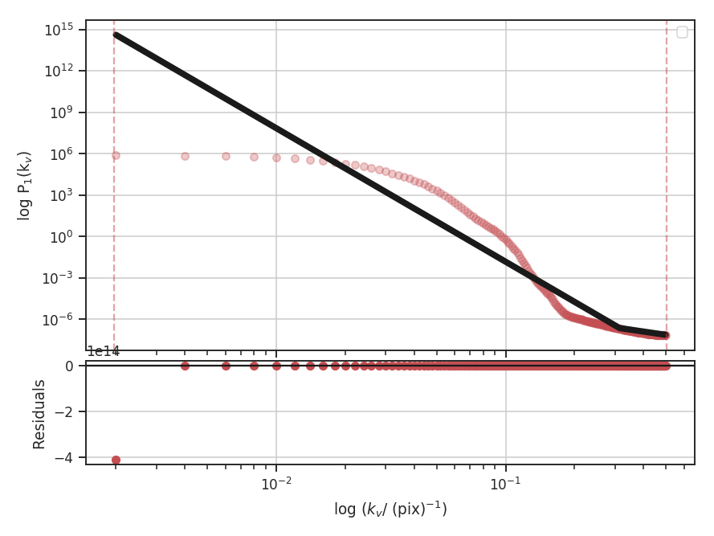
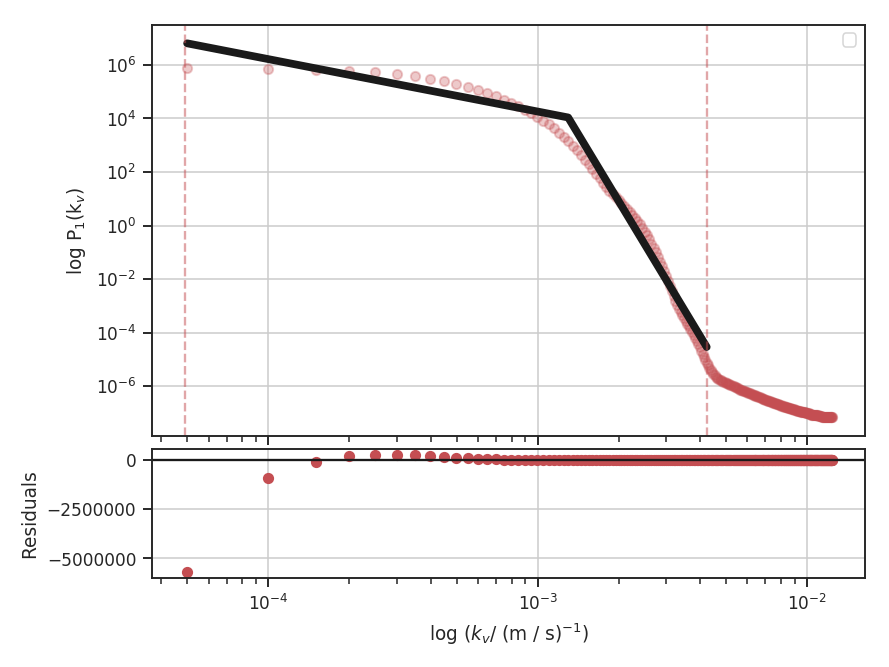
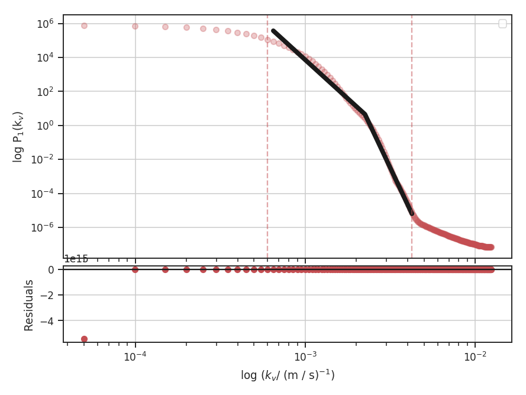

.. _vcs_tutorial:

**********************************
Velocity Coordinate Spectrum (VCS)
**********************************

Overview
--------

The Velocity Coordinate Spectrum (VCS) was present in the theoretical framework of `Lazarian & Pogosyan 2000 <https://ui.adsabs.harvard.edu/#abs/2000ApJ...537..720L/abstract>`_, and further developed in `Lazarian & Pogosyan 2006 <https://ui.adsabs.harvard.edu/#abs/2006ApJ...652.1348L/abstract>`_. The VCS is complementary to the :ref:`VCA <vca_tutorial>`, but rather than integrating over the spectral dimension in the VCA, the spatial dimensions are integrated over.  This results in a 1D power-spectrum whose properties and shape are set by the underlying turbulent velocity and density fields, and the typical velocity dispersion and beam size of the data.

There are two asymptotic regimes of the VCS corresponding to high and low resolution (`Lazarian & Pogosyan 2006 <https://ui.adsabs.harvard.edu/#abs/2006ApJ...652.1348L/abstract>`_). The transition between these regimes depends on the spatial resolution (i.e., beam size) of the data, the spectral resolution of the data, and the velocity dispersion. The current VCS implementation in TurbuStat fits a broken linear model to approximate the asymptotic regimes, rather than fitting with the full VCS formalism (`Chepurnov et al. 2010 <https://ui.adsabs.harvard.edu/#abs/2010ApJ...714.1398C/abstract>`_, `Chepurnov et al. 2015 <https://ui.adsabs.harvard.edu/#abs/2015ApJ...810...33C/abstract>`_).  We assume that the break point lies at the transition point between the regimes and label velocity frequencies smaller than the break as "large-scale" and frequencies larger than the break as "small-scale".

A summary of the VCS asymptotic regimes is given in Table 3 of `Lazarian 2009 <https://ui.adsabs.harvard.edu/#abs/2009SSRv..143..357L/abstract>`_.

Using
-----

**The data in this tutorial are available** `here <https://girder.hub.yt/#user/57b31aee7b6f080001528c6d/folder/59721a30cc387500017dbe37>`_.

We need to import the `~turbustat.statistics.VCS` class, along with a few other common packages:

    >>> from turbustat.statistics import VCS
    >>> from astropy.io import fits

And we load in the data cube:

    >>> cube = fits.open("Design4_flatrho_0021_00_radmc.fits")[0]  # doctest: +SKIP

The VCA spectrum is computed using:

    >>> vcs = VCS(cube)  # doctest: +SKIP
    >>> vcs.run(verbose=True)  # doctest: +SKIP
                                OLS Regression Results
    ==============================================================================
    Dep. Variable:                      y   R-squared:                       0.909
    Model:                            OLS   Adj. R-squared:                  0.908
    Method:                 Least Squares   F-statistic:                     815.9
    Date:                Fri, 21 Jul 2017   Prob (F-statistic):          3.55e-127
    Time:                        16:18:42   Log-Likelihood:                -402.80
    No. Observations:                 249   AIC:                             813.6
    Df Residuals:                     245   BIC:                             827.7
    Df Model:                           3
    Covariance Type:            nonrobust
    ==============================================================================
                     coef    std err          t      P>|t|      [0.025      0.975]
    ------------------------------------------------------------------------------
    const        -11.4835      0.231    -49.755      0.000     -11.938     -11.029
    x1            -9.7426      0.232    -41.915      0.000     -10.200      -9.285
    x2             7.4106      2.683      2.762      0.006       2.126      12.696
    x3            -0.0399      0.314     -0.127      0.899      -0.658       0.578
    ==============================================================================
    Omnibus:                      133.751   Durbin-Watson:                   0.042
    Prob(Omnibus):                  0.000   Jarque-Bera (JB):             1872.647
    Skew:                          -1.766   Prob(JB):                         0.00
    Kurtosis:                      15.962   Cond. No.                         44.9
    ==============================================================================

By default, the VCS spectrum will be fit to a segmented linear model with one break point (see the :ref:`Power Spectrum tutorial <pspec_tutorial>` for a more detailed explanation of the model). If no break points are specified, a spline is used to estimate the location of break points, each of which are tried until a valid fit is found.

With the default settings, the fit is horrendous. This is due to the model's current limitation of fitting with a single break point. For these simulated data, there is no information on spectral frequencies below the thermal line width. This cube was created from an isothermal simulation, and at a temperature of 10 K, the thermal line width of :math:`\sim 200` m / s is oversampled by the 40 m /s channels. We can avoid fitting this region by setting frequency constraints:

    >>> vcs.run(verbose=True, high_cut=0.17 / u.pix)  # doctest: +SKIP
                                OLS Regression Results
    ==============================================================================
    Dep. Variable:                      y   R-squared:                       0.988
    Model:                            OLS   Adj. R-squared:                  0.987
    Method:                 Least Squares   F-statistic:                     2140.
    Date:                Fri, 21 Jul 2017   Prob (F-statistic):           2.90e-76
    Time:                        16:29:33   Log-Likelihood:                -37.805
    No. Observations:                  84   AIC:                             83.61
    Df Residuals:                      80   BIC:                             93.33
    Df Model:                           3
    Covariance Type:            nonrobust
    ==============================================================================
                     coef    std err          t      P>|t|      [0.025      0.975]
    ------------------------------------------------------------------------------
    const          1.8245      0.379      4.819      0.000       1.071       2.578
    x1            -1.8412      0.219     -8.404      0.000      -2.277      -1.405
    x2           -14.8271      0.412    -35.968      0.000     -15.648     -14.007
    x3             0.1035      0.167      0.621      0.536      -0.228       0.435
    ==============================================================================
    Omnibus:                       10.043   Durbin-Watson:                   0.058
    Prob(Omnibus):                  0.007   Jarque-Bera (JB):                3.501
    Skew:                          -0.116   Prob(JB):                        0.174
    Kurtosis:                       2.027   Cond. No.                         21.4
    ==============================================================================

.. image:: images/design4_vcs_lowcut.png

`high_cut` is set to ignore scales below :math:`\sim 240` m / s, just slightly larger than the thermal line width. To see this more clearly, we can create the same plot above in velocity units:

    >>> vcs.run(verbose=True, high_cut=0.17 / u.pix,
    ...         xunit=(u.m / u.s)**-1)  # doctest: +SKIP

The dotted lines, indicating the fitting extents, are now more easily understood. The lower limit, at about :math:`4 \times 10^{-3} {\rm m / s}^{-1}` corresponds to :math:`1 / \left(4 \times 10^{-3}\right) = 250 {\rm m / s}`.

This is still not an optimal fit. There are large deviations as the single break-point model tries to interpret the smooth transition at large scales. This flattening at large scales could be from the periodic box condition in the simulation: there is effectively a maximum size cut-off at the box size beyond which there is no additional energy. For the next example, assume that this is indeed the case and that we can remove this region from the fit:

    >>> vcs.run(verbose=True, high_cut=0.17 / u.pix, low_cut=6e-4 / (u.m / u.s),
    ...         xunit=(u.m / u.s)**-1)   # doctest: +SKIP
                                OLS Regression Results
    ==============================================================================
    Dep. Variable:                      y   R-squared:                       0.996
    Model:                            OLS   Adj. R-squared:                  0.996
    Method:                 Least Squares   F-statistic:                     5443.
    Date:                Fri, 21 Jul 2017   Prob (F-statistic):           6.70e-81
    Time:                        17:10:57   Log-Likelihood:                 15.889
    No. Observations:                  72   AIC:                            -23.78
    Df Residuals:                      68   BIC:                            -14.67
    Df Model:                           3
    Covariance Type:            nonrobust
    ==============================================================================
                     coef    std err          t      P>|t|      [0.025      0.975]
    ------------------------------------------------------------------------------
    const         -8.8409      0.275    -32.183      0.000      -9.389      -8.293
    x1            -9.1948      0.217    -42.371      0.000      -9.628      -8.762
    x2           -12.3859      0.488    -25.404      0.000     -13.359     -11.413
    x3            -0.0062      0.093     -0.067      0.947      -0.191       0.179
    ==============================================================================
    Omnibus:                        6.011   Durbin-Watson:                   0.067
    Prob(Omnibus):                  0.050   Jarque-Bera (JB):                5.617
    Skew:                          -0.476   Prob(JB):                       0.0603
    Kurtosis:                       3.983   Cond. No.                         34.7
    ==============================================================================

This appears to be a better fit! Also, note that the `low_cut` and `high_cut` parameters can be given in pixel or spectral frequency units. We estimated `low_cut` from the previous example, where the plot was already in spectral frequency units.

Based on the power spectrum slope of :math:`-3.2\pm0.1` we found using the zeroth moment map (:ref:`Power Spectrum tutorial <pspec_tutorial>`), this data is in the *steep* regime, where density fluctuations do not dominate at any spectral scale. Using the asymptotic case from Fig. 2 in `Lazarian & Pogosyan 2006 <https://ui.adsabs.harvard.edu/#abs/2006ApJ...652.1348L/abstract>`_, the slopes should be close to :math:`-6 / m` at small scales and :math:`-2 / m` on large scales, where :math:`m` is the index of the velocity field. The second slope in the fit summary (`x2`) is defined *relative* to the first slope (`x1`). The true slopes can be accessed through:

    >>> vcs.slope  # doctest: +SKIP
    array([ -9.19479557, -21.58069847])
    >>> vcs.slope_err  # doctest: +SKIP
    array([ 0.21700618,  0.53366172])

Since, in this regime, both components only rely on the velocity field, they should both give a consistent estimate of :math:`m`:

    >>> -2 / vcs.slope[0]  # doctest: +SKIP
    0.21751435186363388
    >>> - 6 / vcs.slope[1]  # doctest: +SKIP
    0.2780262190776282

Each component does give a similar estimate for :math:`m`. There is the additional issue with the simulated data as to how the :ref:`inertial range <data_for_tutorial>` should be handled. Certainly the slope at smaller scales is made steeper if portions are outside the spatial inertial range.

While we find a good fit to the data, the VCS transition between the two regimes is smoothed over.  This is a break down of assuming the asymptotic regimes, and is a break down of the simplified segmented linear model that has been used. The model presented in `Chepurnov et al. 2010 <https://ui.adsabs.harvard.edu/#abs/2010ApJ...714.1398C/abstract>`_ and `Chepurnov et al. 2015 <https://ui.adsabs.harvard.edu/#abs/2015ApJ...810...33C/abstract>`_, which account for a smooth transition over the entire spectrum, will be a more effective and useful choice. This model will be included in a future release of TurbuStat.

References
----------

`Lazarian & Pogosyan 2000 <https://ui.adsabs.harvard.edu/#abs/2000ApJ...537..720L/abstract>`_

`Lazarian & Pogosyan 2006 <https://ui.adsabs.harvard.edu/#abs/2006ApJ...652.1348L/abstract>`_

`Lazarian & Pogosyan 2008 <https://ui.adsabs.harvard.edu/#abs/2008ApJ...686..350L/abstract>`_

`Chepurnov & Lazarian 2009 <https://ui.adsabs.harvard.edu/#abs/2009ApJ...693.1074C/abstract>`_

`Lazarian 2009 <https://ui.adsabs.harvard.edu/#abs/2009SSRv..143..357L/abstract>`_

`Padoan et al. 2009 <https://ui.adsabs.harvard.edu/#abs/2009ApJ...707L.153P/abstract>`_

`Chepurnov et al. 2010 <https://ui.adsabs.harvard.edu/#abs/2010ApJ...714.1398C/abstract>`_

`Chepurnov et al. 2015 <https://ui.adsabs.harvard.edu/#abs/2015ApJ...810...33C/abstract>`_
