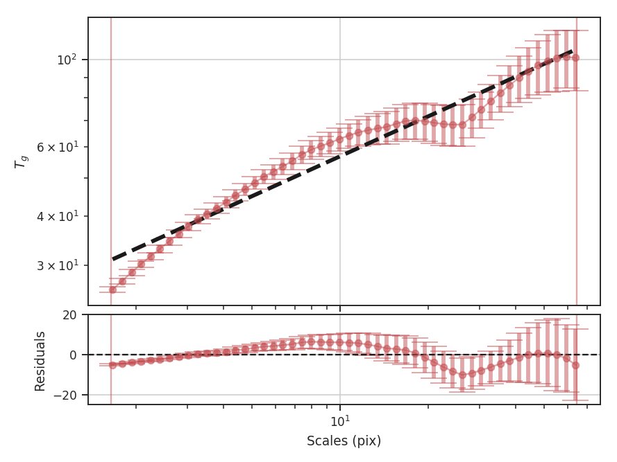
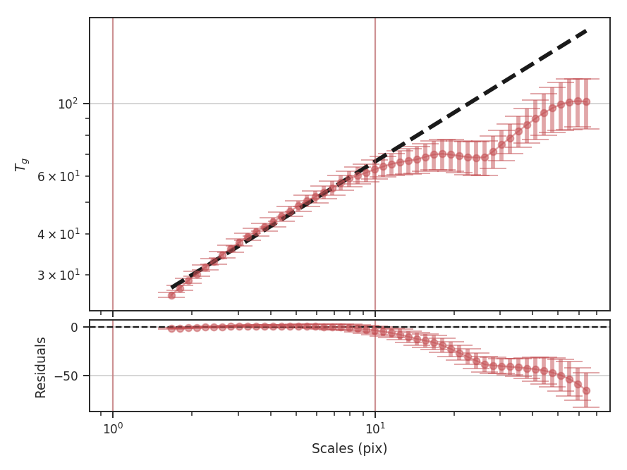
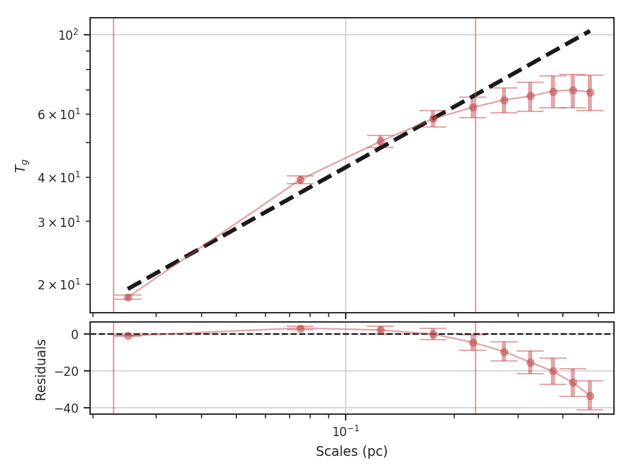
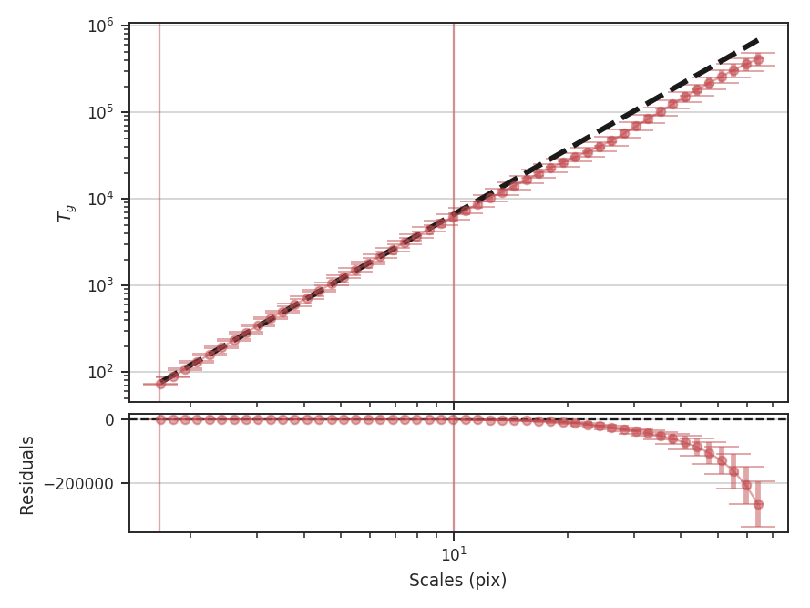

.. _wavelet_tutorial:

********
Wavelets
********

Overview
--------

A wavelet transform can be used to filter structure on certain scales, where the scale is typically related to the size and choice of wavelet kernel. By calculating the amount of structure using different sized kernels, the amount of structure on different scales can be calculated. This makes the technique similar to the power-spectrum, but the power at given scale is calculated in the image domain. This approach was introduced for use on astrophysical turbulence by `Gill & Henriksen 1990 <https://ui.adsabs.harvard.edu/#abs/1990ApJ...365L..27G/abstract>`_. They used a Ricker wavelet for the transform and used the sum of positive values in each filtered map to produce a one-dimensional spectrum between the scale and amount of structure at that scale.

This technique has many similarities to :ref:`Delta-Variance <delvar_tutorial>` (see comparison in `Zielinsky & Stutzki 1999 <https://ui.adsabs.harvard.edu/\#abs/1999A&A...347..630Z>`_). Both create a set of filtered maps at different wavelet scales, though the Delta-Variance splits the wavelet kernel into separate component and normalizes by a weight map to reduce edge effects. From the filtered maps, the Delta-Variance measures the variance across the entire map to estimate the amount of structure, while the Wavelet transform assumes the amount of structure is represented by the total of the positive values. From both methods, the slope of the one-dimensional spectrum is the desired measurement.

Using
-----

**The data in this tutorial are available** `here <https://girder.hub.yt/#user/57b31aee7b6f080001528c6d/folder/59721a30cc387500017dbe37>`_.

We need to import the `~turbustat.statistics.Wavelet` class, along with a few other common packages:

    >>> import numpy as np
    >>> from turbustat.statistics import Wavelet
    >>> from astropy.io import fits
    >>> import astropy.units as u

And we load in the data:

    >>> moment0 = fits.open("Design4_flatrho_0021_00_radmc_moment0.fits")[0]  # doctest: +SKIP

The default wavelet transform of the zeroth moment is calculated as:

    >>> wavelet = Wavelet(moment0).run(verbose=True)  # doctest: +SKIP
                                OLS Regression Results
    ==============================================================================
    Dep. Variable:                      y   R-squared:                       0.954
    Model:                            OLS   Adj. R-squared:                  0.953
    Method:                 Least Squares   F-statistic:                     1001.
    Date:                Tue, 01 Aug 2017   Prob (F-statistic):           8.36e-34
    Time:                        18:07:44   Log-Likelihood:                 97.550
    No. Observations:                  50   AIC:                            -191.1
    Df Residuals:                      48   BIC:                            -187.3
    Df Model:                           1
    Covariance Type:            nonrobust
    ==============================================================================
                     coef    std err          t      P>|t|      [0.025      0.975]
    ------------------------------------------------------------------------------
    const          1.4175      0.012    119.360      0.000       1.394       1.441
    x1             0.3366      0.011     31.635      0.000       0.315       0.358
    ==============================================================================
    Omnibus:                        4.443   Durbin-Watson:                   0.048
    Prob(Omnibus):                  0.108   Jarque-Bera (JB):                2.578
    Skew:                          -0.334   Prob(JB):                        0.276
    Kurtosis:                       2.110   Cond. No.                         4.60
    ==============================================================================

The results of the fit and a plot overlaying the fit on the transform are shown with `verbose=True`. The figure shows that the transform (blue diamonds) does not follow a single power-law relation across all of the scales and resulting fit (dashed blue line) is poor. The solid blue lines indicate the range of scales used in the fit. In the case of these simulated data, scales larger than about 25 pixels are affected by the edges of the map in the convolution. The flattening on scales just smaller is describing actual features in the data and may be a manifestation of the periodic box conditions; we see a similar feature with these data with the :ref:`Delta-Variance <delvar_tutorial>` as well. Unlike the Delta-Variance, the deviation from a power-law is more pronounced on scales larger than about 10 pixels. To improve the fit, we can limit the region that is fit to below this scale:

    >>> wavelet = Wavelet(moment0)  # doctest: +SKIP
    >>> wavelet.run(verbose=True, xlow=1 * u.pix, xhigh=10 * u.pix)  # doctest: +SKIP
                                OLS Regression Results
    ==============================================================================
    Dep. Variable:                      y   R-squared:                       0.992
    Model:                            OLS   Adj. R-squared:                  0.991
    Method:                 Least Squares   F-statistic:                     2758.
    Date:                Wed, 02 Aug 2017   Prob (F-statistic):           1.86e-25
    Time:                        14:05:44   Log-Likelihood:                 78.364
    No. Observations:                  25   AIC:                            -152.7
    Df Residuals:                      23   BIC:                            -150.3
    Df Model:                           1
    Covariance Type:            nonrobust
    ==============================================================================
                     coef    std err          t      P>|t|      [0.025      0.975]
    ------------------------------------------------------------------------------
    const          1.3279      0.006    215.931      0.000       1.315       1.341
    x1             0.4946      0.009     52.516      0.000       0.475       0.514
    ==============================================================================
    Omnibus:                        4.021   Durbin-Watson:                   0.122
    Prob(Omnibus):                  0.134   Jarque-Bera (JB):                3.476
    Skew:                          -0.888   Prob(JB):                        0.176
    Kurtosis:                       2.572   Cond. No.                         5.95
    ==============================================================================

This has significantly improved the fit, and the slope of the power-law is closer to the value found from the :ref:`Delta-Variance transform <delvar_tutorial>`. The wavelet transform slope is half of the Delta-Variance slope:

    >>> wavelet.slope * 2  # doctest: +SKIP
    0.98916576820595215
    >>> wavelet.slope_err *2  # doctest: +SKIP
    0.018835675570973334

The wavelet transform gives an index of :math:`0.99 \pm 0.02`, while the Delta-Variance has a slope of :math:`1.06 \pm 0.02` fit over a similar range. While limiting the fit gives a consistent result to other methods, the differences in the shape of the spectra may give useful information and should be interpreted carefully.

These examples have used the default scales to calculate the wavelet transforms. The default, in pixel units, will vary from 1.5 pixels to half of the smallest image dimension and will be spaced equally in logarithmic space. The number of scales to test defaults to 50; this can be changed by giving the `num` keyword to `~turbustat.statistics.Wavelet`. Alternatively, a custom set of scales can be given. The units of the scale can also be given in both angular and physical units (when a distance is provided). This can be useful for comparing different datasets at a common scale. For example, assume that this simulated dataset lies at a distance of 250 pc:

    >>> phys_scales = np.arange(0.025, 0.5, 0.05) * u.pc
    >>> wavelet = Wavelet(moment0, distance=250 * u.pc, scales=phys_scales)  # doctest: +SKIP
    >>> wavelet.run(verbose=True, xlow=1 * u.pix, xhigh=10 * u.pix, xunit=u.pc)  # doctest: +SKIP
                                OLS Regression Results
    ==============================================================================
    Dep. Variable:                      y   R-squared:                       0.983
    Model:                            OLS   Adj. R-squared:                  0.977
    Method:                 Least Squares   F-statistic:                     173.6
    Date:                Wed, 02 Aug 2017   Prob (F-statistic):           0.000944
    Time:                        14:43:07   Log-Likelihood:                 11.334
    No. Observations:                   5   AIC:                            -18.67
    Df Residuals:                       3   BIC:                            -19.45
    Df Model:                           1
    Covariance Type:            nonrobust
    ==============================================================================
                     coef    std err          t      P>|t|      [0.025      0.975]
    ------------------------------------------------------------------------------
    const          1.2668      0.031     41.159      0.000       1.169       1.365
    x1             0.5649      0.043     13.178      0.001       0.428       0.701
    ==============================================================================
    Omnibus:                          nan   Durbin-Watson:                   1.633
    Prob(Omnibus):                    nan   Jarque-Bera (JB):                0.461
    Skew:                           0.166   Prob(JB):                        0.794
    Kurtosis:                       1.549   Cond. No.                         4.25
    ==============================================================================

We find a similar slope using the same fit region as the previous example, though with more uncertainty since only 5 of the given scales fit into the region. Note that the plot now shows the scales in parsecs, as well. The output unit used in the plot can be changed by specifying `xunit`. Similarly, different units can be used in `xlow` and `xhigh`, too.

Finally, we note a difference between the TurbuStat implementation of the wavelet transform and the one described in `Gill & Henriksen 1990 <https://ui.adsabs.harvard.edu/#abs/1990ApJ...365L..27G/abstract>`_. Their definition of the Ricker wavelet in Section 2 is an unnormalized form of the kernel and this leads to a slope of :math:`+2` larger than the normalized version here. We use the `Ricker implementation <http://docs.astropy.org/en/stable/api/astropy.convolution.RickerWavelet2DKernel.html>`_ from the `astropy.convolution <http://docs.astropy.org/en/stable/convolution/index.html>`_ package, which has the correct :math:`1/\pi \sigma^4` normalization coefficient for the wavelet transform.

The :math:`+2` discrepancy can be explained by thinking of the Ricker kernel as the negative of the Laplacian of a Gaussian. A normalized Gaussian has a normalization constant of :math:`1/2 \pi \sigma^2`, or units of :math:`1/{\rm length}^2`, but has a constant peak for all :math:`\sigma`. In order to make the Laplacian also have a constant peak, referred to as a *scale-normalized derivative* in `image processing <https://en.wikipedia.org/wiki/Scale_space>`_, we need to multiply the Ricker by a factor of :math:`\sigma^2` at each scale. Combined with the normalization coefficient of :math:`1/\pi \sigma^4`, this restores the :math:`1/{\rm length}^2` of a Gaussian (`Lindeburg 1994 <https://www.tandfonline.com/doi/abs/10.1080/757582976>`_). In order to reproduce the unnormalized version of `Gill & Henriksen 1990 <https://ui.adsabs.harvard.edu/#abs/1990ApJ...365L..27G/abstract>`_, we need to multiply the kernel by :math:`\sigma^4`. To reproduce their results, we have included a normalization keyword to disable the correct normalization:

    >>> wavelet = Wavelet(moment0)  # doctest: +SKIP
    >>> wavelet.run(verbose=True, scale_normalization=False,
    ...             xhigh=10 * u.pix)  # doctest: +SKIP
                                OLS Regression Results
    ==============================================================================
    Dep. Variable:                      y   R-squared:                       1.000
    Model:                            OLS   Adj. R-squared:                  1.000
    Method:                 Least Squares   F-statistic:                 7.016e+04
    Date:                Wed, 02 Aug 2017   Prob (F-statistic):           1.40e-41
    Time:                        15:10:40   Log-Likelihood:                 78.364
    No. Observations:                  25   AIC:                            -152.7
    Df Residuals:                      23   BIC:                            -150.3
    Df Model:                           1
    Covariance Type:            nonrobust
    ==============================================================================
                     coef    std err          t      P>|t|      [0.025      0.975]
    ------------------------------------------------------------------------------
    const          1.3279      0.006    215.931      0.000       1.315       1.341
    x1             2.4946      0.009    264.879      0.000       2.475       2.514
    ==============================================================================
    Omnibus:                        4.021   Durbin-Watson:                   0.122
    Prob(Omnibus):                  0.134   Jarque-Bera (JB):                3.476
    Skew:                          -0.888   Prob(JB):                        0.176
    Kurtosis:                       2.572   Cond. No.                         5.95
    ==============================================================================

The unnormalized transform appears to follow a power-law relation over all of the scales, and when limited to the same fitting region, the fit appears to be much better. This is deceiving, however, because the extra factors of :math:`\sigma` are increasing the correlation between the x and y variables in the fit! This effectively gives a slope of :math:`+2` for free, regardless of the data. Further, it means that the fit statistics are no longer valid, as the underlying assumption in the model is that the y and x values are uncorrelated.

.. warning:: We do **not** recommend using the unnormalized form as it inflates the quality of the fit, hides the deviations (that may be physically relevant!), but provides no additional information or improvements.

References
----------

`Gill & Henriksen 1990 <https://ui.adsabs.harvard.edu/#abs/1990ApJ...365L..27G/abstract>`_

`Lindeburg 1994 <https://www.tandfonline.com/doi/abs/10.1080/757582976>`_

`Zielinsky & Stutzki 1999 <https://ui.adsabs.harvard.edu/\#abs/1999A&A...347..630Z>`_
